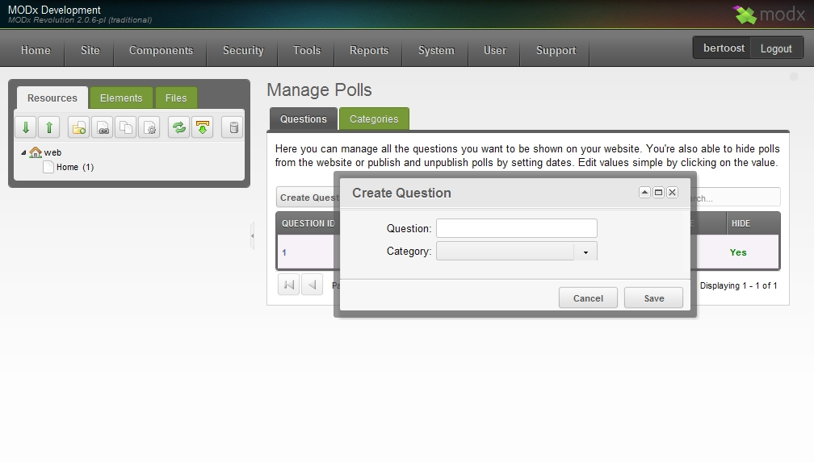
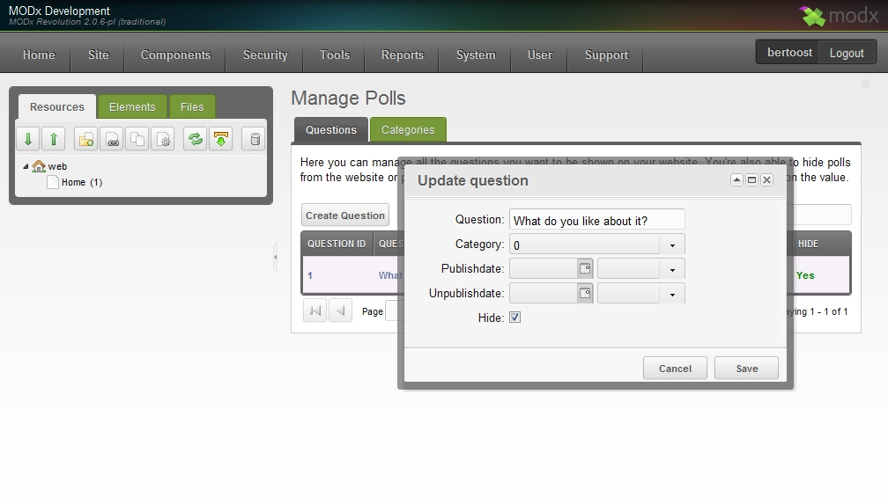
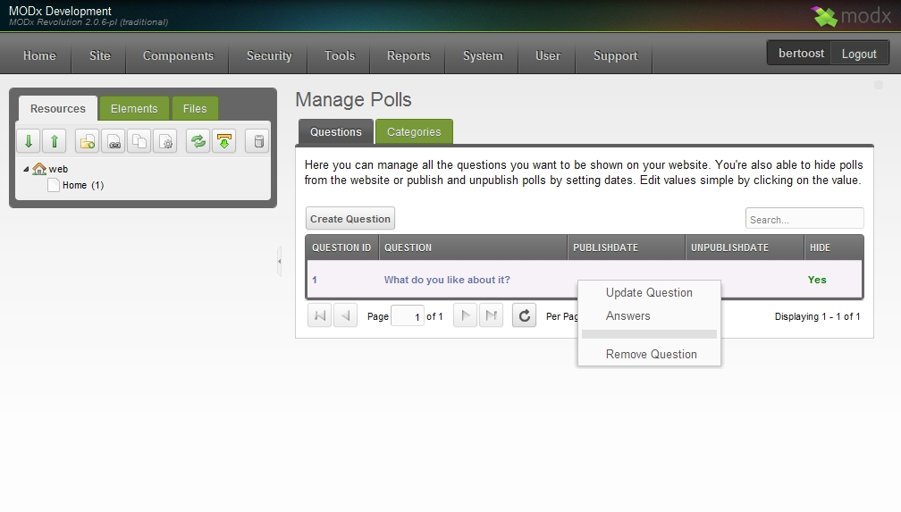
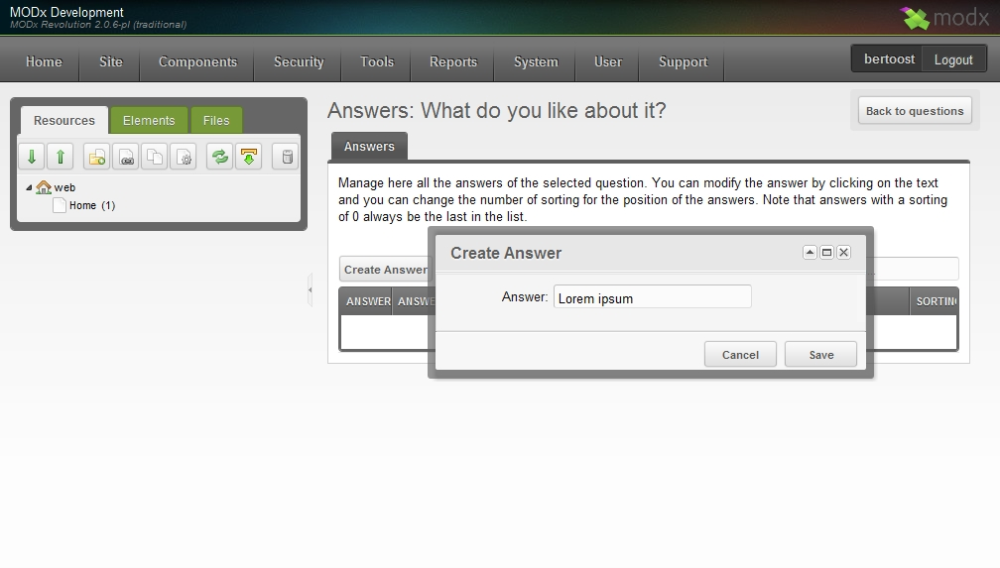
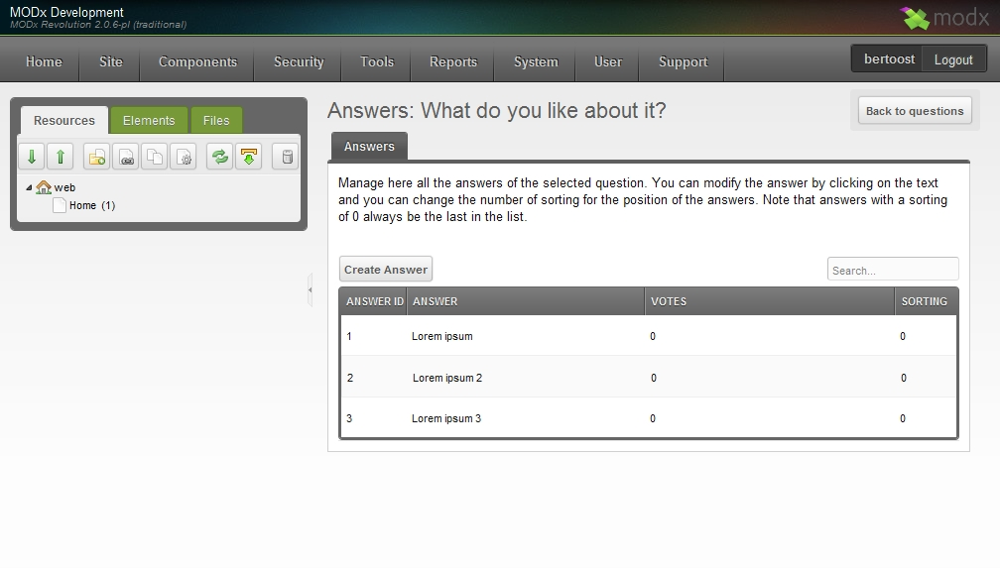

## What is Polls?

Polls is a question and answer manager for MODX Revolution.

With Polls you're able to create questions and answers and even link them into a category for multiple poll support. Via the manager you can easily add as many answers per question as you like and with the two snippets provided you can do mostly what is needed for viewing and voting on the questions.

### Requirements

- MODX Revolution 2.0.0-RC-2 or later
- PHP5 or later

### History

Polls, was written by Bert Oost, a simple question and answer solution, and first released on December 23th, 2010.

### Download

It can be downloaded from within the MODX Revolution manager via [Package Management](developing-in-modx/advanced-development/package-management "Package Management"), or from the MODx Extras Repository on <http://modxcms.com/extras/package/783>.

## Development and Bug Reporting

Polls is stored and developed in GitHub, and can be found here: <https://github.com/bertoost/MODx-Polls>

Bugs can be filed here: <https://github.com/bertoost/MODx-Polls/issues>

## Screenshots

Below a screenshot of the manager pages. More screenshots will be added later.

## See also

1. [Polls.Polls](extras/polls/polls.polls)
2. [Polls.PollsLatest](extras/polls/polls.pollslatest)
3. [Polls.PollsPrevious](extras/polls/polls.pollsprevious)
4. [Polls.PollsResult](extras/polls/polls.pollsresult)
