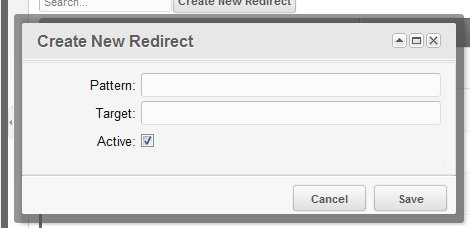
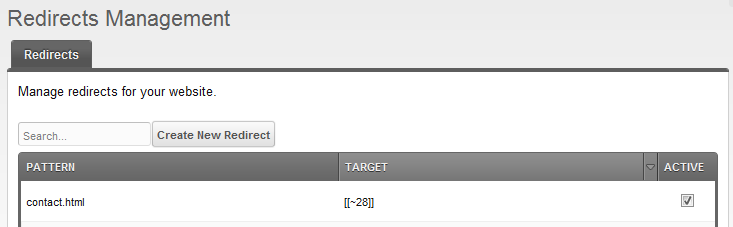

## What is Redirector?

Redirector is a management tool for your 404 / 301 redirects on your site.

## Requirements

- MODX Revolution 2.0.0-RC-2 or later
- PHP5 or later

## History

Redirector was written by [Shaun McCormick](https://github.com/splittingred) as a simple redirection management component, and first released on May 7th, 2010.

### Download

It can be downloaded from within the MODX Revolution manager via Package Management, or from the MODX Extras Repository, here: <http://rtfm.modx.com/extras/revo/redirector>.

### Development and Bug Reporting

Redirector is stored and developed in GitHub, and can be found here: <https://github.com/modxcms/Redirector>

Bugs can be filed here: <https://github.com/modxcms/Redirector/issues>

## Usage

After installing, simply reload the page, and the 'Redirector' menu option should be available through the top Components menu.

To add a new redirect, simply hit the "New Redirect" button. You should see the below popup. 
The pattern is what the plugin will look for when a resource cannot be found. For example, type in contact.html.

The target is where the plugin should redirect the visitor (or Google Bot!) to. You can enter this as an actual URL (eg new/location/for/contact.html), or use the MODX resource tag syntax, for example `[[~28]]` if your resource identifier is 28. This will keep the redirect updated if the alias changes again.

You can determine if the redirect is active or not with the checkbox.

When you saved the redirect, you can see it in the Grid.

Should you wish to update or remove the redirect at some point, you can simply right click the row in the grid and choose Update or Remove.
