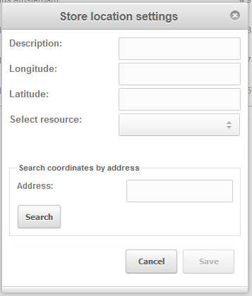
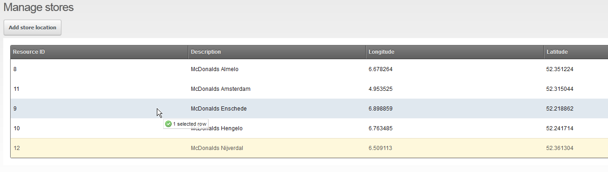

## What is StoreLocator?

StoreLocator is a snippet that integrates Google Maps into MODX® to allow your users to find stores (or whatever location you want them to find) that are close to an address (their home for instance). StoreLocator is easily integrated in your website and is fully customizable.

StoreLocator is created and maintained by [SCHERP Ontwikkeling](http://www.scherpontwikkeling.nl).

## Requirements

StoreLocator required MODX® Revolution 2.2.0 or later.

## History

| Version   | Release date     | Author                                                                                                                                      | Changes            |
| --------- | ---------------- | ------------------------------------------------------------------------------------------------------------------------------------------- | ------------------ |
| 1.0.0-PL1 | March 6th, 2012  | [Patrick Nijkamp](http://www.scherpontwikkeling.nl/over-ons/patrick-nijkamp.html) ([SCHERP Ontwikkeling](http://www.scherpontwikkeling.nl)) | Initial release.   |
| 1.0.1-PL1 | March 10th, 2012 | [Patrick Nijkamp](http://www.scherpontwikkeling.nl/over-ons/patrick-nijkamp.html) ([SCHERP Ontwikkeling](http://www.scherpontwikkeling.nl)) | Fixed noResultsTpl |
| 1.1.0-PL1 | March 22th, 2012 | [Patrick Nijkamp](http://www.scherpontwikkeling.nl/over-ons/patrick-nijkamp.html) ([SCHERP Ontwikkeling](http://www.scherpontwikkeling.nl)) | New placeholders   |

## Download & Installation

Install the package through the MODX® package manager.

## Using StoreLocator in the manager

## Adding stores

To add a store, simply log in to the manager and click "Components" -> "Store Locator". Once in the StoreLocator you will see the page "Manage stores". Now click the button "Add store location" and you will see the following window:



From there you can add a store by filling in the description, longitude and latitude coordinates and select the resource you want to link this store to. The resource will be assigned to the storeRowTpl so you can use all it's data to show the needed placeholders in the front-end. If you don't want to enter the coordinates by hand simply type the address next to the "Address:" box and click search. The script will then post your query to Google Maps and get the coordinates for you.

## Sorting stores

To sort stores log in to the manager and go to "Components" -> "Store Locator". You will see a grid containing all of your stores, you can just pick up a single row and drop it where you want it to be. 



## Using StoreLocator in the front-end (user side)

## Placing the snippet

Place the main `[[[StoreLocator](extras/storelocator "StoreLocator")]]` snippet call on your webpage. If you have placed the snippet it assigns the following placeholders to your page:

| Placeholder name               | Content                               |
| ------------------------------ | ------------------------------------- |
| `[[+StoreLocator.map]]`        | The Google Map view                   |
| `[[+StoreLocator.form]]`       | The StoreLocator search form          |
| ?`[[+StoreLocator.storeList]]` | The list of stores and search results |

You can configure the snippet "StoreLocator" with the following parameters:

| Parameter          | Description                                                            | Values                                                      | Default Value        | Required  |
| ------------------ | ---------------------------------------------------------------------- | ----------------------------------------------------------- | -------------------- | --------- |
| apiKey             | Your Google Maps API key                                               | A Google API key                                            | (empty)              | no        |
| zoom               | Standard zoom level when the map initializes                           | A number between 1 - 15                                     | 8                    | no        |
| storeZoom          | Zoom level when a user clicks on a store in the list                   | A number between 1 - 15                                     | 13                   | no        |
| searchZoom         | Zoom level when user has searched and map is centered on their address | A number between 1 - 15                                     | 13                   | no        |
| width              | Width of the map                                                       | A value in pixels                                           | 300                  | no        |
| height             | Height of the map                                                      | A value in pixels                                           | 400                  | no        |
| mapType            | The type of the Google Map                                             | HYBRID                                                      | ROADMAP              | SATELLITE | TERRAIN | ROADMAP | no |
| defaultRadius      | The default radius that will be selected in the search form            | 5, 10, 25, 50, 100                                          | 5                    | no        |
| centerLongitude    | Longitude on which the map will center by default                      | Longitude coordinates                                       | 6.61480              | no        |
| centerLatitude     | Latitude on which the map will center by default                       | Latitude coordinates                                        | 52.40441             | no        |
| markerImage        | A URL to an image to be used instead of the default Google Map marker  | A URL                                                       | 0                    | no        |
| sortDir            | Sort direction of the store list                                       | ASC                                                         | DESC                 | ASC       | no      |
| limit              | Maximum amount of stores shown by default and in search results        | 0 means all records, any other number limits the resultlist | 0                    | no        |
| formTpl            | The chunk for the form                                                 | A chunk name                                                | sl.form              | no        |
| storeRowTpl        | The chunk for a store row as shown in the list and search results      | A chunk name                                                | sl.storerow          | no        |
| storeInfoWindowTpl | The chunk for the info window popup when clicked on a store marker     | A chunk name                                                | sl.infowindow        | no        |
| noResultsTpl       | The chunk that shows when no results are found                         | A chunk name                                                | sl.noresultstpl      | no        |
| scriptWrapperTpl   | The script wrapper (only change when you know what you're doing)       | A chunk name                                                | sl.scriptwrapper     | no        |
| scriptStoreMarker  | The script store marker (only change when you know what you're doing)  | A chunk name                                                | sl.scriptstoremarker | no        |

## Examples

Below you see the main snippet call and the placement of the placeholders. Every parameter is optional, we have just used some possibilities of customization.

``` php
[[!StoreLocator?
    &searchZoom=`10`
    &zoom=`7`
    &markerImage=`/assets/mcdonalds.png`
    &width=`640`
    &height=`480`
    &centerLongitude=`5.509644`
    &centerLatitude=`52.469397`
]]

<table>
   <tr>
      <td style="width: 640px;">
        [[+StoreLocator.map]]        <!-- This shows the google map -->
      </td>
      <td style="vertical-align: top;">
        [[+StoreLocator.form]]       <!-- This shows the search form -->
        <hr />
        [[+StoreLocator.matchedStores]] / [[+StoreLocator.totalStores]] <!-- This shows number of found stores / total stores -->
        [[+StoreLocator.storeList]]  <!-- This shows the list of stores and search results -->
      </td>
   </tr>
</table>
```

## YouTube example

Here's an example of the usage and placement of the snippet call: [http://www.youtube.com/watch?v=\_\_5Oi4Tqz50](http://www.youtube.com/watch?v=__5Oi4Tqz50)

## StoreLocator premium

You have the possibility to buy StoreLocator premium through the about screen in the component. This will add the following functionality:

- Custom caching (storelist and search results)
- Custom marker images for each individual store
- Possibility to get directions from the entered address to a store from the StoreLocator screen
- A snippet that can plot directions to a specific store from an entered address.

Check out the video demo:
Custom marker images: <http://www.youtube.com/watch?v=keUjHDmOJnw>
Directions / route planner: <http://www.youtube.com/watch?v=FOAWcdoFysk>

## External sources

Developers website: <http://www.scherpontwikkeling.nl>

GitHub repository: <http://www.github.com/b03tz/StoreLocator/>

Report bugs and request features: <http://www.github.com/b03tz/StoreLocator/issues>

Help requests: <http://forums.modx.com/thread/74885/support-topic-for-storelocator-1-0-pl-1>
