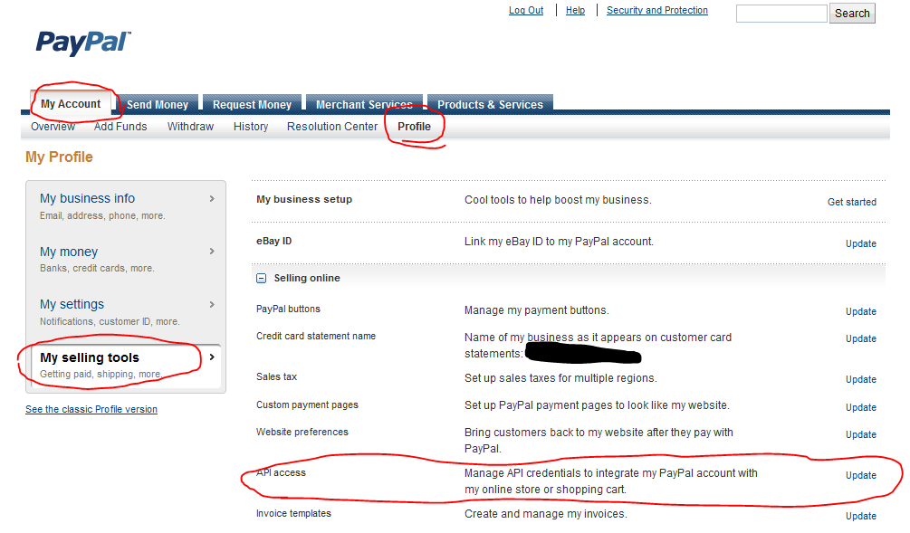
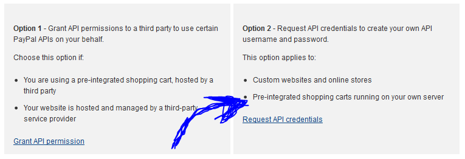
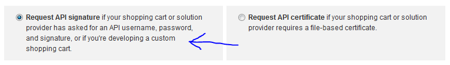
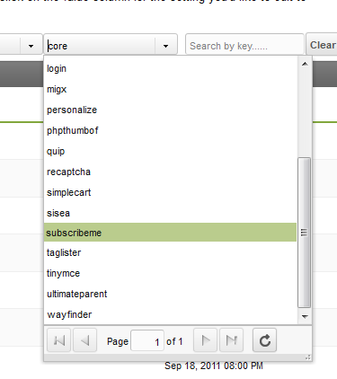
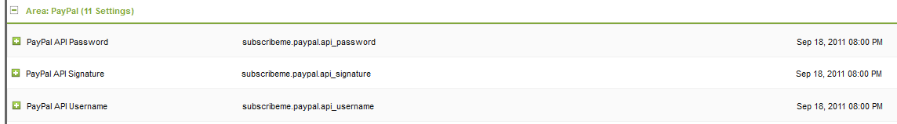
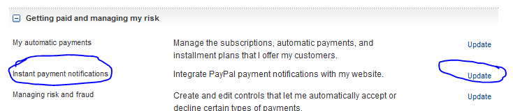
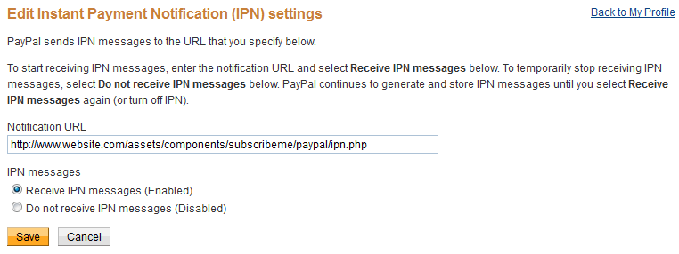

Before getting to this stage, you should make sure the system works and you understand it using the Sandbox mode. ONLY switch to live if you have tested the functionality you needed using the sandbox mode.

## Requesting a API Credentials

First, log in to your account at www.paypal.com. 
Visit your Profile via My Account -> Profile. In the menu to the left, you'll be looking for "My selling tools". On the new page, find API access and choose to update your settings.

You will be presented with two options. You will need option 2: _"Request API credentials to create your own API username and password"_. Please note that you will need a confirmed email to access this option. Click "Request API Credentials" and move on to the next step.

Now you get the choice for either an API signature or API Certificate. The system is built to use a signature, so choose the Signature option (ticked by default) and choose to agree and submit.

Now you should see an API Username, Password and Signature on your screen.

## Configuring your API Credentials in MODX

Now you'll need to head to your manager, and via System -> System Settings find the system settings grid. 

In the namespaces filter combo box choose SubscribeMe, and find the API Password, Signature and Username fields. Enter the credentials you received in the last step there. Make sure there's no trailing spaces or anything like that. 

## Configuring Instant Payment Notifications

Instant Payment Notifications are sort of digital memos sent from PayPal to a pre-configured web URL that is set up to process the notification and do something with it (or not).

SubscribeMe uses IPN for processing transactions, expired and canceled subscriptions.

Go back to your PayPal Profile and find the Instant Payment Notification settings. 

You'll get some information on what IPN is, click the button to choose your settings.

Fill in the IPN url. This is the file at <http://yoursite.com/assets/components/subscribeme/paypal/ipn.php>. If you visit it in your site you should see, well, nothing. It's not intended for public viewing but is processing your request in the back-end. To make sure you have the right URL, enable debug mode in the system settings (system setting key: subscribeme.debug) and open the page. Next, visit your MODX Error Log. You should see the following being added:

> \[2011-09-20 16:11:24\] (FATAL @ /assets/components/subscribeme/paypal/ipn.php) IPN Triggered with data: Array
> (
> )
> \[2011-09-20 16:11:25\] (FATAL @ /assets/components/subscribeme/paypal/ipn.php) \[Request\] Posted to <https://www.paypal.com/cgi-bin/webscr:> cmd=\_notify-validate
> \[2011-09-20 16:11:25\] (FATAL @ /assets/components/subscribeme/paypal/ipn.php) \[Response\] Status: 200 Response: INVALID
> \[2011-09-20 16:11:25\] (FATAL @ /assets/components/subscribeme/paypal/ipn.php) IPN was found to be INVALID

This means it received an empty IPN response, it tried to validate it with PayPal and while it found the PayPal confirmation page the IPN was not considered valid by PayPal. Which makes sense, as PayPal didn't send the request.

So fill in that IPN URL and choose to "_Receive IPN messages (Enabled)_", like the below image.

Now that you set that up you should be able to process transactions!

**You should probably set up a test subscription now (with a one day cycle at a price of 1 cent so you can test the entire process) to make sure everything works as intended.**

## Going LIVE!

When you made sure everything works it's time to start making money. Change the subscribeme.paypal.sandbox ("Use Sandbox?") setting to NO.

PayPal suggests following this [Go Live Checklist](https://cms.paypal.com/us/cgi-bin/?cmd=_render-content&content_ID=developer/howto_api_golivechecklist).
