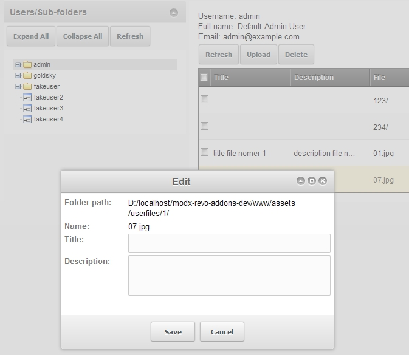
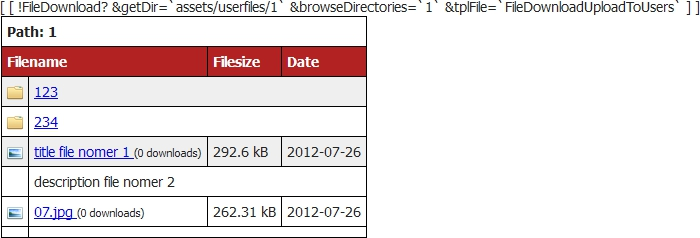

## Upload to Users CMP

A Custom Manager Page (CMP) to upload file to registered members to a specified parent folder.

The extra link is <http://modx.com/extras/package/uploadtouserscmp> .
The GitHub link is <https://github.com/goldsky/UploadToUsers> .

It would be useful for setting up specific folers to each of logged in users, and use FileLister or FileDownload R (>=1.0.0-rc.4) snippet to get the folder using user's ID or username to their own folders.

## Examples

``` php
[[FileLister? &path=`assets/userfile/[[+modx.user.id]]/`]]
[[FileDownload? &getDir=`assets/userfile/[[+modx.user.username]]/`]]
```

Since version 1.0-pl, this package added database table to store additional information about the files, so it can be used later on to replace the filename on the list, and even better, add description into the list.



## Upload to Users Snippet

Currently, it can only be used by [FileDownload R](extras/filedownload-r "FileDownload R") because the link has its own placeholder.

## Examples

To use the snippet, user need to change the FileDownload's template from the original:

``` html
    <tr[[+fd.class]]>
        <td style="width:16px;"></td>
        <td><a href="[[+fd.link]]"[[+fd.linkAttribute]]>[[+fd.filename]]</a>
            <span style="font-size:80%">([[+fd.count]] downloads)</span>
        </td>
        <td>[[+fd.sizeText]]</td>
        <td>[[+fd.date]]</td>
    </tr>
    [[-- This is the description row if the &chkDesc=`chunkName` is provided --]]
    [[+fd.description:notempty=`<tr>
        <td></td>
        <td colspan="3">[[+fd.description]]</td>
    </tr>`:default=``]]
```

to, for instance:

``` html
    <tr[[+fd.class]]>
        <td style="width:16px;"></td>
        <td><a href="[[+fd.link]]"[[+fd.linkAttribute]]>
                [[!uploadtousers:default=`[[+fd.filename]]`? &path=`[[+fd.fullPath]]` &field=`title`]]
            </a>
            <span style="font-size:80%">([[+fd.count]] downloads)</span>
        </td>
        <td>[[+fd.sizeText]]</td>
        <td>[[+fd.date]]</td>
    </tr>
    <tr>
        <td></td>
        <td colspan="3">[[!uploadtousers? &path=`[[+fd.fullPath]]` &field=`description`]]</td>
    </tr>
```

The result of the FileDownload output will be changed like this:



## Properties

| Name          | Description                                                 | Default Value |
| ------------- | ----------------------------------------------------------- | ------------- |
| path          | the full path to the particular file/folder **(mandatory)** |               |
| field         | the table's field to be retrieved                           | title         |
| toArray       | dump the output as an array instead                         |               |
| toPlaceholder | return the output into a placeholder instead                |               |

The available fields are id, dir\_path, name, title, description.
