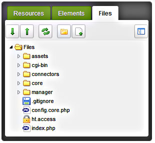
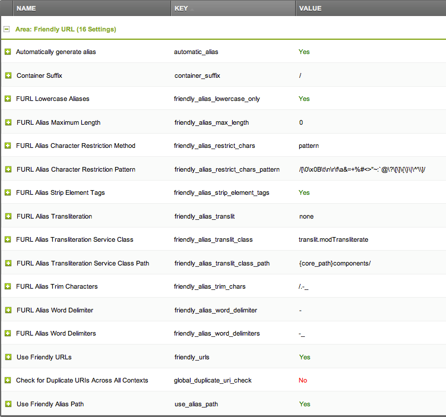

You can have friendly URLs fully functioning in under two minutes by following a simple four step process.

## 1) Working .htaccess sample

MODX supplies an ht.access file for you to edit to match your server settings It is located in the root of the MODX site. This file will be ignored by the server until you rename it or (better) copy it to a file called .htaccess. Whenever a browser requests a page, the server checks for a file called .htaccess, which can contain information about how various URLs should be handled.

The .htaccess file can be anywhere above the MODX installation but the usual location is in the MODX site root (along with the ht.access file, and the assets, manager and connectors directories as shown in the image below). For most installs, you don't have to make any changes at all to the file in order to get FURLs working. There is one change you should make, but get FURLs working first and we'll cover that change at the end of this page.



Here is the ht.access file that comes with one version of MODX (your version may be slightly different).

``` php
# MODX supports Friendly URLs via this .htaccess file. You must serve web
# pages via Apache with mod_rewrite to use this functionality, and you must
# change the file name from ht.access to .htaccess.
#
# Make sure RewriteBase points to the directory where you installed MODX.
# E.g., "/modx" if your installation is in a "modx" subdirectory.
#
# You may choose to make your URLs non-case-sensitive by adding a NC directive
# to your rule: RewriteRule ^(.*)$ index.php?q=$1 [L,QSA,NC]

RewriteEngine On
RewriteBase /


# Prevent rewrite the .well-known directory used by LetsEncrypt by rules below of this rule
RewriteRule "^\.well-known/" - [L]


# Prevent dot directories (hidden directories like .git) to be exposed to the public
# Except for the .well-known directory used by LetsEncrypt a.o
RewriteRule "/\.|^\.(?!well-known/)" - [F]


# Rewrite www.example.com -> example.com -- used with SEO Strict URLs plugin
#RewriteCond %{HTTP_HOST} .
#RewriteCond %{HTTP_HOST} ^www.(.*)$ [NC]
#RewriteRule ^(.*)$ https://%1/$1 [R=301,L]
#
# or for the opposite example.com -> www.example.com use the following
# DO NOT USE BOTH
#
#RewriteCond %{HTTP_HOST} !^$
#RewriteCond %{HTTP_HOST} !^www\. [NC]
#RewriteCond %{HTTP_HOST} (.+)$
#RewriteRule ^(.*)$ https://www.%1/$1 [R=301,L] .


# Force rewrite to https for every host
#RewriteCond %{HTTPS} !=on [OR]
#RewriteCond %{SERVER_PORT} !^443
#RewriteRule ^ https://%{HTTP_HOST}%{REQUEST_URI} [L,R=301]


# Redirect the manager to a specific domain - don't rename the ht.access file
# in the manager folder to use this this rule
#RewriteCond %{HTTP_HOST} !^example\.com$ [NC]
#RewriteCond %{REQUEST_URI} ^/manager [NC]
#RewriteRule ^(.*)$ https://example.com/$1 [R=301,L]


# The Friendly URLs part
RewriteCond %{REQUEST_FILENAME} !-f
RewriteCond %{REQUEST_FILENAME} !-d
RewriteRule ^(.*)$ index.php?q=$1 [L,QSA]


# For servers that support output compression, you should pick up a bit of
# speed by un-commenting the following lines.

#php_flag zlib.output_compression On
#php_value zlib.output_compression_level 5
```

You can also put the file in /htdocs or /public\_html or what ever your server uses as long as it is in, or above, the MODX root directory.

Be aware some hosts like to write their own .htaccess just above the site level, but if your .htaccess is in the MODX site root, it should work fine. If your host has placed an .htaccess file in the MODX site root, you may have to paste the code from the MODX ht.access file below the hosts code in that file. Be sure to back up the host's file first! That way you can restore it if things go bad.

The RewriteBase line should end with a / for root installations  The RewriteBase for a subdirectory installation may have to be entered as: RewriteBase /subdirectoryName/ although this is normally only necessary on localhost installs.The RewriteBase line should almost always end with a slash.

## 2) Configure MODX Revolution

Next, change the settings in the Friendly URLs Area of the MODX System Settings (see the following image). In MODX 2.3, click on the gear icon at the upper right and select "System Settings." In earlier versions, go to System -> System Settings. In the "Search by key" box at the upper right of the grid, type "friendly" (without the quotes), and press Enter. That will display all the Friendly URL settings. The main one you want is toward the bottom: Use Friendly URLs (friendly\_urls). Double click on the "No" and change it to "Yes".

If you do not see all of the MODX FURL settings, simply change the "Area" drop-down box at the top of the grid to Friendly URL as I did.

You will not find friendly\_url\_prefix and friendly\_url\_suffix among the settings in the image below - these have been deprecated in favor of extensions defined by [Content Types](building-sites/resources/content-types "Content Types") and container\_suffix (for Container Resources with Content Types having a mime\_type of text/html).  The default Container Suffix setting is now "/" which results in the urls of container resources instead of the content type of the container (in other words, the URLs of resources marked as containers will be / instead of something like .html). If you want your container resources to show as their content type (e.g., .html), remove the "/" from this setting. If you have issues with packages that utilize the container suffix for FURLS (such as [Articles](/extras/articles "Articles")), return this setting to "/".



The Use Friendly Alias Path (use\_alias\_path) setting allows the site to display directory structures. If it is set to "No" all of the documents on the site will appear in the URLs as if they are directly off of the root, disregarding the paths. It the setting is set to "Yes" (the default), you will see a full path to the current page in the URLs.

The friendly\_alias\_urls setting was removed in MODX 2.1+. Enabling friendly\_urls implies you are using friendly\_alias\_urls in 2.1+ and this setting was no longer useful or necessary.

## 3) Edit your template(s)

Make sure you have the following tag in the head section of all your templates. If you have only one front-end context (e.g., 'web') you can usually leave out the exclamation point to speed of page loads:

``` html
<base href="[[!++site_url]]" />
```

## 4) Clear the site cache

And you're done!

The easiest way to take advantage of using fully qualified Friendly URLs, is to allow MODX to build the links using link tags, described on this page: [link tag syntax](building-sites/resources "Linking to a Resources") to create links to different resources, is easy as tying in the link tag below (where 1 is the Resource ID of the page you want to link to). This has the added benefit of being able to move resources around a web project, without needing to fix a bunch of broken links, as MODX will simply update links created in this manner automatically.

``` html
<a href="[[~1]]" title="some title">Some Page</a>
```

## 5) Convert WWW URLs to non-WWW or Vice Versa

Earlier, we mentioned one change that you should always make to the .htaccess file once you have FURLs working. It concerns URLs that start with 'www' (or not). A user can reach most sites with the domain name, or the domain name preceded by 'www.' You should always convert the URL to one or the other. The reasons are complicated, but if you don't do this, odd things can happen on your site. Users who are logged in, for example, can suddenly lose that status.

Correcting this is really easy. In the code of the .htaccess file above, you'll see two sections, both commented out. One changes non-www urls to www urls, the other does the opposite. Decide which one you want and simply uncomment the section that does it by removing the # at the beginning of each line. Be careful, you will only be uncommenting three lines.

For example, to remove the 'www.' from all requests for a site with the domain 'yoursite.com' change this section:

``` php
# Rewrite www.domain.com -> domain.com -- used with SEO Strict URLs plugin
#RewriteCond %{HTTP_HOST} .
#RewriteCond %{HTTP_HOST} !^example-domain-please-change\.com [NC]
#RewriteRule (.*) http://example-domain-please-change.com/$1 [R=301,L]
```

to look like this:

``` php
# Rewrite www.domain.com -> domain.com -- used with SEO Strict URLs plugin
RewriteCond %{HTTP_HOST} .
RewriteCond %{HTTP_HOST} !^yoursite\.com [NC]
RewriteRule (.*) http://yoursite.com/$1 [R=301,L]
```

Notice that we didn't uncomment the first line. It's a real comment. Uncommenting would make the server treat it like code and that might crash the server.

Severs can be quite touchy about what's in an .htaccess file. Always back up a working .htaccess file before modifying it. That way, if your work crashes the server, you can just copy the saved version back to .htaccess and start again.

## 6) Rewrite to fix duplicates of the main page

Search engines will index each page (index.php, index.html, index.htm, etc.) and will react poorly to duplicate content.

``` php
RewriteCond %{THE_REQUEST} ^[A-Z]{3,9}\ /index\.(php|html|htm)\ HTTP/
RewriteRule ^(.*)index\.(php|html|htm)$ $1 [R=301,L]
```
