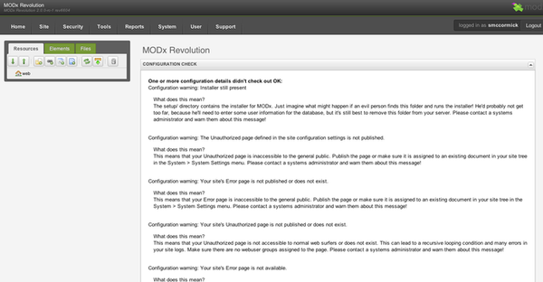

After completing a successful installation, you will be presented with the Manager login page. Proceed to log into the MODX manager using the credentials specified during the installation. Upon successful log in a screen will be presented:  



## Basic security

You will immediately encounter any security concerns which could, and should, be addressed in order to help harden your MODX system. Initial warnings usually refer to either ensuring that the setup folder has been deleted, or that the core folder is accessible  by the public. These issues can be addressed by checking that the 'setup' folder has been deleted and renaming the 'ht.access' file located in the core folder to '.htaccess'.

## Editing the default Resource

By default MODX initially creates a starter resource located in the 'Resources' tab, and a starter template located in the 'Elements' tab under templates. To view the current state of the MODX site navigate the top menu replicating these steps 'Content -> Preview Site'. Alternatively, right click on the default resource and select 'View', or click on the resource itself and select the 'View' button.

To edit the content of this resource, click on the resource itself in the 'Resources' tab and proceed to edit the content located in the 'Content' box. From here you can also proceed to edit the page title, description, summary, if it should be published or not and the alias ['friendly url'](getting-started/friendly-urls "Learn about 'Friendly URLs'")

After the edits have been made click the 'Save' button located in the top right, or use the handy keyboard shortcut 'Ctrl + S' to save the updated resource. Once the page has finished saving view the changes made by clicking the 'View' button.  

## Editing the default Template

In addition to shipping with a starter resource MODX also provides a starter template titled 'BaseTemplate'. This template is located in the 'Elements' tab under 'Templates'. Editing this template can be accomplished by clicking on the template itself, 'BaseTemplate'. From here edits can be made to the template name, description and content such as the example below.

 ```html
<!DOCTYPE html>
<html lang="en">
<head>
    <meta charset="UTF-8">
    <base href="[[!++site_url]]" />
    <title>[[*pagetitle]]</title>
    <!-- Continue to insert your css, scripts and other assets here -->
    <link rel="stylesheet" href="https://maxcdn.bootstrapcdn.com/bootstrap/4.0.0/css/bootstrap.min.css">
</head>
<body>
    <main>
        [[*content]]
    </main>
</body>
</html>
```

In the example template above there are a few odd looking string surrounded by square brackets. These are MODX tags which serve a specific purpose. The `content` tag for example indicates to MODX that it needs to feed the content tab you edited in the default resource into this location. The `pagetitle` tag refers to the page title field we also edited in that resource. Learn more about the different tags syntax, their purpose and how to use them by [visiting this page](building-sites/tag-syntax "Learn more about the MODX tag syntax").  

Once the template has been updated click the 'Save' button, or 'Ctrl + S', and continue to view the site to check out the changes.

## Creating a new Resource

To create a new Resource click on the 'Resources' tab and then locate the '+' icon next to the 'Website' text. Alternatively, a new Resource can be created by right clicking on the 'Website' text and selecting either 'Create -> Document' or 'Quick Create -> Document'. From here proceed to edit the Resource as documented earlier.

## Creating a new Template

To create a new Template click on the 'Elements' tab and then locate the '+' icon next to the 'Templates' text. Alternatively, a new Template can be created by right click on the 'Templates' text and selecting either 'New Template' or 'Quick Create Template'. From here proceed to edit the Template as documented earlier.
