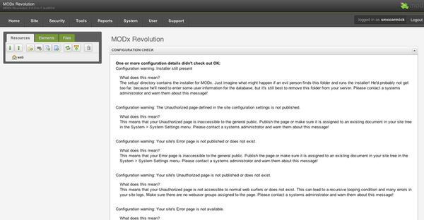

After completing a successful installation, you will be presented with the Manager login page. Log into the Manager using the credentials you specified during installation. You will see:



## Basic security

The Configuration Check widget on the Dashboard lists anything you should fix to harden the install; on a clean install it may show no warnings at all. Typical warnings cover the `setup` folder still being present or reachable, the `core` folder being web-accessible (rename `core/ht.access` to `.htaccess` on Apache), PHP version, unwritable `config.inc.php` or `core/cache/`, unpublished error pages, and `allow_tags_in_post`. Learn more about [hardening Apache and NGINX configurations for MODX](getting-started/maintenance/securing-modx "Learn more about securing your MODX install").

## Editing the default Resource

By default MODX creates a starter resource titled 'Home' (alias `index`) in the 'Resources' tab, and a starter template titled 'BaseTemplate' under 'Elements -> Templates'. To view the site, use the 'View website' button on the Dashboard, right-click the 'Home' resource and select 'View', click 'View' in the resource toolbar, or press `Ctrl+Alt+P` in the resource editor.

Click the resource in the 'Resources' tab and edit its content in the 'Content' box. From there you can also edit the page title, description, summary, publication status, and the ['friendly URL' alias](getting-started/friendly-urls "Learn about 'Friendly URLs'").

Click the 'Save' button in the top right, or press `Ctrl + S`, to save the resource. After saving, click 'View' to see the changes.

## Editing the default Template

MODX also ships with a starter template titled 'BaseTemplate', located in the 'Elements' tab under 'Templates'. Click it to edit the template name, description, and content — for example:

```html
<!DOCTYPE html>
<html lang="en">
    <head>
        <meta charset="UTF-8" />
        <base href="[[!++site_url]]" />
        <title>[[*pagetitle]]</title>
        <!-- Continue to insert your css, scripts and other assets here -->
        <link
            rel="stylesheet"
            href="https://maxcdn.bootstrapcdn.com/bootstrap/4.0.0/css/bootstrap.min.css"
        />
    </head>
    <body>
        <main>
            [[*content]]
        </main>
    </body>
</html>
```

In the template above, a few odd-looking strings are surrounded by square brackets. These are MODX tags with specific purposes. The `content` tag, for example, tells MODX to insert the content you edited in the default resource; the `pagetitle` tag inserts the resource's page title. Learn more about [the MODX tag syntax, its purpose, and how to use it](building-sites/tag-syntax "Learn more about the MODX tag syntax").

Once the template has been updated, click 'Save' (or press `Ctrl + S`) and view the site to see the changes.

## Creating a new Resource

To create a new Resource click on the 'Resources' tab and then locate the '+' icon next to the 'Website' text. Alternatively, a new Resource can be created by right clicking on the 'Website' text and selecting either 'Create -> Document' or 'Quick Create -> Document'. From here proceed to edit the Resource as documented earlier.

## Creating a new Template

To create a new Template click on the 'Elements' tab and then locate the '+' icon next to the 'Templates' text. Alternatively, right-click the 'Templates' text and select 'Create Template' or 'Quick Create Template'. From here proceed to edit the Template as documented earlier.

## Change user experience and security settings

MODX has powerful user and group management and supports alternative login methods. A few related topics:

-   [User and group management](building-sites/client-proofing/security/users)
-   [Manager customization](building-sites/client-proofing/form-customization)
-   [Manager theme](building-sites/client-proofing/custom-manager-themes)
-   [Passwordless login](building-sites/client-proofing/security/passwordless-login)
