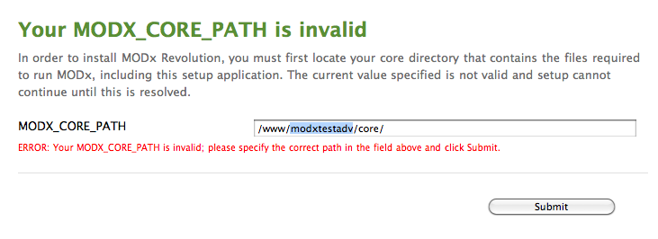
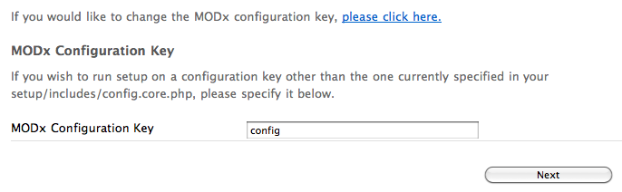
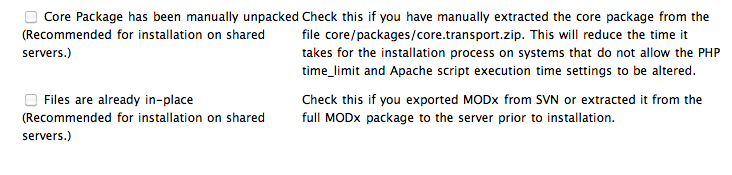

This is the tutorial for the advanced distribution of MODX. It is recommended to only install this distribution if:

- You plan on renaming the manager/ or connectors/ directories, or move the core/ directory
- You have SSH access or can easily move/make writable directories on your server.

You might want to check the [Server Requirements](getting-started/server-requirements "Server Requirements") page first. If after reading this, you're still having issues installing, please read the [Troubleshooting Installation](getting-started/installation/troubleshooting "Troubleshooting Installation") page.

## Installation Pre-Steps

After you've [downloaded](getting-started/installation "Installation") MODX Revolution's advanced distribution, upload and extract it to your server. You should be left with two directories - core/ and setup/. From here, if you plan on moving the core/ directory, proceed to the next section. If you're not going to do so, or rename the config key, browse to **setup/** in your browser and skip to the [Advanced Options](#AdvancedInstallation-AdvancedOptions) section of this document.

### Renaming or Moving the Core

MODX Revolution allows you to rename and/or move the core/ directory to enhance your level of security. You can also move the core/ directory outside of the webroot to further secure your MODX installation.

Should you choose to rename or move the core, MODX recommends doing so before installing. Simply rename or move the core, and setup/ - at the beginning - will present you with a page asking for the new location of the core:

Enter into the textfield the absolute path to where you have moved the core directory. If MODX is able to find the core from there, you will proceed normally with the installation. If MODX still cannot find the directory from the path you specified, check if you have typed it correctly, that it is an absolute path, and that you've made the directory readable (and the core/cache/ file writable).

MODX might also ask you to make the setup/includes/core.config.php file writable. This is required to change the core path, and you should do so before proceeding.

### Changing the Configuration Key

From here, MODX will ask you to choose a language. Do so at this time. MODX will then prompt you with a welcome page, and below will ask if you want to change the MODX Configuration Key. This allows you to run multiple sites with a shared core, as each individual site will need its own unique configuration key.

To change it, simply click the link the install tells you to change the config key, and you'll be presented with a textfield:

Specify a custom, unique config key and click next.

## Advanced Options

You will now be presented with some options for install, similar to the [Basic Installation](getting-started/installation/standard "Basic Installation") screen, but with two extra options at the bottom. 'New Installation' will be your only radio option available to check, which is what you want. Below that, you can choose to adjust the permissions for creating new files or folders in your MODX installation. The defaults should work fine, but if on a more restrictive server, you can change the folder/file perms to 0775/0664, respectively.

Below that, you will be presented with two checkbox options:

These will be grayed out during new installations. (During upgrades, it is recommended that you uncheck these as well.) Click 'Next' to proceed to the next step.

## Database Options

From here, you will get a form asking you for your database information:

Add in your database hostname, which is the URL at which your database is located. For most users, this will be 'localhost'. If you have your MySQL server on a different port, specify it like so: "my.database.com;port=3307", with the ;port= appending the IP/hostname.

Also, if you want, you can specify a different table prefix here. This tells MODX to prefix the tables with this value - this is useful should you want to make multiple MODX installations on one database.

When finished, click the 'Test database server connection and view collations' link. Should you have any errors, they will show below. If you do have errors, check to make sure your database username and password are correct. Also, if your user does not have access to create a database, you might need to do that manually.

### Collations and Charsets

This will then popup another form for setting your database charset and collation:

For most users you can leave these values at what they are. However, if you need to change them, **make sure** the collation matches the charset. Click the 'Create or test selection of your database.' after you've finished.

### Creating an Administrator User

This form will now present you with a few fields for setting up your administrator user. Specify a username that you want to be the administrator username.

MODX recommends **not** using 'admin', as this is a common administrator username and is often the first username hackers check.

From there, put in your email (or the email of your administrator) and specify a password. Click next when you're finished.

## Context Configuration

MODX will now present you with a detailed context installation screen. This is where you can configure the paths to your web context (the main context), as well as the directories for your connectors/ and manager/ folders. MODX recommends leaving the web/ context paths as they are, unless you have a special reason not to.

Renaming your manager/ and connectors/ directories, however, can add an extra level of security to your site. Simply change the paths and URLs in the textfields provided. Note: If you do change the directories, the directories **above** any of those paths must be writable to allow MODX to write the manager/ and/or connectors/ directories to them.

Make sure you change **both** the path and URL!

When done, click 'Next' to proceed.

## Pre-Installation Checks

MODX will then proceed with a list of checks to verify that your system is ready for installing. If any of these fail, you'll need to proceed with the directions that it suggests to make sure your environment meets the [Server Requirements](getting-started/server-requirements "Server Requirements") and has the correct directories writable.

Once you're ready, and all the checks pass, click 'Install' to proceed.

If you get a blank screen or cannot proceed after clicking 'Install', verify these steps:

1. Make sure the directories "/\[root\]", "/core/config", "/core/packages","/core/cache", and "/core/export" are writable. (root will be the actual directory you are installing to.)
2. Make sure your php.ini setting sets memory\_limit to 128M, and max\_execution\_time to 120
3. Ensure that MODX can create the manager and connectors directories; this is done by making the parents of those directories writable (since you can change where they are installed)
4. Post a message in the [Revolution forum](https://forums.modx.com/index.php/board,280.0.html) regarding your issue. State your server setup and installation info, and we'll try and help you find a solution.

## Post-Installation Summary

MODX will then let you know if any errors occurred during install, and prompt you to attempt reinstallation should any of those errors have occurred.

When install is successful, click 'Next' to proceed, and you'll be presented with one final option:

MODX recommends that you make sure to remove the setup/ directory after installing, to safeguard your site from anyone else trying to run setup on your site. You can do this by clicking the 'Check this to DELETE the setup directory from the filesystem.' checkbox.

When ready, click 'Login' to be presented with the Login form for the manager interface. You're finished!

## See Also

1. [Basic Installation](getting-started/installation/standard)
2. [Lighttpd Guide](getting-started/friendly-urls/lighttpd)
3. [Installation on a server running ModSecurity](getting-started/installation/troubleshooting/modsecurity)
4. [Nginx Server Config](getting-started/friendly-urls/nginx)
5. [Advanced Installation](getting-started/installation/advanced)
6. [Git Installation](getting-started/installation/git)
7. [Command Line Installation](getting-started/installation/cli)
8. [The Setup Config Xml File](getting-started/installation/cli/config.xml)
9. [Troubleshooting Installation](getting-started/installation/troubleshooting)
10. [Successful Installation, Now What Do I Do?](getting-started/getting-started)
