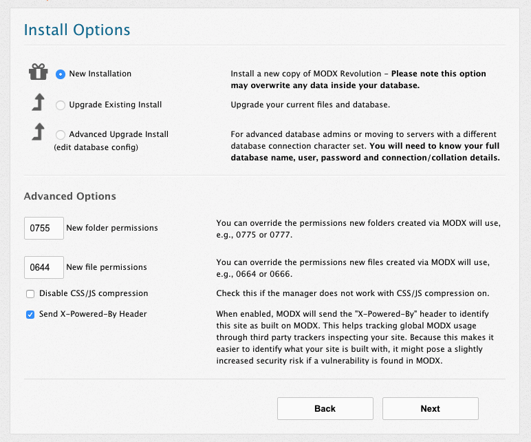
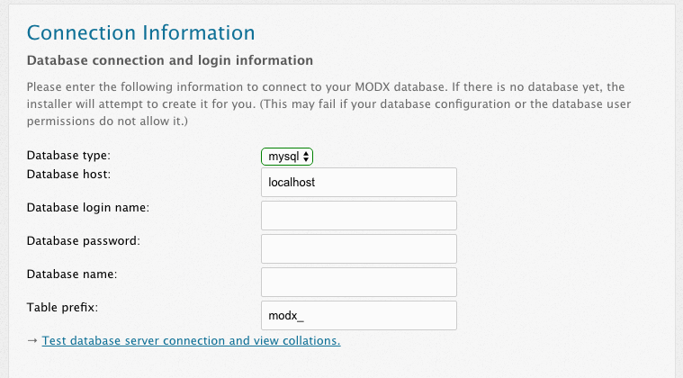
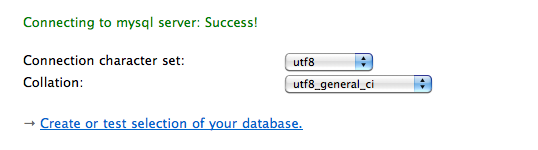
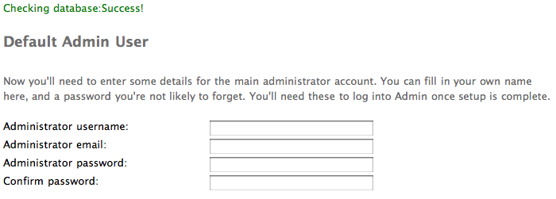
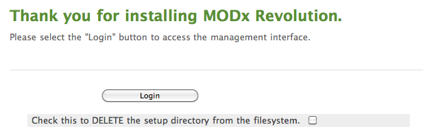

## Beginning Setup

After you've [downloaded](getting-started/installation "Installation") MODX Revolution, upload the .zip file to your server. On the server itself, either through your control panel extraction script or in the server's file manager, extract the file to its own directory. Copy or move all the files within the new extracted MODX version directory to the directory that you wish to install MODX into. You may delete the extracted folder and its contents, as well as the MODX .zip file once your installation is complete.

You can install MODX into any directory you wish, although installing to the root is generally preferred for production sites.

FTP Warning - Using FTP to transfer unpacked files to your server may result in corrupted or incomplete transfers. This can affect your installation negatively. If at all possible, use your server's unpacking script or utility to transfer or move extracted MODX installation files.

### Installing MODX With An Existing Site

Development sites often begin in a subdirectory, and then are [moved](getting-started/maintenance/moving-your-site "Moving Your Site to a New Server") to the root directory when completed. The subdirectory method is useful if you've got an existing site that must remain available during development, or for subdomain MODX installations. It is also possible to leave MODX in a subdirectory and use .htaccess to rewrite your urls to the root.

#### Existing Static HTML Site

If your existing site is static html with an index.html or similar start page, you can install MODX into the root folder alongside your static site while developing. When you are ready to go live, rename or move your static html files and MODX will take over. **Do not enable** [Friendly URL's](getting-started/friendly-urls "Using Friendly URLs") if using this method until after your html files have been moved or renamed. As always, **back up your existing site** prior to installing MODX Revolution or making any changes to your current file structure.

#### Existing Other CMS or Dynamically Driven Site

Do not install MODX Revolution into a directory that contains another dynamically driven site or CMS until that site is removed. Use the subdirectory method to develop MODX in this case.

In all cases except for a new blank site, installing MODX Revolution to a subdirectory for development is the safest method.

### Pre-DNS Transfer Installation to Temporary Directory

If your host provides a temporary installation folder to develop in prior to DNS transfer, once your DNS has been transferred you will need to reference the [Moving Your Site to Another Server](getting-started/maintenance/moving-your-site "Moving Your Site to a New Server") page and update the configuration files: _core/config/config.inc.php, /config.core.php, /connectors/config.php, and /manager/config.core.php_ paths to point to your new root directory.

## Installing MODX Revolution

Start the install process by loading your web browser and running the setup script by navigating to the **setup/** folder.

You might want to check the [Server Requirements](getting-started/server-requirements "Server Requirements") page first. If you're still having issues installing, please read the [Troubleshooting Installation](getting-started/installation/troubleshooting "Troubleshooting Installation") page.

Before running setup, make sure your core/cache/ and core/config/ directories are writable by PHP.

From there you will be asked to choose a language, and be presented with a welcome screen. Click Next when you're ready.

## Install Options

After this, you'll be presented with a screen with some Install Options:

The New Installation option should be the only available option for you to choose. If you need to adjust the file permissions for your webserver, you can do so in the textfields below. Most servers will be fine with the default values.

When you're finished, click Next to proceed.

## Database Options

From here, you will get a form asking you for your database information:

You can create your database and user prior to this step. Make sure your database user is associated with the new database and the user is given permission for all privileges for that database.

- Add in your database hostname, which is the URL at which your database is located. For most users, this will be 'localhost'.
- Enter your database user name. On some hosts, your database username is prefixed with the site owner directory name such as `siteOwner_modxDatabase`. In this case, the entire database name must be entered. Check your database tool in your control panel, or the database itself for such a prefix.
- Your username may also be prefixed with the same site owner directory name. If so, you must prefix your username here the same. i.e. `siteOwner_databaseUserName`.
- Enter your password.
- Also, if you want, you can specify a different table prefix here. This tells MODX to prefix the tables with this value - this is useful should you want to make multiple MODX installations on one database.
- When finished, click the 'Test database server connection and view collations' link. Should you have any errors, they will show below. If you do have errors, check to make sure your database username and password are correct. Also, if your user does not have access to create a database, you might need to do that manually.

### MySQL Notes

If you have your MySQL server on a different port, specify it like so: "my.database.com;port=3307", with the ;port= appending the IP/hostname.  If you are running your MySQL server with networking disabled, you can specify the socket name like this: ";unix\_socket=MySQL".

### Microsoft SQL Server Notes

Support for Microsoft SQL Server was introduced in MODX Revolution 2.1  Depending on your SQL Server's network configuration, there are different ways you may specify your host.

- Named pipe: (local)/SQLEXPRESS
- Tcp/ip: 127.0.0.1,2301 (IP, port)

Due to the way that the PDO driver for SqlSrv works, you may not get an error message or a response back after clicking 'Test database server connection and view collations'. If this happens, it is an indication that there is a problem connecting to the database, authenticating or selecting the database itself. After verifying your settings, click the Back button to go to the previous page, and then Next to get back to the Database Options page.

### Collations and Charsets

This will then popup another form for setting your database charset and collation:

For most users you can leave these values at what they are. However, if you need to change them, **make sure** the collation matches the charset. Click the 'Create or test selection of your database.' after you've finished.

**Microsoft SQL Server Notes**
MODX has only been tested with SQL Server's Latin1 character set.

### Creating an Administrator User

This form will now present you with a few fields for setting up your administrator user. Specify a username that you want to be the administrator username.

MODX recommends **not** using 'admin', as this is a common administrator username and is often the first username hackers check.

From there, put in your email (or the email of your administrator) and specify a password. Click next when you're finished.

Some host's server configurations won't allow MODX to send emails if the System Setting [emailsender](building-sites/settings/emailsender) (set at install to the email address entered for the default admin user) is not valid for the domain. If MODX is not sending registration or form emails, check the [emailsender](building-sites/settings/emailsender) and set it to a valid email address for the hosted domain.

## Pre-Installation Checks

MODX will then proceed with a list of checks to verify that your system is ready for installing. If any of these fail, you'll need to proceed with the directions that it suggests to make sure your environment meets the [Server Requirements](getting-started/server-requirements "Server Requirements") and has the correct directories writable.

Once you're ready, and all the checks pass, click 'Install' to proceed.

If you get a blank screen or cannot proceed after clicking 'Install', verify these steps:

1. Make sure the directories "/core/packages","/core/cache", "/core/import", and "/core/export" are writable.
2. Make sure your php.ini setting sets `memory_limit` to 128M, and `max_execution_time` to 120
3. Create a blank file "/core/config/config.inc.php" and make it writable. **DO NOT COPY config.inc.tpl! Just make it a blank file!**
4. Post a message in the [Revolution forum](http://modxcms.com/forums/index.php/board,280.0.html) regarding your issue. State your server setup and installation info, and we'll try and help you find a solution.

## Post-Installation Summary

MODX will then let you know if any errors occurred during install, and prompt you to attempt reinstallation should any of those errors have occurred.

When install is successful, click 'Next' to proceed, and you'll be presented with one final option:

MODX recommends that you make sure to remove the `setup/` directory after installing, to safeguard your site from anyone else trying to run setup on your site. You can do this by clicking the 'Check this to DELETE the setup directory from the filesystem.' checkbox.

**WARNING**: the setup application grants powerful and far-reaching control over your server. DO NOT leave it in place, after you've finished installing MODX.

When ready, click 'Login' to be presented with the Login form for the manager interface. You're finished!

## Additional Info

Some other special cases:

### MAMP on MacOSX

MAMP (including latest 1.8.4) works fine with MODX Revolution, with one exception. You cannot use eAccelerator as the caching system, as the drivers compiled with MAMP are faulty with regards to PDO and will cause Apache kernel errors. Select the 'xCache' caching drivers to remedy this.

### Vista and XAMPP

There have been reported problems with installing Revolution on 64-bit Vista with XAMPP. We cannot guarantee a working solution on that OS and setup at this time.

Some users have reported that applying a fix found here: <http://www.apachefriends.org/f/viewtopic.php?f=16&t=32617> will fix Apache crashing errors with PDO support in XAMPP.

### Installing Packages

For information on installing 3rd-party packages, see the [How to Install Packages](extending-modx/transport-packages "Package Management") article.

### See Also

1. [Lighttpd Guide](getting-started/friendly-urls/lighttpd)
2. [Installation on a server running ModSecurity](getting-started/installation/troubleshooting/modsecurity)
3. [Nginx Server Config](getting-started/friendly-urls/nginx)
4. [YouTube video by a MODX Ambassador](http://www.youtube.com/watch?v=Wwrq-3CWFVU)
