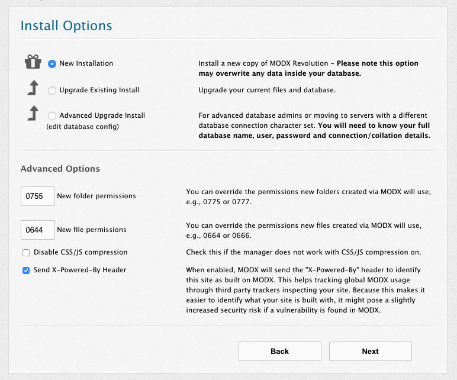
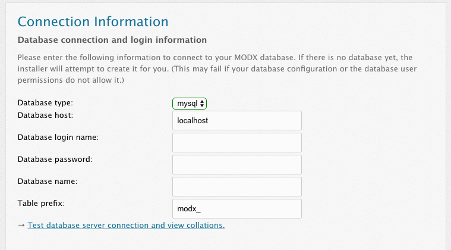
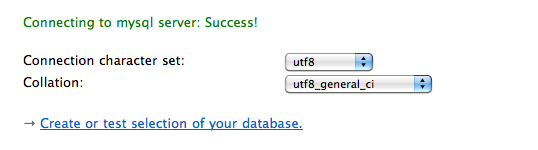
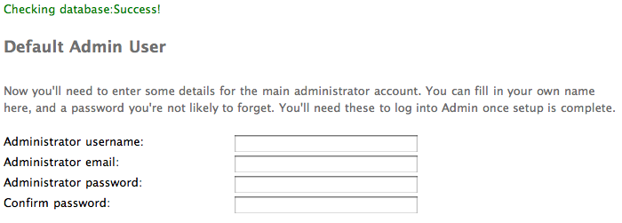
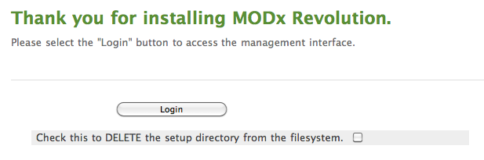

This guide walks through a normal new install from the **traditional** zip download. Most sites should use this path.

- Upgrading an existing site? See [Upgrading MODX](getting-started/maintenance/upgrading).
- Renaming `manager/` or `connectors/`? Use the [Advanced Installation](getting-started/installation/advanced).
- Installing from Git or Composer? See [Git Installation](getting-started/installation/git) or [Composer](getting-started/installation/composer).

## 1. Check requirements

Confirm your host meets the [Server Requirements](getting-started/server-requirements). Current MODX 3.x (3.2+) needs **PHP 8.1+** and MySQL/MariaDB.

You will need:

- A web root (or subdirectory) where the site will live
- A MySQL database and a database user with full rights on that database
- The ability to upload/extract files (file manager, SFTP, or SSH)

## 2. Download and place the files

1. Download the latest **traditional** package from [modx.com/download](https://modx.com/download/).
2. Upload the zip to your server.
3. Extract it **on the server** (hosting file manager or `unzip`). Prefer extracting on the server over uploading thousands of files via FTP, which may corrupt or skip files.
4. Move the extracted files into your web root (or the subdirectory you want to use), so that `index.php`, `core/`, `manager/`, `connectors/`, and `setup/` sit in that directory.
5. You can delete the zip and any empty wrapper folder left after extraction.

Installing in the domain root is usual for production. A subdirectory is fine for testing. Special cases (existing HTML/CMS site, temporary hosting URL) are covered in [Installing alongside an existing site](getting-started/installation/existing-site).

Before continuing, ensure PHP can write to at least:

- `core/cache/`
- `core/config/`
- `core/packages/`
- `core/import/`
- `core/export/`

## 3. Create the database

In your host’s MySQL tool (phpMyAdmin, control panel, CLI, etc.):

1. Create an empty database (utf8mb4 is a good default charset when the host offers it).
2. Create a database user and grant it all privileges on that database. If you prefer a more restrictive set of database permissions, see the list in [Server Requirements](getting-started/server-requirements).
3. Note the hostname (often `localhost`), database name, username, and password. Some shared hosts prefix database and usernames (for example `account_modx`); use the full names setup expects.

## 4. Run setup

In your browser, open `https://yoursite.example/setup/` to start the installation wizard.

Use your real domain or local URL, and include a subdirectory if you installed into one.

### Language and welcome

Choose your language, then continue past the welcome screen.

### Install options

For a new site, leave **New Installation** selected. File and directory permission fields can usually stay at the defaults. Click **Next**.

### Database connection

Enter:

- **Database hostname** - usually `localhost`. For a non-standard port use `host;port=3307`. For a Unix socket you can use a form like `;unix_socket=/path/to/mysql.sock`.
- **Username** and **password**
- **Database name**
- **Table prefix** - `modx_` is fine; change it only if you share one database across multiple MODX installs

Click **Test database server connection and view collations**. Fix any errors before continuing (wrong password, missing database, or a user without rights are the usual causes).

### Charset and collation

Typically, you'll want to use `utf8mb4` and `utf8mb4_general_ci` to have wide compatibility. Using plain `utf8` can make it impossible to save emojis or certain scripts. If you change them, keep charset and collation matched. Then create or confirm the database selection as setup asks.

### Administrator user

Create the main Manager user:

- Prefer a username other than `admin`
- Use a strong password
- Use a real email address you control (setup also uses this for the initial `emailsender` setting)

Click **Next**.

### Pre-installation checks and install

Setup verifies PHP, extensions, and writable paths. Resolve any failures (see [Server Requirements](getting-started/server-requirements) and [Troubleshooting Installation](getting-started/installation/troubleshooting)), then click **Install**.

When it finishes successfully, continue to the summary screen.

### Remove setup and log in

Tick the option to **delete the `setup/` directory**, then log in to the Manager.

Leave `setup/` in place only while you still need it. The installer is powerful; remove it as soon as installation succeeds.

## 5. After installation

1. Confirm you can sign in to the Manager and open the site front-end.
2. Work through [Successful installation, now what?](getting-started/getting-started).
3. Turn on [Friendly URLs](getting-started/friendly-urls) when you are ready (and use the correct Apache/nginx rules).
4. Harden the install: [Securing MODX](getting-started/maintenance/securing-modx) (especially blocking web access to `core/`).
5. Install Extras from Package Management when needed: [Transport packages](extending-modx/transport-packages).

If email from the site fails later, check that [emailsender](building-sites/settings/emailsender) is a valid address for your domain.

## If something goes wrong

- Blank page or stalled install: [Troubleshooting Installation](getting-started/installation/troubleshooting)
- Still stuck? Ask on the [MODX Community](https://community.modx.com) and include your PHP version, database type/version, and the exact setup error (also check `core/cache/logs/error.log` when it exists).

## See also

- [Installing alongside an existing site](getting-started/installation/existing-site)
- [Advanced Installation](getting-started/installation/advanced)
- [Command Line Installation](getting-started/installation/cli)
- [Friendly URLs on nginx](getting-started/friendly-urls/nginx) / [Apache](getting-started/friendly-urls/apache)
- [ModSecurity](getting-started/installation/troubleshooting/modsecurity)
