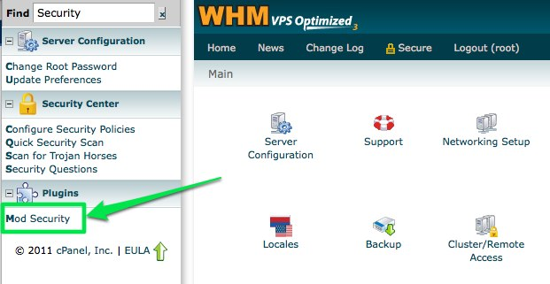

[ModSecurity](https://github.com/owasp-modsecurity/ModSecurity) is a web application firewall (WAF), often run as an Apache module (`security2_module`). Its rule sets can block requests that look like attacks.

The MODX Manager posts a lot of data through `connectors/`. Some of those requests (especially when saving TVs, resources, or other structured content) can match generic SQL-injection or similar rules. When that happens, the Manager action fails. Sometimes you only see a generic error or a quiet failure, so check the Apache / ModSecurity logs.

Editing Apache or ModSecurity config can take the site offline if done incorrectly. If you are not comfortable with that, ask your host or a system administrator. Many hosts can whitelist a rule for you if you give them the rule id and URI from the log.

## Confirm ModSecurity is installed

Ask your host, or check yourself:

### WHM / cPanel

1. Log into WHM (often `https://yoursite.com:2087/`).
2. Under **Plugins**, look for **Mod Security**.



### Command line

List loaded Apache modules:

``` bash
apachectl -t -D DUMP_MODULES
```

If `apachectl` is not in your `PATH`, find it (for example `find / -name apachectl 2>/dev/null`) and run it with the full path. ModSecurity usually appears as `security2_module (shared)`.

You can also search the main Apache config (often under `/etc/httpd/` or `/usr/local/apache/conf/`) and included conf directories for `security2_module` or `mod_security`.

## Check the logs

Reproduce the failing Manager action while watching the Apache error log (path varies by host):

``` bash
tail -f /usr/local/apache/logs/error_log
```

Also check the ModSecurity audit log when present, for example `/usr/local/apache/logs/modsec_audit.log`.

### What to record from an error

Example:

``` text
[Sat Nov 19 19:16:32 2011] [error] [client 123.123.123.123] ModSecurity: Access denied with code 500 (phase 2).
Pattern match "(insert[[:space:]]+into.+values|select.*from.+[a-z|A-Z|0-9]|select.+from|bulk[[:space:]]+insert|union.+select|convert.+\\\\(.*from)"
at ARGS:els.
[file "/usr/local/apache/conf/modsec2.user.conf"]
[line "359"]
[id "300016"]
[rev "2"]
[msg "Generic SQL injection protection"]
[severity "CRITICAL"]
[hostname "yoursite.com"]
[uri "/connectors/element/tv.php"]
[unique_id "TshG4EWntHMAAAfIFmUAAAAI"]
```

Note:

- **Rule id** - `[id "300016"]`
- **Host** - `[hostname "yoursite.com"]`
- **URI** - `[uri "/connectors/element/tv.php"]`

You need those to whitelist the rule for that path only.

## Whitelist the rule for that URI

Prefer a narrow whitelist: remove the specific rule id for the specific Location, rather than turning ModSecurity off for the whole site.

### Where to put the rule

On many cPanel/WHM servers you should not edit the main `httpd.conf` directly. Put a small include under the vhost userdata path referenced in the domain’s `VirtualHost` block, for example:

- `/usr/local/apache/conf/userdata/std/2/USERNAME/*.conf`
- `/usr/local/apache/conf/userdata/std/2/USERNAME/yoursite.com/*.conf`

Server-wide allow lists sometimes live in `/usr/local/apache/conf/modsec2/whitelist.conf`. Paths differ by host; use what your Apache config already `Include`s.

Back up any file you change. On cPanel, you can refresh the built config with:

``` bash
cd /usr/local/apache/conf
cp -p httpd.conf httpd.conf.backup
/scripts/rebuildhttpdconf
```

### Example whitelist

From the sample log above:

``` apache
<LocationMatch "/connectors/element/tv.php">
  <IfModule mod_security2.c>
    SecRuleRemoveById 300016
  </IfModule>
</LocationMatch>
```

You can list several rule ids on one line or use several `SecRuleRemoveById` directives. If you rename `connectors/` or change the site path, update these `LocationMatch` paths to match.

Other connectors or Manager URLs may need their own entries as you find them in the logs, for example:

``` apache
<LocationMatch "/connectors/resource/index.php">
  <IfModule mod_security2.c>
    SecRuleRemoveById 300013 300014 300015 300016
  </IfModule>
</LocationMatch>
```

Then reload or restart Apache so the change is picked up (method depends on the host, for example `systemctl reload httpd` or `/etc/init.d/httpd restart`). On cPanel, rebuild the conf first if that is how includes are merged, then restart.

If Apache fails to start, restore the backup config and fix the syntax before trying again.

## Large downloads / static resources

ModSecurity request-body limits can truncate large downloads (including large Static Resources), sometimes around 64KB, occasionally **without** a clear log line.

In WHM Mod Security → Edit Config, review settings such as:

- `SecRequestBodyAccess`
- `SecRequestBodyLimit`
- `SecRequestBodyInMemoryLimit`

For a download-only location you may need to adjust or disable body access, for example:

``` apache
SecRequestBodyAccess Off
```

(Use that only where appropriate, not as a global default unless you understand the tradeoff.)

A similar truncated download can also come from double gzip (for example nginx and Apache both compressing). Rule that out before assuming ModSecurity.

## See also

- [Hardening MODX](getting-started/maintenance/securing-modx)
- [Troubleshooting Installation](getting-started/installation/troubleshooting)
- [ModSecurity reference](https://github.com/owasp-modsecurity/ModSecurity/wiki)
