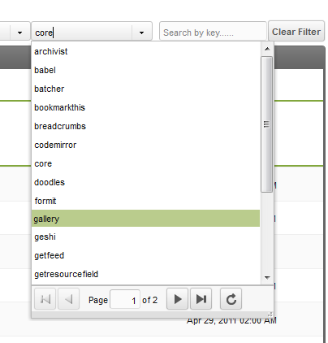
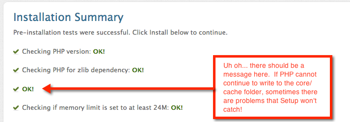
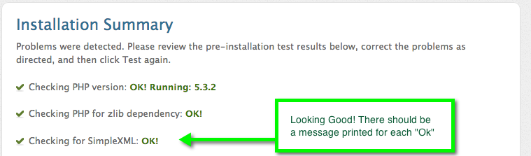

Move both the database and all site files. The same steps apply when the site only moves to a new folder on the current server.

**Tip**
 Before the move, turn off [Friendly URLs (FURLS)](getting-started/glossary#friendly-urls-friendly-aliases) in the Manager (if enabled) and rename `.htaccess` to `ht.access`. Do the reverse as your last step, once everything works at the new location. It removes a common source of confusion during the transition.

## Log into the Manager: clear cache and sessions

- Log into the [Manager](getting-started/glossary), then from the main menu: `Content` --> `Clear Cache`
- Clear your [sessions](getting-started/glossary): user menu (top right) --> `Access` --> `Logout All Users` (requires the `flush_sessions` permission)


The surest way to clear the cache is by hand: delete everything inside the `core/cache` folder. The server's file manager or SSH does this much faster than FTP, and a cleared cache makes the archive you upload smaller.

## Packaging up your files

Package the site into a single archive instead of moving files one by one. A GUI drag-and-drop silently skips hidden files such as `.htaccess`, and hundreds of small FTP transfers are slower than one archive: each file authenticates separately.

On a UNIX style system, create an archive with the tar command:

``` bash
tar -czf /path/to/backups/modx_revo_site.tar.gz /path/to/modx_doc_root/
```

On the target server, extract the file in a directory of its own, so a failed extraction is easy to clean up:

``` bash
gunzip modx_revo_site.tar.gz
tar xvf modx_revo_site.tar
```

Then move the containing directory into place rather than copying files in bulk, so hidden files are not left behind.

## Change file ownership

Ownership often changes when you move hosts: the files must belong to the web server and be accessible to it. Check the server configuration or ask your host for the correct settings. The ownership on the uploaded `tar.gz` is usually correct, since FTP software applies it on upload.

## Writable: 777 or 755?

Some folders must be writable: depending on the server's security configuration that means 755 or 777. The `tar.gz` keeps the old server's permissions, which may not work on the new one.

## Dumping your database

_Note that MODX 3 supports MySQL/MariaDB only (the `sqlsrv` driver from 2.x was removed in 3.0). The section below is MySQL specific._

Dump the database with a GUI tool such as `phpMyAdmin`, or with the command-line `mysqldump` utility:

``` bash
mysqldump -u username -p your_revo_db > /path/to/backups/my_revo_db.sql
```

The account needs SELECT and LOCK permissions on all MODX Revolution tables. In practice, use the username and password from your configuration file (`/core/config/config.inc.php`). `mysqldump` prompts for the password after the command: what you type or paste will not appear in the terminal.

On the new server, load the dump into the target database with the `mysql` command:

``` bash
mysql -u username -p target_db < my_revo_db.sql
```

phpMyAdmin works too, but web-based tools share PHP's memory limits, so for a full database prefer the command line. See the [phpMyAdmin backup FAQ](https://docs.phpmyadmin.net/en/latest/faq.html#how-can-i-backup-my-database-or-table); many control panels also offer database backup tools.

## Updating your config files

Once the files are deployed to the new server, update the main configuration file `core/config/config.inc.php`. Six paths need changing; find and replace the values of these variables:

``` php
/* PATHS */
$modx_core_path= '/path/to/modx_doc_root/core/';
$modx_processors_path= '/path/to/modx_doc_root/core/src/Revolution/Processors/';
$modx_connectors_path= '/path/to/modx_doc_root/connectors/';
$modx_manager_path= '/path/to/modx_doc_root/manager/';
$modx_base_path= '/path/to/modx_doc_root/';
$modx_assets_path= '/path/to/modx_doc_root/assets/';

/* HOST (used for command-line PHP stuff only) */
$http_host='yoursite.com';
```

Note: in web requests MODX determines the host from `$_SERVER['HTTP_HOST']` itself; the `$http_host` value saved in the config is only used for CLI runs (see `core/docs/config.inc.tpl`).

If you are also moving the site into or out of a subfolder, update `$modx_connectors_url`, `$modx_manager_url` and `$modx_base_url`. They should end with a slash (for example, `$modx_base_url='/'` for a site not in a subfolder).

**Permissions**
You may need to loosen the permissions before editing the config file. Restore the read-only permissions on the file afterwards.

Three more configuration files hold the same two PHP constants; update their paths too:

``` php
define('MODX_CORE_PATH', '/path/to/modx_doc_root/core/');
define('MODX_CONFIG_KEY', 'config');
```

- /config.core.php
- /connectors/config.core.php
- /manager/config.core.php

\*If the site lives in a **~temporary folder** on the server, its development URL carries a **~yoursitehome** addition. All four files above will hold that temporary path on the development installation; replace it with the production paths when you move to the root install.

## Update your database

**Don't forget the database.** MODX stores path data in it: if the `workspaces` table still holds the old path, the Manager page may show a white page.

To see the path stored in the database, run this query in phpMyAdmin, the MySQL command line or any other query tool:

``` sql
SELECT `path` FROM `your_revo_db`.`workspaces`;
```

Replace `your_revo_db` with your database name, and add the table prefix to the `workspaces` table if there is one, for example `modx_workspaces`.

If the path on the new server differs from the old one, update the record. Edit it in a GUI editor (such as SQL-Yog or phpMyAdmin), or run (customise the query for your database, prefix and data path):

``` sql
UPDATE `your_revo_db`.`workspaces` SET path='/path/to/modx_doc_root/core/' WHERE id='1';
```

## Update .htaccess

A move often brings a new domain: update every reference to the old domain in your `.htaccess` file(s).

## On the new server

Log into the Manager to verify it works. On entry you may get a blank page or a fatal error about a missing manager controller, for example `manager/controllers/default/welcome.class.php` (current controllers use the `*.class.php` naming).

The old path is still cached in the database and on the file system: clear the site cache once more after the transfer and refresh the Manager page. Clearing it from the Manager is not always enough: delete all folders and files inside `core/cache` over FTP, SSH, the command line or your hosting panel's file manager. If you skipped the cache and session cleanup before the move, do it now when the Manager shows errors.


## Re-run setup

After any change to a MODX Revolution site's install, version or location, re-run the `domain.com/setup` script.

- Run the setup version that matches the version of MODX Revolution you will be using.
- Get the transferred site working before attempting any version upgrades.

[Download Previous Versions of MODX Revolution](https://modx.com/download/previous-releases/)

If MODX does not find a `config.inc.php` file during setup, it will not offer the upgrade install option. Do not proceed unless you can check the "Upgrade Install" checkbox. If the file is there but MODX does not find it, check the path in the `config.core.php` files described in Updating your config files above; MODX uses that path to find `config.inc.php`.


## Updating your extras settings



Some extras, such as [Gallery](extras/gallery), store file paths in their own settings: Gallery keeps the paths to its assets, core, files and phpthumb folders. They change on a move, and system settings are the usual place they live.

In the Manager open `Admin` -> `System Settings` and find the namespaces dropdown, as seen on the image to the right (click to enlarge). Pick the extra you need, for instance Gallery: most extras show up on the list. Update the paths to the new location.

**If you are using MODX Revolution 2.2**, also check the `extension_packages` system setting (System & Server area of System Settings). It is used for custom resource classes (such as the [Articles](extras/articles) extra) and defines the path to its model, which may need updating after the move.

## Troubleshooting

### Setup errors

Re-running setup on the new server can fail even when the copied files and database already work. Re-run it only to fix something that broke during the transfer.

#### Class xPDODriver_ not found

``` text
Fatal error: Class 'xPDODriver_' not found in /path/to/webroot/core/xpdo/xpdo.class.php on line 1823
```

Your configuration file got mangled. Re-open `core/config/config.inc.php` and verify that its contents are in place: a mangled config file contains placeholders instead of values.

``` php
$database_type = '{database_type}';
$database_server = '{database_server}';
$database_user = '{database_user}';
$database_password = '{database_password}';
$database_connection_charset = '{database_connection_charset}';
$dbase = '{dbase}';
$table_prefix = '{table_prefix}';
$database_dsn = '{database_dsn}';
$config_options = {config_options};
$driver_options = {driver_options};
```

#### Installation Summary shows incomplete items

When the Installation Summary page shows no messages at all, permissions are not correct somewhere.



When that page works correctly, each "Ok" carries a message:



#### Check your database encoding

If the database on one server does not use the same encoding as the new server, things like single quotes break, and in some cases the site returns a 500 error.

## Final checks

Keep the old server's backups until the new site has survived a couple of backup cycles and everything is verified.

If trouble persists after setup succeeds, delete all files in `core/cache` by hand and clear your browser cache and cookies.

**Final Checkup**
 The `test_config.php` script from [modx_utils](https://github.com/craftsmancoding/modx_utils) confirms that the configuration file is set up correctly, but it is old: since MODX 2.5.x some of its connectors no longer exist. For a supported check, use the commercial [SiteCheck](http://bobsguides.com/sitecheck-tutorial.html) package.
