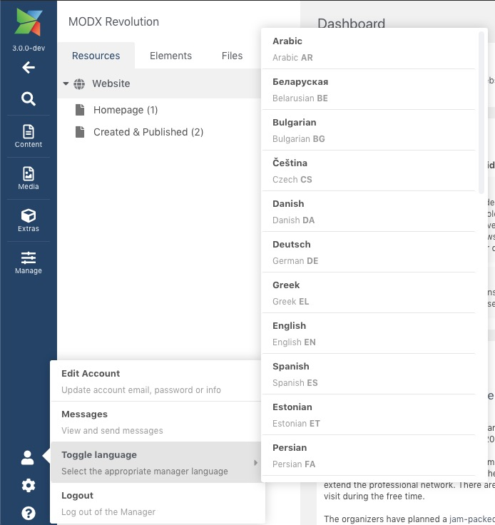

In MODX 2.x the manager language came from the `manager_language` system setting; there was no built-in context- or user-level override. In MODX 3 the setting is gone — the language is stored in the user's session.

The current language is available as `cultureKey` in the MODX config array: `$modx->config['cultureKey']`. Manager JavaScript must use `MODx.config.cultureKey` instead of `MODx.config.manager_language`.

The manager picks a language from the browser language on first visit; a different one can be chosen at the bottom of the login screen. While logged in, use Admin > Toggle language in the manager menu (in 3.0 this item was under User; it moved to Admin in 3.1 — the screenshot below shows the 3.0 menu).

