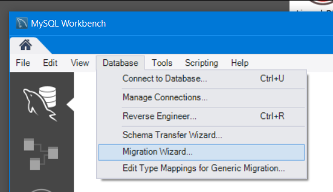

As of MODX 3.0, sqlsrv (mssql server) is no longer supported. This means that if you used sqlsrv with MODX 2.x, you will now need to migrate your database to MySQL if you wish to upgrade to MODX 3.

MODX does not currently provide utilities to migrate, however there are various migration tools available online. 

## Before you begin

It's strongly recommended running a database type migration on a development or staging site, rather than production. It may take some time for data to be copied and migrated across.

## Step 1, migrate to MySQL

To get started, first **migrate your sqlsrv database to a new MySQL database** with a third party tool. One option that we'll describe here is using MySQL Workbench, [available here](https://dev.mysql.com/downloads/workbench/).

In the top menu choose Database > Migration wizard.

At the bottom of the screen click "Start migration" and keep going through the steps shown in the task list to get your data moved over into the clean database.

## Step 2, create a clean MODX installation on MySQL

Next up we're going to create a clean MODX installation **using the same version currently installed on sqlsrv**. 

The reason to first create a clean installation is that while the migration tries to guess the appropriate data types and such, it is possible that will deviate slightly from the MODX schemas for MySQL. 

[Follow the standard installation instructions](../installation) to create your clean MODX installation. 

## Step 3, copy data from the migration into the clean install

Next, use a MySQL tool (such as MySQL Workbench or PHPMyAdmin) to export **only the data** from the migrated database to file. **Do not export the structure**! Make sure to create the export with the "truncate before insert" option because we don't need to keep the information from the clean install, we just want its database structure.

Import the export onto the clean installation. 

## Step 4, copy files and test

Finally, make sure to move across all files that your site needs. That includes components, assets, etc, however make sure to **not** overwrite the `core/config/config.inc.php` file.

Now you can test your site on MySQL and make sure it all works as expected. 

