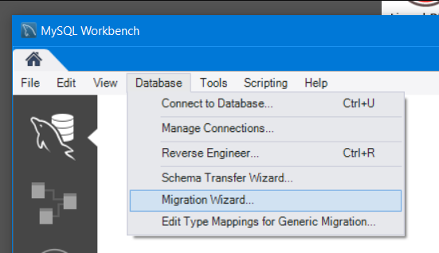

As of MODX 3.0, sqlsrv (mssql server) is no longer supported. If you used sqlsrv with MODX 2.x, migrate your database to MySQL to upgrade to MODX 3.

MODX does not provide migration utilities, but various migration tools are available online.

## Before you begin

Run the migration on a development or staging site, not production. Copying and migrating the data may take a while.

## Step 1, migrate to MySQL

**Migrate your sqlsrv database to a new MySQL database** with a third-party tool. One option is MySQL Workbench, [available here](https://dev.mysql.com/downloads/workbench/).

In the top menu choose Database > Migration wizard.

At the bottom of the screen click "Start migration" and follow the steps in the task list to move the data into the clean database.

## Step 2, create a clean MODX installation on MySQL

Create a clean MODX installation **on the same version that currently runs on sqlsrv**.

A clean installation is needed because the migration guesses data types and may deviate slightly from the MODX schemas for MySQL.

[Follow the standard installation instructions](getting-started/installation) to create the clean installation.

## Step 3, copy data from the migration into the clean install

Use a MySQL tool (such as MySQL Workbench or PHPMyAdmin) to export **only the data** from the migrated database to a file. **Do not export the structure**. Enable "truncate before insert" in the export: the clean install contributes only its database structure, not its data.

Import the export into the clean installation.

## Step 4, copy files and test

Move across all files your site needs — components, assets, etc. Do **not** overwrite `core/config/config.inc.php`.

Test the site on MySQL and check that everything works as expected.
