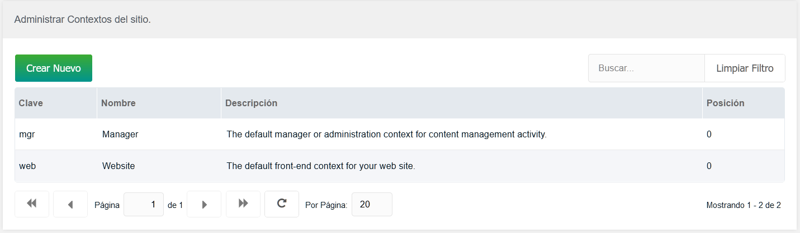
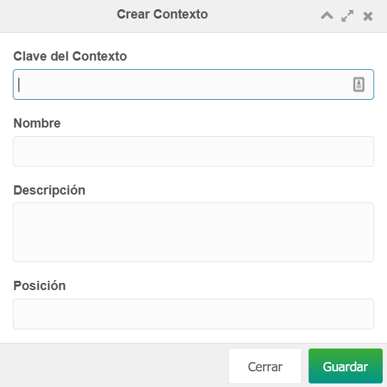

 Los contextos permiten que los ajustes de configuración de MODX se anulen, amplíen, aislen o se compartan entre dominios, subdominios, subsitios, sitios múltiples, secciones culturales específicas, aplicaciones web específicas, etc.

 Puedes crear fácilmente un contexto desde la entrada Contextos en el manú Sistema. El contexto se mostrará en tu árbol de recursos. Los recursos se pueden arrastrar fácilmente entre contextos para moverlos de un contexto a otro.

 Nota: no hay nada fundamentalmente _diferente_ acerca de los recursos en diferentes contextos, excepto que ahora heredan las configuraciones del contexto en el que se encuentran. Por tanto, si creas un nuevo contexto, tendrás que editar la configuración del mismo para que aparezca algún cambio real distinguible.

## Creando un contexto

 Primero, vete a la página Contextos, a través de Sistema(_*icono de rueda dentada en  el menú  superior_) -> Contextos. Luego, haz clic en el botón "Crear Nuevo" (_encima de la cuadrícula_). 
 
 
 
 Esto te pedirá una clave, un nombre y una descripción, y un numero de posición (en base al cuál se ordenarán los contextos en el árbol de la parte izquierda del Manager). 
 
 
 
 Una vez creado, haz clic con el botón derecho sobre el contexto recién aparecido en la cuadrícula, y haz clic en "Actualizar Contexto".
 

 Esto te llevará a una página con 3 pestañas que muestran el contexto, una cuadrícula de configuraciones vacía y una cuadrícula con los permisos de acceso al mismo. Desde aquí puedes agregar configuraciones específicas del contexto que reasignará cualquier configuración del sistema. Tu nuevo contexto estará completamente vacío, lo que requiere que incluyas todas y cada una de las configuraciones que necesites que utilice (por ej. site_start = Id de la página de inicio de tu nuevo contexto).

 Ten en cuenta que los nuevos contextos no obtienen automáticamente permisos de "carga" para usuarios anónimos en 2.2+; deberás concederlos manualmente.

Cuando creas un nuevo contexto además del contexto "web" predeterminado, es posible que también debas aplicar la configuración de contexto al contexto web.

## Configuraciones de contexto

 Puedes crear configuraciones para cualquier contexto definido haciendo clic en ** Sistema -> Contextos**. Luego haz clic con el botón derecho en cualquier contexto y selecciona "Actualizar Contexto".

 Cada contexto puede tener su propia configuración que anula o extiende las [Configuraciones de Sistema](building-sites/settings "Configuraciones de Sistema"). Las configuraciones de contexto, a su vez pueden ser anuladadas o extendidas por las [Configuraciones de Usuario](administering-your-site/security/users#Users-UsersUserSettings). La jerarquía a recordar es esta:

 Configuración del sistema -> Configuración del contexto -> Configuración del usuario

## Acceso al contexto

Al crear un nuevo contexto, asegúrate de que los grupos de usuarios que quieras tengan acceso a él:

`Sistema -> Listas de Control de Acceso -> Actualizar Grupo de Usuarios deseado -> Permisos -> Acceso a Contextos`

## Recuperando configuraciones de contexto

 Recuperar una configuración de contexto no es diferente a recuperar cualquier otra configuración del sistema; de hecho, es posible que no te dés cuenta de que se está obteniendo una configuración determinada en el nivel de sistema o de contexto (o en el de usuario).

 En una plantilla o Chunk:

``` php
[[++my_context_setting]]
```

 Programáticamente en un Snippet:

``` php
$setting = $modx->getOption('my_context_setting');
```

## Ver también

1. [Crear un subdominio desde una carpeta usando hosts virtuales](building-sites/contexts/virtual-host)
2. [Uso de un Plugin de puertas para administrar múltiples dominios](building-sites/contexts/gateway-plugin)
