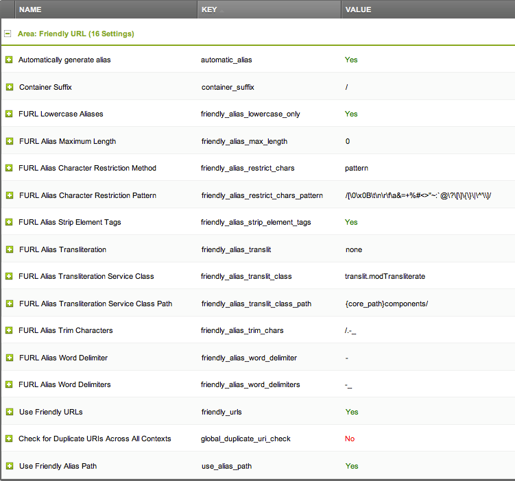

Puedes tener las URL amigables funcionando completamente en menos de dos minutos siguiendo un simple proceso de cuatro pasos.

## 1) Trabajando sobre el archivo .htaccess de ejemplo

MODX proporciona un archivo ht.access para que lo edites coincidiendo con la configuración de tu servidor. Se encuentra en la raíz del sitio MODX. El servidor ignorará este archivo hasta que lo renombres o (mejor) lo copies en un archivo llamado .htaccess. Cada vez que un navegador solicita una página, el servidor busca el archivo llamado .htaccess, que puede contener información sobre cómo se deben manejar varias URL.

El archivo .htaccess puede estar en cualquier lugar dentro de la instalación de MODX, pero la ubicación habitual es en la raíz del sitio MODX (junto con el archivo ht.access y los directorios de assets, manager y connectors, como se muestra en la imagen a continuación). Para la mayoría de las instalaciones, no es necesario realizar ningún cambio en el archivo para que las FURL funcionen. Debes hacer un cambio, pero primero haz que las FURL funcionen y trataremos sobre ese cambio al final de esta página.


Aquí está el archivo ht.access que viene con la versión 2.7.3 de MODX (tu versión puede ser ligeramente diferente).

``` php
# MODX supports Friendly URLs via this .htaccess file. You must serve web
# pages via Apache with mod_rewrite to use this functionality, and you must
# change the file name from ht.access to .htaccess.
#
# Make sure RewriteBase points to the directory where you installed MODX.
# E.g., "/modx" if your installation is in a "modx" subdirectory.
#
# You may choose to make your URLs non-case-sensitive by adding a NC directive
# to your rule: RewriteRule ^(.*)$ index.php?q=$1 [L,QSA,NC]

RewriteEngine On
RewriteBase /


# Prevent dot directories (hidden directories like .git) to be exposed to the public
# Except for the .well-known directory used by LetsEncrypt a.o
RewriteRule "/\.|^\.(?!well-known/)" - [F]


# Rewrite www.example.com -> example.com -- used with SEO Strict URLs plugin
#RewriteCond %{HTTP_HOST} .
#RewriteCond %{HTTP_HOST} ^www.(.*)$ [NC]
#RewriteRule ^(.*)$ https://%1/$1 [R=301,L]
#
# or for the opposite example.com -> www.example.com use the following
# DO NOT USE BOTH
#
#RewriteCond %{HTTP_HOST} !^$
#RewriteCond %{HTTP_HOST} !^www\. [NC]
#RewriteCond %{HTTP_HOST} (.+)$
#RewriteRule ^(.*)$ https://www.%1/$1 [R=301,L] .


# Rewrite secure requests properly to prevent SSL cert warnings, e.g. prevent 
# https://www.example.com when your cert only allows https://secure.example.com
#RewriteCond %{SERVER_PORT} !^443
#RewriteRule (.*) https://example.com/$1 [R=301,L]


# Redirect the manager to a specific domain - don't rename the ht.access file
# in the manager folder to use this this rule
#RewriteCond %{HTTP_HOST} !^example\.com$ [NC]
#RewriteCond %{REQUEST_URI} ^/manager [NC]
#RewriteRule ^(.*)$ https://example.com/$1 [R=301,L]


# The Friendly URLs part
RewriteCond %{REQUEST_FILENAME} !-f
RewriteCond %{REQUEST_FILENAME} !-d
RewriteRule ^(.*)$ index.php?q=$1 [L,QSA]


# Make sure .htc files are served with the proper MIME type, which is critical
# for XP SP2. Un-comment if your host allows htaccess MIME type overrides.

#AddType text/x-component .htc


# If your server is not already configured as such, the following directive
# should be uncommented in order to set PHP's register_globals option to OFF.
# This closes a major security hole that is abused by most XSS (cross-site
# scripting) attacks. For more information: http://php.net/register_globals
#
# To verify that this option has been set to OFF, open the Manager and choose
# Reports -> System Info and then click the phpinfo() link. Do a Find on Page
# for "register_globals". The Local Value should be OFF. If the Master Value
# is OFF then you do not need this directive here.
#
# IF REGISTER_GLOBALS DIRECTIVE CAUSES 500 INTERNAL SERVER ERRORS :
#
# Your server does not allow PHP directives to be set via .htaccess. In that
# case you must make this change in your php.ini file instead. If you are
# using a commercial web host, contact the administrators for assistance in
# doing this. Not all servers allow local php.ini files, and they should
# include all PHP configurations (not just this one), or you will effectively
# reset everything to PHP defaults. Consult www.php.net for more detailed
# information about setting PHP directives.

#php_flag register_globals Off


# For servers that support output compression, you should pick up a bit of
# speed by un-commenting the following lines.

#php_flag zlib.output_compression On
#php_value zlib.output_compression_level 5


# The following directives stop screen flicker in IE on CSS rollovers. If
# needed, un-comment the following rules. When they're in place, you may have
# to do a force-refresh in order to see changes in your designs.

#ExpiresActive On
#ExpiresByType image/gif A2592000
#ExpiresByType image/jpeg A2592000
#ExpiresByType image/png A2592000
#BrowserMatch "MSIE" brokenvary=1
#BrowserMatch "Mozilla/4.[0-9]{2}" brokenvary=1
#BrowserMatch "Opera" !brokenvary
#SetEnvIf brokenvary 1 force-no-vary

```

También puedes colocar el archivo en /htdocs o /public\_html , o lo que tu servidor utilice, siempre que esté en el directorio raíz de MODX o por encima del mismo.

Ten en cuenta que a algunos hosts les gusta escribir su propio .htaccess justo por encima del nivel del sitio, pero si tu .htaccess está en la raíz del sitio MODX, debería funcionar bien. Si tu host ha colocado un archivo .htaccess en la raíz del sitio MODX, es posible que tengas que pegar el código del archivo  ht.access de MODX a continuación del código que contenga el archivo del host. ¡Asegúrate de hacer primero una copia de seguridad del archivo del host! De esa manera podrás restaurarlo si las cosas van mal.

La línea RewriteBase debe terminar con / para las instalaciones en el directorio raíz. La RewriteBase para una instalación en un subdirectorio debe especificarse como: RewriteBase /nombreDeSubdirectorio/ , aunque esto, normalmente, solo es necesario en instalaciones localhost. La línea RewriteBase casi siempre debe terminar con una barra oblicua.

## 2) Configurar MODX Revolution

Seguidamente, cambia la configuración en el Área URL amigable, en la Configuración del Sistema MODX (consulta la siguiente imagen). En MODX 2.3 o superior, haz clic en el ícono de ajustes de la esquina superior derecha y selecciona "Configuración del Sistema". En versiones anteriores, vete a Sistema -> Configuración del Sistema. En el cuadro "Buscar por clave" en la esquina superior derecha de la cuadrícula, escribe "amigable" (sin las comillas) y presiona Entrar. Eso mostrará todas las configuraciones de URL amigable. El principal que deseas está hacia la parte inferior: Usar URL amigables (friendly\ _urls). Haz doble clic en "No" y cámbialo a "Sí".

Si no ves todas las configuraciones de MODX FURL, simplemente cambia el cuadro desplegable "Área" en la parte superior de la cuadrícula, a URL amigable.

No encontrarás friendly\_url\_prefix ni friendly\_url\_suffix entre las configuraciones que aparecen en la imagen a continuación: estas han quedado en desuso en favor de las extensiones definidas por [Tipos de contenido] (building-sites/resources/content-types "Content Types") y container\ _suffix (para Recursos Contenedor con tipos de contenido que tienen un mime\_type de texto/html). La configuración predeterminada del sufijo de Contenedor ahora es "/", lo que da como resultado  que las URL de los recursos contenedores  acabarán en / en lugar de algo como .html). Si deseas que los recursos contenedores se muestren como su tipo de contenido (por ejemplo, .html), elimina "/" de esta configuración. Si tienes problemas con los paquetes que utilizan el sufijo del contenedor para FURLS (como por ejemplo [Artículos] (/ extras/articles "Articles")), retorna esta configuración a "/".



La configuración Usar la Ruta de Alias Amigable (use\ _alias\ _path) permite que el sitio muestre estructuras de directorios. Si se establece en "No", todos los documentos en el sitio aparecerán en las URL como si estuvieran directamente en el directorio raíz, sin tener en cuenta las rutas. Si la configuración se establece en "Sí" (el valor predeterminado), verá una ruta completa a la página actual en las URL.

La configuración friendly\_alias\_urls se eliminó en MODX 2.1+. Habilitar friendly\ _urls implica que está usando friendly\ _alias\ _urls en 2.1+ y esta configuración ya no era útil ni necesaria.

## 3) Edita tu(s) plantilla(s)

Asegúrate de tener la siguiente etiqueta en la sección principal de todas tus plantillas. Si solo tienes un contexto front-end (por ejemplo, 'web'), generalmente puedes omitir el signo de exclamación para acelerar la carga de la página:

``` html
<base href="[[!++site_url]]" />
```

## 4) Borra la caché del sitio

¡Y estas listo!

La forma más fácil de aprovechar el uso de URL amigables totalmente calificadas es permitir que MODX cree los enlaces usando etiquetas de enlace, que se describen en esta página: [sintaxis de etiqueta de enlace] (building-sites/resources "Linking to a Resources"). Para crear enlaces a diferentes recursos, es tan fácil como muestra la etiqueta de enlace a continuación (donde 1 es el ID del recurso de la página a la que deseas vincular). Esto tiene el beneficio adicional de poder mover recursos dentro de un proyecto web, sin la necesidad de tener que arreglar un montón de enlaces rotos, ya que MODX simplemente actualizará los enlaces creados de esta manera automáticamente.

``` html
    <a href="[[~1]]" title="algún título">Alguna página</a>

```

## 5) Convierte direcciones WWW a no WWW o Vice Versa

Anteriormente, mencionamos un cambio que siempre debes realizar en el archivo .htaccess una vez que tengas las URLs amigables funcionando. Se trata de URLs que comienzan con 'www' (o no). Un usuario puede llegar a la mayoría de los sitios con el nombre de dominio o el nombre de dominio precedido por 'www'. Siempre debes convertir la URL a uno u otro. Las razones son complicadas, pero si no haces esto, pueden ocurrir cosas extrañas en tu sitio. Los usuarios que han iniciado sesión, por ejemplo, pueden perder repentinamente ese estado.

Corregir esto es realmente fácil. En el código del archivo .htaccess anterior, verás dos secciones, ambas comentadas. Uno cambia las URL que no son www a las URL www, el otro hace lo contrario. Decide cuál quieres y simplemente descomenta la sección que lo hace eliminando el símbolo # al comienzo de cada línea. Ten cuidado, solo tienes que descomentar tres líneas.

Por ejemplo, para eliminar el 'www.' de todas las solicitudes de un sitio con el dominio 'tusitio.com' cambia esta sección:

``` php
# Rewrite www.domain.com -> domain.com -- used with SEO Strict URLs plugin
#RewriteCond %{HTTP_HOST} .
#RewriteCond %{HTTP_HOST} !^example-domain-please-change\.com [NC]
#RewriteRule (.*) http://example-domain-please-change.com/$1 [R=301,L]
```

para que quede así:

``` php
# Rewrite www.domain.com -> domain.com -- used with SEO Strict URLs plugin
RewriteCond %{HTTP_HOST} .
RewriteCond %{HTTP_HOST} !^tusitio\.com [NC]
RewriteRule (.*) http://tusitio.com/$1 [R=301,L]
```

Ten en cuenta que no descomentamos la primera línea. Es un comentario real. Descomentarlo haría que el servidor lo tratase como código y eso podría bloquear el servidor.

Los servidores pueden ser bastante sensibles acerca de lo que hay en un archivo .htaccess. Haz siempre una copia de seguridad del archivo .htaccess que funcione antes de modificarlo. De esa manera, si tu trabajo bloquea el servidor, puedes recuperar la versión guardada de  .htaccess y comenzar de nuevo.
