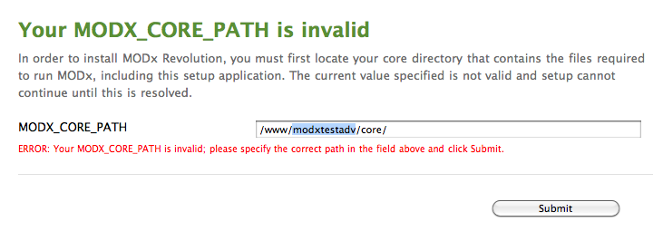
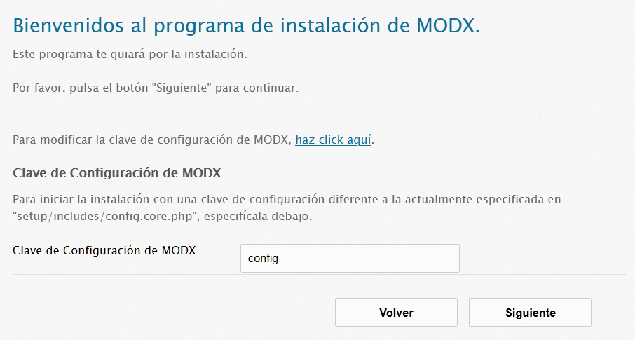
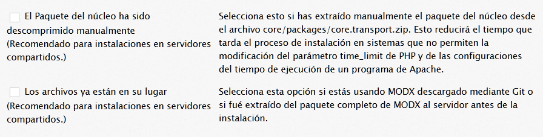
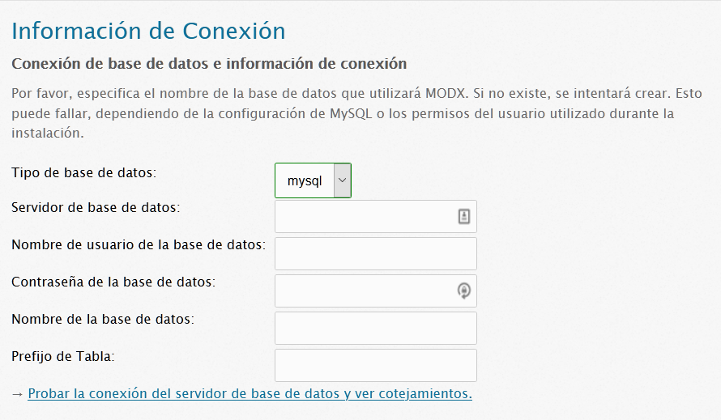
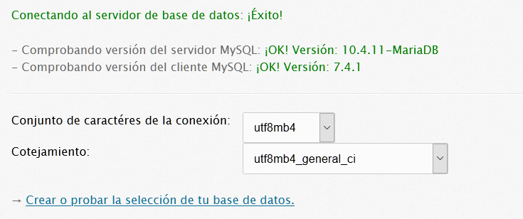
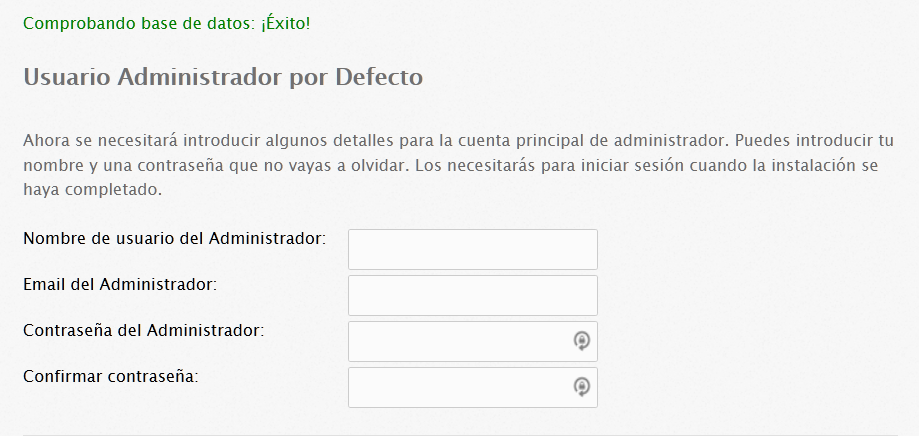
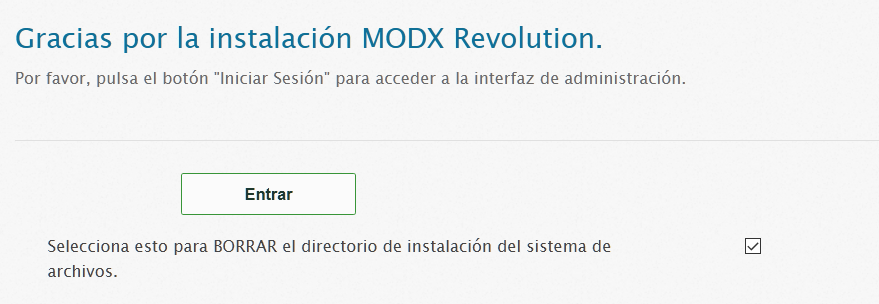

Este es el tutorial para la distribución avanzada de MODX. Se recomienda instalar esta distribución solo si:

- Planeas renombrar los directorios manager/ o connectors/ , o mover el  directorio core/
- Tiene acceso SSH o puedes mover y crear fácilmente directorios con permisos de escritura en tu servidor.

Es posible que desees comprobar primero la página de [Requisitos del Servidor](getting-started/server-requirements "Server Requirements"). Si después de leer esto, todavía tienes problemas para instalar, lee la página [Solución de problemas de instalación](getting-started/installation/troubleshooting "Troubleshooting Installation").

## Pasos previos a la instalación

Después de haber [descargado]getting-started/installation "Instalación") la distribución avanzada de MODX Revolution, súbela y extráela en tu servidor. Deberías tener dos directorios: core/ y setup/. A partir de aquí, si planeas mover el directorio core/, continúa con la siguiente sección. Si no lo vas a hacer, o cambiar el nombre de la clave de configuración, vete a **setup /** en tu navegador y salta a la sección [Opciones avanzadas] (#AdvancedInstallation-AdvancedOptions) de este documento.

### Renombrando o moviendo el directorio core(núcleo)

MODX Revolution te permite cambiar el nombre y/o mover el directorio core/ para mejorar tu nivel de seguridad. También puedes mover el directorio core/ fuera del directorio web público, para asegurar aún más tu instalación de MODX.

Si eliges cambiar el nombre o mover el core, MODX recomienda hacerlo antes de la instalación. Simplemente cambia el nombre o mueve el core, y setup/ - al inicio- te presentará una página pidiéndote la nueva ubicación del core:

Ingresa en el campo de texto la ruta absoluta a donde has movido el directorio core. Si MODX puede encontrarlo allí, procederá normalmente con la instalación. Si MODX aún no puede encontrar el directorio desde la ruta que especificaste, verifica si lo has escrito correctamente, que sea una ruta absoluta y que hayas hecho que el directorio sea leíble (y que el directorio core/cache/ tenga permisos de escritura).

MODX también podría pedirte que hagas que el archivo setup/includes/core.config.php sea escribible. Esto es necesario para cambiar la ruta principal, y debes hacerlo antes de continuar.

### Cambiar la clave de configuración

A partir de aquí, MODX te pedirá que elijas un idioma. Hazlo en este momento. Luego, MODX te presentará una página de bienvenida que, abajo, te preguntará si deseas cambiar la clave de configuración de MODX. Esto te permite ejecutar múltiples sitios con un núcleo compartido, ya que cada sitio individual necesitará su propia clave de configuración única.

Para cambiarlo, simplemente haz clic en el enlace que la instalación te indica para que cambies la clave de configuración, y se te presentará un campo de texto:

Especifica una clave de configuración única y personalizada y haz clic en Siguiente.

## Opciones avanzadas

Ahora se te presentarán algunas opciones de instalación, similares a la imagen de pantalla [Instalación básica](getting-started/installation/standard "Instalación básica" ), pero con dos opciones adicionales en la parte inferior. Solo podrás seleccionar la opción 'Nueva instalación', que es lo que deseas. Debajo de eso, puedes elegir ajustar los permisos que se aplicarán a los nuevos archivos o carpetas en tu instalación de MODX. Los valores predeterminados deberían funcionar bien, pero si estás en un servidor más restrictivo, puedes cambiar los permisos de carpeta y/o archivo a 0775 y 0664, respectivamente.

Debajo de eso, se te presentarán dos opciones de selección:

Estos pueden aparecer atenuados (en gris) durante las nuevas instalaciones. (Durante las actualizaciones, se recomienda que también las desactives). Haz clic en 'Siguiente' para continuar con el siguiente paso.

## Opciones de Base de Datos

Seguidamente, te aparecerá un formulario pidiéndote la información de tu base de datos:

Agrega el nombre de host de tu base de datos, que es la URL en la que se encuentra tu base de datos. Para la mayoría de los usuarios, esto será 'localhost'. Si tienes tu servidor MySQL en un puerto diferente, especifícalo así: "my.database.com; port=3307" (con el ";port=" agregado  a la IP o nombre_de_host).

Además, si lo deseas, aquí puedes especificar un prefijo de tabla diferente . Esto le dice a MODX que prefije las tablas con este valor. Esto es útil si deseas realizar múltiples instalaciones de MODX en una misma base de datos.

Cuando termines, haz clic en el enlace 'Probar la conexión del servidor de base de datos y ver cotejamientos'. Si hay algún error, se mostrará a continuación. Si tiene erroes, verifica que tu nombre de usuario y contraseña de la base de datos sean correctos. Además, si tu usuario no tiene acceso para crear una base de datos, es posible que debas hacerlo manualmente.

### Cotejamientos y conjuntos de caracteres

Esto abrirá otro formulario para configurar el conjunto de caracteres y el cotejamiento de la base de datos:

Para la mayoría de los usuarios, se puede dejar estos valores tal como están. Sin embargo, si necesitas cambiarlos, **asegúrate** de que el cotejamiento coincida con el juego de caracteres. Haz clic en 'Crear o probar la selección de tu base de datos'. después de que hayas terminado.

### Crear un usuario Administrador

Este formulario te presentará algunos campos para configurar tu usuario administrador. Especifica un nombre de usuario que desees que sea el nombre de usuario del administrador.

MODX recomienda **no** usar 'admin', ya que este es un nombre de usuario de administrador común y, a menudo, es la primera comprobación de los hackers de nombre de usuario.

A partir de ahí, ingresa tu correo electrónico (o el correo electrónico de tu administrador) y especifica una contraseña. Haz clic en siguiente cuando hayas terminado.

## Configuración de Contexto

Ahora MODX  te presentará una pantalla de instalación de contexto detallada. Aquí es donde puedes configurar las rutas a tu contexto web (el contexto principal), así como los directorios para tus conectores  y panel de administrador (carpetas connectors/ y manager/ respectivamente). MODX recomienda dejar las rutas web/ de contexto tal como están, a menos que tengas una razón especial para no hacerlo.

Sin embargo, cambiar el nombre de tus directorios manager/ y connectors/, puede agregar un nivel adicional de seguridad a tu sitio. Simplemente cambia las rutas y las URL en los campos de texto provistos. Nota: Si cambias los directorios, los directorios **padre** de cualquiera de estas rutas deben poder escribirse, para permitir que MODX escriba en ellos los directorios manager/ y connectors/.

¡Asegúrate de cambiar **ambos**, la ruta y la URL!

Cuando termines, haz clic en 'Siguiente' para continuar.

## Comprobaciones previas a la instalación

A continuación MODX procederá con una lista de verificaciones para comprobar que tu sistema esté listo para la instalación. Si alguna de estas falla, deberás seguir las instrucciones que sugiere para asegurarte de que tu entorno cumpla con los [Requisitos del servidor](getting-started/server-requirements "Requisitos del servidor") y de que se puedan escribir los directorios correctos.

Una vez que estés listo y se pasen todas las comprobaciones, haz clic en 'Instalar' para continuar.

Si obtienes una pantalla en blanco o no puedes continuar después de hacer clic en 'Instalar', verifica estos pasos:

1. Asegúrate de que los directorios "/\[root\]", "/core/config", "/core/packages","/core/cache", y "/core/export" se puedan escribir. (root será el directorio real en el que estás instalando).
2. Asegúrate de que tu configuración de php.ini establezca memory\_limit en 128M y max\_execution\_time en 120 .
3. Asegúrate de que MODX pueda crear el administrador y los directorios de conectores. Esto se hace dando permisos de escritura a los directorios **padres** de los directorios manager/ y connectors/ (ya que puede cambiar dónde están instalados).
4. Publica un mensaje en el [Foro Revolución](https://forums.modx.com/index.php/board,280.0.html) con respecto a tu problema. Indica la configuración de tu servidor y la información de instalación, e intentaremos ayudarte a encontrar una solución.

## Resumen posterior a la instalación

MODX te informará si se produjo algún error durante la instalación y te pedirá que intentes la reinstalación en caso de que se haya producido alguno. Cuando la instalación sea exitosa, haz clic en 'Siguiente' para continuar, y se te presentará una opción final:

MODX recomienda que te asegures de eliminar el directorio setup/ después de la instalación, para proteger tu sitio de cualquier otra persona que intente ejecutar la configuración en tu sitio. Puedes hacerlo haciendo clic en la opción  'Selecciona esto para BORRAR el directorio de instalación del sistema de archivos'. 
Cuando estés listo, haz clic en 'Iniciar sesión' para que se te presente el formulario de inicio de sesión para la interfaz del administrador. ¡Has terminado!

## Ver también

1. [Instalación Básica](getting-started/installation/standard)
2. [Guía para Lighttpd](getting-started/friendly-urls/lighttpd)
3. [Instalación en un servidor que ejecuta ModSecurity](getting-started/installation/troubleshooting/modsecurity)
4. [Configuración del servidor Nginx](getting-started/friendly-urls/nginx)
5. [Instalación avanzada](getting-started/installation/advanced)
6. [Instalación desde Git](getting-started/installation/git)
7. [Instalación desde línea de comandos](getting-started/installation/cli)
8. [El archivo de configuración Config Xml](getting-started/installation/cli/config.xml)
9. [Solución de problemas de instalación](getting-started/installation/troubleshooting)
10. [Instalación exitosa, ¿ahora qué hago?](getting-started/getting-started)
