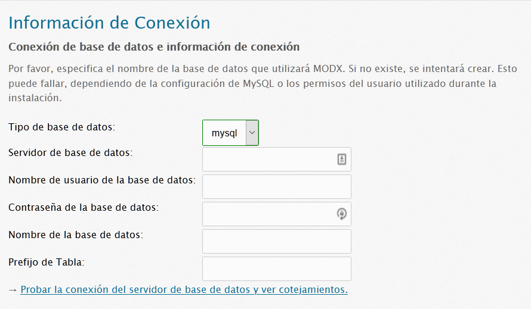
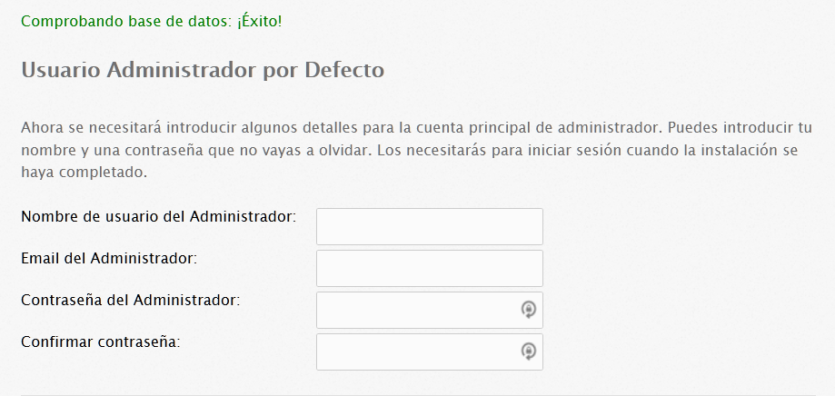

## Beginning Setup

Después de [descargar](getting-started/installation "Instalación") MODX Revolution, sube el archivo .zip a tu servidor.  En el servidor mismo, ya sea a través de la línae de comandos de extracción del panel de control o en el administrador de archivos del servidor, extráe el archivo en su propio directorio. Copia o mueve todos los archivos que estan dentro del nuevo directorio de versión de MODX extraído (se llamará algo parecido a modx-2.x.x-pl, donde x.x son números de versión), al directorio en el que deseas instalar MODX. Puedes eliminar la carpeta subida  y su contenido, así como el archivo .zip MODX una vez que se complete la instalación.

Puedes instalar MODX en cualquier directorio que desees, aunque la instalación en el directorio raíz, generalmente, se prefiere para los sitios de producción.

Advertencia de FTP: el uso de FTP para transferir archivos desempaquetados a tu servidor puede provocar transferencias corruptas o incompletas. Esto puede afectar a tu instalación negativamente. Si es posible, usa la linea de comandos o la utilidad de desempaquetado de tu servidor para transferir o mover los archivos de instalación de MODX extraídos.

### Instalar MODX con un sitio existente

Los sitios de desarrollo a menudo comienzan en un subdirectorio y luego se [trasladan](getting-started/maintenance/moving-your-site "Moviendo tu sitio a un nuevo servidor") al directorio raíz cuando se completa . El método de subdirectorio es útil si tiene un sitio existente que debe permanecer disponible durante el desarrollo o para instalaciones MODX en subdominio. También es posible dejar MODX en un subdirectorio y usar .htaccess para reescribir sus URL a la raíz.

#### Sitio HTML estático existente

Si tu sitio existente es html estático, con un index.html o una página de inicio similar, puedes instalar MODX en la carpeta raíz junto con tu sitio estático durante el desarrollo. Cuando esté listo para lanzarse, cambia el nombre o mueve tus archivos html estáticos y MODX se hará cargo. **No habilits** [URL amigables](getting-started/friendly-urls "Uso de URL amigables") si usas este método hasta después de que tus archivos html se hayan movido o renombrado. Como siempre, **haz una copia de seguridad de tu sitio existente** antes de instalar MODX Revolution o realizar cambios en tu estructura de archivos actual.

#### Otro CMS existente o sitio controlado dinámicamente

No instales MODX Revolution en un directorio que contenga otro sitio controlado dinámicamente o CMS hasta que se elimine ese sitio. En ese caso, usa el método de subdirectorio para desarrollar MODX.

En cualquier caso, excepto en un nuevo sitio en blanco, instalar MODX Revolution en un subdirectorio para el desarrollo es el método más seguro.

### Instalación en directorio temporal previa a la transferencia de DNS

Si tu host proporciona una carpeta de instalación temporal para desarrollar antes de la transferencia de DNS, una vez que se haya transferido tu DNS, deberás tomar referencia de [Mover tu sitio a otro servidor](getting-started/maintenance/moving-your-site "Mover tu sitio a un nuevo servidor") y actualizar los archivos de configuración: _core/config/config.inc.php, /config.core.php, /connectors/config.core.php, y /manager/config.core.php_ con la ruta que apunte a tu nuevo directorio raíz.

## Instalando MODX Revolution

Inicia el proceso de instalación abriendo tu navegador web y ejecutando el script de configuración, navegando a la carpeta **setup/** (por ej.: http.//tudominio.com/setup/).

Es posible que desees consultar primero la página [Requisitos del Servidor](getting-started/server-requirements "Requisitos del Servidor"). Si aún tienes problemas para instalar, lee la página [Solución de problemas de Instalación](getting-started/installation/troubleshooting  "Solución de problemas de Instalación").

Antes de ejecutar la instalación, asegúrese de que PHP pueda escribir en tus directorios core/cache/ y core/config/. 

A partir de ahí, se te pedirá que elijas un idioma y se te presentará una pantalla de bienvenida. Haz clic en Siguiente cuando estés listo.

## Opciones de instalación

Después de esto, se te presentará una pantalla con algunas opciones de instalación:

La opción Nueva instalación debería ser la única opción disponible para que elijas. Si necesitas ajustar los permisos de archivo para tu servidor web, puedes hacerlo en los campos de texto a continuación. La mayoría de los servidores estarán bien con los valores predeterminados. Cuando hayas terminado, haz clic en Siguiente para continuar.

## Opciones de Base de Datos

Seguidamente, te aparecerá un formulario pidiéndote la información de tu base de datos:

Puedes crear tu base de datos y usuario antes de este paso. Asegúrate de que tu usuario esté asociado con la nueva base de datos y de que tenga asignados todos los privilegios para esa base de datos.

- Agrega el nombre de host de tu base de datos, que es la URL en la que se encuentra tu base de datos. Para la mayoría de los usuarios, esto será 'localhost'.
- Ingresa tu nombre de usuario de la base de datos. En algunos hosts, el nombre de usuario de la base de datos tiene como prefijo el nombre del directorio del propietario del sitio, como `propietario_nombreDatabase`. En tal caso, se debe ingresar el nombre completo de la base de datos. Verifíca el nombre con la herramienta de base de datos en tu panel de control, o en la propia base de datos en sí.
- Tu nombre de usuario también puede tener como prefijo el mismo nombre de directorio del propietario del sitio. Si es así, debes prefijar tu nombre de usuario de igual manera, es decir, `propietario_nombreUsuarioDatabase`.
- Introduce la contraseña.
- Además, si lo deseas, aquí puedes especificar un prefijo de tabla diferente . Esto le dice a MODX que prefije las tablas con este valor. Esto es útil si deseas realizar múltiples instalaciones de MODX en una misma base de datos.
- Cuando termines, haz clic en el enlace 'Probar la conexión del servidor de base de datos y ver cotejamientos'. Si hay algún error, se mostrará a continuación. Si tiene erroes, verifica que tu nombre de usuario y contraseña de la base de datos sean correctos. Además, si tu usuario no tiene acceso para crear una base de datos, es posible que debas hacerlo manualmente.

### Notas sobre MySql

Si tienes tu servidor MySQL en un puerto diferente, especifícalo así: "my.basededatos.com; port = 3307", con ;port= agregado a la IP o nombre de host. Si estás ejecutando tu servidor MySQL con la red deshabilitada, puedes especificar el nombre del socket como: ";unix\_socket=MySQL".

### Notas sobre Microsoft SQL Server 

El soporte para Microsoft SQL Server se introdujo en MODX Revolution 2.1 Dependiendo de la configuración de red de tu SQL Server, hay diferentes maneras de especificar tu host.

- Named pipe: (local)/SQLEXPRESS
- Tcp/ip: 127.0.0.1,2301 (IP, port)

Debido a la forma en que funciona el controlador PDO para SqlSrv, es posible que no recibas un mensaje de error o una respuesta después de hacer clic en 'Probar la conexión del servidor de base de datos y ver cotejamientos'. Si esto sucede, es una indicación de que hay un problema para conectarse a la base de datos, autenticar o seleccionar la base de datos en sí. Después de verificar su configuración, haz clic en el botón Atrás para ir a la página anterior, y luego en Siguiente para volver a la página Opciones de base de datos.

### Cotejamientos y conjuntos de caracteres
    
    Esto abrirá otro formulario para configurar el conjunto de caracteres y el cotejamiento de la base de datos:

Para la mayoría de los usuarios, se puede dejar estos valores tal como están. Sin embargo, si necesitas cambiarlos, **asegúrate** de que el cotejamiento coincida con el juego de caracteres. Haz clic en 'Crear o probar la selección de tu base de datos'. después de que hayas terminado.

**Notas sobre Microsoft SQL Server**
MODX solo se ha probado en SQL Server con el juego de caracteres Latin1 .

### Crear un usuario Administrador

Este formulario te presentará algunos campos para configurar tu usuario administrador. Especifica un nombre de usuario que desees que sea el nombre de usuario del administrador.

MODX recomienda **no** usar 'admin', ya que este es un nombre de usuario de administrador común y, a menudo, es la primera comprobación de los hackers de nombre de usuario.

A partir de ahí, ingresa tu correo electrónico (o el correo electrónico de tu administrador) y especifica una contraseña. Haz clic en siguiente cuando hayas terminado.

Algunas configuraciones de servidor del host no permitirán que MODX envíe correos electrónicos si la Configuración del sistema [emailsender](building-sites/settings/emailsender) (por defecto establecida en la instalación a la dirección de correo electrónico ingresada para el usuario administrador) no es válida para el dominio. Si MODX no envía correos electrónicos de registro o formulario, verifica [emailsender](building-sites/settings/emailsender) y configúralo en una dirección de correo electrónico válida para el dominio alojado.

## Comprobaciones previas a la instalación
   
   A continuación MODX procederá con una lista de verificaciones para comprobar que tu sistema esté listo para la instalación. Si alguna de estas falla, deberás seguir las instrucciones que sugiere para asegurarte de que tu entorno cumpla con los [Requisitos del servidor](getting-started/server-requirements "Requisitos del servidor") y de que se puedan escribir los directorios correctos.
   
   Una vez que estés listo y se pasen todas las comprobaciones, haz clic en 'Instalar' para continuar.
   
   Si obtienes una pantalla en blanco o no puedes continuar después de hacer clic en 'Instalar', verifica estos pasos:
   
   1. Asegúrate de que los directorios "/\[root\]", "/core/config", "/core/packages","/core/cache", y "/core/export" se puedan escribir. (root será el directorio real en el que estás instalando).
   2. Asegúrate de que tu configuración de php.ini establezca memory\_limit en 128M y max\_execution\_time en 120 .
   3. Asegúrate de que MODX pueda crear el administrador y los directorios de conectores. Esto se hace dando permisos de escritura a los directorios **padres** de los directorios manager/ y connectors/ (ya que puede cambiar dónde están instalados).
   4. Publica un mensaje en el [Foro Revolución](http://modxcms.com/forums/index.php/board,280.0.html) con respecto a tu problema. Indica la configuración de tu servidor y la información de instalación, e intentaremos ayudarte a encontrar una solución.

## Resumen posterior a la instalación
   
   MODX te informará si se produjo algún error durante la instalación y te pedirá que intentes la reinstalación en caso de que se haya producido alguno. Cuando la instalación sea exitosa, haz clic en 'Siguiente' para continuar, y se te presentará una opción final:

MODX recomienda que te asegures de eliminar el directorio setup/ después de la instalación, para proteger tu sitio de cualquier otra persona que intente ejecutar la configuración en tu sitio. Puedes hacerlo haciendo clic en la opción  'Selecciona esto para BORRAR el directorio de instalación del sistema de archivos'. 

**ADVERTENCIA**: la aplicación de configuración otorga un control poderoso y de gran alcance sobre tu servidor. NO lo dejes en su lugar una vez que hayas terminado de instalar MODX.

Cuando estés listo, haz clic en 'Iniciar sesión' para que se te presente el formulario de inicio de sesión para la interfaz del administrador. ¡Has terminado!

## Información adicional

Otros casos especiales:

### MAMP en MacOSX

MAMP (incluida la última versión 1.8.4) funciona bien con MODX Revolution, con una excepción. No puede usar eAccelerator como el sistema de almacenamiento en caché, ya que los controladores compilados con MAMP son defectuosos con respecto a PDO y causarán errores en el núcleo de Apache. Selecciona los controladores de almacenamiento en caché 'xCache' para remediar esto.

### Vista y XAMPP

Se ha informado de problemas con la instalación de Revolution en Vista de 64 bits con XAMPP. No podemos garantizar una solución de trabajo en ese sistema operativo y la configuración en este momento. 

Algunos usuarios han informado de que la aplicación de una soluciónpuede encuentrase aquí: <http://www.apachefriends.org/f/viewtopic.php?f=16&t=32617> solucionará los errores de bloqueo de Apache con soporte PDO en XAMPP.

### Instalando Paquetes

Para obtener información sobre la instalación de paquetes de terceros, consulta el artículo [Cómo instalar paquetes](extending-modx/transport-packages "Administración de Paquetes").

### See Also

1. [Guía para Lighttpd](getting-started/friendly-urls/lighttpd)
2. [Instalación en un servidor que ejecuta ModSecurity](getting-started/installation/troubleshooting/modsecurity)
3. [Configuración del servidor Nginx](getting-started/friendly-urls/nginx)
4. [Video de YouTube de un embajador de MODX](http://www.youtube.com/watch?v=Wwrq-3CWFVU)
