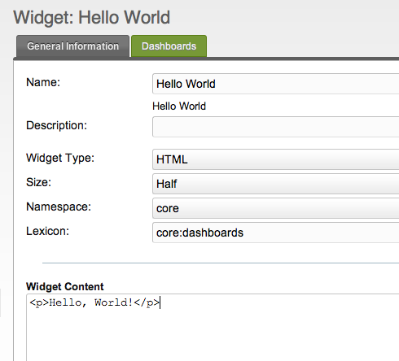
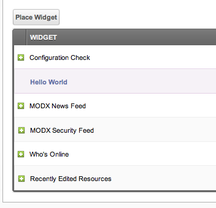
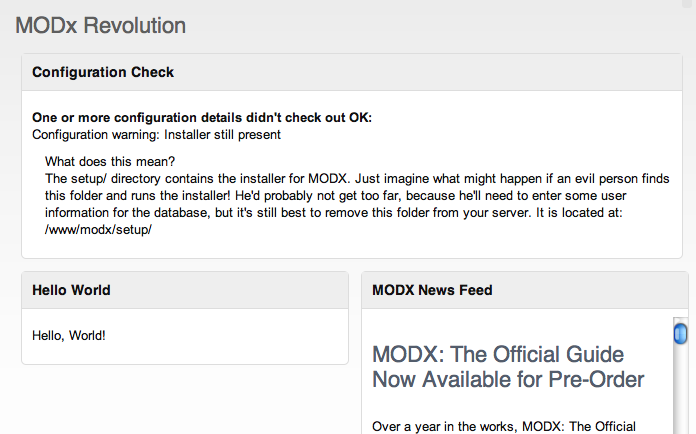

В этой статье описывается, как создать собственный виджет панели управления, включая краткое описание различных типов виджетов и их работу.

## Создание виджета

Перейдите на страницу "Панели управления" в верхнем меню и нажмите вкладку "Виджеты". Затем нажмите "Создать виджет", и откроется экран создания виджета. Вы увидите несколько новых полей:

- **Имя** - Название вашего виджета. Давайте назовем наш "Hello World".
- **Описание** - Краткое описание вашего виджета.
- **Тип виджета** - Тип виджета. Мы поговорим об этом позже, а сейчас просто выберите "HTML".
- **Размер** - Виджеты бывают трех размеров - половина, на всю ширину и двойные. Виджет с размером "половина" займет половину ширины ряда панели управления. С размером "на всю ширину" занймет целый ряд. "Двойной" займет два ряда панели управления.
- **Пространство имен** - Пространство имен, с которым связан виджет. Полезно для разработчиков коммпонентов, мы же оставим "core".
- **Словарь** - Добавляет возможность загружать лексикон с помощью этого виджета. Давайте продолжим и оставим по умолчанию "core:dashboards".

Обратите внимание, что при вводе имени виджета под ним появляется текст, отображая то, что вы вводите. Это инструмент автоматического перевода имен виджетов; если бы вы вводили ключ лексикона, он перевел бы его (попробуйте ввести "widget_create", чтобы увидеть, как это работает).

Теперь, в вашем содержании виджета панели управления вставьте это:

```php
<p>Hello, world!</p>
```

Наш виджет должен выглядеть так:



Теперь сохраните виджет.

### Назначение виджета на панель управления

Теперь, когда у нас есть наш виджет, давайте назначим его на панель управления.
Вернитесь страницу панели управления, нажмите на вкладку "Панели управления" и найдите в списке панель управления, например, "Default". Нажмите правой кнопкой мыши и выберите "Редактировать панель". Вы перейдете на страницу редактирования панели управления "Default".

Здесь нажмите кнопку "Добавить виджет" над списком виджетов. Выберите наш виджет "Hello World" из выпадающего списка и нажмите "Сохранить". Теперь наш виджет на панели управления! Давайте изменим его позицию, перетащив ее между другими виджетами.



Сохраните свою панель управления.

### Просмотр виджета

Теперь, если вы перейдете на панель управления, вы сможете увидеть свой новый виджет!



## Другие типы виджетов

Очевидно, есть больше типов виджетов. См. Раздел [Типы виджетов панели управления](building-sites/client-proofing/dashboards/widget-types "Типы виджетов панели управления") для получения дополнительной информации о создании различных типов виджетов.

## Смотрите также

1. [Редактирование панели управления](building-sites/client-proofing/dashboards/managing)
2. [Назначение панели управления для группы пользователей](building-sites/client-proofing/dashboards/usergroups)
3. [Создание виджета панели управления](building-sites/client-proofing/dashboards/creating-a-widget)
4. [Типы виджетов панели управления](building-sites/client-proofing/dashboards/widget-types)
    1. [Тип виджета панели управления - Файл](building-sites/client-proofing/dashboards/widget-types/file)
    2. [Тип виджета панели управления - HTML](building-sites/client-proofing/dashboards/widget-types/html)
    3. [Тип виджета панели управления - PHP](building-sites/client-proofing/dashboards/widget-types/inline-php)
    4. [Тип виджета панели управления - Сниппет](building-sites/client-proofing/dashboards/widget-types/snippet)
