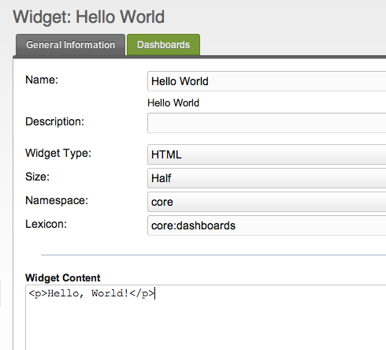
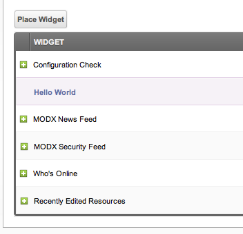
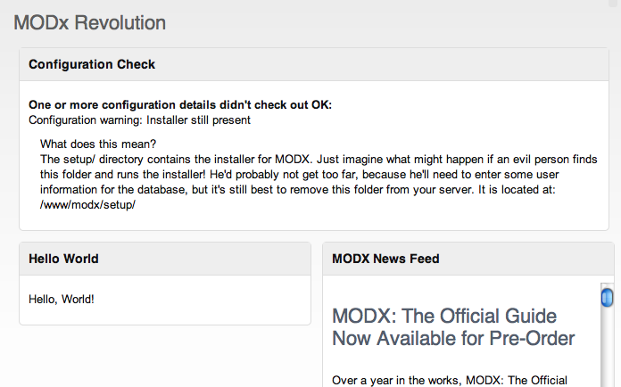

В этой статье описано, как создать собственный виджет панели управления, включая краткий обзор типов виджетов и принципов их работы.

## Создание базового виджета

Откройте страницу панелей управления (**Dashboard → Dashboards** в верхнем меню) и перейдите на вкладку **Widgets**. Нажмите **Create New Widget**. Откроется экран создания виджета. Вы увидите несколько полей:

- **Name** - имя виджета. Назовём наш «Hello World».
- **Description** - краткое описание виджета для внутреннего использования.
- **Widget Type** - тип виджета. Подробнее об этом ниже. Пока выберите **HTML**.
- **Size** - размер виджета: half, full или double. Half занимает половину строки. Full занимает целую строку. Double занимает две строки.
- **Namespace** - пространство имён, с которым связан виджет. Полезно разработчикам Extras. Мы оставим **core**.
- **Lexicon** - позволяет загрузить лексикон для виджета. Оставим значение по умолчанию **core:dashboards**.

Когда вы вводите имя виджета, под полем появляется текст, повторяющий ваш ввод. Это автоматический перевод имён виджетов. Если ввести ключ записи лексикона, он переведётся (попробуйте `widget_create`, чтобы увидеть, как это работает).

В содержимое виджета вставьте:

``` php
<p>Hello, world!</p>
```

Виджет должен выглядеть так:



Сохраните виджет.

### Назначение виджета панели по умолчанию

Вернитесь на главную страницу панелей управления, откройте вкладку **Dashboards** и найдите панель по умолчанию. Щёлкните по ней правой кнопкой мыши и выберите **Update Dashboard**. Откроется страница редактирования.

Нажмите **Place Widget** над таблицей виджетов. Выберите **Hello World** в выпадающем списке и сохраните. Виджет добавлен на панель. Перетащите его на позицию №2 между виджетами **Configuration Check** и **MODX News Feed**:



Сохраните панель.

> **Примечание:** Добавление виджета через менеджер панелей (как описано выше) помещает его в **шаблон** панели. Если панель [настраиваемая](building-sites/client-proofing/dashboards "Dashboards"), виджет автоматически появится у всех существующих пользователей этой панели, а также у новых.
>
> Добавление виджета прямо на странице панели (через сам просмотр панели) добавляет его только для текущего пользователя. Другие пользователи его не увидят, пока виджет не добавят в шаблон.
>
> На крупных сайтах с большим числом пользователей добавление виджета в шаблон создаёт запись размещения для каждого пользователя, у которого уже есть личная копия этой панели. Учитывайте это, если важна производительность.

### Просмотр виджета

Нажмите пункт **Dashboard** в верхнем меню. Вы увидите новый виджет на панели.



## Другие типы виджетов

Доступны и другие типы виджетов. См. раздел [Типы виджетов панели управления](building-sites/client-proofing/dashboards/widget-types "Dashboard Widget Types").

## Смотрите также

1. [Управление панелью](building-sites/client-proofing/dashboards/managing)
2. [Назначение панели группе пользователей](building-sites/client-proofing/dashboards/usergroups)
3. [Создание виджета панели управления](building-sites/client-proofing/dashboards/creating-a-widget)
4. [Типы виджетов панели управления](building-sites/client-proofing/dashboards/widget-types)
    1. [Тип виджета - файл](building-sites/client-proofing/dashboards/widget-types/file)
    2. [Тип виджета - HTML](building-sites/client-proofing/dashboards/widget-types/html)
    3. [Тип виджета - inline PHP](building-sites/client-proofing/dashboards/widget-types/inline-php)
    4. [Тип виджета - сниппет](building-sites/client-proofing/dashboards/widget-types/snippet)
