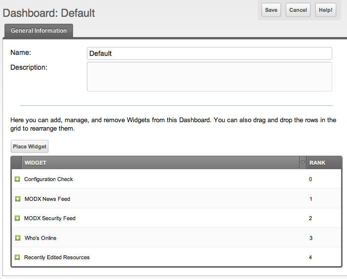

В этой статье описано, как редактировать панель управления, в том числе как назначать и размещать виджеты на этой панели.

## Редактирование панели управления

Откройте главную страницу панелей управления в верхнем меню: «Панель управления» -> «Панели управления». После загрузки на первой вкладке вы увидите таблицу с (скорее всего) одной панелью, «Default». Щёлкните по строке правой кнопкой мыши и выберите «Редактировать панель». Откроется страница редактирования панели.

Ниже полей имени и описания вы увидите таблицу виджетов, назначенных на панель. Перетаскивайте виджеты, чтобы изменить порядок. Добавляйте виджеты кнопкой «Place Widget». Удаляйте виджеты через контекстное меню по правому щелчку:

## Шаблон и личные изменения

Изменения на этой странице обновляют **шаблон** панели. Для [настраиваемых панелей](building-sites/client-proofing/dashboards "Панели управления") изменения шаблона распространяются на всех пользователей с личной копией этой панели:

- Если вы **добавите виджет** здесь, он появится на панели у всех существующих пользователей этой панели.
- Если вы **удалите виджет** здесь, он исчезнет с личных панелей всех пользователей.

Это отличается от изменений прямо на странице панели (например, закрытие виджета кнопкой или добавление виджета из вида панели). Такие правки затрагивают только текущего пользователя.

Если вы хотите применить изменение виджета ко всем пользователям, сделайте это на этой странице управления. Если нужно настроить только свою панель, меняйте её прямо на странице панели.

## Смотрите также

1. [Редактирование панели управления](building-sites/client-proofing/dashboards/managing)
2. [Назначение панели управления группе пользователей](building-sites/client-proofing/dashboards/usergroups)
3. [Создание виджета панели управления](building-sites/client-proofing/dashboards/creating-a-widget)
4. [Типы виджетов панели управления](building-sites/client-proofing/dashboards/widget-types)
    1. [Тип виджета панели управления - Файл](building-sites/client-proofing/dashboards/widget-types/file)
    2. [Тип виджета панели управления - HTML](building-sites/client-proofing/dashboards/widget-types/html)
    3. [Тип виджета панели управления - Inline PHP](building-sites/client-proofing/dashboards/widget-types/inline-php)
    4. [Тип виджета панели управления - Сниппет](building-sites/client-proofing/dashboards/widget-types/snippet)
