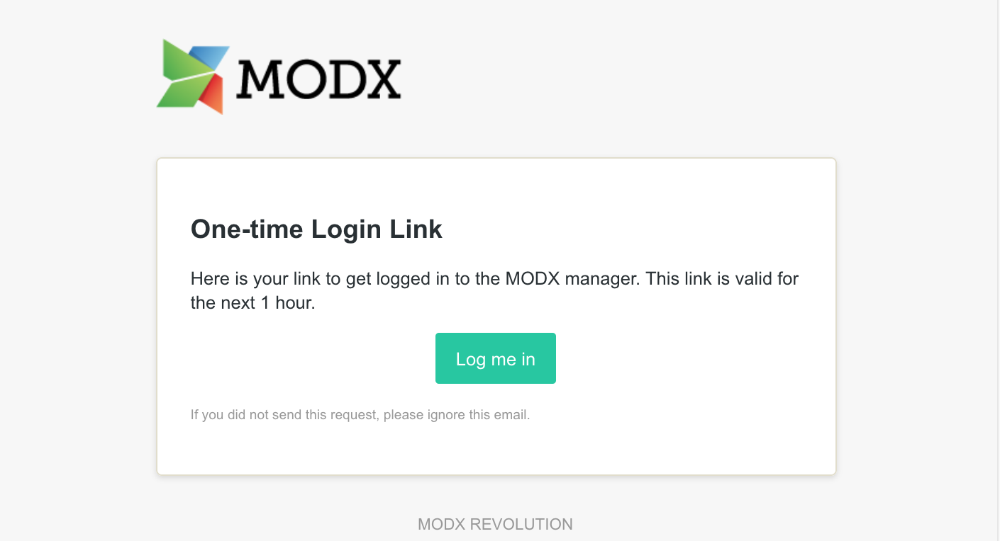

MODX3 имеет новую функцию под названием "Вход без пароля", которая может быть активирована с помощью системных настроек. После активации этой функции вам больше не нужно вводить пароль и имя пользователя для входа. Вместо этого вы просто вводите адрес электронной почты своей учетной записи, и система отправит вам электронное письмо со ссылкой для одноразового входа. Нажав на эту ссылку, вы сразу же войдете в менеджер.

## Преимущества входа без пароля

Потребность в надежном пароле часто заставляет людей выбирать универсальные псевдозащищенные пароли, повторно используя проверенную надежную фразу и, возможно, просто добавляя число к услуге. Как администратор сайта, вы не должны поощрять своих пользователей делать небезопасные вещи. Это устраняет риск незащищенного пароля от вашей установки MODX, но, конечно, для ваших пользователей нужна защищенная учетная запись электронной почты. Но это также относится и к традиционному входу в систему по имени пользователя и паролю, потому что здесь также есть самообслуживание паролем, где вы можете сбросить пароль по электронной почте.

Кроме того, если вход без пароля включен, пароли больше не сохраняются в базе данных MODX. Тогда больше не будет теоретического риска кражи паролей в результате взлома базы данных (независимо от любого шифрования).

## Как включить пароль без логина

Чтобы активировать вход без пароля, необходимо установить системный параметр `passwordless_activation` в области «Аутентификация и безопасность» основных настроек системы на «Да». При следующем входе в систему вам будет представлен следующий экран входа в систему:

Просто введите адрес электронной почты вашей учетной записи, и вы получите письмо с персональной ссылкой для входа.

## Настройка срока действия ссылки

Вы можете настроить срок действия ссылки для входа в систему через системный параметр `passwordless_expiration`. По умолчанию оно установлено на 3600 секунд, что должно быть достаточно для всех, чтобы войти в систему. Если вы параноик, вы можете легко установить на более низкое значение, например, 600 разрешить использование ссылки только на 10 минут. Срок действия также будет указан в самом электронном письме.

## Дополнительные замечания

Имейте в виду, что _не будет сообщения об ошибке_, если вы введете неизвестный адрес электронной почты во время входа в систему. Это хорошо известное и предполагаемое поведение для предотвращения попыток перечисления пользователей.
