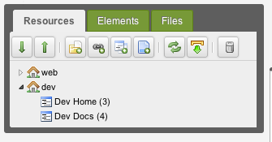

Из этого туториала вы узнаете, как использовать Контекст для создания и управления отдельным поддоменом в одной установке Revolution. Мы собираемся создать поддомен на dev.modx.com (конечно, не совсем, но вы поняли идею).

## Создание контекста

Перейдите в Система -> Контексты. Нажмите _Создать новый_, чтобы создать новый контекст. Дайте ему имя "dev" и нажмите _Сохранить_.

Затем в дереве ресурсов (слева) создайте ресурс "Dev Home". Поместите его в корень контекста «dev». Кроме того, пока вы это делаете, создайте ресурс "Dev Docs" с псевдонимом "документация". Мы будем использовать это для проверки наших контекстных ссылок.

Ваше дерево должно выглядеть примерно так:



Оттуда идите вперед и щелкните правой кнопкой мыши на контексте «dev» в дереве и нажмите «Изменить контекст». Отсюда мы увидим вкладку Настройки контекста. Нажмите на нее, и вам нужно будет добавить несколько настроек:

- **base\_url** - Установите это в "**/**" (без кавычек), так как мы указываем корень URL нашей базы.
- **http\_host** - Установите это в **dev.modxcms.com** (или ваше имя поддомена)
- **site\_start** - Установите это **Идентификатор вашего ресурса "Dev Home"**.
- **site\_url** - Установите это в **<http://dev.modxcms.com/>** (или ваш поддомен URL). Не забывайте **_косую черту_**. Помните, что этот параметр: **scheme + _http\_host_ + base\_url**

Вы можете добавить другие специфичные для контекста настройки, такие как error\_page, unauthorized\_page, cultureKey и другие, если вы того пожелаете. Все системные настройки могут быть переопределены путем установки их в контексте.

**Примечание: СВЯЗЬ МЕЖДУ КОНТЕКСТАМИ**
Если вы собираетесь **ссылаться на контекст «web» из этого контекста («dev»)**, вам нужно **добавить те же самые настройки контекста (со значениями, специфичными для web), конечно) в контексте «сети»**. Это позволяет MODX знать, куда перенаправлять URL-адреса веб-контекста.

После создания настроек очистите кеш сайта.

## Создание виртуального хоста

### Пользователи cPanel

cPanel автоматически внесет необходимые изменения при создании нового субдомена. Редактирование виртуальных хостов вручную не рекомендуется.

Теперь нам нужно немного поработать с Apache. (Если вы не используете Apache, вы можете, по крайней мере, следовать той же идее и настроить ее на своем сервере.) Перейдите в файл Apache httpd.conf и добавьте эти строки, меняя их, где необходимо, для вашего доменного имени:

``` php
NameVirtualHost dev.modxcms.com
<VirtualHost dev.modxcms.com>
  ServerAdmin dev@modxcms.com
  DocumentRoot /home/modxcms.com/public_html/dev
  ServerName dev.modxcms.com
  ErrorLog logs/devmodxcms-error_log
  TransferLog logs/devmodxcms-access_log
</VirtualHost>
```

Некоторые установки Apache предпочитают указывать IP-адрес сервера в параметрах VirtualHost и NameVirtualHost - это нормально; Важное поле - имя сервера.

Очевидно, что если вы создаете субдомен, отличный от dev.modxcms.com, вам нужно изменить эти значения.

Большой! Перезагрузите свой сервер (apachectl).

## Файлы поддоменов

Теперь нам нужно создать реальные файлы для загрузки поддоменов. Перейдите к созданию подкаталога «dev /» в `/home/modxcms.com/public_html/` (или любом другом базовом пути, в котором находится ваш webroot).

Вам нужно скопировать 3 файла из корневого каталога вашего MODX Revolution:

- index.php
- .htaccess
- config.core.php

Скопируйте их в каталог dev /.

Теперь вам нужно их отредактировать.

### index.php

Отредактируйте index.php и найдите эту строку (ближе к концу):

``` php
$modx->initialize('web');
```

Измените «web» на «dev». Сохраните файл и закройте.

#### .htaccess

Вам нужно будет отредактировать только одну строку здесь (и, возможно, не совсем). Найдите эту строку (в начале):

``` php
RewriteBase /
```

Убедитесь, что установлено значение /, а не что-либо еще. Он должен соответствовать настройке контекста **base\_url**, которую вы установили ранее.

#### config.core.php

Здесь действительно важно убедиться, что эта строка указывает на вашу основную папку MODX:

``` php
define('MODX_CORE_PATH', dirname(__FILE__) . '/core/');
```

Если основной домен «на один уровень» выше в файловой системе, вы сможете использовать следующее:

``` php
define('MODX_CORE_PATH', dirname(dirname(__FILE__)) . '/core/');
```

## Заключительные шаги

Снова очистите кэш сайта, обновите дерево ресурсов и нажмите «Предварительный просмотр» в своем документе «Dev Home». Теперь вы должны показывать страницу по следующему URL:

> <http://dev.modxcms.com/>

Создайте ссылку `[[~135]` на ресурс «Dev Docs» в ресурсе «Dev Home». Перезагрузите страницу. Обратите внимание, что ссылка правильно построена для:

> <http://dev.modxcms.com/documentation.html>

И вы сделали это!

## Смотрите также

- [Контексты](building-sites/contexts "Контексты")
- Контексты как подпапки (на форуме: <http://modxcms.com/forums/index.php/topic,51346.0.html>)
