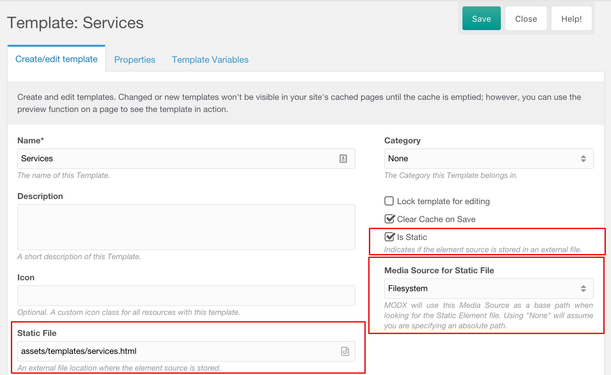

Начиная с MODX Revolution 2.2 вы можете создавать статические элементы, чтобы упростить управление ими. Эта функция доступна для всех элементов, включая шаблоны, сниппеты, чанки и плагины.

Статический элемент - это элемент, который получает свое содержимое из файла. При редактировании через менеджер файл будет обновляться. Точно так же, когда вы редактируете файл через IDE, он будет обновляться в MODX при следующем запросе элемента.

Чтобы создать элемент в качестве статического элемента, просто установите флажок _Статичный_, выберите Media Source и добавьте путь к файлу, относящемуся к этому источнику медиа, к входу _Статичный файл_. Вы также можете щелкнуть значок на входе _Статичный файл_, чтобы открыть браузер MODX для выбора файла, а не вводить его вручную.

Этот процесс одинаков для всех типов элементов.

## Файлы против Базы данных

Имейте в виду, что MODX по-прежнему сохраняет содержимое в базе данных, чтобы элемент мог обрабатываться нормально. MODX проверяет содержимое файла только тогда, когда элемент запрашивается без кэширования, поэтому обязательно очищайте кеш при разработке. По этой причине статические элементы могут оказаться наиболее полезными при работе с некэшированными сниппетами или плагинами и несколько менее полезными для шаблонов и блоков.

Чтобы улучшить опыт редактирования со статическими элементами, есть несколько дополнительных функций, которые могут помочь автоматически создать элементы в базе данных MODX или автоматически очистить кэш для вас.

## Автоматическое создание статических элементов

Начиная с MODX 2.7 можно автоматизировать процесс генерации статических элементов в ядре. Он удаляет ручные шаги по созданию статического элемента, помечая элемент как статический, выбирая источник медиа статических элементов, и он автоматически генерирует имя пути к файлу для вашего статического файла.

Когда элемент удаляется или переименовывается, связанный с ним файл также удаляется.

### Настройка автоматических статических элементов

1. Перейдите в Система > Настройки системы. Выберите тему статических элементов.
2. Включите автоматизацию статических элементов для каждого типа элемента, для которого вы хотите использовать автоматизируя рабочий процесс создания статических элементов. Например, включите параметр `static_elements_automate_snippets`, чтобы использовать его для сниппетов, и `static_elements_automate_chunks`, чтобы использовать его для чанков.
3. Выберите источник мультимедиа по умолчанию для статических элементов в параметре `static_elements_default_mediasource`.
4. Укажите базовый путь статических элементов, куда будут отправляться файлы, в параметре `static_elements_basepath`. Например: `components/static/elements/`.
5. При необходимости выберите категорию по умолчанию для использования в качестве статических элементов в параметре `static_elements_default_category`.
6. Для обеспечения работы с расширением `tpl` в шаблонах, необходимо дописать в настройку `upload_files` расширение `tpl`. MODX автоматически генерирует статические элементы с этим названием. 

### Структура файлов

Файлы будут созданы по пути: `{static_elements_basepath}/{type}/{category}/{filename}.{extension}` в указанном медиа-источнике. Например: `components/site/elements/chunks/html/footer.chunk.tpl`.
