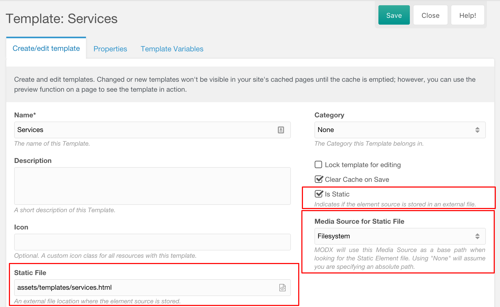

С MODX Revolution 2.2 можно создавать статические элементы, чтобы проще управлять ими. Функция есть у всех типов элементов: Templates, Chunks, Snippets и Plugins.

Статический элемент берёт содержимое из файла. Правка в Менеджере обновляет файл. Правка файла в IDE попадает в MODX при следующем запросе элемента.

## Создание статического элемента

Отметьте флажок _Is Static_ / _Статичный_, выберите Media Source и укажите путь к файлу относительно этого источника в поле _Static File_ / _Статичный файл_. Можно открыть браузер MODX иконкой в этом поле и выбрать файл, а не вводить путь вручную.

Для всех типов элементов шаги одинаковые.

### Создание без Media Source

Можно выбрать Media Source `None`.

Тогда в _Static File_ укажите путь относительно каталога компонентов ядра (`MODX_CORE_PATH . 'components/'`) или задайте системную настройку `element_static_path`. Пути будут считаться относительно неё.

При Media Source `None` допустимы и абсолютные пути.

## Файлы и база данных

MODX всё равно хранит содержимое в БД, чтобы элемент обрабатывался как обычно. Содержимое файла проверяется, только когда элемент запрошен без кеша. При разработке очищайте кеш. Поэтому статические элементы удобнее всего для некешируемых сниппетов и плагинов. Для шаблонов и чанков выгода обычно меньше.

Для удобства есть Extras, которые создают элементы в БД автоматически или сами сбрасывают кеш.

## Автоматическое создание статических элементов

С MODX 2.7 ядро умеет само заводить статические элементы. Не нужно вручную ставить флаг, выбирать Media Source и придумывать путь: путь к файлу генерируется сам.

При удалении или переименовании элемента связанный файл тоже удаляется.

### Настройка автоматики

1. Откройте **Система → Системные настройки**. Выберите область Static Elements.
2. Включите автоматику для нужных типов. Например, `static_elements_automate_snippets` для сниппетов и `static_elements_automate_chunks` для чанков.
3. В `static_elements_default_mediasource` укажите Media Source по умолчанию.
4. В `static_elements_basepath` задайте базовый путь для файлов, например `components/static/elements/`.
5. При желании задайте категорию по умолчанию в `static_elements_default_category`.

### Структура файлов

Файлы создаются по пути `{static_elements_basepath}/{type}/{category}/{filename}.{extension}` внутри выбранного Media Source. Пример: `components/site/elements/chunks/html/footer.chunk.tpl`.
