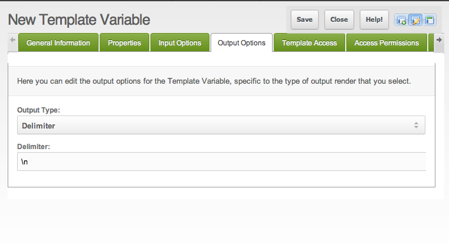

## Что такое @FILE привязка?

Привязка @FILE возвращает содержимое любого указанного файла.

## Синтаксис

``` php
@FILE file_path
```

Привязывает переменную к файлу, где **_file\_path_** - путь и имя файла. Возвращаемое значение представляет собой строку, содержащую содержимое файла. Путь к файлу - это абсолютный путь от корня сервера или вашей конкретной установки.

Команда **@FILE** очень полезна в тех случаях, когда нам может потребоваться сгенерировать данные, доступные в файле. Используя символы **||** и **==** в качестве разделителя, мы можем взаимодействовать с любым внешним приложением базы данных.

## Использование

Например: допустим, у нас есть текстовый файл с именем headline\_news.txt, который является внешним по отношению к нашей системе баз данных. Этот файл постоянно обновляется свежими новостями другой внешней системой. Мы хотим разместить эти новости на нашем сайте, чтобы наши посетители могли их увидеть. Как мы можем сделать это?

Во-первых, мы могли бы создать новую переменную шаблона. Затем мы добавляем команду @FILE в значение по умолчанию телевизора. Это будет указывать на то, где находится headline\_news.txt в нашем примере. Наше значение по умолчанию может выглядеть так:

> @FILE assets/news/headline\_news.txt

Скажем, каждый заголовок в headline\_news.txt файл разделяется символом новой строки (lf или \\n). Мы можем использовать рендер Delimiter для разделения каждого элемента и отображения их по одному. Наши поля будут выглядеть так:




И вуаля! У нас есть динамическая отрисовка @FILE.

## Смотрите также

- [Переменные шаблона](building-sites/elements/template-variables "Переменные шаблона")
- [Привязки](building-sites/elements/template-variables/bindings "Привязки")
