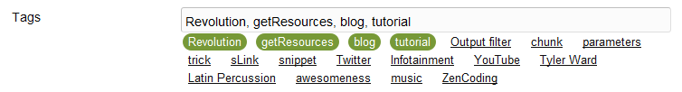
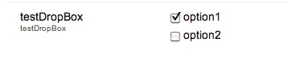
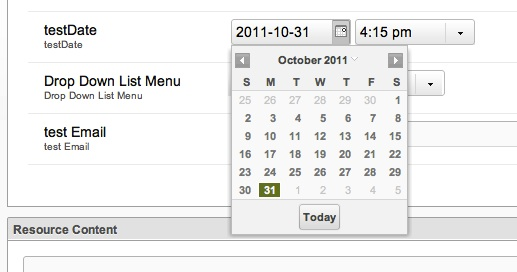
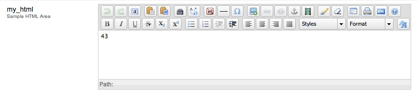
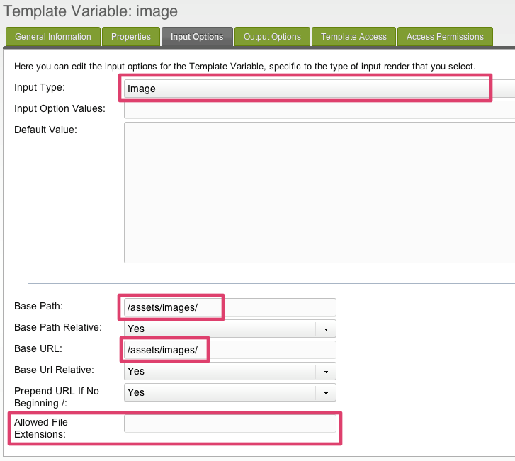
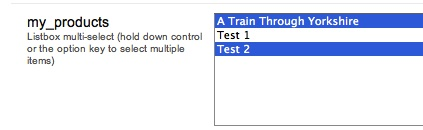

Существует несколько встроенных типов шаблонных переменных.

Некоторые типы ввода не рекомендуются в зависимости от версии MODX.

Лучше всего вводить несколько значений параметра ввода в одной строке без возврата каретки.

## Автоматический тег (autotag)

Автоматический тег - это удобная переменная шаблона для использования тегов при ведении блога, наличии нескольких категорий, к которым может принадлежать ресурс, или вкогда вам нужен список тегов, которые использовались ранее. Каждый раз, когда вы редактируете или создаете ресурс с доступом к переменной шаблона автоматического тега, вы увидите теги, которые использовались ранее. Вы можете легко нажать на ранее использованные теги, чтобы выбрать их в списке.

Чтобы сделать Автоматический тег TV, вам нужно будет установить тип вывода на «Разделитель» и указать разделитель по вашему выбору, и / или использовать фильтр вывода, чтобы представить его так, как вы предпочитаете.



Чтобы вывести теги таким образом, чтобы каждый тег связывался с определенным ресурсом и передавал тег в параметре GET, вы можете использовать выходной фильтр (сниппет) следующим образом:

``` php
if ($input == '') { return 'Error'; } // In case the TV is empty
$tags = explode(', ',$input); // Based on a delimiter of ", " this will split each one up in an array
foreach ($tags as $key => $value) { // Loop through the tags
    $output[] = '<a href="'.$modx->makeurl(9, '', array('tag' => $value)).'">'.$value.'</a>'; // Add it to an output array, with a link to resource 9 and the get parameter.
}
return implode(', ',$output); // Merge the output array and output
```

### Все имена опций ввода (для использования в migx options-json)

``` json
{
   "allowBlank":"true",
   "maxLength":"",
   "minLength":"",
   "regex":"",
   "regexText":""
}
```

## Флажок (checkbox)

### Пример использования

Основное назначение этого - просто определить поле как флажок. Вы можете контролировать, установлен ли флажок по умолчанию или нет, манипулируя полями «Значения параметра ввода» и «Значение по умолчанию».

#### Отмечено по умолчанию

- Значения параметров ввода: My Option==1
- Значение по умолчанию: 1

#### Не отмеченно по умолчанию:

- Значения параметров ввода: My Option==1
- Значение по умолчанию: 0

Поле будет установлено по умолчанию до тех пор, пока значение после "==" соответствует значению по умолчанию. Если вы хотите установить значение по умолчанию для переменной шаблона флажка в несколько значений, вы должны разделить значения с помощью "||" delimiter.

### Продвинутое использование

Вы можете различать отдельные ключи и значения, используя двойное равенство и двойные каналы:

``` php
option1==value1||option2==value2
```

### Другой пример продвинутого использования

Тип ввода Флажок позволяет отображать несколько флажков на одном TV. Установите значения параметров ввода в формате `option1==value1||option2==value2`. Чтобы объявить флажки по умолчанию, укажите в поле значения по умолчанию имена опций, разделенные двумя каналами (||). Вы можете использовать [@SELECT](building-sites/elements/template-variables/bindings/select-binding "SELECT Привязку") для выбора элементо из вашей базы данных, например: **Значения параметров ввода:**

``` sql
@SELECT pagetitle, id FROM modx_site_content WHERE parent=35
```



Если вы используете несколько таких флажков, вам, вероятно, потребуется установить **Тип вывода** на «Разделитель» (например, запятую), чтобы вы могли различать значения, содержащиеся в каждом флажке.

## Дата (date)

Это позволяет вам установить дату и время.



Если вы хотите установить дату по умолчанию, вы можете поместить одно из следующих ключевых слов в поле значения по умолчанию (без кавычек!). «Странная» логика, лежащая в основе значений -X/+X (которые были бы интуитивно понятны - для «назад» и «+ для будущего»), вероятно, происходит из какого-то вычитания в коде, например: `now()` - значение, поэтому, если value равно +72, это означает `now() - (+72)`, но - и + is -, так что положительное значение вычитается, тогда как `now() - (-72)`, - и - равно +, добавляется отрицательное значение

| Значение по умолчанию | Функция                                                                               |
| --------------------- | ------------------------------------------------------------------------------------- |
| yesterday             | Отображение дня до сегодняшней даты, времени 12:00pm                                  |
| today                 | Отображает сегодняшнюю дату, время 12:00pm                                            |
| now                   | Отображает текущую дату, текущее время                                                |
| tomorrow              | Отображает день после сегодняшней даты, время 12:00pm                                 |
| +X                    | X количество часов BACK от текущего времени, например +72 означает «3 дня назад»      |
| -X                    | X количество часов в БУДУЩЕМ от текущего времени, например -72 означает "через 3 дня" |

Вы используете [Тип вывода Дата TV](making-sites-with-modx/customizing-content/template-variables/template-variable-output-types/date-tv-output-type "Тип вывода Дата TV") изменить формат возвращаемой даты.

### Все имена параметров ввода (для использования в migx options-json)

 ``` json
{
   "allowBlank":"true",
   "disabledDates":"",
   "disabledDays":"",
   "minDateValue":"",
   "minTimeValue":"",
   "maxDateValue":"",
   "maxTimeValue":"",
   "startDay":"",
   "timeIncrement":"",
   "hideTime":"false"
}
```

## DropDown список меню

**ПРИМЕЧАНИЕ**: этот тип ввода TV устарел начиная с Revo 2.1.x Пожалуйста, смотрите [Listbox](#TemplateVariableInputTypes-Listbox(MultiSelect)) типы ввода ниже.

Установите значения параметров ввода в формате `option1==value1||option2==value2||option3==value3`. Убедитесь, что вы выбрали выходной тип с разделителями (или другой тип по своему вкусу), чтобы иметь возможность представить его пользователю определенным образом.. Ты можешь использовать [@SELECT](building-sites/elements/template-variables/bindings/select-binding "SELECT Binding") привязку для выбора 2 столбцов, например,

``` sql
@SELECT name, value FROM your_table
```

Также см. Список ресурсов ТВ типа.


### Все имена параметров ввода (для использования в migx options-json)

``` json
{
   "allowBlank":"true",
   "listWidth":"",
   "listHeight":""
}
```

## Email

Это текстовое поле, имеющее собственную проверку: будет принят только текст в допустимом формате электронной почты.


### Все имена параметров ввода (для использования в migx options-json)

``` json
{
   "allowBlank":"true",
   "maxLength":"",
   "minLength":""
}
```

## Файл

Создает форму ввода файла для просмотра файла на сервере. Файлы могут быть загружены через файловый менеджер MODX. Вы можете объявить файл значений по умолчанию, указав путь к файлу.

При использовании дружественных URL-адресов обратите особое внимание на относительные пути к файлам.

### Все имена параметров ввода (для использования в migx options-json)

## Скрытый

Скрытое поле не отображается в менеджере, поэтому вы редко используете эту опцию. Вы можете установить значение по умолчанию, которое можно получить на всех страницах, используя эту переменную. Другая возможность - сохранить сниппет, который принимает идентификатор страницы в качестве ввода.

## HTML область (richtext)

Это дает вам небольшой редактор WSYIWYG для поля. Это выглядит точно так же, как поля Richtext.



## Изображение


Создает форму ввода изображения для просмотра файла на сервере. Файлы могут быть загружены через файловый менеджер MODX.

В MODX 2.2+ больше нет параметров ввода для TV с изображениями. Вместо этого перейдите на вкладку «Источники мультимедиа» и выберите источник мультимедиа, который нужно назначить этому TV для каждого контекста. Вы можете настроить базовые пути и т.п. в [Медиа Источнике](building-sites/media-sources "Медиа Источнике").



1) Вы можете объявить файл значений по умолчанию, указав путь к изображению.

2) Если вы хотите ограничить изображения, используемые для этого телевизора, определенной папкой, вы можете указать (начиная с Revolution 2.1) base-path и base-url. Вы также можете установить относительные или абсолютные пути. При использовании дружественных URL-адресов обратите особое внимание на относительные пути к файлам.
Для правильного отображения изображений в интерфейсе и бэкэнде убедитесь, что в настройках `base_url` и `base_path` указаны правильные настройки!

3) Вы можете добавить URL, если путь к файлу не начинается с завершающей косой черты.

4) Вы можете указать расширения файлов, которые могут быть выбраны.

Этот тип ввода возвращает ссылку (которая будет использоваться в качестве атрибута src) на изображение. Вы также можете установить весь [html-img-tag как тип вывода](making-sites-with-modx/customizing-content/template-variables/template-variable-output-types/image-tv-output-type "Тип TV-вывода изображения").

## [Image+](extras/image) (imageplus)

### Все имена параметров ввода (для использования в migx options-json)

``` json
{
   "targetWidth":"",
   "targetHeight":"",
   "targetRatio":"",
   "thumbnailWidth":"",
   "allowAltTag":"true",
   "allowCaption":"false",
   "allowCredits":"false"
}
```

## Список (одиночный выбор)

Для него доступны те же параметры, что и для списка (Multi-Select) - см. ниже.

## Список (множественный выбор)

Это ведет себя подобно полям флажков: вы можете выбрать несколько элементов, и это поле может быть запитано связыванием `@SELECT` в его параметре «Значения параметра ввода». Как и флажки, вы, вероятно, хотите установить «Тип вывода» в качестве разделителя, чтобы вы могли различать значения.



### Как использовать

Как и в случае с флажками, вы можете просто указать список значений, разделенных двойными каналами:

``` php
Man||Bear||Pig
```

### Separate Options/Values

Часто приятно иметь более читаемый ярлыки. Вы можете отобразить что-то приятное и при этом сохранить другое значение, используя формат двойного равенства и двойной трубы, используемый флажками:

``` php
Option 1==value1||Option 2==value2
```

### Все имена параметров ввода (для использования в migx options-json)

``` json
{
   "allowBlank":"true",
   "listWidth":"",
   "title":"",
   "typeAhead":"false",
   "typeAheadDelay":"250",
   "listEmptyText":"",
   "stackItems":"false"
}
```

## Число

Это еще одно текстовое поле с преимущественной проверкой. Вы буквально не можете набрать ничего, кроме цифр от 0 до 9, знака минус (-) и точки (то есть десятичной точки). Ошибка проверки возникает, если вы вводите более одной десятичной точки или знак минус. Комплексные числа (например, использование радикалов «^» или «e» **не** поддерживаются).

Обратите внимание, что конечные нули обрезаются, например, 4,50 обрезается до 4,5, это может сделать этот тип ввода неподходящим для полей валюты.

### Все имена параметров ввода (для использования в migx options-json)

``` json
{
   "allowBlank":"true",
   "allowDecimals":"Yes",
   "allowNegative":"Yes",
   "decimalPrecision":"2",
   "decimalSeparator":".",
   "maxValue":"",
   "minValue":""
}
```

## Переключатели (radio)

### Пример использования

Основное использование этого - предоставить список опций радио. Вы можете управлять опцией по умолчанию, манипулируя полями «Значения опций ввода» и «Значение по умолчанию».

#### Выбран по умолчанию

- Значения параметров ввода: Моя опция==1
- Значение по умолчанию: 1

Эта опция будет выбрана по умолчанию, если значение после «==» соответствует значению по умолчанию.

### Расширенное использование

Опция радио может использоваться для вывода более простых числовых значений. Одним из таких примеров является использование опции радио для определения порции, используемой для боковой панели.

Установите значения параметров ввода, используя формат **Заголовок == значение**, но используйте плейсхолдеры чанков в качестве значений. Чтобы объявить несколько параметров, используйте два канала (||) после значения перед заголовком следующего параметра.

#### Пример боковой панели Revolution

- Значения параметров ввода: Related==`[[$my_related_chunk]]||Content==[[*sidebar-txt]]||Twitter==[[$my_twitter_chunk]]`
- Значение по умолчанию: `[[$my_related_chunk]]`

В приведенных выше примерах вы можете вывести чанк или другую переменную шаблона без помощи дополнительного.

### Все имена параметров ввода (для использования в migx options-json)

 ``` json
{
   "allowBlank":"true",
   "columns":"1"
}
```

## Список ресурсов

Укажите определение с идентификатором ресурса, и вы получите выпадающий список всех страниц/ресурсов, которые являются дочерними для этого ресурса. Значение, сохраненное после того, как вы сделали выбор, является идентификатором единственного выбранного ресурса.


Это похоже на использование [@SELECT](building-sites/elements/template-variables/bindings/select-binding "SELECT Binding") привязки в меню списка DropDown, но список ресурсов будет проходить через весь браузер ресурсов, в то время как при привязке `@SELECT` вам придется обновить запрос, чтобы получить список дочерних элементов каждого из родителей.

Этот тип ввода также принимает условия WHERE для фильтрации по:


### Другой пример

``` php
[{"pagetitle:!=":"Home"}]
```

### Все имена параметров ввода (для использования в migx options-json)

``` json
{
   "allowBlank":"1",
   "showNone":"1",
   "parents":"",
   "depth":"10",
   "includeParent":"1",
   "limitRelatedContext":"0",
   "where":"[{\"isfolder: = \":\"1\"},{\"hidemenu\":\"0\",\"OR:hidemenu:=\":\"1\"}]",
   "limit":"0"
}
```

## Текстовый редактор

Смотрите _HTML Area_.

## Тег

Несколько тегов, разделенных || символами будут разделяться и выводиться отдельно при использовании с [типом вывода HTMLTag](building-sites/elements/template-variables/output-types/html) для форматирования.

### Все имена параметров ввода (для использования в migx options-json)

``` json
{
   "allowBlank":"1"
}
```

## Текст

Это ванильное текстовое поле.

Начиная с MODX 2.1, для этого телевизора можно установить три варианта ввода:

- Разрешить пустое: да / нет, когда «нет» ресурс не может быть сохранен без его заполнения.
- Максимальная длина: число, представляющее количество символов, которые можно заполнить в этом поле.
- Минимальная длина: число, представляющее минимальное количество символов, которое необходимо заполнить. Возможно, вы захотите использовать его с опцией разрешения пробела «Нет».


### Все имена параметров ввода (для использования в migx options-json)

``` json
{
   "allowBlank":"true",
   "maxLength":"",
   "minLength":"",
   "regex":"",
   "regexText":""
}
```

## Текстовая область

Это стандартное поле _textarea_, высотой 15 строк. Он имеет тот же размер, что и поля HTML Area, но без редактора WYSIWYG.

### Все имена параметров ввода (для использования в migx options-json)

``` json
{
   "allowBlank":"true"
}
```

## Текстовое окно

Это выглядит точно так же, как в текстовое поле.

## URL

Это текстовое поле с инструкциями, в раскрывающемся списке которого можно выбрать протокол: нет, `http://`, `https://`, `ftp://` или `mailto:`. Проверка правильности структуры URL не выполняется.


