В MODX есть несколько встроенных типов шаблонных переменных (TV).

Некоторые типы ввода устарели в зависимости от версии MODX.

Для TV с пользовательскими списками (listbox, checkbox, radio и т. п.) лучше вводить несколько значений параметра ввода в одной строке без перевода строки.

## Типы ввода

### Автоматический тег (autotag)

Автоматический тег удобен для тегов в блоге, когда ресурс может относиться к нескольким категориям, или когда нужен список ранее использованных тегов. При каждом редактировании или создании ресурса с доступом к такой TV вы увидите уже использованные теги и сможете выбрать их одним кликом.

Чтобы вывести autotag TV на фронтенде, задайте тип вывода «Разделитель», укажите нужный разделитель и/или примените фильтр вывода. 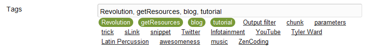
Чтобы каждый тег вёл на ресурс и передавался в GET-параметре, используйте фильтр вывода (сниппет):

```php
if ($input == '') { return 'Error'; } // In case the TV is empty
$tags = explode(', ',$input); // Based on a delimiter of ", " this will split each one up in an array
foreach ($tags as $key => $value) { // Loop through the tags
    $output[] = '<a href="'.$modx->makeurl(9, '', array('tag' => $value)).'">'.$value.'</a>'; // Add it to an output array, with a link to resource 9 and the get parameter.
}
return implode(', ',$output); // Merge the output array and output
```

#### Шаблон JSON-параметров ввода

```json
{
    "allowBlank": "true",
    "maxLength": "",
    "minLength": "",
    "regex": "",
    "regexText": ""
}
```

### Флажок (checkbox)

#### Простое использование

Базовый сценарий: поле с одним флажком. Отметку по умолчанию задают через поля «Значения параметра ввода» и «Значение по умолчанию».

##### Отмечен по умолчанию

-   Значения параметра ввода: `My Option==1`
-   Значение по умолчанию: 1

##### Не отмечен по умолчанию

-   Значения параметра ввода: `My Option==1`
-   Значение по умолчанию: 0

Флажок будет отмечен, пока значение после `==` совпадает со значением по умолчанию. Для нескольких значений по умолчанию разделите их разделителем `||`.

#### Расширенное использование

Ключи и значения разделяют двойным равенством и двойными вертикальными чертами:

```php
option1==value1||option2==value2
```

#### Ещё более сложное использование

Тип «Флажок» позволяет показать несколько флажков в одной TV. Задайте значения параметра ввода в формате `option1==value1||option2==value2`. Чтобы отметить флажки по умолчанию, укажите в поле значения по умолчанию имена опций через `||`. Можно использовать [@SELECT](building-sites/elements/template-variables/bindings/select-binding "SELECT Binding") для выборки из базы, например **Значения параметра ввода:**

```sql
@SELECT pagetitle, id FROM modx_site_content WHERE parent=35
```

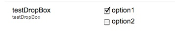

При нескольких флажках задайте **Тип вывода** «Разделитель» (например, запятую), чтобы различать значения каждого флажка.

### Дата (date)

Позволяет задать дату и время.

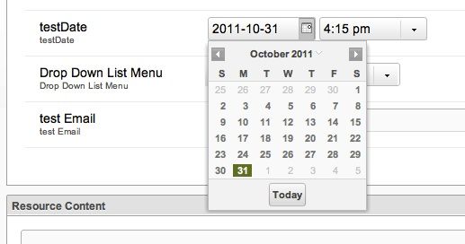

Для даты по умолчанию поместите одно из ключевых слов ниже в поле значения по умолчанию (без кавычек). «Странная» логика `-X`/`+X` (интуитивно минус: назад, плюс: вперёд) связана с вычитанием в коде: `now() - value`. Если value равно `+72`, получается `now() - (+72)`, и положительное значение вычитается. При `now() - (-72)` два минуса дают плюс, и отрицательное значение прибавляется.

| Значение по умолчанию | Функция                                                                                 |
| --------------------- | --------------------------------------------------------------------------------------- |
| `yesterday`           | День до сегодняшней даты, время 12:00                                                   |
| `today`               | Сегодняшняя дата, время 12:00                                                           |
| `now`                 | Сегодняшняя дата, текущее время                                                         |
| `tomorrow`            | День после сегодняшней даты, время 12:00                                                |
| `+X`                  | X: число часов НАЗАД от текущего времени, например +72 означает «3 дня назад»          |
| `-X`                  | X: число часов ВПЕРЁД от текущего времени, например -72 означает «через 3 дня»         |

Формат даты на выводе задаёт [Тип вывода Date TV](making-sites-with-modx/customizing-content/template-variables/template-variable-output-types/date-tv-output-type "Date TV Output Type").

#### Шаблон JSON-параметров ввода

```json
{
    "allowBlank": "true",
    "disabledDates": "",
    "disabledDays": "",
    "minDateValue": "",
    "minTimeValue": "",
    "maxDateValue": "",
    "maxTimeValue": "",
    "startDay": "",
    "timeIncrement": "",
    "hideTime": "false"
}
```

### Выпадающий список (DropDown List Menu)

ПРИМЕЧАНИЕ: этот тип ввода TV устарел с Revo 2.1.x. Смотрите типы [Listbox](<#listbox-single-select-listbox>) ниже.

Задайте значения параметра ввода в формате `option1==value1||option2==value2||option3==value3`. Выберите тип вывода «Разделитель» (или другой подходящий), чтобы корректно показать значение на фронтенде. Можно использовать привязку [@SELECT](building-sites/elements/template-variables/bindings/select-binding "SELECT Binding") для двух столбцов, например:

```sql
@SELECT name, value FROM your_table
```

См. также тип TV «Список ресурсов».

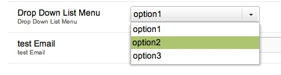

#### Шаблон JSON-параметров ввода

```json
{
    "allowBlank": "true",
    "listWidth": "",
    "listHeight": ""
}
```

### Email

Текстовое поле со встроенной проверкой: принимается только текст в корректном формате email.

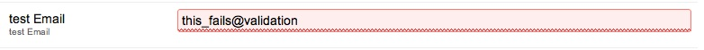

#### Шаблон JSON-параметров ввода

```json
{
    "allowBlank": "true",
    "maxLength": "",
    "minLength": ""
}
```

### Файл

Создаёт поле выбора файла для просмотра файлов на сервере. Загрузка: через файловый менеджер MODX. Файл по умолчанию задаётся путём к нему.

При дружественных URL обратите внимание на относительные пути к файлам.

#### Шаблон JSON-параметров ввода

(Нет)

### Скрытое поле (hidden)

Скрытое поле не отображается в менеджере, поэтому его редко используют. Можно задать значение по умолчанию и получать его на всех страницах с этой переменной. Другой вариант: сохранить сниппет, который принимает ID страницы.

### HTML-область (richtext)

Даёт небольшой WYSIWYG-редактор для поля. Выглядит так же, как поля Richtext.

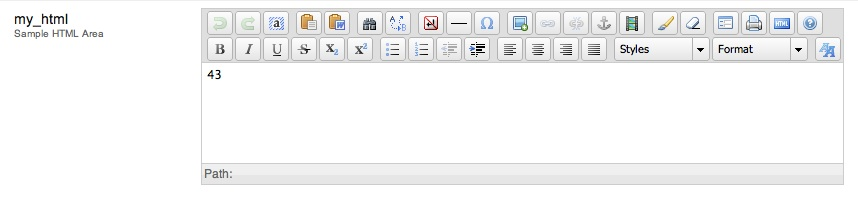

### Изображение (image)

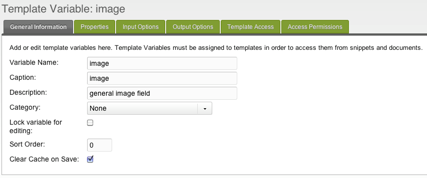

Создаёт поле выбора изображения для просмотра файлов на сервере. Загрузка: через файловый менеджер MODX.

В MODX 2.2+ у Image TV больше нет параметров ввода. Перейдите на вкладку «Источники медиа» и назначьте источник этой TV для каждого контекста. Базовые пути и другие настройки задаются в [Источнике медиа](building-sites/media-sources "Media Sources").

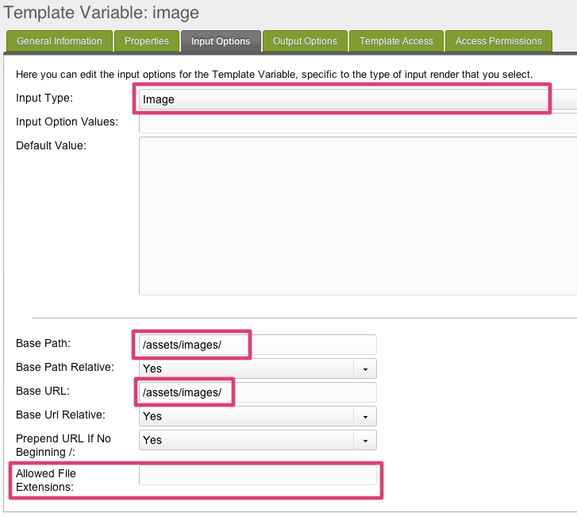

1. Файл по умолчанию задаётся путём к изображению.

2. Чтобы ограничить изображения для этой TV одной папкой, укажите (с Revolution 2.1) base-path и base-url. Можно задать относительные или абсолютные пути. При дружественных URL обратите внимание на относительные пути. Для корректного отображения на фронтенде и в бэкенде проверьте настройки `base_url` и `base_path`.

3. Можно добавить URL, если путь к файлу не начинается с косой черты.

4. Можно указать допустимые расширения файлов.

Этот тип ввода возвращает ссылку (для атрибута src). Можно также задать [html-img-tag как тип вывода](making-sites-with-modx/customizing-content/template-variables/template-variable-output-types/image-tv-output-type "Image TV Output Type").

### [Image+](extras/image) (imageplus)

#### Шаблон JSON-параметров ввода

```json
{
    "targetWidth": "",
    "targetHeight": "",
    "targetRatio": "",
    "thumbnailWidth": "",
    "allowAltTag": "true",
    "allowCaption": "false",
    "allowCredits": "false"
}
```

### Listbox (одиночный выбор) (listbox)

Те же параметры, что у Listbox (множественный выбор): см. ниже.

### Listbox (множественный выбор) (listbox-multiple)

Работает как флажки: можно выбрать несколько элементов, а поле может питаться привязкой @SELECT в «Значения параметра ввода». Как и для флажков, задайте тип вывода «Разделитель», чтобы различать значения.

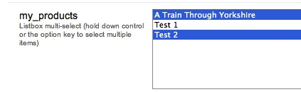

#### Простое использование

Как у флажков, укажите список значений через `||`:

```php
Man||Bear||Pig
```

#### Отдельные подписи и значения

Часто нужна более читаемая подпись. Можно показать понятный текст и сохранить другое значение в формате двойного равенства и `||`, как у флажков:

```php
Option 1==value1||Option 2==value2
```

#### Шаблон JSON-параметров ввода

```json
{
    "allowBlank": "true",
    "listWidth": "",
    "title": "",
    "typeAhead": "false",
    "typeAheadDelay": "250",
    "listEmptyText": "",
    "stackItems": "false"
}
```

### Число (number)

Текстовое поле с предварительной проверкой. Можно вводить только цифры 0-9, минус (-) и точку (десятичный разделитель). Ошибка появится при более чем одной точке или минусе. Комплексные числа (радикалы `^` или `e`) **не** поддерживаются.

Конечные нули обрезаются: 4.50 становится 4.5. Для денежных полей этот тип может не подойти.

#### Шаблон JSON-параметров ввода

```json
{
    "allowBlank": "true",
    "allowDecimals": "Yes",
    "allowNegative": "Yes",
    "decimalPrecision": "2",
    "decimalSeparator": ".",
    "maxValue": "",
    "minValue": ""
}
```

### Переключатели (option)

#### Простое использование

Базовый сценарий: список переключателей. Вариант по умолчанию задают через «Значения параметра ввода» и «Значение по умолчанию».

##### Выбран по умолчанию

-   Значения параметра ввода: My Option==1
-   Значение по умолчанию: 1

Опция будет выбрана, пока значение после `==` совпадает со значением по умолчанию.

#### Расширенное использование

Переключатели могут выводить не только числа. Например, ими выбирают чанк для боковой панели.

Задайте значения параметра ввода в формате **Title==value**, а в качестве value используйте плейсхолдеры чанков. Несколько опций разделяйте `||` после value, перед следующим title.

##### Пример боковой панели (Revolution)

-   Значения параметра ввода: `[[$my_related_chunk]]||Content==[[*sidebar-txt]]||Twitter==[[$my_twitter_chunk]]`
-   Значение по умолчанию: `[[$my_related_chunk]]`

В этих примерах можно вывести чанк или другую TV без дополнительного сниппета.

#### Шаблон JSON-параметров ввода

```json
{
    "allowBlank": "true",
    "columns": "1"
}
```

### Список ресурсов (resourcelist)

Укажите ID ресурса: получите выпадающий список всех дочерних страниц/ресурсов. После выбора сохраняется ID выбранного ресурса.

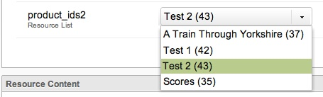

Похоже на [@SELECT](building-sites/elements/template-variables/bindings/select-binding "SELECT Binding") в выпадающем списке, но «Список ресурсов» обходит всё дерево ресурсов. С @SELECT пришлось бы обновлять запрос для каждого родителя.

Этот тип ввода также принимает условия WHERE для фильтрации:

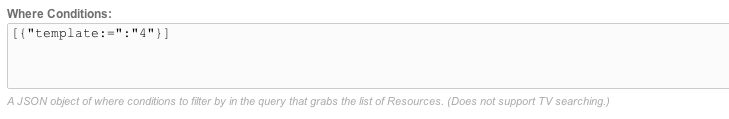

Другой пример:

```php
[{"pagetitle:!=":"Home"}]
```

#### Шаблон JSON-параметров ввода

```json
{
    "allowBlank": "1",
    "showNone": "1",
    "parents": "",
    "depth": "10",
    "includeParent": "1",
    "limitRelatedContext": "0",
    "where": "[{\"isfolder: = \":\"1\"},{\"hidemenu\":\"0\",\"OR:hidemenu:=\":\"1\"}]",
    "limit": "0"
}
```

### Rich Text

См. [_HTML-область_](building-sites/elements/template-variables/input-types#html-area-richtext).

### Тег (tag)

Несколько тегов, разделённых `||`, выводятся по отдельности с [типом вывода HTMLTag](building-sites/elements/template-variables/output-types/html) для форматирования.

#### Шаблон JSON-параметров ввода

```json
{
    "allowBlank": "1"
}
```

### Текст (text)

Обычное текстовое поле.

С MODX 2.1 для этой TV доступны три параметра ввода:

-   Allow Blank: да/нет. При «нет» ресурс нельзя сохранить с пустым полем.
-   Max length: максимальное число символов.
-   Min Length: минимальное число символов. Часто используют вместе с Allow Blank «нет».

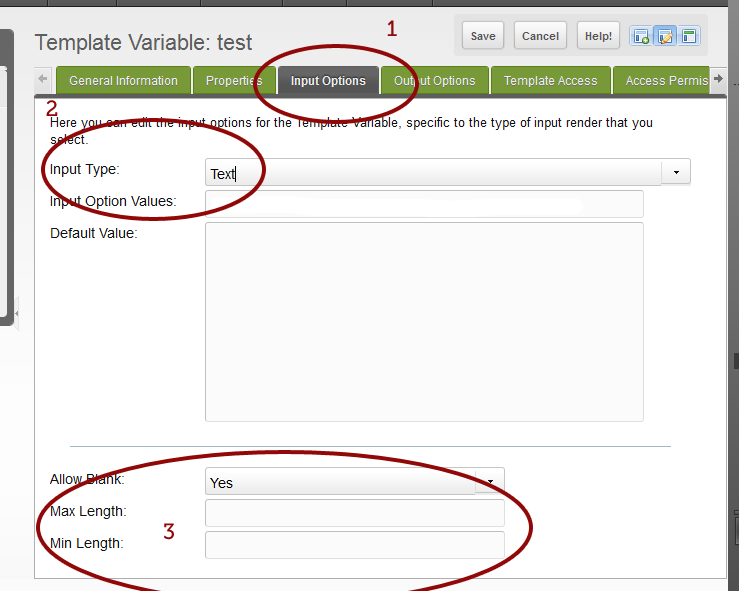

#### Шаблон JSON-параметров ввода

```json
{
    "allowBlank": "true",
    "maxLength": "",
    "minLength": "",
    "regex": "",
    "regexText": ""
}
```

### Текстовая область (textarea)

Стандартное поле _textarea_ высотой 15 строк. Тот же размер, что у HTML Area, но без WYSIWYG-редактора.

#### Шаблон JSON-параметров ввода

```json
{
    "allowBlank": "true"
}
```

### Текстовая область (мини) (deprecated)

Меньшее поле _textarea_ высотой 5 строк.

### Textbox

По сути совпадает с обычным текстовым полем.

### URL

Текстовое поле с выбором протокола: none, <http://>, <https://>, <ftp://,> или [](mailto:). Структура URL не проверяется.

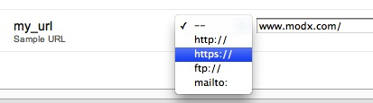

## Динамически задаваемые параметры ввода

Этот раздел про определение самой TV, а не про пользовательские опции (пары ключ-значение) listbox и похожих типов.

При создании TV не через стандартную форму менеджера (_например_, в Extra MIGX) параметры ввода задают JSON-объектом. Поле на форме ресурса рендерит Smarty. Теги Smarty внутри JSON не работают для динамической подстановки. Вместо них используйте сниппет. Например:

Так не сработает:

```json
{
    "maxDateValue":"{$smarty.now|date_format:'%Y-%m-%d'}",
    "allowBlank":true,
    "hideTime":true
}
```

А так сработает:

```json
{
    "maxDateValue":"[[!tv-option--get-max-date]]",
    "allowBlank":true,
    "hideTime":true
}
```

где сниппет `tv-option--get-max-date` содержит:

```php
<?php
return date('Y-m-d', time());
```
