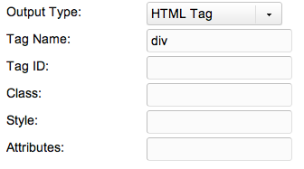

## Тип вывода TV - HTML тег

Этот тип позволяет вам оборачивать тег HTML вокруг ввода. Он специально предназначен для использования с типом ввода тегагде отдельные значения тега разделяются знаком ||.

## Свойства вывода

Эти выходные свойства выглядят как:

| Имя        | Описание                                                  |
| ---------- | --------------------------------------------------------- |
| Tag Name   | Тег для создания, такой как div, img, span, и другие.     |
| Tag ID     | DOM идентификатор тега.                                   |
| Class      | Любые CSS класс для добавления к тегу.                    |
| Style      | Любые атрибуты стиля для добавления к тегу.               |
| Attributes | Любые другие атрибуты, которые вы хотите добавить к тегу. |

## Смотрите также

1. [Тип вывода TV - Дата](building-sites/elements/template-variables/output-types/date)
2. [Тип вывода TV - Разделитель](building-sites/elements/template-variables/output-types/delimiter)
3. [Тип вывода TV - HTML тег](building-sites/elements/template-variables/output-types/html)
4. [Тип вывода TV - Изображение](building-sites/elements/template-variables/output-types/image)
5. [Тип вывода TV - URL](building-sites/elements/template-variables/output-types/url)
