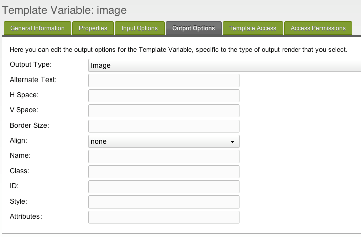

## Тип вывода TV - Изображение

Этот тип вывода позволяет вам обернуть тег img вокруг ввода (обычно это тип ввода: «изображение»).

## Свойства вывода

Эти выходные свойства выглядят как:

| Имя            | Описание                                                                                          | Значение |
| -------------- | ------------------------------------------------------------------------------------------------- | -------- |
| Output type    | Возможность вывода на фронтеде.                                                                   | Image    |
| Alternate text | Альтернативный текст для изображения, которое будет отображаться, если img не может быть загружен |          |
| H Space        | горизонтальное пространство                                                                       |          |
| V Space        | вертикальное пространство                                                                         |          |
| Border Size    | размер границы, которую должно получить изображение                                               |          |
| Align          | выравнивание изображения (middle, top, bottom, center, left, right)                               | none     |
| Name           | имя для тега изображения                                                                          |          |
| Class          | CSS класс для прикрепления тега img                                                               |          |
| ID             | CSS ID для прикрепления тега img                                                                  |          |
| Style          | Любые CSS-атрибуты стиля для добавления к тегу                                                    |          |
| Attributes     | любые другие HTML-атрибуты, которые вы хотите добавить к тегу                                     |          |

## Смотрите также

1. [Тип вывода TV - Дата](building-sites/elements/template-variables/output-types/date)
2. [Тип вывода TV - Разделитель](building-sites/elements/template-variables/output-types/delimiter)
3. [Тип вывода TV - HTML тег](building-sites/elements/template-variables/output-types/html)
4. [Тип вывода TV - Изображение](building-sites/elements/template-variables/output-types/image)
5. [Тип вывода TV - URL](building-sites/elements/template-variables/output-types/url)
