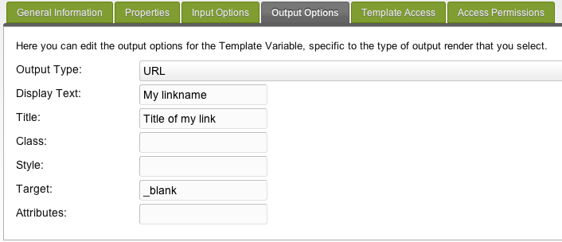

## Тип вывода TV - URL

Этот тип вывода позволяет вам обернуть ссылку (a-tag) вокруг ввода (обычно это тип ввода: «текст»).

## Свойства вывода

Эти выходные свойства выглядят как:

| Имя          | Описание                                                           |
| ------------ | ------------------------------------------------------------------ |
| Output type  | Возможность вывода на фронтенде. Значение: URL                     |
| Display text | текст, который отображается как текст ссылки вместо URL            |
| Title        | тег заголовка для ссылки-заголовка                                 |
| Class        | Класс CSS для прикрепления тега img                                |
| Style        | Любые CSS-атрибуты стиля для добавления к тегу                     |
| Target       | цель ссылки, должна быть оставлена пустой, но может быть "\_blank" |
| Attributes   | любые другие HTML-атрибуты, которые вы хотите добавить в тег       |

## Смотрите также

1. [Тип вывода TV - Дата](building-sites/elements/template-variables/output-types/date)
2. [Тип вывода TV - Разделитель](building-sites/elements/template-variables/output-types/delimiter)
3. [Тип вывода TV - HTML тег](building-sites/elements/template-variables/output-types/html)
4. [Тип вывода TV - Изображение](building-sites/elements/template-variables/output-types/image)
5. [Тип вывода TV - URL](building-sites/elements/template-variables/output-types/url)
