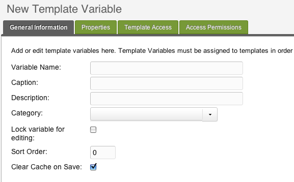

На этой странице описано, как создать переменную шаблона в MODX Revolution. Переменная шаблона, в двух словах, является настраиваемым полем. Чтобы узнать больше о том, что такое переменная шаблона см. Страницу [Шаблонные переменные](building-sites/elements/template-variables "Шаблонные переменные").

## Объяснение

Когда мы говорим «Создать переменную шаблона», мы можем говорить о двух возможных действиях: мы можем ссылаться на действие добавления некоторого текста или содержимого в одно из существующих пользовательских полей при редактировании страницы MODX (т.е. ресурс). ИЛИ мы можем ссылаться на действие по определению этого поля, чтобы оно было доступно нашим ресурсам MODX. Эта страница посвящена последнему. В первом случае мы будем создавать _пример_ переменной шаблона, в то время как второй случай - это определение схемы шаблона переменной, которая определяет, как будет вести себя каждый экземпляр.

**Класс поля**
Когда вы создаете переменную шаблона, вы действительно определяете _class_ настраиваемого поля: это действует как проект для всех экземпляров этого настраиваемого поля.

## Создание переменной шаблона

### 1. Войдите в менеджер MODX

Просто чтобы прояснить ситуацию, вы должны войти в диспетчер MODX как администратор (или подобный), чтобы это работало!

### 2. Добавьте переменную шаблона (TV)

В левой панели дерева ресурсов перейдите на вкладку **Элементы**


### 3. Заполните общую информацию

Когда мы определяем TV, мы должны определить много информации о поведении этого настраиваемого поля. Вкладка «Общая информация» содержит основную информацию для этой переменной.



-   **Имя переменной**: Это соответствует плейсхолдерам, которые будут использоваться в ваших шаблонах, e.g. **bio** = `[[*bio]]`. _Это имя должно быть **уникальным**_!
-   **Подпись**: Это основная метка для вашей переменной, которая появляется при редактировании ресурса, который использует это TV
-   **Описание**: Это вторичная метка для вашей переменной
-   **Категория**: Это влияет на то, на какой вкладке отображается переменная
-   **Порядок сортировки**: Если вы используете более одного TV, это определит, какие из них появятся сверху (1 = верх, большие цифры опускаются TV вниз)


На картинке вы можете видеть, как настройки будут соответствовать полям редактора ваших страниц.

Имя должно быть уникальным!

### 4. Определите параметры ввода

Затем нажмите на вкладку **Параметры ввода**: вам нужно выбрать тип поля, например, текстовое поле, раскрывающееся поле, WYSIWYG и т.д. Ознакомьтесь с [Типами ввода переменных шаблона](building-sites/elements/template-variables/input-types "Типы ввода переменных шаблона") для полного списка возможных типов ввода.

-   **Тип ввода**: Ваше поле может быть простым текстовым полем, раскрывающимся списком, ссылкой на другую страницу или множеством других типов полей.
-   **Варианты ввода**: Некоторые типы ввода игнорируют это поле, но другие могут требовать его. Например. выпадающий список требует список возможных значений. Опять же, смотрите страницу [Типы ввода переменных шаблона](building-sites/elements/template-variables/input-types "Типы ввода переменных шаблона") для получения дополнительной информации.
-   **Значение по умолчанию**: это влияет на то, каким будет значение по умолчанию для поля. Это может быть простое значение, или он может использовать один из MODX [Привязки](building-sites/elements/template-variables/bindings "Привязки") чтобы делать такие вещи, как выборка значений из базы данных или наследование значений от родительской страницы.


### 5. Настроить доступ к шаблонам

Перейдите на вкладку **Доступ к шаблону**: вы должны определить, какой шаблон(ы) будет использовать это пользовательское поле, которое вы определили. Как только вы определили это пользовательское поле, вы можете выбрать, какой шаблон(ы) действительно может использовать Это.

Каждый раз, когда вы создаете Ресурс, который использует шаблон, к которому был подключен TV, он будет доступен для редактирования. **Убедитесь, что вы подключили TV хотя бы к одному шаблону.**

### 6. Сохраните определение TV

Когда вы редактируете страницу, которая использует шаблон, связанный с этим TV, вы сможете добавлять данные в это поле TV.

### 7. Используйте это: создайте ресурс

Теперь, когда вы определили свой TV и добавили его в шаблон, добавьте ресурс MODX (например, щелкните правой кнопкой мыши в дереве документа и выберите **Создать -> Создать ресурс здесь**). Выберите шаблон, который использует этот TV.

### 8. Измените значение

Когда ваш ресурс MODX (т.е. страница) использует шаблон, содержащий вашу переменную шаблона, вы можете добавить данные к этому атрибуту, щелкнув на вкладке «Переменные шаблона» на странице.

## Расширенное использование

В ХОДЕ ЗАПОЛНЕНИЯ ...

Возможно, вы заметили, что мы пропустили изрядное количество вкладок при первом просмотре. Переменные шаблона предлагают некоторые более сложные функции, которые вам не нужны для простых сценариев.

## Параметры вывода вывода

Далее мы выберем параметры вывода вывода. Мы также выберем «Дата», и, как вы заметите, под этим полем (в зависимости от выбранного Output Render) будут отображаться некоторые поля формы:


Позволяет нам редактировать более детальные опции для этого Output Render.

## Свойства

Оттуда мы можем указать любые свойства по умолчанию, которые мы хотим для TV. «Как вы можете использовать свойства для TV?», спросите вы. Ну, скажем, мы делаем текстовый TV под названием "singSS ". В нашем контенте у нас есть это:

```php
Просмотр: [[+subsection]]
```

Мы можем добавить свойство списка «subsection» в сетку, а затем разрешить переопределение этого свойства с помощью наборов свойств. Скажем, мы создали набор свойств с именем `CarsSectionTVPS` (для набора свойств). В нем мы устанавливаем свойство «subsection» на «Cars». Затем мы прикрепили бы его к TV в нашем ресурсе, или шаблоне, или там, где мы его используем, следующим образом:

```php
[[*viewingSS@CarsSectionTVPS]]
```

Это будет выводить TV:

> Просмотр: Cars

## Доступ к шаблонам и группам ресурсов

Мы можем назначить TV на [Шаблоны](building-sites/elements/templates "Шаблоны"), также. Это позволяет тем ресурсам, назначенным тем [Шаблонам](building-sites/elements/templates "Шаблоны") редактировать TV для каждого ресурса.

Кроме того, TV могут быть ограничены определенными группами ресурсов, которые можно выбрать в сетке с пометкой «Права доступа».

## Смотрите также

1. [Создание переменной шаблона TV](building-sites/elements/template-variables/step-by-step)
2. [Привязки](building-sites/elements/template-variables/bindings)
    1. [CHUNK привязка](building-sites/elements/template-variables/bindings/chunk-binding)
    2. [DIRECTORY привязка](building-sites/elements/template-variables/bindings/directory-binding)
    3. [FILE привязка](building-sites/elements/template-variables/bindings/file-binding)
    4. [INHERIT привязка](building-sites/elements/template-variables/bindings/inherit-binding)
    5. [RESOURCE привязка](building-sites/elements/template-variables/bindings/resource-binding)
    6. [SELECT привязка](building-sites/elements/template-variables/bindings/select-binding)
3. [Типы ввода переменных шаблона TV](building-sites/elements/template-variables/input-types)
4. [Типы вывода переменных шаблона TV](building-sites/elements/template-variables/output-types)
    1. [Тип вывода TV - Дата](building-sites/elements/template-variables/output-types/date)
    2. [Тип вывода TV - Разделитель](building-sites/elements/template-variables/output-types/delimiter)
    3. [Тип вывода TV - HTML тег](building-sites/elements/template-variables/output-types/html)
    4. [Тип вывода TV - Изображение](building-sites/elements/template-variables/output-types/image)
    5. [Тип вывода TV - URL](building-sites/elements/template-variables/output-types/url)
5. [Добавление пользовательского типа TV - MODX 2.2](extending-modx/custom-tvs)
6. [Создание поля множественного выбора для связанных страниц в вашем шаблоне](building-sites/tutorials/multiselect-related-pages)
7. [Доступ к значениям переменных шаблона через API](extending-modx/snippets/accessing-tvs)
