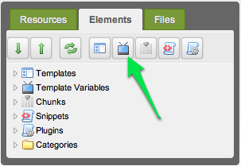
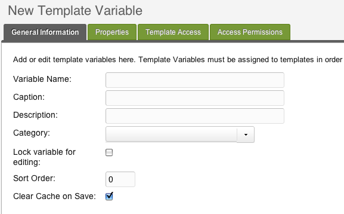
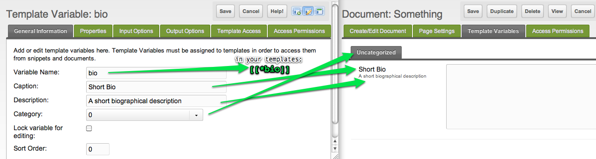
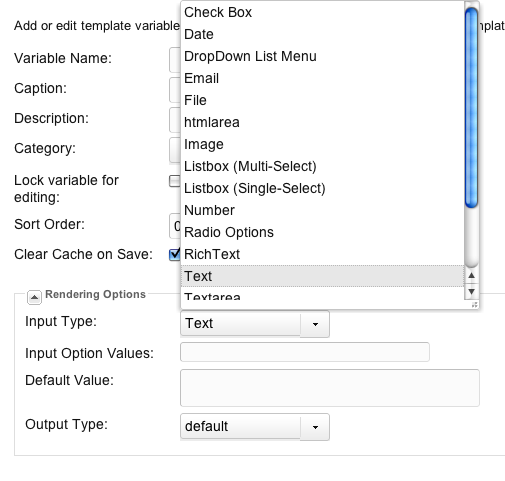
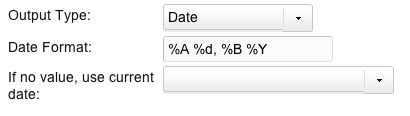

На этой странице описано, как создать переменную шаблона (TV) в MODX Revolution. TV это пользовательское поле. Подробнее о TV см. страницу [Переменные шаблона](building-sites/elements/template-variables "Template Variables").

## Объяснение

Фраза «создать переменную шаблона» может означать два разных действия:

- добавить текст или содержимое в одно из существующих пользовательских полей при редактировании страницы MODX (ресурса),
- или определить само поле, чтобы оно стало доступно ресурсам MODX.

Эта страница посвящена второму случаю. В первом вы создаёте _экземпляр_ TV. Во втором вы определяете _шаблон_ TV, который задаёт поведение каждого экземпляра.

**Класс поля**
Когда вы создаёте TV, вы определяете _класс_ пользовательского поля. Он служит чертежом для всех экземпляров этого поля.

## Создание переменной шаблона

### 1. Войдите в менеджер MODX

Вы должны войти в менеджер MODX как администратор (или с аналогичными правами).

### 2. Добавьте переменную шаблона

В левой панели дерева ресурсов откройте вкладку **Elements**.



### 3. Заполните общую информацию

При определении TV нужно задать много параметров поведения поля. Вкладка **General Information** содержит базовые настройки.



- **Variable Name**: плейсхолдер в шаблонах, например **bio** = `[[*bio]]`. _Имя должно быть **уникальным**_!
- **Caption**: основная подпись TV при редактировании ресурса
- **Description**: дополнительная подпись
- **Category**: вкладка, на которой TV появится в редакторе
- **Sort Order**: порядок среди нескольких TV (1 сверху, большие числа опускаются ниже)



На рисунке видно, как настройки соответствуют полям редактора страницы.

Имя должно быть уникальным!

### 4. Настройте параметры ввода

Откройте вкладку **Input Options**. Выберите тип поля: текст, выпадающий список, WYSIWYG и т.д. Полный список см. на странице [Типы ввода переменных шаблона](building-sites/elements/template-variables/input-types "Template Variable Input Types").

- **Input Type**: текстовое поле, выпадающий список, ссылка на другую страницу и другие варианты.
- **Input Options**: некоторые типы игнорируют это поле, другим оно нужно. Например, выпадающий список требует перечень значений. Подробнее см. [Типы ввода переменных шаблона](building-sites/elements/template-variables/input-types "Template Variable Input Types").
- **Default**: значение по умолчанию. Это может быть простое значение или одна из [привязок](building-sites/elements/template-variables/bindings "Bindings") MODX для выборки из БД или наследования от родительской страницы.



### 5. Настройте доступ к шаблонам

Откройте вкладку **Template Access**. Укажите, какие шаблоны будут использовать это поле.

Когда вы создаёте ресурс с шаблоном, к которому привязана TV, TV доступна для редактирования. **Привяжите TV хотя бы к одному шаблону.**

### 6. Сохраните определение TV

При редактировании страницы с шаблоном, связанным с этой TV, вы сможете заполнить поле TV.

### 7. Используйте TV: создайте ресурс

После определения TV и привязки к шаблону создайте ресурс MODX (например, ПКМ в дереве документов → **Create → Create Resource Here**). Выберите шаблон, использующий эту TV.

### 8. Измените значение

Когда ресурс использует шаблон с вашей TV, откройте вкладку **Template Variables** на странице редактирования и заполните поле.

## Расширенное использование

В РАЗРАБОТКЕ ...

В первом проходе мы пропустили несколько вкладок. TV поддерживает более сложные сценарии, которые не нужны для простых задач.

## Параметры вывода

Далее выберите параметры вывода. Выберите **Date**. Под полем (в зависимости от выбранного Output Render) появятся дополнительные поля:



Они позволяют настроить Output Render точнее.

## Свойства

Здесь можно задать свойства по умолчанию для TV. «Как использовать свойства TV?», спросите вы. Допустим, у нас textarea TV с именем `viewingSS`. В контенте:

``` php
Viewing: [[+subsection]]
```

Добавьте свойство списка `subsection` в таблицу, затем разрешите переопределение через наборы свойств. Создайте набор свойств `CarsSectionTVPS` (PS, Property Set). В нём установите `subsection` в «Cars». Подключите его к TV в ресурсе, шаблоне или там, где вы её используете:

``` php
[[*viewingSS@CarsSectionTVPS]]
```

TV выведет:

> Viewing: Cars

## Доступ к шаблонам и группам ресурсов

TV можно назначать [шаблонам](building-sites/elements/templates "Templates"). Тогда ресурсы с этими [шаблонами](building-sites/elements/templates "Templates") смогут редактировать TV.

TV также можно ограничить определёнными группами ресурсов в таблице **Access Permissions**.

## Смотрите также

1. [Создание переменной шаблона](building-sites/elements/template-variables/step-by-step)
2. [Привязки](building-sites/elements/template-variables/bindings)
   1. [CHUNK Binding](building-sites/elements/template-variables/bindings/chunk-binding)
   2. [DIRECTORY Binding](building-sites/elements/template-variables/bindings/directory-binding)
   3. [FILE Binding](building-sites/elements/template-variables/bindings/file-binding)
   4. [INHERIT Binding](building-sites/elements/template-variables/bindings/inherit-binding)
   5. [RESOURCE Binding](building-sites/elements/template-variables/bindings/resource-binding)
   6. [SELECT Binding](building-sites/elements/template-variables/bindings/select-binding)
3. [Типы ввода переменных шаблона](building-sites/elements/template-variables/input-types)
4. [Типы вывода переменных шаблона](building-sites/elements/template-variables/output-types)
   1. [Date TV Output Type](building-sites/elements/template-variables/output-types/date)
   2. [Delimiter TV Output Type](building-sites/elements/template-variables/output-types/delimiter)
   3. [HTML Tag TV Output Type](building-sites/elements/template-variables/output-types/html)
   4. [Image TV Output Type](building-sites/elements/template-variables/output-types/image)
   5. [URL TV Output Type](building-sites/elements/template-variables/output-types/url)
5. [Добавление пользовательского типа TV - MODX 2.2](extending-modx/custom-tvs)
6. [Multi-select для связанных страниц в шаблоне](building-sites/tutorials/multiselect-related-pages)
7. [Доступ к значениям TV через API](extending-modx/snippets/accessing-tvs)
