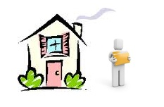

## Что такое шаблоны?

Шаблоны обычно содержат теги HTML-разметки, которые определяют макет и внешний вид вашего сайта. Когда запрашивается документ, MODX загружает документ и его шаблон, и MODX находит все специальные плейсхолдеры в шаблоне и заменяет их соответствующими значениями из документа перед отправкой готовой страницы в браузер пользователя.

Думайте о шаблоне как о доме. Ваши [Ресурсы](building-sites/resources "Ресурсы") содержание, то есть человек. Человек может иметь много разных домов, но одновременно жить только в одном доме.



[Ресурсы](building-sites/resources "Ресурсы") могут использовать только один Шаблон за раз, однако Ресурс может переключать Шаблоны в любое время, точно так же, как человек может перемещаться из дома в дом в любое время. Шаблон, как и дом, также меняет основной способ отображения страницы. Шаблон обычно содержит верхний и нижний колонтитулы страницы - и/или боковую панель, панель навигации и т.д.

## Использование

Чтобы создать шаблон, разверните часть дерева «Элементы» и щелкните правой кнопкой мыши «Шаблоны». Выберите «Создать новый шаблон», затем вставьте свой HTML-код в текстовое поле «Код шаблона». Вы можете скопировать и вставить текст ниже, чтобы начать работу с очень простым шаблоном:

``` html
<html>
<head>
    <title>[[*pagetitle]]</title>
    <meta name="description" content="[[*description]]"/>
</head>
<body>
<h1>[[*longtitle]]</h1>

Идентификатор страницы: [[*id]]<br/>
Вступительный текст (резюме): [[*introtext]]<br/>
Название меню: [[*menutitle]]

<hr/>

[[*content]]

</body>
</html>
```

Обратите внимание на важный тег `[[*content]]` - этот тег сообщает MODX, куда поместить содержимое ресурса.

MODX по умолчанию хранит шаблоны в своей базе данных, если вы используете версию до 2.2.x, это ваш единственный вариант. В MODX 2.2.x и новее у вас есть возможность сохранять шаблоны в виде статических файлов с использованием Media Sources.

Помните, что просто _создание_ шаблона не означает, что он автоматически используется: вы должны редактировать каждый [Ресурс](building-sites/resources "Ресурсы") и указать, какой шаблон он использует. Это отличается от некоторых систем управления контентом, где каждый шаблон имеет одну или несколько страниц. Каждая страница MODX имеет один шаблон, который используется для форматирования вывода.

После того, как вы создали один или несколько шаблонов, вы можете отредактировать любой ресурс и выбрать шаблон для него, выбрав один из раскрывающегося списка «Использование шаблона».

Шаблоны могут содержать любые теги, в том числе [Переменные шаблона TV](building-sites/elements/template-variables "Переменные шаблона TV"), [Чанки](building-sites/elements/chunks "Чанки"), [Сниппеты](extending-modx/snippets "Сниппеты"), и другие.

### Использование полей ресурса в шаблоне

Как вы заметили из нашего примера кода шаблона выше, на поля ресурса можно ссылаться с помощью синтаксиса `[[*fieldName]]`. Список доступных полей ресурсов можно найти [здесь](building-sites/resources). Например, если мы хотим показать заголовок текущего ресурса в нашем теге `<title>`, мы просто сделаем это:

``` html
<title>[[*pagetitle]]</title>
```

Вы также можете разместить содержимое текущего ресурса, используя тег «content»:

``` html
<body>
[[*content]]
</body>
```

Tэти теги похожи на обычные теги MODX в том смысле, что они могут иметь [выходные фильтры](building-sites/tag-syntax/output-filters) применяемые к ним. Например, допустим, что мы хотим отобразить поле «introtext» на правой панели навигации, но убрать из него любые HTML-теги и отобразить только первые 400 символов - и, если длиннее, добавить многоточие (...):

``` html
<div id="rightbar">
[[*introtext:stripTags:ellipsis=`400`]]
</div>
```

### Переменные шаблона в шаблонах

Если шаблоны похожи на дом, подумайте о [шаблонных переменных](building-sites/elements/template-variables "Переменные шаблона") (TV) как комнаты в этом доме. Вы можете иметь бесконечное количество TV в шаблоне: просто подумайте об этом, как о добавлении новых комнат в дом.

Переменные шаблона TV позволяют вам иметь настраиваемые поля для любого ресурса с указанным шаблоном. Скажем, вам нужно поле для фотографий в ваших ресурсах в шаблоне «BiographyPages». Просто - просто создайте TV, назовите его «bioPhoto», присвойте ему тип ввода и вывода «image» и назначьте его шаблону «BiographyPages». Затем вы увидите TV в любом ресурсе, который использует этот шаблон.

Затем вы можете ссылаться на ваш TV «bioPhoto» в вашем контенте с тем же синтаксисом тега, что и в поле ресурса:

``` html
<div class="photo">
[[*bioPhoto]]
</div>
```

Опять же, важно отметить, что [Переменные шаблона](building-sites/elements/template-variables "Переменные шаблона") должен быть явно назначен для шаблона, который будет использоваться. После назначения в шаблон значение телевизора для этого ресурса можно будет редактировать при редактировании ресурса. Если вы не видите недавно созданный TV в своих ресурсах, убедитесь, что вы назначили этот телевизор для шаблона.

## Смотрите также

- [Синтаксис тегов](building-sites/tag-syntax "Синтаксис тегов")
- [Переменные шаблона](building-sites/elements/template-variables "Переменные шаблона")
