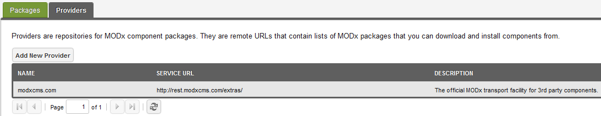
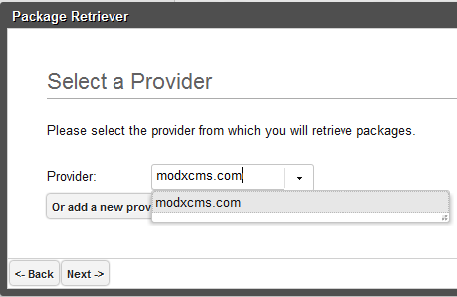

## Что такое транспортный провайдер?

Транспортные провайдеры в MODX являются удаленными источниками, с которых можно загружать транспортные пакеты. Просто указав URL-адрес службы, вы можете легко подключиться к транспортному провайдеру и легко получить из него последние транспортные пакеты.

MODX поддерживает неограниченное количество транспортных провайдеров, и каждый из них может быть из любого источника.

MODX рекомендует не загружать транспортные пакеты от поставщиков, которых вы не можете проверить или не доверяете. Мы рекомендуем официального провайдера modx.com по адресу: <http://rest.modx.com/extras/>

## Использование

Для настройки транспортного провайдера просто перейдите на страницу управления пакетами и оттуда нажмите на заголовок панели «Провайдеры» внизу. Это откроет сетку провайдеров, которыми вы можете легко управлять.

Оттуда вы можете нажать кнопку «Добавить нового поставщика», чтобы добавить другого, или щелкнуть правой кнопкой мыши любого поставщика, чтобы получить дополнительные параметры. Поставщики должны быть действительными файлами JSON, доступными через Интернет и в правильном формате. Обратите внимание, что раздел «Дополнительно» на modxcms.com является провайдером.

URL-адрес службы - это фактическое абсолютное местоположение файла поставщика.

Если у вас есть провайдер, вы можете подключиться к нему, зайдя в сетку пакетов, нажав «Добавить нового провайдера», а затем выберите опцию «Выбрать провайдера». Это вызовет раскрывающийся список опций провайдера:

После того, как вы выбрали своего провайдера, нажмите Дальше, и дерево загрузки будет заполнено содержимым этого провайдера (то есть данными). Это покажет вам дерево версий пакета, которые вы можете скачать:

## Связанные страницы

1. [Транспортные пакеты](extending-modx/transport-packages)
2. [Провайдеры](building-sites/extras/providers)
3. [Создание сборки скрипта стороннего компонента](extending-modx/transport-packages/build-script)
