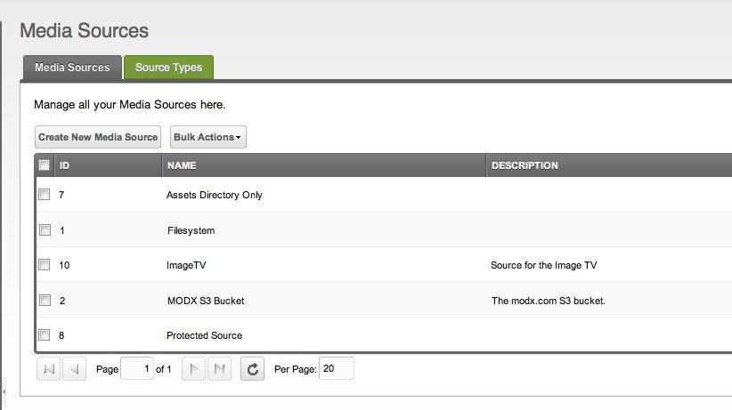

В этой статье описывается, как добавить [Медиа источник](building-sites/media-sources "Медиа источник") к вашей установке MODX.

## Создание медиа источника

Перейдите в Медиа > Источники файлов. Здесь вы увидете список доступных на данный момент медиа-источников:

Прежде чем мы продолжим, важно отметить разницу между "Медиа источником" и "Типом медиа источника".
Тип медиа источника - это классификация источника, такая как тип источник S3 или тип источника Filesystem. Эти типы указывают Источник на различные системы хранения.

А пока, создайте источник мультимедиа, нажав кнопку "Создать новый источник файлов". Должно появиться окно с базовой формой для источника:

Теперь выберите тип источника файловой системы и дайте ему имя. Для получения информации о создании S3 Медиа источник, [нажмите здесь](building-sites/media-sources/types/media-source-type-s3 "Тип медиа источника - S3"). Как только это будет сделано, вы увидите свой источник мультимедиа в списке. Щелкните правой кнопкой мыши и выберите "Редактировать источник файлов".

## Редактирование вашего нового медиа источника

На этом экране будет отображаться основная информация о новом источнике мультимедиа, списком со специфическими для типа свойствами для источника, который вы можете изменить, и вкладка «Права доступа», которая позволит вам ограничить доступ к источнику.

А пока давайте установим свойство `basePath` на `assets/`, а затем свойство `baseUrl` на `assets/`. Сохраните источник.

**Только щелчок правой кнопкой мыши**
Все свойства доступны только после того, как вы создали Медиа источника и затем щелкните его правой кнопкой мыши, чтобы отредактировать.

Другие доступные свойства включают следующее:

-   `basePath`
-   `basePathRelative` (yes|no)
-   `baseUrl`
-   `baseUrlRelative` (yes|no)
-   `allowedFileTypes`
-   `imageExtensions`
-   `thumbnailType`
-   `thumbnailQuality`
-   `skipFiles`

## Использование вашего источника

После того, как вы его создали, вы сможете увидеть источник в раскрывающемся списке в левом дереве на вкладке "Файлы". Если вы выберете этот источник, теперь вы сможете видеть только содержимое каталога `assets/` в вашей установке MODX! (Если вы еще не создали каталог `assets/` в вашей установке, сделайте это сейчас.)

Кроме того, вы можете подключить этот источник к TV. Прочитайте [Назначение медиа-источников для TV](building-sites/media-sources/assigning-to-tvs "Назначение медиа-источников для TV") статью, чтобы узнать, как.
