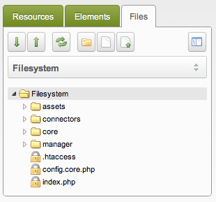

## Введение

Из этого туториала Вы узнаете, как создать второй источник мультимедиа, который можно использовать для клиентов, которые будут скрывать файлы сайта MODX. Это руководство должно быть выполнено на сайтах до того, как ваши клиенты загрузят какие-либо файлы. Если вы делаете это на существующем сайте, ознакомьтесь с разделом Устранение неполадок в конце этой статьи.

По умолчанию ваш файловый менеджер должен выглядеть примерно так:

Это круто и все, но мы, вероятно, можем сделать его более комфортным, запретив пользователям просматривать файлы, которые они никогда не будут использовать. Давайте сделаем так:

## Руководство

### Шаг 1: Создайте структуру каталогов

Отлично. Давайте создадим папку в `/assets/` под названием `files`. Внутри этой папки, еще две, одну назовем «pdf», а другую «images». Все файлы, которые загружают наши клиенты, попадут в эти папки. Давайте укажем `CHMOD` (права на папку), которые мы создали `777`. Ваш источник мультимедиа в файловой системе должен выглядеть следующим образом:

### Шаг 2. Скрыть источник мультимедиа в файловой системе

Теперь пришло время спрятать все над папкой `/assets/files/`.

1. Перейдите в Медиа > Источники файлов.
2. Щелкните правой кнопкой мыши на источнике мультимедиа в файловой системе и выберите "Редактировать источник файлов".
3. Перейдите на вкладку "Права доступа".
4. Нажмите "Добавить группу пользователей"
5. Выберите "Administrator" в качестве группы пользователей, "Member" в качестве минимальной роли и "Media Source Admin" в качестве политики. Это будет означать, что все пользователи в группе пользователей "Administrator" смогут добавлять/удалять источники мультимедиа. Вам нужно убедиться, что ваши клиенты находятся в другой группе пользователей. Если они входят в группу пользователей с правами администратора, вы можете установить минимальную роль для этого источника мультимедиа "Super User", чтобы только пользователи с ролью "Super User" могли получить доступ к источнику мультимедиа.
6. Нажмите "Готово", а затем "Сохранить".

В этот момент, если клиент входит в систему, он не сможет использовать файловую систему вообще. Давайте это исправим.

### Шаг 3: Добавьте клиентские файлы Media Source

Теперь мы собираемся создать новый медиа-источник, который будут использовать наши клиенты.

1. Перейдите в Медиа > Источники файлов
2. Нажмите "Создать новый источник файлов"
3. Прокрутите вниз и укажите `/assets/files/` в качестве значений `basePath` и `baseURL`. Первый указывает MODX, где на сервере искать, а второй сообщает MODX, где в сети искать (т.е. относительно вашего доменного имени). Давайте пока укажем для `basePathRelative` и `baseUrlRelative` равными `true`. Для более сложных настроек (таких когда сайт, который использует разные домены для разных контекстов) вам может потребоваться установить абсолютные пути. Не волнуйтесь об этом сейчас.
4. Нажмите "Сохранить"

На этом этапе клиенты могут войти в систему, но это немного сбивает с толку, как они используют файловую систему. Когда они переходят на вкладку «files», источником медиа по умолчанию является тот, к которому у них нет доступа. Они по-прежнему могут менять медиа-источник на свой, но это довольно запутанный опыт для пользователя. Давайте это исправим.

### Шаг 4. Установите источник мультимедиа по умолчанию

Легко установить медиа источник по умолчанию.

1. Система > Системные настройки
2. Нажмите "Фильтровать по области" и выберите "Система управления"
3. Найдите параметр "Источник мультимедиа по умолчанию". Измените это с "Filesystem" на "Файлы клиента"
4. Подождите, пока MODX сохранит эту настройку

На этом этапе, когда клиенты входят в систему, они увидят "Файлы клиентов" в качестве источника мультимедиа по умолчанию и смогут использовать его как обычно. Любые новые переменные-шаблоны типа "Изображение" или "Файл" также будут ссылаться на это местоположение.

Были сделаны!

## Устранение неполадок: Существующие установки

Если вы используете это руководство на сайте, на котором уже установлены TV и загружены изображения, вам необходимо будет обновить их пути после выполнения шагов 1-4:

1. Переместите все файлы с сервера на новое место. Их местоположение должно быть таким же путем относительно местоположения источника медиа
2. Обновите все переменные шаблона для ссылки на новый источник медиа

Так и должно быть!

## Расширенное использование

### Различные контексты

Легко настроить отдельный источник медиа для каждого контекста. Для каждого контекста создайте новый параметр с именем `default_media_source` и введите идентификатор источника мультимедиа.

Любые новые TV в этом контексте теперь будут использовать этот источник информации.

В сочетании с [этим уроком](building-sites/contexts/virtual-host "Создание поддомена из папки с использованием виртуальных хостов"), теперь у нас есть разные сайты с одной и той же установкой MODX, каждый со своей уникальной файловой системой.
