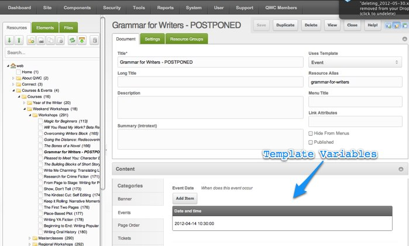
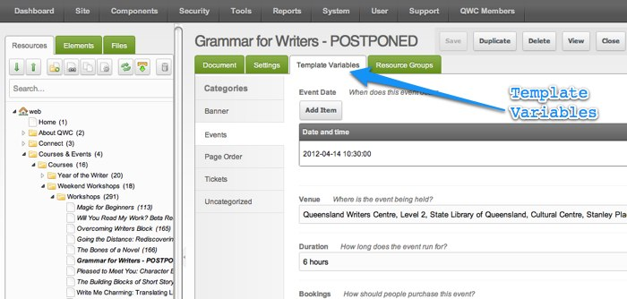

## tvs_below_content

-   **Имя**: Разместить TV ниже контента
-   **Тип**: Да/Нет
-   **По умолчанию**: Нет

Это определяет, будут ли переменные шаблона отображаться на собственной вкладке или под содержимым ресурса.

### Yes

Все TV отображаются под контентом Resource, как и для MODX Evolution.

### Нет

TV появляются на собственной вкладке.

