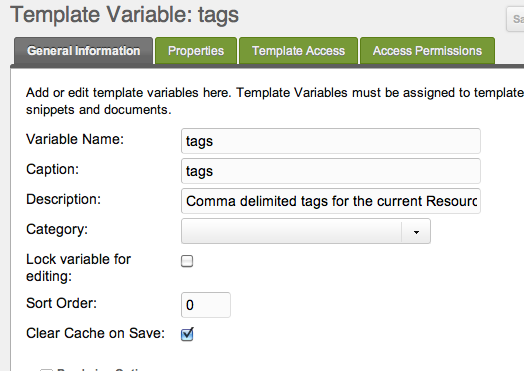
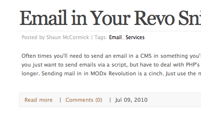
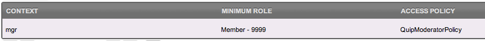
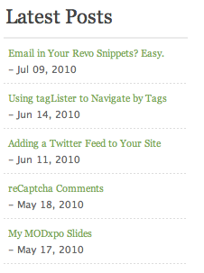
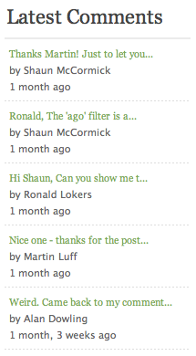
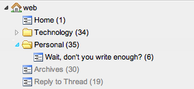

## Требования

1. Для некоторых дополнений нужны ЧПУ, а расширение `.html` можно заменить на `/`: Content -> Content Types -> HTML (.html) -> /

## Создание блога в MODX Revolution

Это руководство поможет настроить гибкое и мощное решение для блога в MODX Revolution. MODX Revolution не готовое блог-приложение, а полноценная платформа для контентных приложений, поэтому типовой блог «из коробки» не поставляется. Блог нужно собрать под свои задачи.

Инструменты для этого уже есть. Руководство проведёт через настройку. Перед началом полезно разобраться с [синтаксисом тегов](/building-sites/tag-syntax "Tag Syntax") Revolution.

Руководство объёмное: здесь блог с публикациями, архивами, тегами, комментариями и другими возможностями. Ненужные части можно пропустить. MODX модульный, блог может быть любого масштаба. Это лишь один из способов. Вариантов настройки блога в MODX Revolution много.

Изначально руководство опиралось на блог на [splittingred.com](http://splittingred.com/), но после редизайна сайта примеры больше не совпадают с его текущим видом.

## Установка нужных дополнений

Сначала скачайте и установите дополнения, которые понадобятся для блога. Ниже самые частые:

### Необходимые дополнения

-   [getResources](/extras/getresources "getResources"): для вывода записей, страниц и других ресурсов.
-   [getPage](/extras/getpage "getPage"): для постраничной навигации в списках.
-   [Quip](/extras/quip "Quip"): для комментариев.
-   [tagger](/extras/tagger "tagger"): для управления тегами и навигации по ним.
-   [Archivist](/extras/archivist "Archivist"): для раздела архивов.

### Дополнительные дополнения

-   [Breadcrumbs](/extras/breadcrumbs "Breadcrumbs"): для хлебных крошек.
-   [Gallery](/extras/gallery "Gallery"): для фотогалерей.
-   [SimpleSearch](/extras/simplesearch "SimpleSearch"): для простого поиска на сайте.
-   [getFeed](/extras/getfeed "getFeed"): если нужны внешние ленты, например Twitter.
-   [Login](/extras/login "Login"): если комментировать могут только авторизованные пользователи.

## Создание шаблона записи блога

Сначала создайте шаблон только для записей блога. Если нужны комментарии, особое оформление или структура страницы, настраивать это для каждой записи неудобно. Проще завести отдельный шаблон. Далее предполагается, что для обычных страниц уже есть базовый шаблон. Назовём его «BaseTemplate».

Создадим шаблон «BlogPostTemplate». Его содержимое может выглядеть так:

```php
[[$pageHeader]]
<main id="post-[[*id]]">
  <a href="#content" class="visually-hidden">skip to main content</a>
  <h2>
	<a href="[[~[[*id]]]]">[[*pagetitle]]</a>
  </h2>
  <p class="post-info">
    Posted on <time datetime="[[*publishedon:strtotime:date=`%Y-%m-%d`]]">[[*publishedon:strtotime:date=`%b %d, %Y`]]</time> | 
    <a href="[[~[[*id]]]]#comments">
      Comments ([[!QuipCount? &thread=`blog-post-[[*id]]`]])
	</a>
  </p>
  <article id="content">
	<p>[[*introtext]]</p>
    <hr />
    [[*content]]
  </article>
  <aside id="tags">
    [[*tags:notempty=`
	  <span class="tags">
	    Tags: [[!tolinks? &items=`[[*tags]]` &tagKey=`tag` &target=`1`]]
	  </span>
    `]]
  </aside>
  <hr />
  <section id="comments">
    [[!Quip?
      &thread=`blog-post-[[*id]]`
      &replyResourceId=`123`
      &closeAfter=`30`
    ]]
    <hr />
    [[!QuipReply?
      &thread=`blog-post-[[*id]]`
      &notifyEmails=`my@email.com`
      &moderate=`1`
      &moderatorGroup=`Moderators`
      &closeAfter=`30`
    ]]
  </section>
</main>
[[$pageFooter]]
```

Разберём шаблон по частям. Любой блок можно переставить, изменить параметры или расположение. Это базовая структура: если теги нужны внизу, перенесите их туда. MODX это не запрещает.

### Шапка и подвал

В шаблоне два чанка: «pageHeader» и «pageFooter». В них общая HTML-разметка шапки и подвала для разных шаблонов. Изменения в одном чанке применяются везде, а не в каждом шаблоне отдельно. Далее идёт pagetitle ресурса со ссылкой на ту же страницу.

### Информация о записи

Блок «info» записи: дата публикации и ссылка на комментарии. Подробнее:

```php
<p class="post-info">
  Posted on <time datetime="[[*publishedon:strtotime:date=`%Y-%m-%d`]]">[[*publishedon:strtotime:date=`%b %d, %Y`]]</time>
  <a href="[[~[[*id]]]]#comments">
    Comments ([[!QuipCount? &thread=`blog-post-[[*id]]`]])
  </a>
</p>
```

Первая часть берёт поле `publishedon` и [форматирует](/building-sites/tag-syntax/date-formats) дату. Тег `<time>` даёт поисковикам и скринридерам больше контекста, см. [MDN](https://developer.mozilla.org/en-US/docs/Web/HTML/Element/time). Для этого добавлен атрибут `datatime` в машиночитаемом формате.

Затем выводится число комментариев со ссылкой-якорем на блок комментариев. Свойство `&thread` в вызове QuipCount (и позже в Quip) использует `blog-post-[[*id]]`. MODX автоматически создаст отдельную ветку для каждой новой записи.

### Содержимое записи

В секции контента сначала идёт `[[*introtext]]`. Это поле ресурса MODX, краткий отрывок записи для главной при выводе последних постов.

### Комментарии к записям

В BlogPostTemplate для комментариев используется [Quip](/extras/quip "Quip"). Можно подключить другую систему, например Disqus. В этом руководстве используем Quip. Код:

```php
<section class="post-comments" id="comments">
  [[!Quip?
    &thread=`blog-post-[[*id]]`
    &replyResourceId=`123`
    &closeAfter=`30`
  ]]
  <hr />
  [[!QuipReply?
    &thread=`blog-post-[[*id]]`
    &notifyEmails=`my@email.com`
    &moderate=`1`
    &moderatorGroup=`Moderators`
    &closeAfter=`30`
  ]]
</section>
```

Здесь два вызова сниппетов: [Quip](/extras/quip/quip "Quip") выводит комментарии ветки, [QuipReply](/extras/quip/quip.quipreply "Quip.QuipReply"): форму ответа.

В вызове Quip задан ID ветки и несколько настроек. Комментарии будут вложенными (по умолчанию), поэтому нужно указать ID ресурса для ответа в ветке (подробнее в [документации Quip](/extras/quip "Quip")) через свойство `&replyResourceId`. Если `&replyResourceId` указывает на страницу 123, на странице 123 разместите, например:

```php
[[!QuipReply]]
<br />
[[!Quip]]
```

В обоих вызовах, Quip и QuipReply, задайте свойство `&closeAfter`. Quip автоматически закроет комментирование через 30 дней после создания ветки (когда она загружается).

В QuipReply включена модерация всех сообщений, модераторы в группе пользователей Moderators (настройку группы разберём ниже).

У Quip много других настроек, их можно изучить в [документации Quip](/extras/quip "Quip").

**Что такое вложенные комментарии?**
При включённых _threaded_ комментариях пользователи отвечают на другие комментарии. Без вложенности можно комментировать только саму запись блога.

## Настройка тегов

Шаблон готов. Создайте TV «tags» для тегирования.

Создайте TV с именем «tags» и описанием «Comma delimited tags for the current Resource.» Убедитесь, что TV доступна шаблону «BlogPostTemplate», который создали ранее.



Готово. Теги добавляются при редактировании ресурса списком через запятую.

Добавим теги в секцию «Post Info» шаблона BlogPostTemplate:

```php
<p class="post-info">
  Posted on <time datetime="[[*publishedon:strtotime:date=`%Y-%m-%d`]]">[[*publishedon:strtotime:date=`%b %d, %Y`]]</time>
+  [[*tags:notempty=`
+     | Tags: [[!tolinks? &items=`[[*tags]]` &tagKey=`tag` &target=`1`]] |
+  `]]
  <a href="[[~[[*id]]]]#comments">
    Comments ([[!QuipCount? &thread=`blog-post-[[*id]]`]])
  </a>
</p>
```

_Обратите внимание на `:notempty` у TV «tags». Подробнее [здесь](https://docs.modx.com/current/en/building-sites/tag-syntax/output-filters)._

[tagLister](/extras/taglister "tagLister") поставляется со сниппетом [tolinks](/extras/taglister/taglister.tolinks "tagLister.tolinks"), который превращает теги через запятую в ссылки. Мы указали целевой ресурс с ID 1, домашнюю страницу. Если блог на другой странице, измените ID.


## Создание разделов

Если в блоге нужны «разделы» (категории), сначала создайте соответствующие ресурсы.

В этом руководстве создадим два раздела: «Personal» и «Technology». Создайте два ресурса в корне сайта и отметьте их как контейнеры. Псевдонимы «personal» и «technology», тогда URL записей будет вида `website.com/personal/...`.

Далее для справки будем считать, что ID этих ресурсов 34 и 35.

Не используйте для них BlogPostTemplate, только BaseTemplate. Эти страницы показывают все записи выбранного раздела. В содержимое ресурсов добавьте:

```php
[[!getResourcesTag?
  &element=`getResources`
  &elementClass=`modSnippet`
  &tpl=`blogPost`
  &hideContainers=`1`
  &pageVarKey=`page`
  &parents=`[[*id]]`
  &includeTVs=`1`
  &includeContent=`1`
]]

[[!+page.nav:notempty=`
<nav class="paging" role="Blog Posts">
  <ul class="pageList">
    [[!+page.nav]]
  </ul>
</nav>
`]]
```

[getResourcesTag](/extras/taglister/taglister.getresourcestag) это обёртка над [getResources](/extras/getresources "getResources") и [getPage](/extras/getpage "getPage"), которая фильтрует результаты по TV «tags». Свойство `&parents` с `[[*id]]` выбирает все опубликованные ресурсы в этом разделе. При параметре `?tag=TagName` в URL можно фильтровать по тегу: `<a href="[[~34]]?tag=TagName">`.

Ниже вызова getResourcesTag идут ссылки пагинации: по умолчанию getResourcesTag показывает 10 записей на страницу.

_Атрибут `role="Blog Posts"` у элемента `nav` подсказывает скринридерам, что ссылки внутри ведут к записям блога. Подробнее на [MDN](https://developer.mozilla.org/en-US/docs/Web/Accessibility/ARIA/Roles/Navigation_Role#Best_practices)._

### Настройка чанка blogPost

В вызове есть свойство `&tpl` со значением «blogPost», чанк для каждой записи в списке. Его содержимое:

```php
<article>
  <h2>
    <a href="[[~[[+id]]]]">[[+pagetitle]]</a>
  </h2>
  <p>
    Posted by [[+createdby:userinfo=`fullname`]]
    [[+tv.tags:notempty=`
      | <span class="tags">Tags: [[!tolinks? &items=`[[+tv.tags]]` &tagKey=`tags` &target=`1`]]
      </span>
    `]]
  </p>
  <div>
    <p>[[+introtext]]</p>
  </div>
  <footer class="meta">
    <span>
      <a href="[[~[[+id]]]]">Read more</a> |
      <a href="[[~[[+id]]]]#comments">
        Comments ([[!QuipCount? &thread=`blog-post-[[+id]]`]])
      </a> |
      <time datetime="[[+publishedon:strtotime:date=`%Y-%m-%d`]]">
        [[+publishedon:strtotime:date=`%b %d, %Y`]]
      </time>
    </span>
  </footer>
</article>
```

Сначала ссылка на запись с pagetitle. Затем автор и теги (как в BlogPostTemplate).

Далее отрывок из поля `introtext`.

В конце ссылка «Read more», счётчик комментариев и дата публикации.



## Главная страница блога

На главной блога (ресурс с ID 1, старт сайта) разместите:

```php
[[!getResourcesTag?
  &elementClass=`modSnippet`
  &element=`getResources`
  &tpl=`blogPost`
  &parents=`34,35`
  &limit=`5`
  &includeContent=`1`
  &includeTVs=`1`
  &showHidden=`0`
  &hideContainers=`1`
  &cache=`0`
  &pageVarKey=`page`
]]
[[!+page.nav:notempty=`
<nav class="paging" role="Blog">
  <ul class="pageList">
    [[!+page.nav]]
  </ul>
</nav>
`]]
```

Так выводятся записи из разделов 34 и 35. Фильтрация по тегам тоже работает: все вызовы tolinks и tagLister по умолчанию ведут на ресурс с ID 1. Вызов getResourcesTag на этой странице даёт автоматическую фильтрацию по тегам.

Главную можно вынести на другую страницу, не site_start и не ID 1. Тогда измените свойства `target` в вызовах tagLister и tolinks.

## Добавление записей

Структура готова, можно публиковать записи.

### Структура страниц внутри разделов

Как организовать записи внутри раздела, на ваше усмотрение. Можно добавить контейнеры по годам и месяцам или класть записи прямо в раздел.

Если используете контейнеры по дате, отметьте «Hide from Menus», чтобы они не попадали в выборку getResources.

Структура под разделами не определяет навигацию, её строит [Archivist](/extras/archivist "Archivist"). Зато от неё зависит URL записей.

### Новая запись блога

Создайте ресурс с шаблоном «BlogPostTemplate» и напишите текст. В `introtext` краткий отрывок, в `content` полный текст.

В конце укажите теги в TV «tags».

## Настройка архивов

Первая запись готова, разделы работают. Осталось настроить просмотр старых записей, здесь помогает «Archivist».

### Ресурс архивов

Создайте в корне ресурс «Archives» с псевдонимом «archives». В содержимое добавьте:

```php
[[!getPage?
  &element=`getArchives`
  &elementClass=`modSnippet`
  &tpl=`blogPost`
  &hideContainers=`1`
  &pageVarKey=`page`
  &parents=`34,35`
  &includeTVs=`1`
  &toPlaceholder=`archives`
  &limit=`10`
  &cache=`0`
]]
<h3>[[+arc_month_name]] [[+arc_year]] Archives</h3>
[[+archives]]
[[!+page.nav:notempty=`
<nav class="paging" role="Archives">
  <ul class="pageList">
    [[!+page.nav]]
  </ul>
</nav>
`]]
```

Похоже на getResourcesTag со страницы раздела. Здесь getPage оборачивает сниппет [getArchives](/extras/archivist "Archivist") и выбирает записи из ресурсов 34 и 35. Результат попадает в плейсхолдер «archives», на который ссылаемся ниже.

Ниже плейсхолдеры текущего месяца и года просмотра и пагинация. Для справки: ID этого ресурса 30.

### Виджет Archivist

Ресурс архивов есть, но нужен список месяцев с записями. Добавьте в подвал, например:

```php
<h3>Archives</h3>
<ul>
  [[!Archivist? &target=`30` &parents=`34,35`]]
</ul>
```

Сниппет [Archivist](/extras/archivist/archivist "Archivist") строит помесячный список записей (другие опции в [документации](/extras/archivist/archivist "Archivist")). `&target` равен 30, ресурс архивов. `&parents` равен 34 и 35, ресурсы разделов.

Archivist сам сгенерирует URL архивов: `archives/2010/05/` покажет записи за май 2010, `archives/2009/` за 2009 год.

## Дополнительные возможности

### Группа модераторов

В вызове QuipReply указана группа модераторов «Moderators». Создайте её.

Перейдите в Security -> Access Controls и создайте группу «Moderators». Добавьте нужных пользователей (включая себя) и назначьте роль.

На вкладке Context Access добавьте ACL: группа получает доступ в контексте «mgr» с минимальной ролью Member (9999) и политикой «QuipModeratorPolicy».

Участники группы «Moderators» модерируют комментарии в ветках и получают email о новых сообщениях. Модерация через менеджер или по ссылкам в письмах. ACL должен выглядеть примерно так:



Сохраните группу. Возможно, понадобится сброс сессий (Security -> Flush Sessions) и повторный вход, чтобы подтянулись права. Остальное делает Quip.

### Виджет «Последние записи»

Список последних записей добавляется просто. Разместите вызов там, где нужен блок:

```php
<ol>
  [[!getResources?
	&parents=`34,35`
	&hideContainers=`1`
	&tpl=`latestPostsTpl`
	&limit=`5`
	&sortby=`publishedon`
  ]]
</ol>
```

[getResources](/extras/getresources "getResources") выведет топ-5 ресурсов из разделов 34 и 35, отсортированных по `publishedon`.

Создайте чанк `latestPostsTpl`, указанный в свойстве `tpl`:

```php
<li>
  <a href="[[~[[+id]]]]">[[+pagetitle]]</a>
  [[+publishedon:notempty=`<br /> - [[+publishedon:strtotime:date=`%b %d, %Y`]]`]]
</li>
```

_Здесь `<ol>`, потому что список отсортирован по дате. Для пяти случайных статей лучше `<ul>`._

Последние записи на сайте:



### Виджет «Последние комментарии»

Quip поставляется со сниппетом [QuipLatestComments](/extras/quip/quip.quiplatestcomments "Quip.QuipLatestComments") для вывода свежих комментариев.

Разместите вызов там, где нужен список:

```php
<ol>
	[[!QuipLatestComments? &tpl=`latestCommentTpl`]]
</ol>
```

Создайте чанк «latestCommentTpl»:

```php
<li class="[[+cls]] [[+alt]]">
  <a href="[[+url]]">[[+body:ellipsis=`[[+bodyLimit]]`]]</a>
  <br /><span class="author">by [[+name]]</span>
  <br /><span class="ago">[[+createdon:ago]]</span>
</li>
```

QuipLatestComments обрезает текст комментария и добавляет многоточие после `&bodyLimit` (по умолчанию 30 символов). Модификатор «ago» это встроенный [фильтр вывода](/building-sites/tag-syntax/output-filters#string-output-modifiers) MODX Revolution: превращает метку времени в формат вроде «two hours, 34 minutes» (или min/sec, year/mo, mo/week).

По умолчанию выводятся 5 последних комментариев. Результат:



Другие параметры в [документации сниппета](/extras/quip/quip.quiplatestcomments "Quip.QuipLatestComments").

### Виджет «Популярные теги»

[tagLister](/extras/taglister "tagLister") делает это за вас. Разместите вызов где удобно:

```php
[[!tagLister? &tv=`tags` &target=`1`]]
```

tagLister проверит TV «tags» и создаст ссылки на целевой ресурс (здесь ID 1) для топ-10 тегов. Больше опций в [документации](/extras/taglister#properties "tagLister").

## Заключение

Блог настроен. Дерево ресурсов должно выглядеть примерно так:



Настроек и доработок может быть гораздо больше. Руководство это отправная точка. MODX позволяет легко менять, дополнять и масштабировать любое решение, в том числе блог.

## Смотрите также

- [Create a Blog in MODX Revolution](https://sepiariver.com/modx/creating-a-blog-in-modx/)
