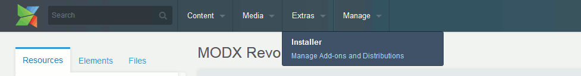
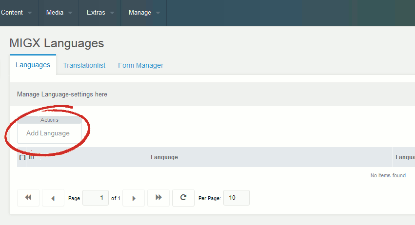
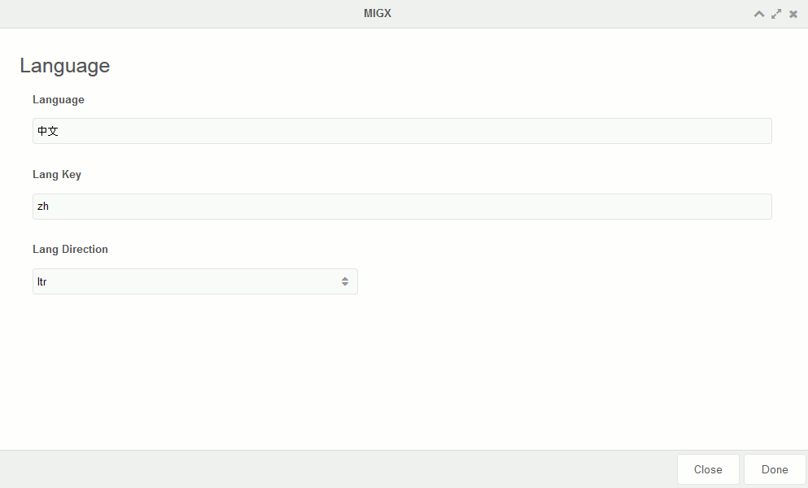
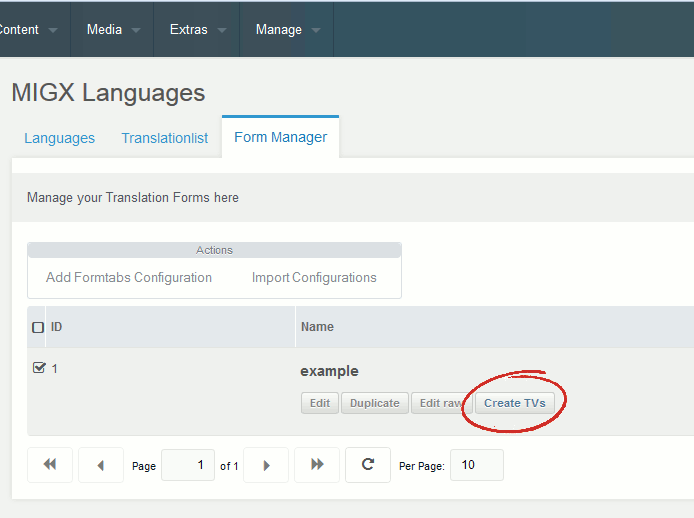
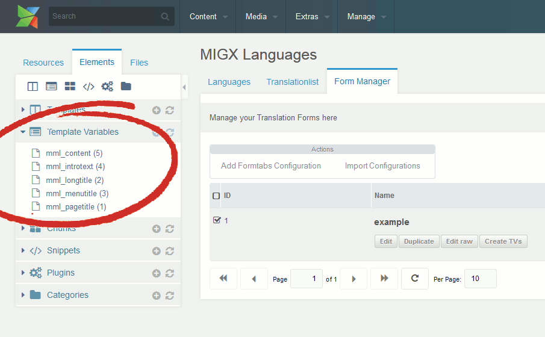
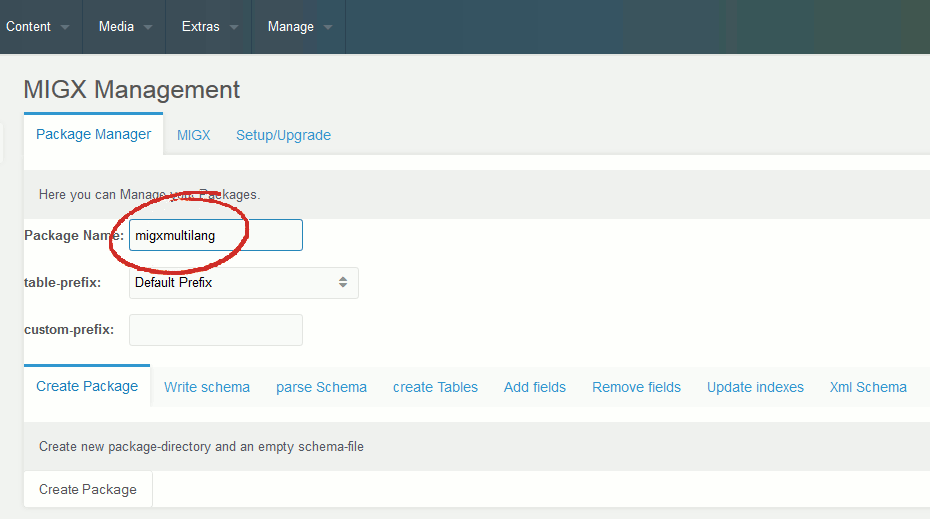
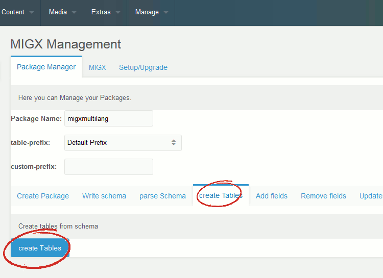

## Введение

migxMultiLang это компонент, который позволяет довольно легко создать многоязычный веб-сайт без необходимости дополнительного контекста или настройки файла .htaccess.

Он был написан Бруно Пернером, и его документацию можно найти на <https://github.com/Bruno17/migxmultilang>. Это руководство является попыткой детализировать начальную базовую настройку migxMultiLang со скриншотами процесса.

Спасибо Бруно Пернеру и Сьюзен Оттвелл за то, что они помогли мне с этим разобраться!

## Требования

migxMultiLang построен на дополнениях MIGX и pdoTools и требует, чтобы оба были установлены для работы. На скриншотах в этом уроке показывается MODX Revolution 2.3.2, однако они также будут работать с предыдущими версиями. В этом руководстве также предполагается, что у вас установлена новая рабочая версия MODX.

**Также имейте в виду, что Дружественные URL-адреса должны быть включены, чтобы это работало!**

## Шаг 1: Установите дополнения

Нажмите «Установщик» в меню «Пакеты.



Нажмите на кнопку «Загрузить пакеты».


Найдите и загрузите следующие дополнения:

- migx
- pdotools
- migxmultilang

Установите их все, оставив migxMultiLang напоследок.

При установке migxMultiLang вас спросят, хотите ли вы разместить его в верхней панели навигации или в раскрывающемся меню «Пакеты». Смотрите скриншот ниже. Это полностью зависит от ваших личных предпочтений и может быть легко изменено позже в панели управления MODX «Меню», если вы передумали.


Если вы решили установить migxMultiLang в меню Extras, вы должны увидеть его, когда откроете меню сейчас.


### Шаг 2: Добавьте свои языки

Выберите migxMultiLang в меню «Пакеты» (или в верхней панели навигации, если вы решили разместить ее там).
Вы увидите страницу с тремя вкладками вверху. Первая вкладка «Языки», и это то, где мы хотим быть.
Нажмите на кнопку «Добавить язык». Мы будем делать это дважды, потому что в этом уроке мы будем использовать только два языка, однако теоретически вы можете использовать столько, сколько захотите.



При нажатии на кнопку «Добавить язык» откроется окно MIGx с тремя полями: «Язык», «Языковой ключ» и «Направление языка».
Первое название вашего языка. Мы будем добавлять «английский» в качестве нашего первого языка, поэтому мы вводим его в первое поле.
Второе поле содержит языковой ключ, который migxMultiLang будет использовать для переключения языков. Мы введем «en» в качестве ключа.
Английский идет слева направо, поэтому третье поле можно оставить как «ltr».


Нажмите кнопку «Готово» внизу, чтобы сохранить и закрыть окно.
Теперь мы повторим процесс добавления второго языка.
Снова, нажмите кнопку «Добавить язык», которая откроет то же самое окно.
На этот раз мы добавим китайский. (Или какой язык вам нравится)
В поле Язык введите 中文. (Скопируйте и вставьте китайские иероглифы отсюда или просто напишите «Китайский»)
В поле Lang Key введите «zh».
Оставьте поле Lang Direction "ltr".



Снова нажмите кнопку «Готово», чтобы сохранить и закрыть окно.
На вкладке Языки вы увидите ваши новые добавленные языки.

### Шаг 3: Создание переменных шаблона

Теперь мы закончили с вкладкой Языки.
Нажмите на вкладку «Диспетчер форм» в верхней части, а затем нажмите кнопку «Импортировать конфигурации».


Вы увидите пример конфигурации в сетке. Вы можете скопировать его и создать свой собственный, однако для этого урока мы просто воспользуемся примером.
Нажмите на кнопку «Редактировать», чтобы внести изменения в конфигурацию.


При нажатии на кнопку «Редактировать» откроется окно с двумя вкладками: «Форма» и «Настройки».
Перейдите на вкладку «Настройки» и установите флажок «Использовать в качестве вкладок по умолчанию для всех других шаблонов».


Нажмите Done, и окно должно сохраниться и закрыться.
Теперь, когда мы изменили конфигурацию, нам нужно создать телевизоры.
Нажмите кнопку «Создать Переменные шаблона», которая находится рядом с кнопкой «Изменить», которую мы нажимали ранее.



Если вы теперь загляните в раздел «Переменные шаблона» дерева элементов, вы увидите только что созданные телевизоры.

- `mml_content`
- `mml_introtext`
- `mml_longtitle`
- `mml_menutitle`
- `mml_pagetitle`

Это версии migxMultiLang типичных полей ресурса.



Теперь нам нужно создать основную переменную шаблона перевода.
Сначала создайте новую категорию, щелкнув значок «Новая категория» в верхней части дерева элементов.
Откроется окно новой категории. Назовите его «Переводы» и нажмите кнопку «Сохранить».


Теперь нажмите на иконку «Новый телевизор» в верхней части дерева элементов, и появится новая страница.
Введите следующую информацию в отображаемые поля.

Имя - переводы
Подпись - Переводы
Описание - Введите переводы для этого ресурса здесь:
Категория - Переводы


После ввода этой информации нажмите на вкладку «Параметры ввода» вверху.
Тип ввода должен быть:

`migxdb`

Конфигурации должны быть:

``` php
mml_translations:migxmultilang,mml_translate:migxmultilang
```


Хорошо, мы почти закончили с этим. Теперь нажмите на вкладку «Доступ к шаблонам» вверху.
Установите флажок в столбце «Доступ» для базового шаблона.
Теперь нажмите кнопку Сохранить вверху справа.


Теперь перейдите в дерево ресурсов и выберите ресурс с помощью BaseTemplate. В нашем случае у нас есть только домашний ресурс.
Выберите вкладку Дополнительные поля на ресурсе, и вы увидите только что созданный ТВ.


Хотя переводы пока не работают, нам еще нужно кое-что сделать.

## Шаг 4: Системные настройки

Зайдите в системные настройки MODX. Для тех, кто не знает, вы можете найти его в правом верхнем углу экрана в выпадающем меню со значком Cog.
Выберите pdotools из поля со списком, и вы увидите две настройки.
Существует настройка с именем: FQN of pdoFetch. Измените значение этого параметра на `pdotools.mmlfetch`


Excellent! This step is complete.

Note for newer versions of pdoTools:
you will need this system-settings:

pdoFetch.class: migxmultilang.mmlfetch
`pdofetch_class_path`: `{core_path}components/migxmultilang/model/`

## Шаг 5: Создание таблиц базы данных

Выберите MIGX в меню «Пакеты» вверху.
Появится Диспетчер пакетов.

В поле «Имя пакета» введите: `migxmultilang`



Теперь выберите вкладку «создать таблицы» под этим.
На этой вкладке будет только одна кнопка с именем «Создать таблицы». Нажмите на это.
Он должен сказать вам, что таблицы были созданы успешно.



## Шаг 6: Создание шаблонов для внешнего интерфейса

migxMultiLang меняет способ использования шаблонов, если мы хотим, чтобы для определенного ресурса было доступно более одного языка.

Мы собираемся переместить содержимое BaseTemplate в блок, который мы будем называть MainTpl для простоты.

В дереве элементов откройте BaseTemplate и скопируйте содержимое.

Создайте новый блок MainTpl и вставьте скопированное содержимое в.

Сохраните блок MainTpl, а затем снова откройте базовый шаблон.

Удалите все в области «Шаблон кода (HTML)», а затем вставьте следующий код:

``` php
[[!mmlCache?
&element=`pdoResources`
&parents=`0`
&resources=`[[*id]]`
&tpl=`MainTpl`
&includeTVs=`[[mmlGetTemplateTVs]]`
&prepareTVs=`1`
&processTVs=`1`
&tvPrefix=``
&loadModels=`migxmultilang`
&prepareSnippet = `mmlTranslatePdoToolsRow`
]]
```

Если вы назвали свой чанк как-нибудь, кроме «MainTpl», убедитесь, что вы обновили параметр `&tpl`.


BaseTemplate теперь готов загрузить ваш блок MainTpl, как если бы это был шаблон.
Теперь нам нужно пойти и поместить несколько тегов в чанк, чтобы мы могли выбирать языки из внешнего интерфейса.

Откройте блок MainTpl.

migxMultiLang поставляется с сниппетом под названием `mml_LangLinks`, и мы собираемся добавить это к нашему чанку.

Вот очень простой пример возможного блока MainTpl:

``` html
<!doctype html>
<html lang="en">
<head>
<meta charset="[[++modx_charset]]">
<title>[[++site_name]] - [[+mml_pagetitle]]</title>
<base href="[[++site_url]]">
</head>
<body>
[[+mml_pagetitle]]
[[!mml_LangLinks]]
</body>
```

Помимо обычных тегов MODX в разделе head вы можете видеть, что я добавил `[[+ mml_pagetitle]]` и `[[! Mml_LangLinks]]`.
`[[+ mml_pagetitle]]` ссылается на один из первых созданных нами телевизоров и будет содержать обе версии имени ресурса.

Сохранить чанк!

Теперь пришло время пойти и войти в переводы.

Вернитесь на вкладку «Шаблонные переменные» на домашнем ресурсе, и вы увидите разные языки и кнопку «Редактировать» для каждого.

Нажмите на кнопку редактирования на английском языке. Появится окно редактирования на английском языке.

В поле «Pagetitle» введите: «Это английская версия».

Нажмите Готово, а затем откройте окно редактирования на китайском языке.

В поле «Pagetitle» введите: «Это китайская версия».

Нажмите Готово.

Пришло время пойти и взглянуть на интерфейс вашего сайта.

## Шаг 7: Протестируйте это

Мы установили английский в качестве языка по умолчанию, поэтому он появляется первым.
Ваша страница должна выглядеть так:


Если вы нажмете на китайскую ссылку, текст изменится на «Это китайская версия».
Начальная настройка завершена!

Легко добавить свои собственные телевизоры, которые также будут переведены.
При желании вы можете перенести перевод ТВ на главную страницу ресурса.

Этот урок был только для того, чтобы показать, как настроить и запустить простейшую форму migxMultiLang.

Я планирую добавить к этому в ближайшее время, чтобы показать, как это может быть использовано в различных ситуациях и поощрять других также.

В то же время, у Бруно есть более сложный пример шаблона в документации:<https://github.com/Bruno17/migxmultilang>
