## Введение

migxMultiLang это дополнение, которое позволяет довольно легко создать многоязычный сайт без дополнительных контекстов и правок файла `.htaccess`.

Его написал Bruno Perner, документация доступна на <https://github.com/Bruno17/migxmultilang>. Это руководство подробно описывает начальную базовую настройку migxMultiLang со скриншотами процесса.

Спасибо Bruno Perner и Susan Ottwell за помощь в первоначальной настройке!

## Требования

migxMultiLang построен на дополнениях MIGX и pdoTools и требует установки обоих. На скриншотах в этом руководстве показан MODX Revolution 2.3.2, но всё работает и в более ранних версиях. Здесь также предполагается свежая рабочая установка MODX.

**Для работы дополнения должны быть включены ЧПУ (Friendly URLs)!**

## Шаг 1: Установка дополнений

Нажмите «Установщик» в меню «Дополнения» вверху.

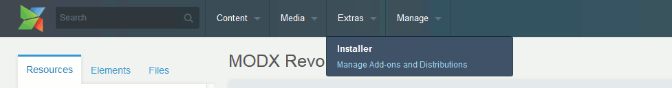

Нажмите кнопку «Загрузить дополнения».

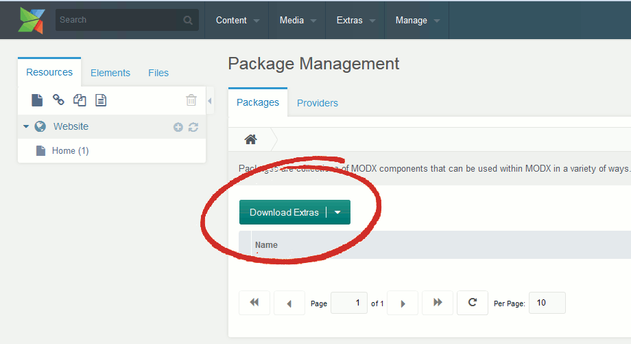

Найдите и загрузите:

- migx
- pdotools
- migxmultilang

Установите все дополнения, migxMultiLang оставьте на последнее место.

При установке migxMultiLang вас спросят, разместить его в верхней панели навигации или в выпадающем меню «Дополнения». Смотрите скриншот ниже. Это вопрос личных предпочтений, позже пункт меню можно изменить в панели «Меню» MODX.

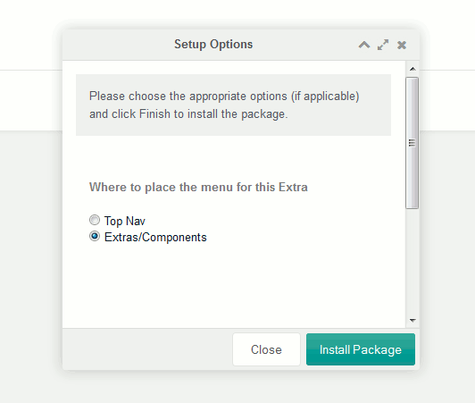

Если вы установили migxMultiLang в меню «Дополнения», он появится там после открытия меню.

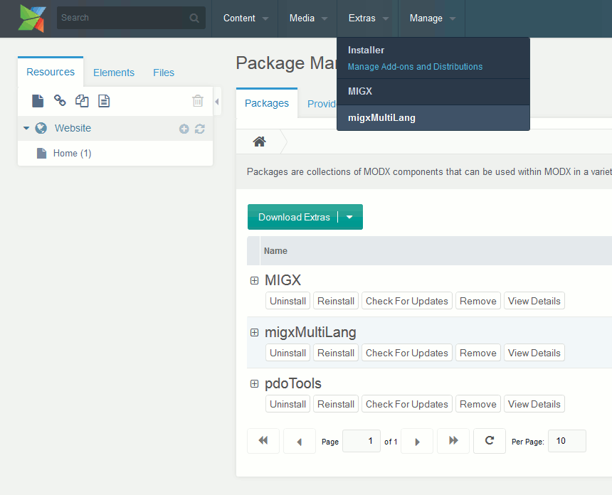

### Шаг 2: Добавление языков

Выберите migxMultiLang в меню «Дополнения» (или в верхней панели навигации, если выбрали этот вариант).

Откроется страница с тремя вкладками. Первая вкладка «Languages» (Языки), нам нужна именно она.

Нажмите кнопку «Add Language» (Добавить язык). Мы сделаем это дважды: в этом руководстве используем два языка, но теоретически можно добавить сколько угодно.

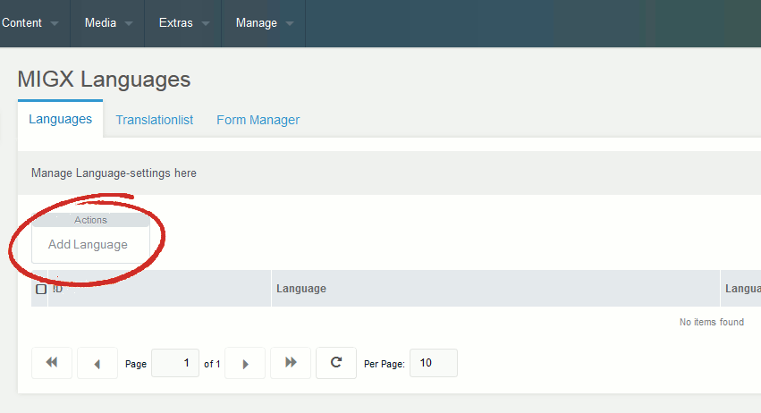

Кнопка «Add Language» откроет окно MIGx с тремя полями: Language, Lang Key и Lang Direction.

В первом поле укажите название языка. Первым добавим English, введите «English».

Во втором поле укажите ключ языка для переключения в migxMultiLang. Введите «en».

Английский читается слева направо, поэтому третье поле оставьте «ltr».

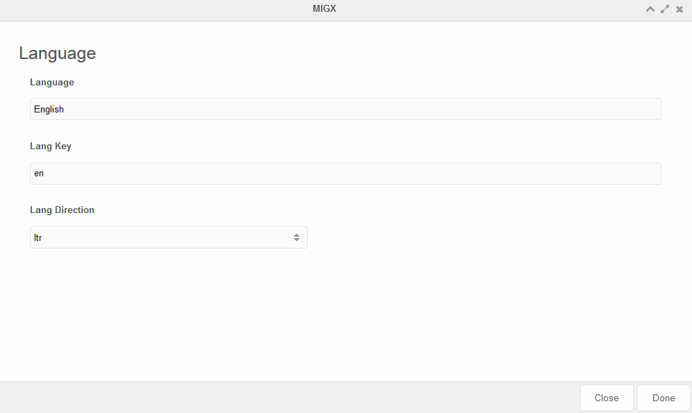

Нажмите «Done» внизу, чтобы сохранить и закрыть окно.

Повторите процесс для второго языка.

Снова нажмите «Add Language», откроется то же окно.

На этот раз добавим китайский (или любой другой язык).

В поле Language введите 中文. (Скопируйте иероглифы отсюда или напишите «Chinese».)

В поле Lang Key введите «zh».

Поле Lang Direction оставьте «ltr».

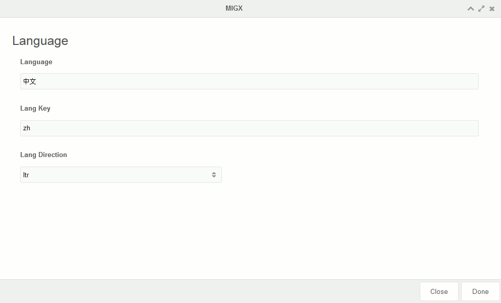

Снова нажмите «Done», чтобы сохранить и закрыть окно.

На вкладке Languages вы увидите добавленные языки.

### Шаг 3: Создание переменных шаблона

С вкладкой Languages закончили.

Перейдите на вкладку «Form Manager» и нажмите «Import Configurations».

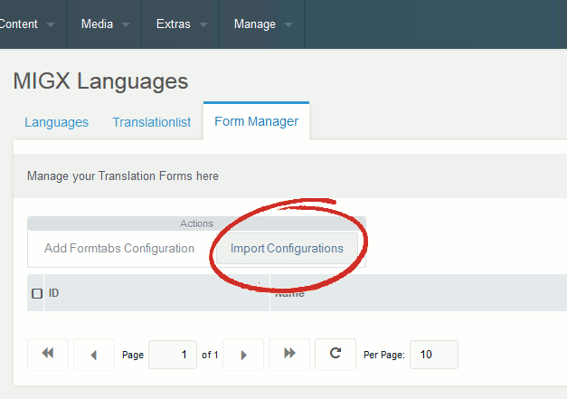

В таблице появится пример конфигурации. Его можно продублировать и настроить под себя, но в этом руководстве используем пример как есть.

Нажмите «Edit», конфигурацию нужно изменить.

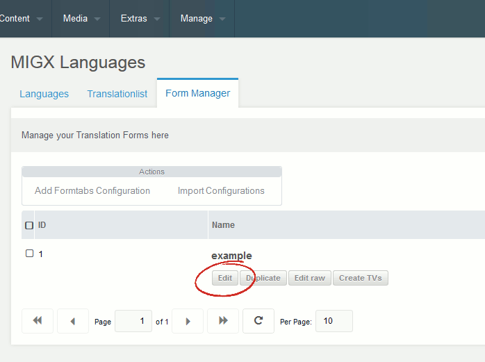

Кнопка «Edit» откроет окно с двумя вкладками: «Form» и «Settings».

Перейдите на «Settings» и отметьте «Use as Default Formtabs for all other templates».

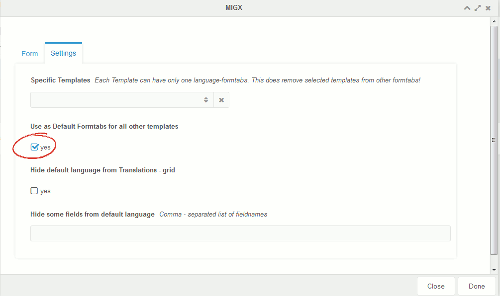

Нажмите «Done», окно сохранится и закроется.

После изменения конфигурации создайте TV.

Нажмите «Create TVs» рядом с кнопкой «Edit», которую нажимали раньше.

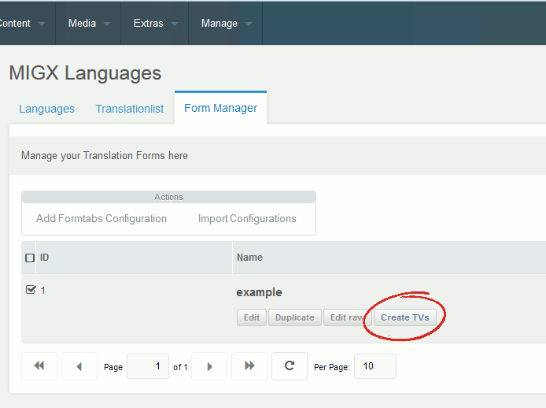

В разделе «Template Variables» дерева элементов появятся новые TV:

- `mml_content`
- `mml_introtext`
- `mml_longtitle`
- `mml_menutitle`
- `mml_pagetitle`

Это версии типичных полей ресурса для migxMultiLang.

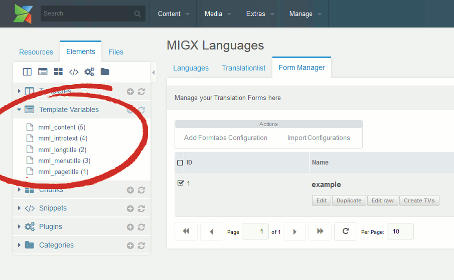

Теперь создайте основную TV для переводов.

Сначала создайте категорию: нажмите значок «New Category» вверху дерева элементов.

В окне новой категории укажите имя «Translations» и нажмите «Save».

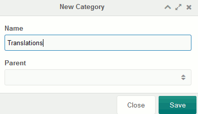

Нажмите значок «New TV» вверху дерева элементов, откроется страница создания TV.

Заполните поля:

Name: translations

Caption: Translations

Description: Enter the translations for this resource here:

Category: Translations

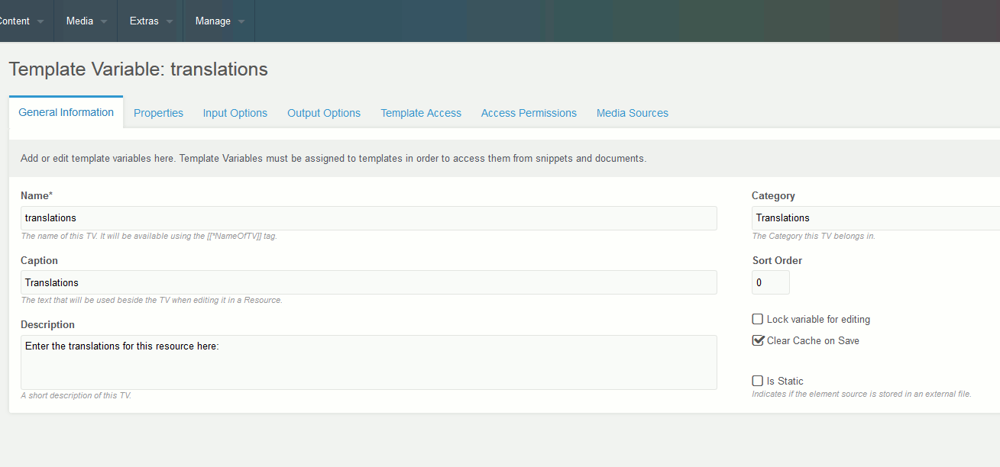

После заполнения перейдите на вкладку «Input Options».

Input Type:

`migxdb`

Configurations:

``` php
mml_translations:migxmultilang,mml_translate:migxmultilang
```

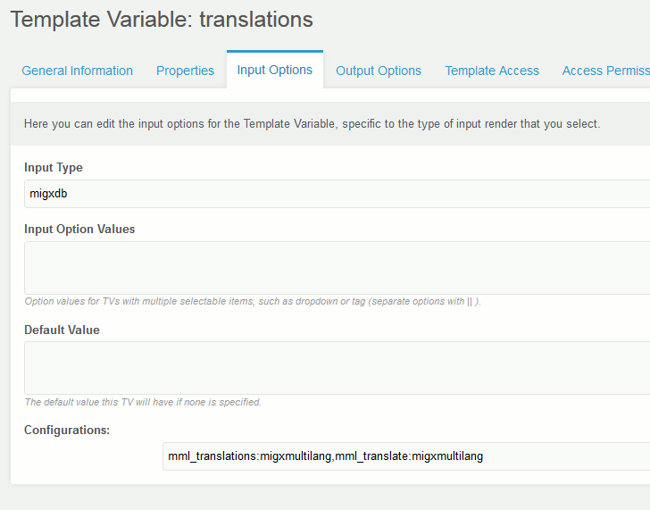

Почти готово. Перейдите на вкладку «Template Access».

Отметьте галочку в колонке «Access» для BaseTemplate.

Нажмите «Save» вверху справа.

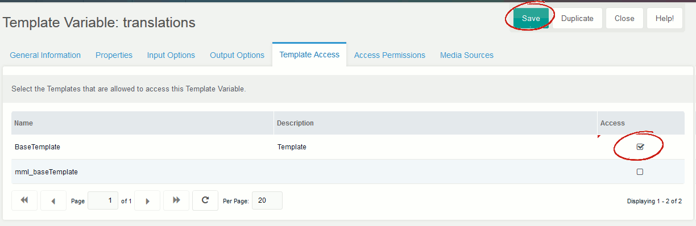

Откройте дерево ресурсов и выберите ресурс с BaseTemplate. В нашем случае это только Home.

На вкладке «Template Variables» ресурса появится созданная TV.

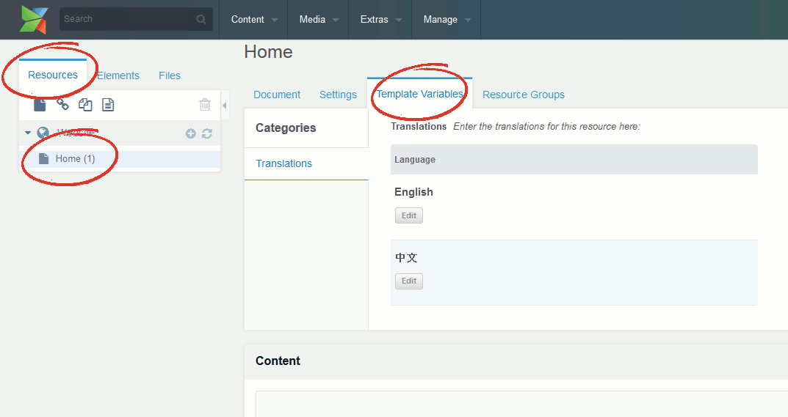

Переводы пока не работают. Осталось несколько шагов.

## Шаг 4: Системные настройки

Откройте системные настройки MODX. Их можно найти в выпадающем меню с иконкой шестерёнки в правом верхнем углу.

Выберите pdotools в выпадающем списке, появятся две настройки.

Найдите настройку FQN of pdoFetch и измените значение на `pdotools.mmlfetch`

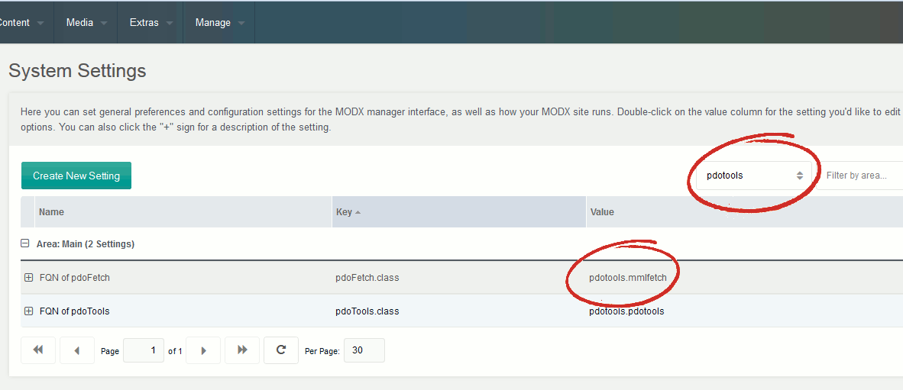

Шаг выполнен.

Примечание для новых версий pdoTools:
понадобятся такие системные настройки:

pdoFetch.class: migxmultilang.mmlfetch
`pdofetch_class_path`: `{core_path}components/migxmultilang/model/`

## Шаг 5: Создание таблиц базы данных

Выберите MIGX в меню «Дополнения» вверху.

Откроется MIGX Package Manager.

В поле «Package Name» введите: `migxmultilang`

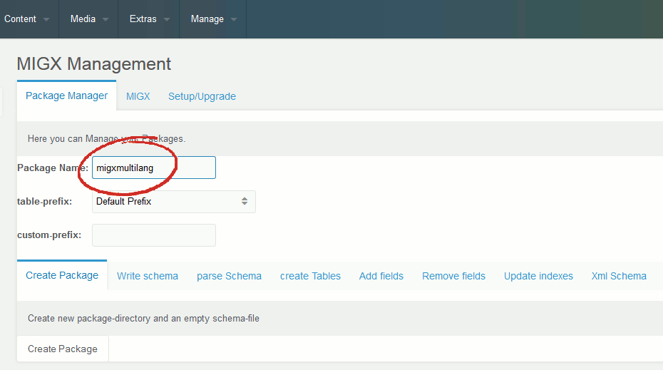

Перейдите на вкладку «create Tables» ниже.

Под ней будет одна кнопка «create Tables». Нажмите её.

Должно появиться сообщение об успешном создании таблиц.

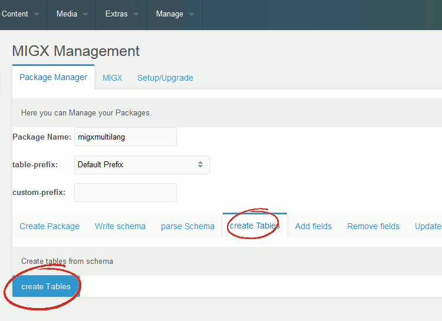

## Шаг 6: Создание шаблонов для фронтенда

migxMultiLang меняет подход к шаблонам, если для ресурса нужно несколько языков.

Перенесём содержимое BaseTemplate в чанк с именем MainTpl.

В дереве элементов откройте BaseTemplate и скопируйте содержимое.

Создайте чанк MainTpl и вставьте скопированный код.

Сохраните MainTpl, затем снова откройте BaseTemplate.

Удалите всё из области «Template Code (HTML)» и вставьте следующий код:

``` php
[[!mmlCache?
&element=`pdoResources`
&parents=`0`
&resources=`[[*id]]`
&tpl=`MainTpl`
&includeTVs=`[[mmlGetTemplateTVs]]`
&prepareTVs=`1`
&processTVs=`1`
&tvPrefix=``
&loadModels=`migxmultilang`
&prepareSnippet = `mmlTranslatePdoToolsRow`
]]
```

Если чанк называется не «MainTpl», обновите аргумент `&tpl`.

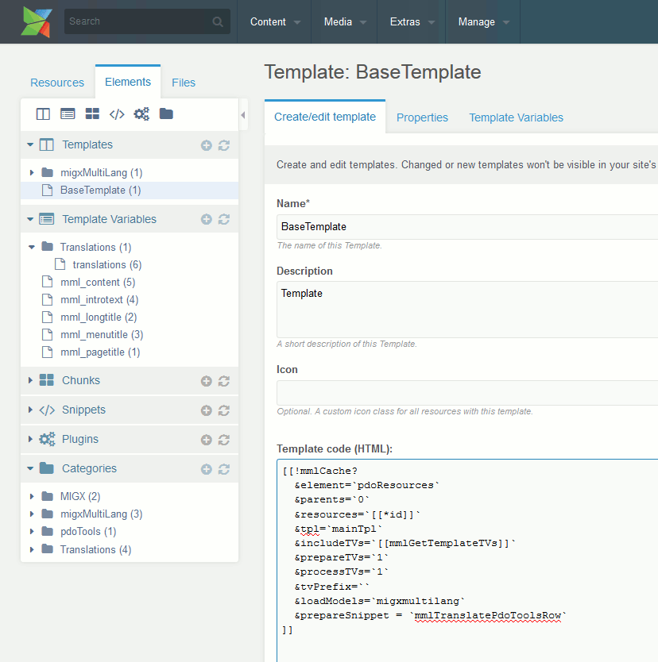

BaseTemplate теперь загружает чанк MainTpl как шаблон.

Добавим в чанк теги для переключения языков на фронтенде.

Откройте чанк MainTpl.

migxMultiLang поставляется со сниппетом `mml_LangLinks`. Добавим его в чанк.

Простой пример чанка MainTpl:

``` html
<!doctype html>
<html lang="en">
<head>
<meta charset="[[++modx_charset]]">
<title>[[++site_name]] - [[+mml_pagetitle]]</title>
<base href="[[++site_url]]">
</head>
<body>
[[+mml_pagetitle]]
[[!mml_LangLinks]]
</body>
```

Помимо обычных MODX-тегов в `<head>`, здесь добавлены `[[+mml_pagetitle]]` и `[[!mml_LangLinks]]`.

`[[+mml_pagetitle]]` ссылается на одну из созданных ранее TV и хранит обе версии названия ресурса.

Сохраните чанк!

Теперь введите переводы.

Вернитесь на вкладку «Template Variables» ресурса Home. Вы увидите языки и кнопку «Edit» для каждого.

Нажмите «Edit» для English. Откроется окно редактирования на английском.

В поле `Pagetitle` введите: `This is the English version.`

Нажмите «Done», затем откройте окно редактирования для китайского.

В поле `Pagetitle` введите: `This is the Chinese version.`

Нажмите «Done».

Проверьте фронтенд сайта.

## Шаг 7: Проверка

English задан как язык по умолчанию, поэтому он отображается первым.

Страница должна выглядеть так:

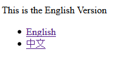

При клике по ссылке на китайский текст сменится на «This is the Chinese Version».

Базовая настройка завершена!

Можно добавить собственные TV, которые тоже будут переводиться.

При желании Form Customization перенесёт TV переводов на основную страницу ресурса.

Это руководство показывает самый простой способ запустить migxMultiLang.

Планирую дополнить его примерами для разных сценариев и пригласить других авторов сделать то же самое.

Тем временем у Bruno в документации есть более сложный пример шаблона: <https://github.com/Bruno17/migxmultilang>
