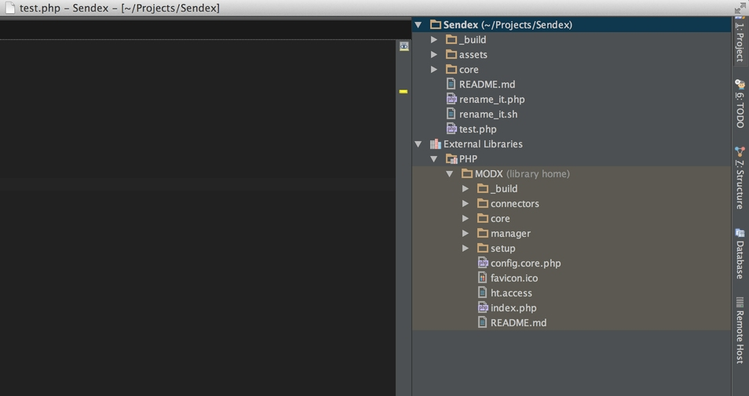
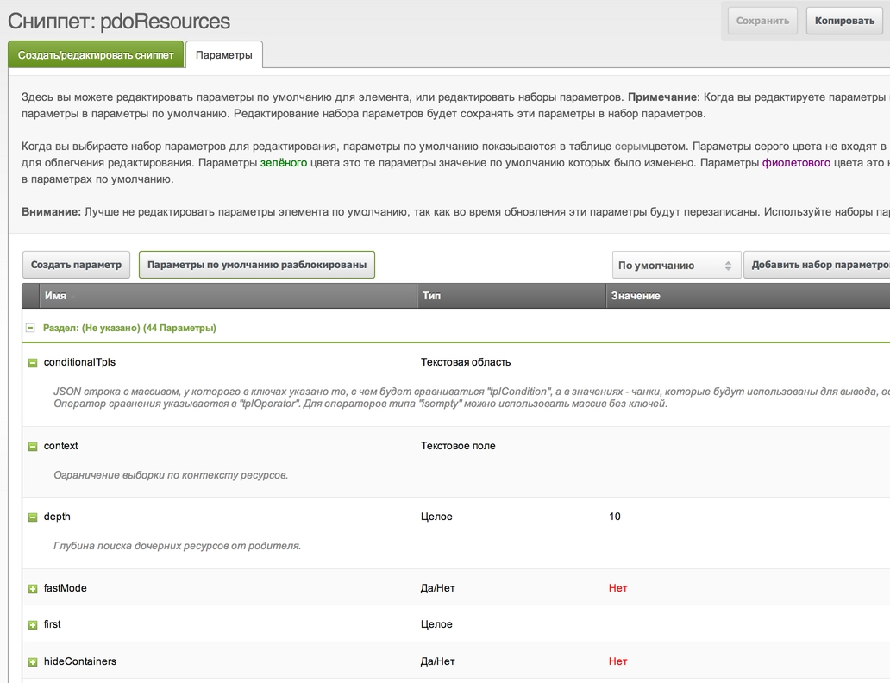

Все приличные дополнения в MODX распространяются транспортными пакетами — это такие zip файлы с определенной структурой.

При установке они могут совершать различные действия: создавать таблицы, менять системные настройки, копировать файлы и т.п.

Писать транспортный пакет с нуля очень долго, муторно и чревато ошибками. Гораздо лучше использовать проверенную заготовку **modExtra** — именно с её помощью написаны почти все мои дополнения.

Поэтому, сегодня нам нужно скачать [modExtra из репозитория](https://github.com/bezumkin/modExtra) и разобрать структуру будущего компонента: зачем там так много файлов и директорий?

Конечно, мы разберемся и со сборщиком пакета — как он работает и конфигурируется.

## Загружаем modExtra

Заготовка живет в репозитории на GitHub, поэтому самый простой способ — взять и клонировать её к вам на компьютер.
Для этого есть как минимум 2 способа:

- Если вы не знакомы с Git, или он еще не установлен у вас на компьютере — просто скачиваем и распаковываем [архив с файлами](https://github.com/bezumkin/modExtra/archive/master.zip)
- Если Git у вас уже установлен — клонируем репозиторий:

``` php
git clone https://github.com/bezumkin/modExtra.git
```

и удаляем из него директорию `./modExtra/.git` — она нам не нужна.
Теперь нужно перенести файлы и директории в наш проект. Он располагается у вас на компьютере (на прошлом уроке мы указали к нему путь), поэтому файлы можно просто копировать через проводник. PhpStorm сам увидит и проиндексирует изменения.

Должно получиться вот так:



test.php можно смело удалить.

## Структура компонента

Обычный пакет состоит из 3х директорий:

`_build` — скрипты для сборки компонента в транспортный пакет
`assets` — файлы, которые должны быть доступны снаружи, из интернет
`core` — файлы, которые нужны для внутренней логики компонента
`README.md` — файл с общим описанием компонента, нужен для будущего репозитория на GitHub
`rename_it.php` — новый скрипт переименования заготовки на php
`rename_it.sh` — старый скрипт переименования заготовки на perl

### Директория core

Самая важная директория компонента — здесь хранится вся логика его работы.

Эта директория должна копироваться на рабочий сайт, поэтому выглядит так:

``` plain
- core
-- components
--- имя_компонента
---- здесь уже всё нужное
```

То есть, структура директорий такова, чтобы скопироваться в нужное место `/core` сайта.

#### Основные директории:

- **controllers** — файлы для подготовки страниц админки. Загружают нужные скрипты и стили.
- **docs** — история изменений, инструкция и лицензия. Эти файлы участвуют в описании пакета.
- **elements** — устанавливаемые чанки, сниппеты и прочие возможные наследники `modElement`
- **lexicon** — словари компонента, обычно только en и ru
- **model** — директория с объектами компонента и моделями таблиц для баз данных, обычно только для MySql. Здесь же находится и сновной рабочий класс компонента.
- **processors** — файлы, выполняющие какую-то одну небольшую функцию. Служат, как правило, для обработки запросов от админки.
Обратите внимание, что к файлам, которые лежат в этой директории, нельзя обращаться снаружи. То есть, здесь нельзя хранить какие-то скрипты, к которым вы хотите обратиться из браузера.

Это — файлы ядра, и в MODX директорию core можно вынести вообще за пределы сайта, или даже использовать одну core для нескольких установок.

Если вам нужно что-то открывать из браузера — для этого есть assets.

### Директория assets

Директория, доступная из браузера для запросов. Здесь хранятся файлы `*.js, *.css и php-коннекторы` для запросов их админки.

По умолчанию коннектор всего один, именно к нему будут обращаться страницы админки для выполнения каки-то задач.
Особо рассказывать здесь нечего, все и так понятно.

### Директория _build

Наверное, самая интересная часть modExtra. В отличии от стандартных скриптов сборки MODX, в modExtra все очень гибко настраивается.

#### Конфигурация

Это служебная директория, её не будет в конечном пакете, ведь это именно её скрипты и собирают пакет.

- **data** — список сниппетов, чанков и других modElement, которые будут установлены
- **includes** — вспомогательные функции для работы сборщика
- **properties** — список свойств сниппетов. Базовове имя файла должно совпадать с таковым у сниппета.
- **resolvers** — вспомогательные скрипты, запускающиеся на конечном сайте при установке пакета

В корне сборщика лежат особые файлики.

Файл сборки — `build.transport.php`. Он подключает конфиг `build.config.php`, в котором хранятся настройки:

- Имя компонента
- Версия
- Нужно ли сразу устанавливать компонент, при сборке?
- Определение рабочих директорий
- Настройка устанавливаемых объектов

Про объекты нужно рассказать подробнее. В MODX Revolution почти всё является объектом: и чанки и сниппеты и шаблоны.
У объектов есть различные свойства, для работы в MODX. Но во время установки пакета, нас интересуют не свойства этих объектов, а как их устанавливать и обновлять.

Поэтому транспортный пакет, по сути, это другой специальный объект — `modTransportVehicle` и у него есть свойства, описывающие как установить все чанки, сниппеты и шаблоны пакета.

По идее, в скрипте установки (`build.transport.php`) должно быть прописано поведение всех устанавливаемых объектов:

- Катеогория, к которой относится объект
- Его первичный ключ, чтобы определить дубликаты?
- Что делать, если такой ключ уже существует: перезаписывать или нет? (обновлять чанки и сниппеты?)
- Свойства дочерних объектов (если есть)

Выглядит всё это довольно сложно и на самом деле — так есть.

Поэтому я переписал скрипты установки таким образом, чтобы все основные настройки были вынесены в `build.config.php` и алгоритм работы теперь следующий:

1. Не нужно залезать в `build.transport.php` вообще
2. Нужно ли упаковывать объект указывается объявлением константы `BUILD_имяобъекта_UPDATE`
3. Обновление объекта указывается в `BUILD_имяобъекта_UPDATE`
4. Статичность объекта указывается в `BUILD_имяобъекта_STATIC`
5. Скрипты, которые будут выполнены при установке пакета (ресолверы) указываются в массиве `$BUILD_RESOLVERS`

Таким образом, всю работа по конфигурированию пакета и по добавлению удалениею можно разбить на 4 этапа:

1. Добавляем нужные объекты в `_build` в `/data/transport.типобъекта.php` (про это чуть ниже)
2. Указываем, как их устанавливать в конфиге
3. Добавляем ресолверы в `_build/resolvers/resolve.любоеимя.php`
4. Указываем, имя ресолвера в конфиге

Очевидно, что при такой структуре сборщика, нам будет очень просто включать (или исключать) разные объекты в пакет.

### Устанавливаемые объекты

Собственно, это и есть наши чанки, сниппеты и т.д.

Файлы с объектами у меня состоят из массива и цикла, который разбирает этот массив и возвращает уже готовые объекты.
Логика тут простая: в массиве уникальные значения объекта, а в цикле добавляются значения по умолчанию + настройки статичности элементов из конфига.

Таким образом, вот стандартный массив с одним чанков для **modExtra**:

``` php
$tmp = array(
    'tpl.modExtra.item' => array(
        'file' => 'item',   // Имя файла в /core/components/имя/chunks/
        'description' => '',    // Описание - будет видно в соотв. поле в админке
    ),
);
```

Схожим образом добавляются и другие объекты.

Если вы хоть немного знакомы с php — вопросов не будет, просто поглядите исходники.

У всех элементов MODX можно прописывать параметры — они будут видны на соответствующей вкладке при просмотре элемента.



Правило хорошего тона: всегда прописывать параметры сниппетам, для остальных они не особо нужны.

Скрипт сборки ищет параметры для сниппетов в директории `_build/properties/`. Файлы там устроены по тому же принципу — массив с уникльными значениями, и цикл со значениями по умолчанию.

### Вспомогательные скрипты (ресолверы)

Это такие специальные файлики, которые выполняются при различных действиях с пакетом: установке, обновлении и удалении.

Файлы-ресолверы лежат в `_build/resolvers/` и выглядят примерно так:

``` php
if ($object->xpdo) {
    /* @var modX $modx */
    $modx =& $object->xpdo;

    switch ($options[xPDOTransport::PACKAGE_ACTION]) {
        case xPDOTransport::ACTION_INSTALL:
            // Действия при первой установке пакета
            break;

        case xPDOTransport::ACTION_UPGRADE:
            // Действия при обновлении пакета
            break;

        case xPDOTransport::ACTION_UNINSTALL:
            // Что делать при удалении пакета
            break;
    }
}
return true;
```

Здесь можно делать что угодно с системой, на которую устанавливается пакет, даже удалить весь сайт — ведь вам доступен класс modX.
Напоминаю, что активные ресолверы для сборки указывается в `$BUILD_RESOLVERS`.

## Заключение

Возможно, что-то будет непонятно по работе сборщика, но мы еще с ним поразбираемся, когда будем упаковывать готовый код.

Главное помните, что есть универсальный набор скриптов, который соберет нам в транспортный пакет всё, что захотим.

На следующем уроке мы выгрузим **modExtra** на сервер, переименуем в **Sendex**, немного изменим, соберем в пакет и установим.
