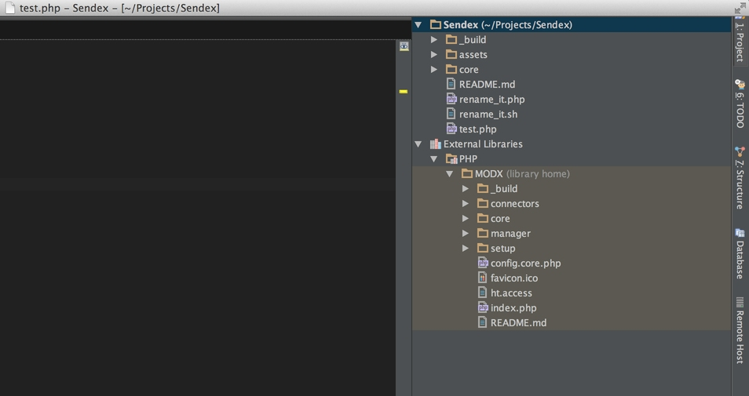
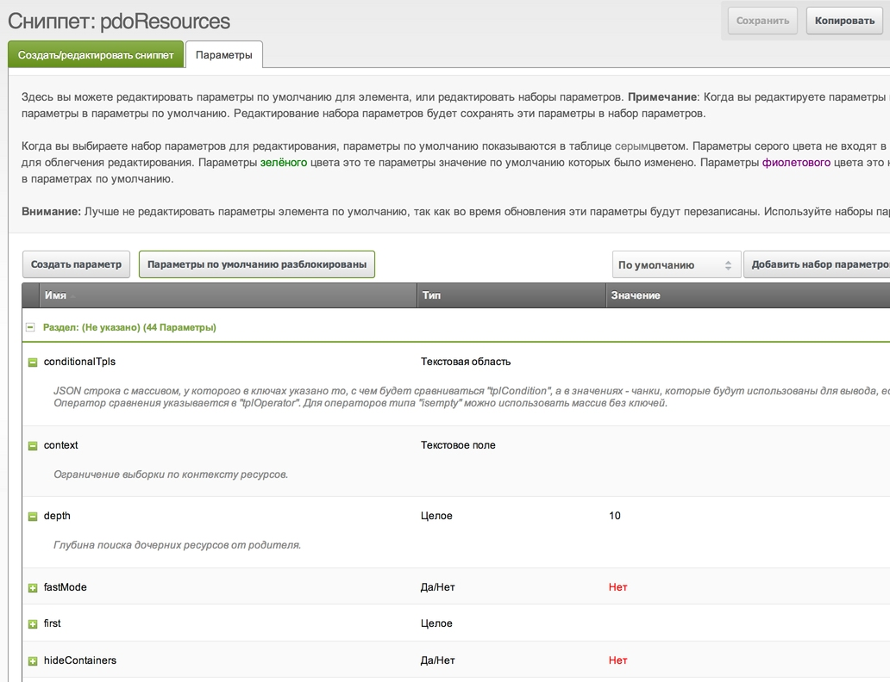

Все приличные дополнения к MODX распространяются транспортными пакетами: это zip-файлы с определённой структурой.

При установке они могут выполнять разные действия: создавать таблицы, менять системные настройки, копировать файлы и т.д.

Писать транспортный пакет с нуля долго, муторно и чревато ошибками. Лучше взять проверенную заготовку **modExtra**: почти все мои дополнения написаны с её помощью.

Для MODX 2.x берите [modx-pro/modExtra](https://github.com/modx-pro/modExtra), для MODX 3.x: [modx-pro/ModExtra3](https://github.com/modx-pro/ModExtra3). Структура каталогов та же по смыслу. Скачайте одну заготовку и разберите дерево ниже.

На этой странице также разбор сборщика: как запускается и как настраивается.

## Загружаем modExtra

Заготовка на GitHub. Клонируйте её (или скачайте zip), затем скопируйте файлы в проект.

- Без Git: распакуйте архив [modExtra](https://github.com/modx-pro/modExtra/archive/master.zip) или [ModExtra3](https://github.com/modx-pro/ModExtra3/archive/master.zip)
- С Git:

```bash
git clone https://github.com/modx-pro/modExtra.git
# или: git clone https://github.com/modx-pro/ModExtra3.git
```

Вложенный `.git` можно удалить, если история заготовки не нужна. Остальное скопируйте в путь проекта с прошлого урока. PhpStorm проиндексирует файлы.

Должно получиться так:



`test.php` можно смело удалить.

## Структура компонента

Обычный пакет состоит из 3 каталогов:

- `_build`: скрипты сборки компонента в транспортный пакет
- `assets`: файлы, которые должны быть доступны снаружи
- `core`: файлы внутренней логики компонента
- `README.md`: файл с общим описанием компонента, нужен для будущего репозитория на GitHub
- `rename_it.php`: новый скрипт переименования заготовки на PHP
- `rename_it.sh`: старый скрипт переименования на Perl

### Каталог core

Самый важный каталог компонента: здесь вся логика его работы.

Этот каталог нужно копировать на рабочий сайт, поэтому он выглядит так:

``` plain
- core
-- components
--- component_name
---- everything is necessary here
```

То есть структура каталогов устроена так, чтобы скопироваться в нужное место `/core` сайта.

#### Основные каталоги

- **controllers**: файлы подготовки страниц админки. Загружают нужные скрипты и стили.
- **docs**: история изменений, инструкция и лицензия. Эти файлы участвуют в описании пакета.
- **elements**: устанавливаемые чанки, сниппеты и другие возможные наследники `modElement`
- **lexicon**: словари компонента, обычно только en и ru
- **model**: каталог с объектами компонента и моделями таблиц БД, обычно только для MySQL. Здесь же лежит основной рабочий класс компонента.
- **processors**: файлы, которые выполняют одну небольшую функцию. Как правило, обрабатывают запросы из админки.
Обратите внимание: к файлам в этом каталоге нельзя обратиться снаружи. То есть здесь нельзя хранить скрипты, к которым вы хотите обратиться из браузера.

Это файлы ядра. В MODX каталог core можно вынести за пределы сайта или даже использовать один core для нескольких установок.

Если нужно открыть что-то из браузера, для этого есть assets.

### Каталог assets

Каталог, доступный из браузера для запросов. Здесь хранятся файлы `*.js, *.css and php-connectors` для запросов админки.

По умолчанию коннектор один: именно к нему обращаются страницы админки, чтобы выполнить задачи.
Здесь особо рассказывать нечего, всё и так понятно.

### Каталог `_build`

Этот каталог не попадает в transport zip. Его скрипты *собирают* пакет. В актуальных заготовках ([modExtra](https://github.com/modx-pro/modExtra), [ModExtra3](https://github.com/modx-pro/ModExtra3)):

| Путь | Назначение |
| --- | --- |
| `_build/build.php` | Точка входа (CLI или браузер) |
| `_build/config.inc.php` | Имя, версия, `'install'`, `'update'`, `'static'`, логирование |
| `_build/elements/` | PHP-массивы меню, чанков, сниппетов и т.д. |
| `_build/resolvers/` | PHP при установке / обновлении / удалении |

В старых текстах курса ещё фигурируют `build.transport.php`, `build.config.php`, константы `BUILD_*` и `_build/data/`. В указанных заготовках их **нет**.

#### Конфигурация

`config.inc.php` возвращает массив. Полезные ключи:

- `name` / `name_lower` / `version` / `release`
- `'install' => true`: собрать и сразу установить
- `'update'`: по типам элементов, перезаписывать ли при апгрейде пакета
- `'static'`: статичность по умолчанию для plugins, snippets, chunks

В `build.php` обычно не лезут: правят массивы и запускают скрипт.

#### Элементы

В `_build/elements/` подхватываются PHP-файлы, имя которых **не** начинается с `.` или `_`. Базовое имя (без `.php`) должно совпадать с методом класса сборки (`menus`, `chunks`, `snippets`, …). Чтобы упаковать чанки, переименуйте `_chunks.php` в `chunks.php` (для нового типа добавьте и метод в `build.php`).

Пример списка чанков:

```php
return [
    'tpl.ModExtra.item' => [
        'file' => 'item', // core/components/<name>/elements/chunks/item.tpl
        'description' => '',
        // 'properties' => [...], // свойства сниппета/чанка по желанию
    ],
];
```

Остальные типы устроены так же: уникальные ключи в массиве, значения по умолчанию в методе сборки, static/update берутся из `config.inc.php`.



Свойства сниппета можно задать в массиве элемента ключом `properties`. Отдельного каталога `_build/properties/` в текущих modExtra / ModExtra3 нет.

#### Ресолверы

PHP в `_build/resolvers/`. То же правило: имена с `.` или `_` в начале пропускаются. Остальные файлы выполняются при действиях с пакетом.

```php
/** @var xPDOTransport $transport */
/** @var array $options */
/** @var modX $modx */

if ($transport->xpdo) {
    $modx = $transport->xpdo;

    switch ($options[xPDOTransport::PACKAGE_ACTION]) {
        case xPDOTransport::ACTION_INSTALL:
            // первая установка
            break;
        case xPDOTransport::ACTION_UPGRADE:
            // обновление
            break;
        case xPDOTransport::ACTION_UNINSTALL:
            // удаление
            break;
    }
}

return true;
```

В ModExtra3 типичны `tables.php` (схема/таблицы) и `symlinks.php` (ссылки `core` / `assets` обратно в `Extras/` для разработки).

## Заключение

Настройки пакета в `_build/config.inc.php` и `_build/elements/`, ресолверы по необходимости. Сборка: `_build/build.php`.

На следующем занятии загрузим заготовку на сервер, переименуем в **Sendex**, чуть подправим, соберём и установим.
