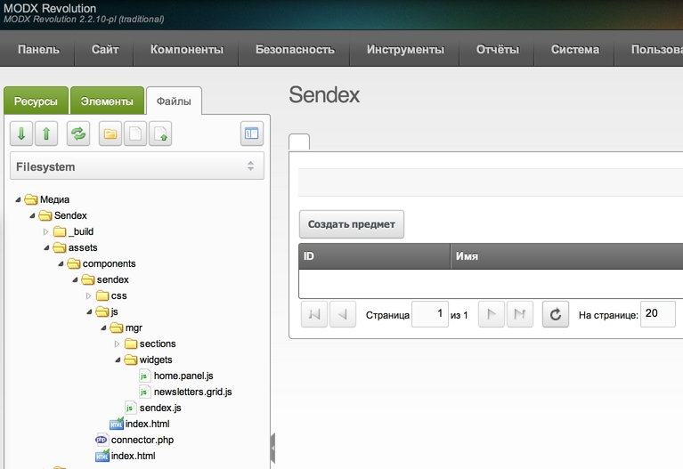
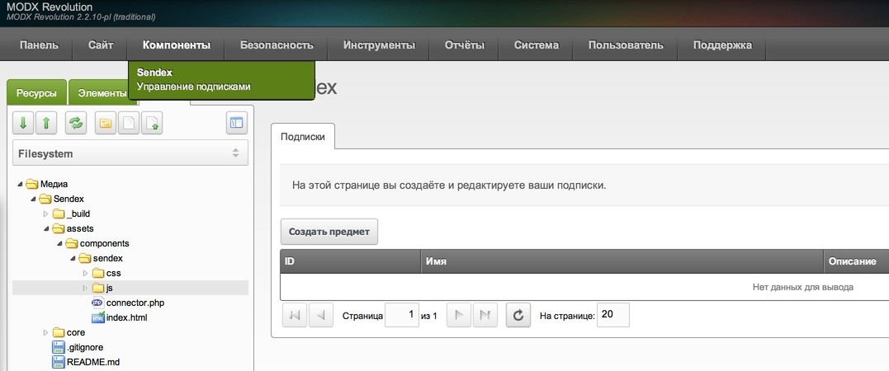
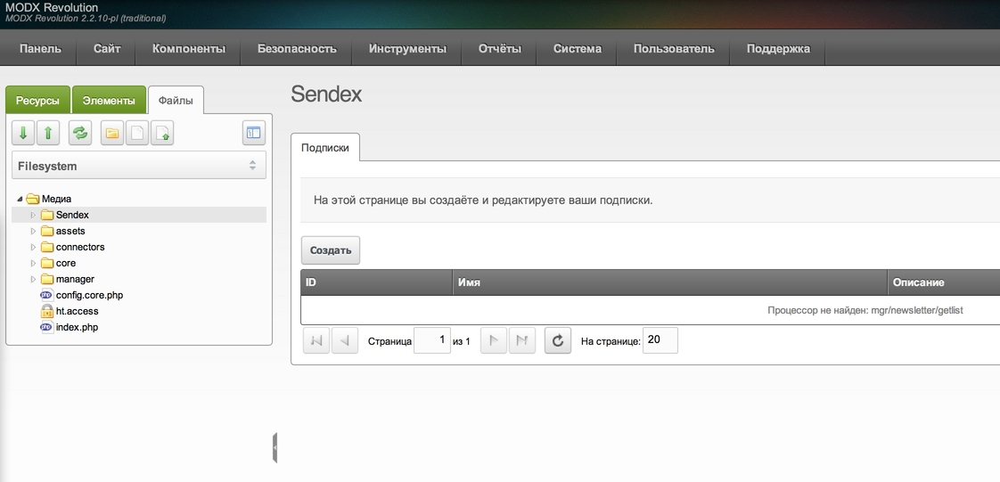
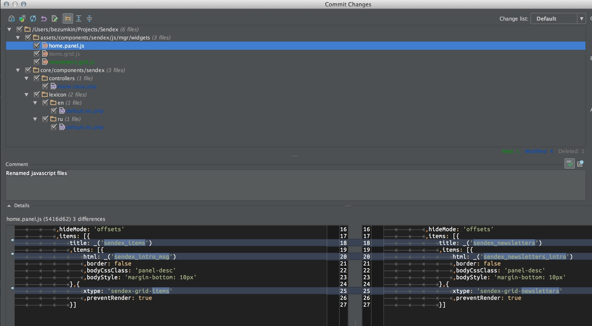
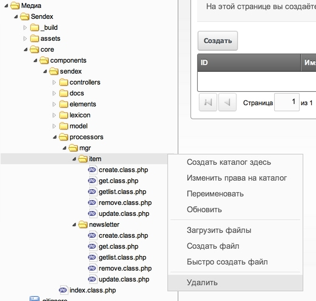
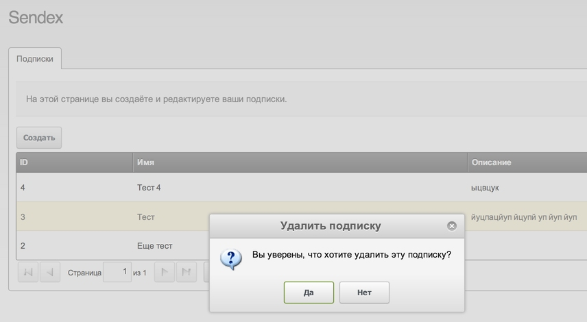

На прошлом уроке мы разобрались с контроллерами Custom Manager Page (CMP) нашего компонента, и выяснили, что основной смысл их существования — подготовить все нужные файлы для вывода страницы.

Пока у нас используются js файлы от modExtra, и сегодня нам нужно их изучить и переписать для Sendex.

Первым делом нужно понять, что ExtJs — это javascript фреймфорк, куда более мощный чем jQuery. Он не требует HTML верстки, он все генерирует на лету. То есть, вы пишете javascript код, а на странице получаете готовые таблички, кнопочки, пагинацию и т.д.

Причем, все эти элементы уже подчиняются какой-то логике: одна кнопка переключает странички, другая вызывает модальное окно и т.д.

Сначала довольно трудно въехать в ExtJS, особенно если не знаешь javascript, но со временем начинаешь понимать его преимущества, и реально экономить время.

## Виджеты

Сразу говорю, я не гуру ExtJS, освоил его на минимальном уровне, необходимом для написания компонентов MODX. Поэтому, буду писать «своими словами», и возможно не всегда верно.

На мой взгляд, 2 основных момента для понимания ExtJS:

* Все элементы ExtJS являются объектами javascript, со своими свойствами. Когда вы пишите какой-то свой виджет, нужно просто унаследовать и расширить уже готовый от авторов ExtJS или MODX. Например, пишите свою таблицу — расширяете **MODx.grid.Grid**, в таблицах будут всплывающие окошки — писуете фиджет, расширяющий **MODx.Window**.
  
Это очень похоже на Объектно-Ориентированное Программирование (ООП) в PHP и если принять эту логику — жизнь становится очень простой и лёгкой.

* Практически все видежты или уже работают, или умеют работать через Ajax. Все свои данные они отправляют на сервер без перезагрузки страницы, и ответ получают в формате JSON.

То есть, здесь полнейшее отделение логики от представления. Вам не нужно что-то там парсить или рендерить на PHP, чтобы отдать готовый HTML. Вставлять его тоже никуда не нужно, сервер должен отдать массив в таком формате:

``` php
$array = array(
    'success' => false,
    'message' => 'Возника ошибка при сохранении формы',
    'total' => 1
    'data' => array(
        'id' => 'alias',
        'msg' => 'Это поле обязательно'
    )
);
```

А виджет ExtJS смотрит в этот массив, понимает, что сервер отдал ошибку и выводит сообщение о ней. В данном примере — это требование заполнить alias страницы при её сохранении.

Уверяю вас, такая схема делает работу **очень простой и удобной**. Вы отдельно пишите код на javascript, отдельно пишите процессоры на PHP, которые с ним будут работать, а потом открываете админку — и начинается магия!

Всё структурировано, никакой мешанины в коде, недоработки легко находятся и исправляются. Готовые виджеты, которые можно вызвать на странице одной строчкой я называю **xtype** — потому что, именно это и указывается при их вызове.

Процессоры
Мы не будем рассматривать старые скучные процессоры, в которых были просто портянки кода, которые возвращали JSON. С версии MODX 2.2 у нас появились «классные процессоры», о которых вы можете почитать [вот здесь](http://bezumkin.ru/sections/php/59/) — с ними мы и будем работать.

Итак, процессор это php файл, который содержит класс, наследующий modProcessor и возвращающий своё имя. В MODX есть уже куча готовых классов на разные случаи жизни, которые можно наследовать для своих целей:

* **modObjectGetProcessor** — Получает и возвращает указанный объект
* **modObjectGetListProcessor** — Выводит список объектов для таблицы
* **modObjectCreateProcessor** — Создаёт новый объект
* **modObjectUpdateProcessor** — Обновляет существующий объект
* **modObjectDuplicateProcessor** — Делает копию существующего объекта
* **modObjectRemoveProcessor** — Удаляет объект
То есть, здесь нам тоже, как правило, нужно просто унаследовать уже имеющийся класс, переопределить пару свойств и методов — и всё готово.

Сам файл-процессор состоит из класса, и обязан содержать в конце вернуть своё имя. Вот, простейший пример:

``` php
<?php
class SendexItemCreateProcessor extends modObjectCreateProcessor {
    // Тип объекта, с которым будем работать - это имя выводится в логе операций MODX
    // и подставляется в сообщения об ошибках
    public $objectType = 'sxNewsletter';
    // xPDO класс объекта
    public $classKey = 'sxNewsletter';
    // Используемый лексикон - нужен для вывода ошибок
    public $languageTopics = array('sendex');
    // Разрешение, которое проверяеся при работе с процессором
    // Можно оставить пустым - тогда смогут работать все менеджеры
    public $permission = 'new_document';
}
// Обязательно возвращаем имя класса, чтобы MODX знал, что именно нужно инициализировать в процессоре
return 'SendexItemCreateProcessor';
```

Это процессор абсолютно рабочий, его можно вызвать через `$modx->runProcessor()`, передать нужные параметры и будет создан объект `sxNewsletter` (или получена ошибка).

Для того, чтобы узнать, какие методы можно переопределить — просто [смотрите в исходник наследуемого modObjectCreateProcessor](https://github.com/modxcms/revolution/blob/c2d6582fe7a570ab634de2b9bb42029ec4909905/core/model/modx/modprocessor.class.php#L599). Напоминаю, что в PhpStorm нужно просто кликнуть на класс и нажать Ctrl+B.

С теорией покончено, давайте закрепим на практике.

## Основные js файлы админки

От modExtra у нас осталась демонстрационная страница, которая создаётся следующими скриптами в `/assets/components/sendex/js/mgr/`:

* **sendex.js** — скрипт с объявлением самого объекта Sendex. В него будут вписываться все остальные объекты компонента. Этот файл мы не трогаем.
* **sections/home.js** — Скрипт единственной страницы компонента. Тоже не трогаем, но обращаем внимание на строку:
`,renderTo: 'sendex-panel-home-div'`
И вспоминаем, что [именно такой div у нас указан в шаблоне](https://github.com/bezumkin/Sendex/blob/5416d620300261025420f9e73c41ee3a6fb9fd5a/core/components/sendex/elements/templates/home.tpl), который [загружается контроллером](https://github.com/bezumkin/Sendex/blob/5416d620300261025420f9e73c41ee3a6fb9fd5a/core/components/sendex/controllers/home.class.php#L45).
А потом смотрим на строку, где объявляется `xtype` нашей страницы:
`xtype: 'sendex-panel-home'`
Именно [этот xtype у нас и запускает контроллер](https://github.com/bezumkin/Sendex/blob/5416d620300261025420f9e73c41ee3a6fb9fd5a/core/components/sendex/controllers/home.class.php#L35) после полной загрузки страницы.
То есть, вот она связь HTML страницы, сгенерированной PHP, и запуск виджета ExtJS на ней.
* **widgects/home.panel.js** — виджет «Панель», который содержит в себе заголовок, описание и табы (вкладки). Его мы немножко будем менять, когда будем добавлять новые вкладки на страницу.
* **widgects/items.grid.js** — виджет с таблицой предметов modExtra. Основной рабочий файл, который выводит записи из БД и позволяет редактировать их во всплывающих окошках. В основном с ним мы и работаем.
Давайте еще раз: у нас есть раздел в админке, он состоит из одного пункта меню и одной страницы. На странице вызывается панель с вкладками, и на первой вкладке у нас таблица. Окошки, создающие новую запись и меняющие существующую, являются частью этой таблицы.

Сегодня работаем именно в этом объеме, другие вкладки добавим позже.

Готовим таблицу для работы с `sxNewsletter`
Первая вкладка посвящена работе с объектами `sxNewsletter`, то есть — с подписками.

Нужно указать это в `widgets/home.panel.js`:

``` javascript
{
    // Имя вкладки
    title: _('sendex_newsletters')
    // Массив с содержимым
    ,items: [
    // Блок HTML с описанием этой вкладки
    {
        html: _('sendex_newsletters_intro')
        ,border: false
        ,bodyCssClass: 'panel-desc'
        ,bodyStyle: 'margin-bottom: 10px'
    }
    // Вызов рабочей таблицы
    ,{
        xtype: 'sendex-grid-newsletters'
        ,preventRender: true
    }
}
```

Как видите, я просто переименовал кое-что. Самый главный момент здесь, это вызов `xtype` таблицы
`xtype: 'sendex-grid-newsletters'`.

Как только мы его указали — админка ломается, ибо такого **xtype не существует**.


Как понять, из-за сего сломалось? Ну так нам ExtJS пишет в логе, что перед ошибкой было

``` javascript
create
Ext.Container.Ext.extend.createComponent
Ext.Container.Ext.extend.lookupComponent
```

То есть: поиск и создание виджета, после чего ошибка. Мы же помним, что мы ег опереименовали — так что всё логично.

Таким образом, нужно поменять имя и в файле `widgects/items.grid.js`. Хотя стоп, его сначала нужно переименовать в `widgects/newsletters.grid.js`.

Сразу нужно указать новый файл для загрузки в контроллере `controllers/home.class.php` на строке 30:

``` javascript
$this->addJavascript($this->Sendex->config['jsUrl'] . 'mgr/widgets/newsletters.grid.js');
```

Ну а теперь просто меняем в `newsletters.grid.js` строку 108 с регистрацией виджета:

``` javascript
Ext.reg('sendex-grid-newsletters',Sendex.grid.Items);
```

Синхронизируем с MODXCloud и обновляем страницу — ошибки нет.



_Кстати говоря, обычно с переименованием через SFTP возникают какие-то ошибки, и часто PhpStorm просто создаёт на сервере новый файл рядом со старым. Это не страшно, просто удаляйте его через админку_.

У вас должно получиться всё как на скриншоте выше. Обратите внимание, что у меня не отображается заголовок вкладки. Так и должно быть — я же указал несуществующую запись из лексикона.

Вообще, поддержка лексиконов в компонентах сделана отлично, вам нужно просто указывать ключ из ваших файлов лексикона в виде:

`_('ключ')`

Нижнее подчеркивание здесь — это функция MODX, которая выведет нужную фразу. Очень элегантное решение, не правда ли?

Поэтому редактируем

`/core/components/sendex/lexicon/ru/default.inc.php`

``` php
$_lang['sendex'] = 'Sendex';
$_lang['sendex_menu_desc'] = 'Управление подписками';

$_lang['sendex_newsletters'] = 'Подписки';
$_lang['sendex_newsletters_intro'] = 'На этой странице вы создаёте и редактируете ваши подписки.';
```

и `/core/components/sendex/lexicon/en/default.inc.php`.

``` php
$_lang['sendex'] = 'Sendex';
$_lang['sendex_menu_desc'] = 'Newsletters management';

$_lang['sendex_newsletters'] = 'Newsletters';
$_lang['sendex_newsletters_intro'] = 'On this page you create and edit your subscription.';
```

Напоминаю, что лексиконы Sendex [загружает контроллер home.class.php](https://github.com/bezumkin/Sendex/blob/5416d620300261025420f9e73c41ee3a6fb9fd5a/core/components/sendex/controllers/home.class.php#L22).

После синхронизации языковых файлов с сервером, нужно обязательно почистить кэш сайта, ибо MODX постоянно кэширует лексиконы. Как видите, заодно я еще поправил описание нашего пункта меню.



Ну а теперь в `newsletters.grid.js` осталось переименовать все встречающиеся **Items** в **Newsletters**, а **item** в **newsletter**. В результате этого пропадает кнопка создания (меняем ей запись на `sendex_btn_create` и добавляем это в лексиконы) и получается ошибка



> Процессор не найден: mgr/newsletter/getlist

Конечно не найден, мы же переименовали всё только в javascript файлах, а php остались где были. Кстати, [вот мой коммит со всеми изменениями](https://github.com/bezumkin/Sendex/commit/fbb80934e3e220da52521ecf0f98b5388930acb8) на текущий момент — сравнивайте.

Вот картинка с изменёнными файлами:



Теперь нужно переделать процессоры.

## Готовим процессоры для работы с sxNewsletter

Первым делом переименовывем `/core/components/sendex/processors/mgr/item/` в `/core/components/sendex/processors/mgr/newsletter/` и заливаем новую директорию на сервер.

У меня получилось, что старая тоже осталась — поэтому я её удаляю в админке:



Затем меняем классы в файлах процессорах. Просто заменяем **SendexItem**, получившийся при изначальном переименовании modExtra, на **sxNewsletter** — наш объект с подписками.

После переименования синхронизируем изменения файлов, обновляем страницу в админке и ошибка пропадает.
Более того, можно **создавать, изменять и удалять подписки**, так как основные поля объекта modExtraItem и sxNewsletter совпадают (name и description).

Затем приводим в порядок остальные записи в лексиконе (меняем и там item на newsletter) и получается все довольно приятно:




Вот и всё, для начала. Мы уже может управлять объектами — у нас есть базовый интерфейс на ExtJS, который работает с процессорами и поддерживает сразу 2 языка: русский и английский.

Вот [мой коммит с изменениями](https://github.com/bezumkin/Sendex/commit/3e3d6d5c420e9a6d452ed61b6bd573613e11d467).

Вот какие файлы я редактировал:


## Заключение

Дальнейшая работа сводится к трём пунктам:

* Придумали и нарисовали что-то на ExtJS
* Добавили работу с этим в процессоры
* Добавили нужные записи в словари

Конечно, нужно будет создавать новые javascript файлы и процессоры, подключать их в контроллерах и вызывать из виджетов, но в целом — вот она, основная база дальнейшей разработки.
Выходит несложно, если работать с заготовкой modExtra.

На следующем уроке мы плотнее поработаем с ExtJS и сделаем свой интерфейс для sxNewsletter.
