Заканчиваем с подготовкой к началу активной разработки.

Сегодня нам нужно выгрузить заготовку на сервер, переименовать, создать репозиторий на GitHub и отправить в него первый коммит. А для этого нужно будет настроить PhpStorm на работу с git.

## Синхронизация с сервером

После того, как мы связали наш локальный проект с удалённым сервером, в PhpStorm появились новые пункты в контектном меню:

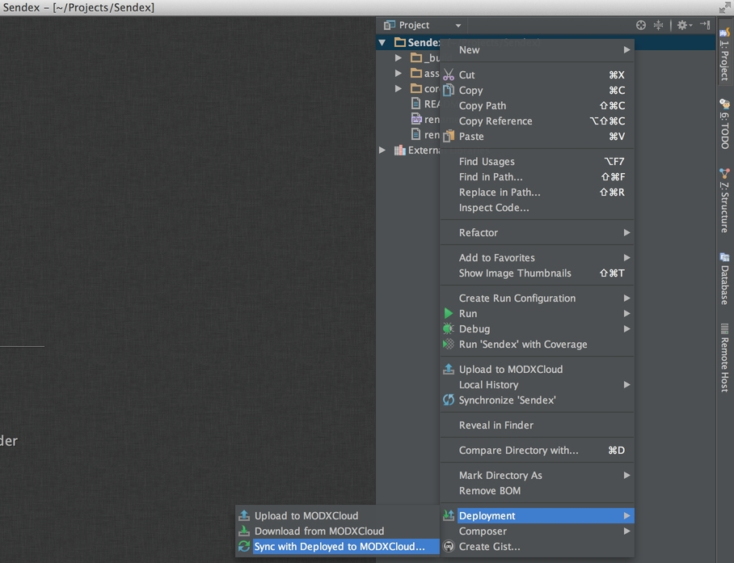

* Выгрузить файлы на сервер
* Скачать файлы с сервера
* Синхронизировать удалённые и локальные файлы

Важно понимать, что первый и второй пункт могут **перезаписывать существующие файлы**, поэтому использовать их нужно очень аккуратно.
В основном, лучше использовать синхронизацию — она покажет различия в файлах и позволит выбрать действия с ними. Правда есть и недостаток — при синхронизации нужно прочитать все удаленные файлы, а это занимает время. Хорошо, что PhpStorm позволяет синхронизировать не только весь проект, но и каждую отдельную директорию, и даже файл.

Мы выгружаем проект в первый раз, перезаписывать там нечего — поэтому смело кликаем **Upload to MODXCloud**. После этого можно проверить наличие файлов в админке.

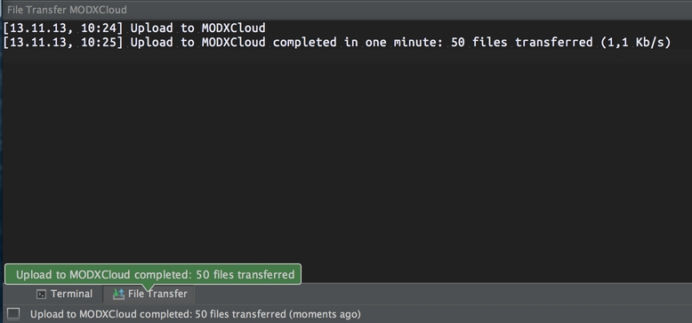

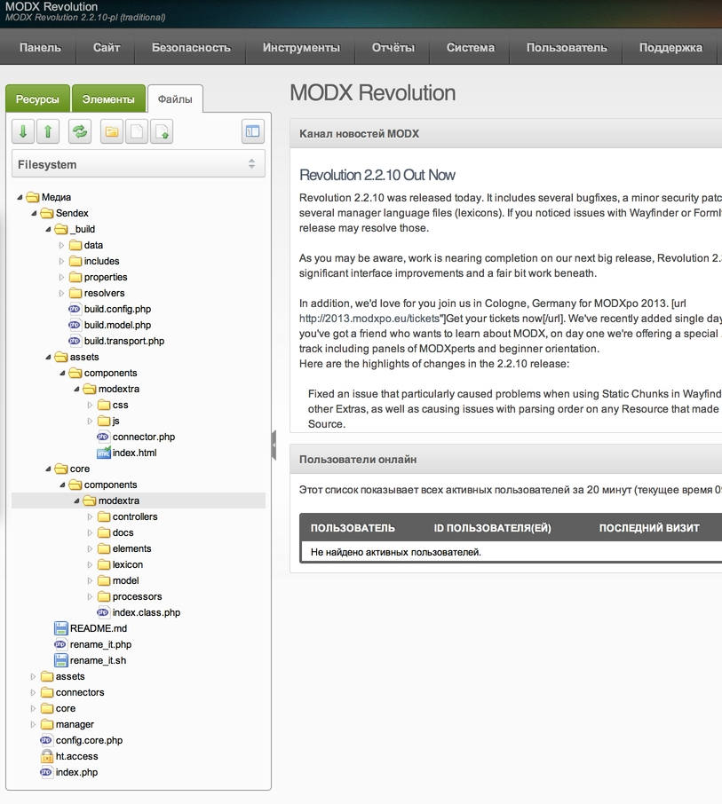

Теперь нам нужно переименовать заготовку modExtra в Sendex. Для этого воспользуемся скриптом `rename_it.php`. На моём сервере ссылка получается вот такая:

``` php
http://c2263.paas2.ams.modxcloud.com/Sendex/rename_it.php
```

Если открыть её без параметров, то скрипт требует указать новое имя:

``` php
You need to specify a new name of component in this file on line 9, or send it via $_GET["name"].
```

Окей, изменяем ссылку и указываем новое имя:

``` php
http://c2263.paas2.ams.modxcloud.com/Sendex/rename_it.php?name=Sendex
```

Видим кучу непонятных строк (на самом деле, это новые имена файлов и директорий), а значит, заготовка была успешно переименована, и теперь является настоящим компонентом.

Мы даже можем его собрать и установить, прямо сейчас, но тогда он создаст нам ненужные демо-таблицы в БД, так что это мы сделаем после написания своей схемы и генерации модели.

В админке уже видно новые файлы, а вот в проекте все по старому. Значит, их нужно синхронизировать. Учитывая, что в локальном проекте мы ничего не меняли, можно кликнуть **Download from MODXCloud** — IDE предупредит, что может перезаписать файлы. Спасибо, мы в курсе.

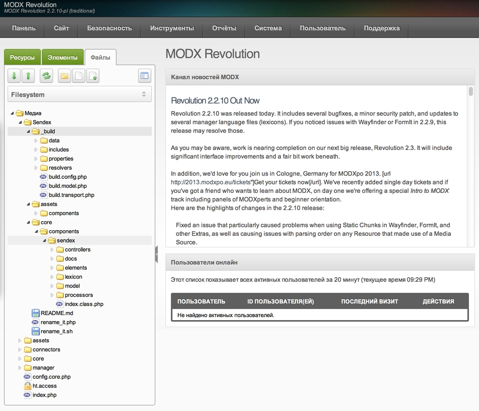


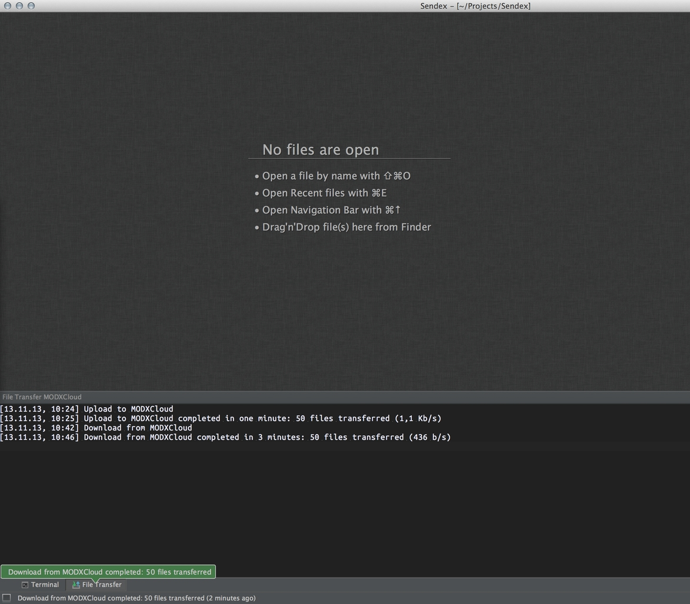

Теперь удаляем старые ненужные файлы и директории:

* `/core/components/modextra/`
* `/assets/components/modextra/`
* `rename_it.php`
* `rename_it.sh`

Если вы предусмотрительно активировали в настройках Deployment пункт Automatic upload, то все изменения будут сразу синхронизироваться:

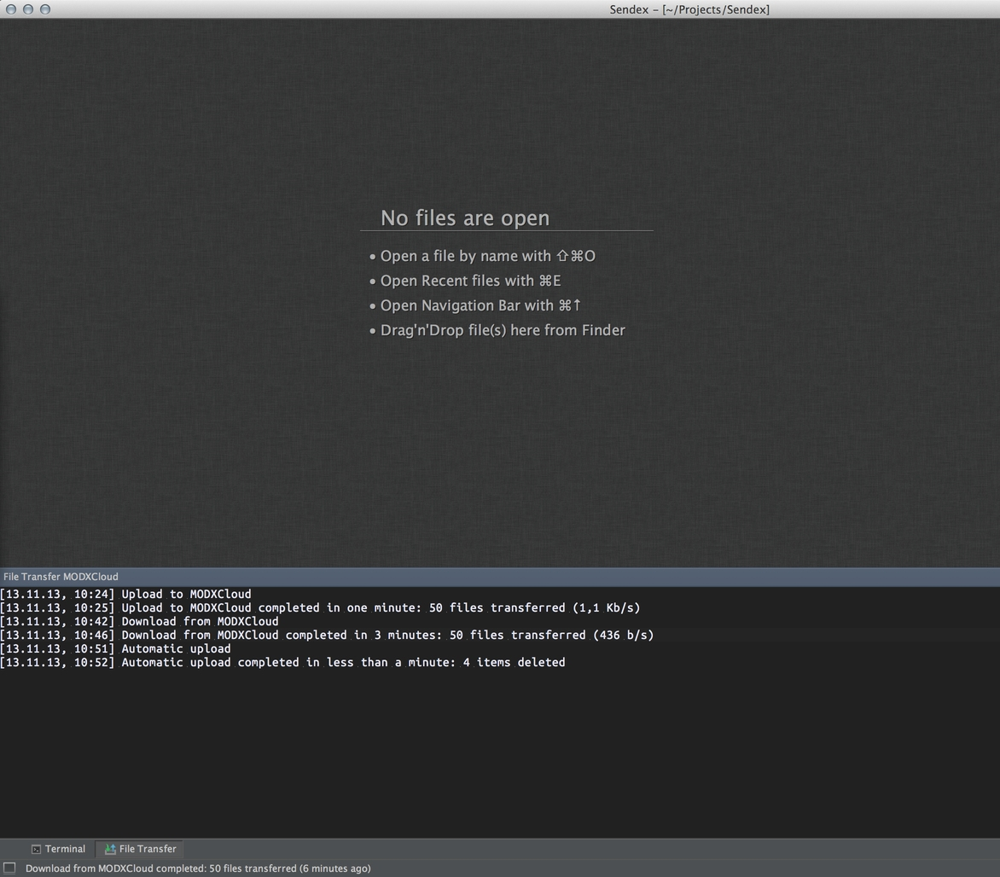

Пожалуйста, помните, что автоматическая синхронизация работает в одну сторону — от локального компьютера на сервер. Если вы редактируете файлы проекта через админку сайта — нужно синхронизировать эти изменения вручную.

Ну вот, теперь наш проект готов для первого коммита на GitHub.

## Работа с GitHub

Вообще, этот пункт не является обязательным. Вас никто не заставляет вести историю изменений файлов, принимать сообщения об ошибках и предложения изменения кода.

Вы можете спокойно хранить всё у себя в компьютере и не заморачиваться с этими вашими репозиториями. Однако, хороший программист всегда держит проект в чистоте и порядке, общается со своими пользователями и помнит, что и когда он изменил в своём коде. Я уж молчу про то, что репозиторий в интернет — отличная резервная копия.

Поэтому [регистрируемся на GitHub](https://github.com/join) и [качаем их приложение](http://windows.github.com/). С одной стороны, приложение это не обязательно, а с другой — оно установит консольный git, который нам очень нужен.

После установки возвращаемся в PhpStorm и бежим в настройки. Там есть поиск, в котором вводим git и видим совпадения:


Вводим и проверяем данные для доступа на GitHub, а затем указываем и проверяем путь к исполняемому файлу git (не знаю, где он будет на Windows — придётся поискать).

Если вы еще не удалили директорию `Sendex/.git`, то сейчас самое время это сделать, потому что нам нужно создать новый локальный репозиторий.

Жмём в меню **VCS → Enable version control**, выбираем git и сохраняем.

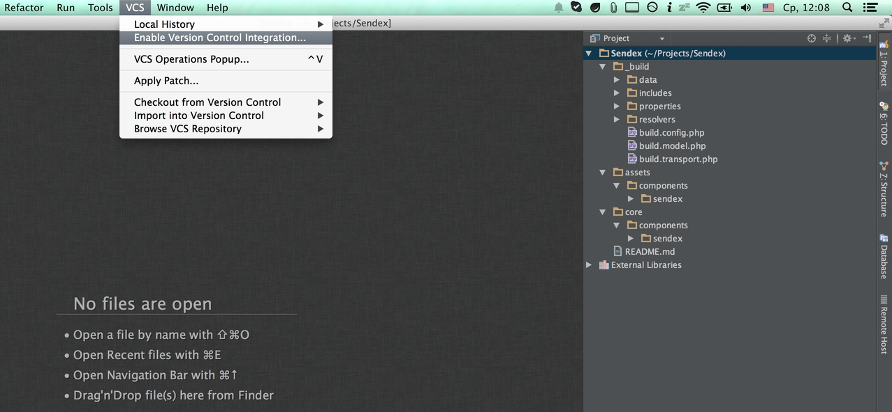

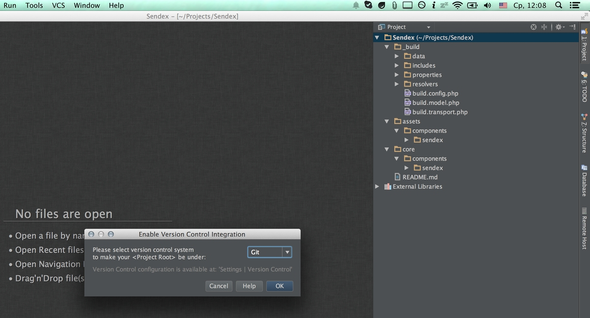

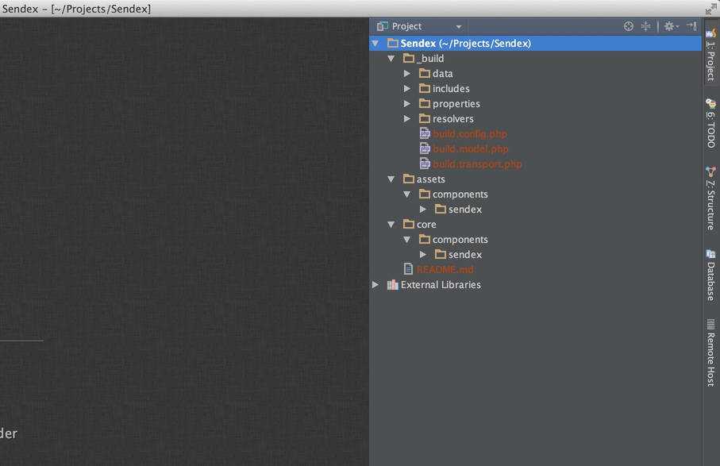

Все файлики стали коричневыми, это значит, что они не добавлены в репозиторий. Нужно добавить их через контекстное меню, в котором появился новый пункт Git, и они позеленеют.

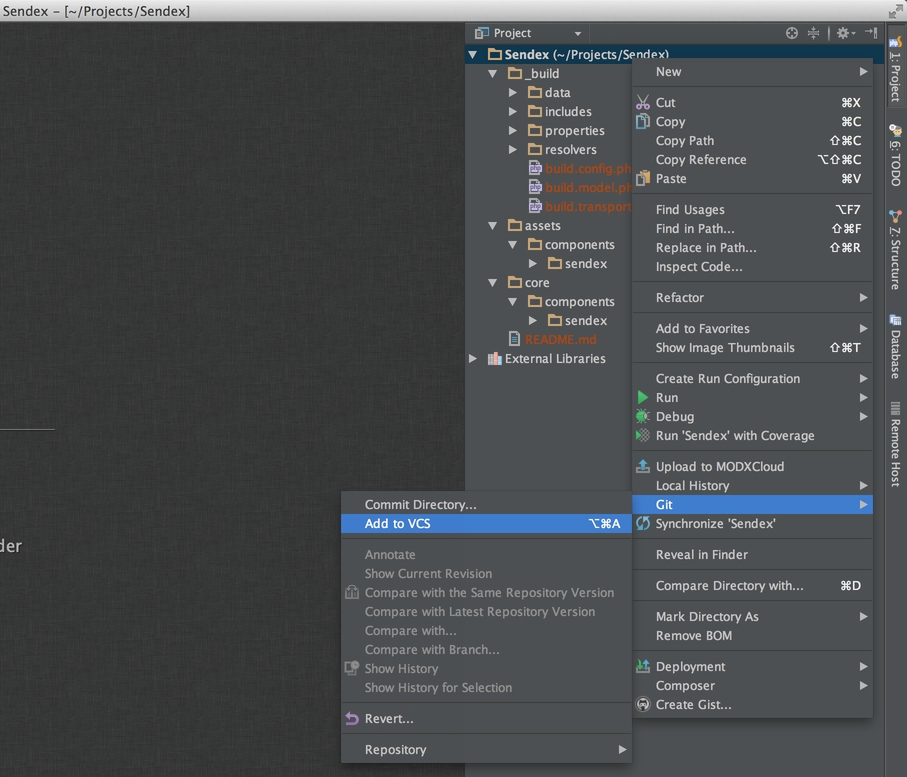

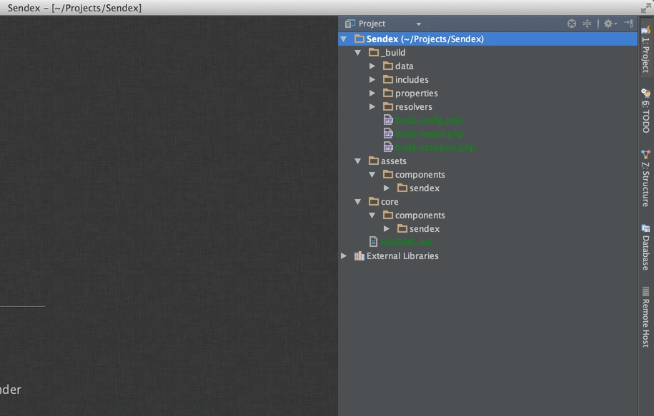

Наверное, уже пора вкратце рассказать, что же такое система контроля версий? Грубо говоря, любая система контроля версий, это программа, которая хранит изменения ваших файлов, с возможностью откатиться. Систем довольно много, но самый популярной сейчас является [Git](http://ru.wikipedia.org/wiki/Git), которую придумал [Линус Торвальдс](http://ru.wikipedia.org/wiki/%D2%EE%F0%E2%E0%EB%FC%E4%F1,_%CB%E8%ED%F3%F1) для разработки ядра Linux.

Основным отличием от конкурентов является удобное создание веток и их слияние. То есть, на каждое изменение можно создавать новую ветку, химичить там что-то, а затем вливать эти изменения в основной проект, разрешая конфликты (если возникнут).

Если никогда с таким не работал, то может быть непросто въехать. Поэтому советую почитать вот [этот учебник](http://githowto.com/ru/git_how_to), там все хорошо описано. Обратите внимание, что там даются знания, как работать с Git в коммандной строке, а я показываю тоже самое, только в PhpStorm.

**Еще раз напоминаю**, это вовсе не обязательно для разработки дополнений в MODX — это просто полезный навык, который может очень облегчить вам жизнь.

Еще одно отличие Git — это формат хранения. Он не лезет в ваши файлы, сохраняя всё нужно в одной директории **.git**. Фактически, `Sendex/.git` — это и есть репозиторий. Именно поэтому нам нужны было удалить старую директорию, которая была репозиторием modExtra.

Сейчас же мы создали новый, чистенький репозиторий Git, в котором не сохранено ни одного изменения. Этот репозиторий — **локальный**, он еще не привязан к GitHub, но полностью работоспособен. Вы можете копировать проект на флешку, носить туда-сюда и при этом его история изменений будет там же.

Для исключения файлов или директорий из системмы контроля версий используется файл `.gitignore`, и нам нужно добавить такой в корень репозитория:
`.idea`
Таким образом, мы отключи слежение за служебной директорией PhpStorm внутри проекта.

Удобно, не правда ли? Так зачем же тогда нужен GitHub? А вот затем, чтобы связать все ваши компьютеры, флешки и прочие хранилища одного проекта. Можно назвать GitHub **центральным хранилищем кода**. В настоящее время он хостит огромное количество проектов, которые разрабатываются разными людьми, и всё это не превращается в хаос. Кстати говоря, [MODX разрабатывается там же](https://github.com/modxcms/revolution/).

Файл **README.md** в корне проекта будет служить кратким описанием, поэтому я немного его изменил и теперь можно делать первый коммит, то есть фиксирование кода. Это будет как бы точка сохранения, на которую мы сможет потом откатиться, если что.

В PhpStorm это делается просто. Открываем вкладку **Changes** внизу IDE, и выбираем **Commit changes** в контекстном меню. перед отправкой изменений в репозиторий IDE показывает нам все изменённые файлы (а это сейчас весь проект), и просит ввести описание изменений.

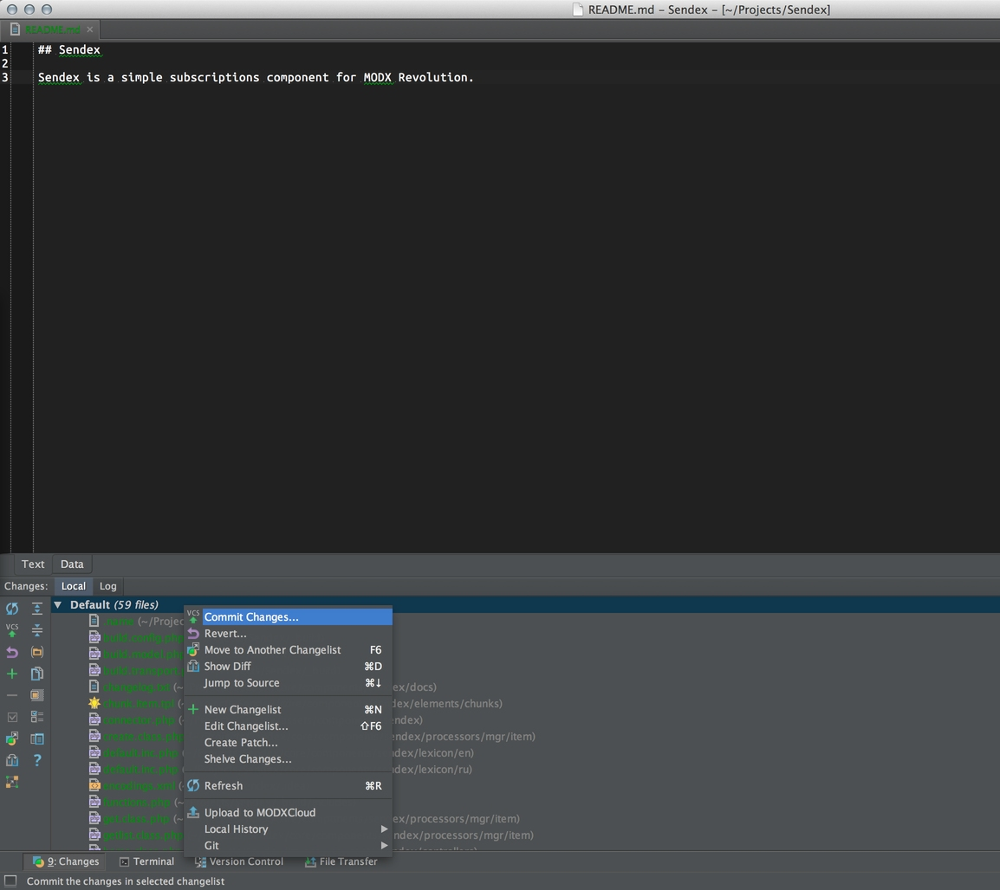

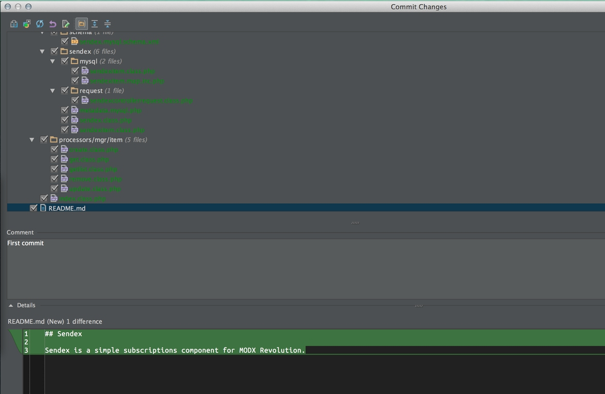

В первом комите изменений как бы нет, поэтому и пишем «First commit». Далее жмём commit и игнорируем предупреждения об ошибках в коде — больно уж умный этот PhpStorm! На вкладке **Version control** будет лог работы Git — ну вдруг, интересно?

Всё, изменения сохранены в наш локальный репозиторий, и с этого момента при каждом изменений файла проекта он будет становиться синим. Это значит, что в него внесены изменения, которые не были сохранены в репозитории — нужно закоммитить.

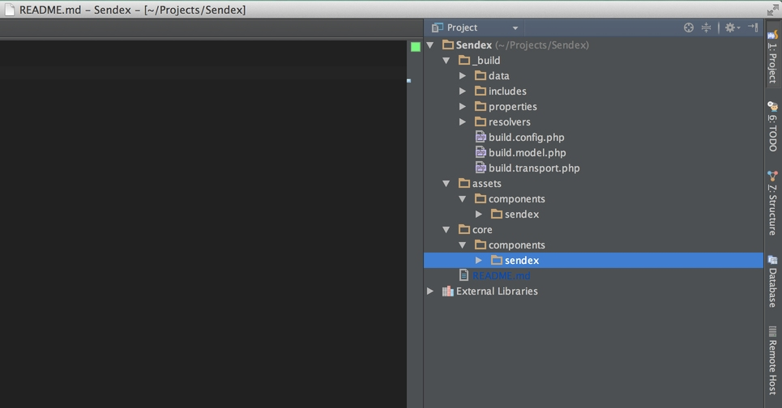

Ну а теперь нам осталось только связать наш удалённый проект с GitHub и отправить изменения в него, чтобы их могли видеть все желающие. К сожалению, я не нашел как это сделать прямо в PhpStorm, поэтому придётся через командную строку.

В этом нет ничего страшного, потому что нам все равно нужно сначала создать новый проект на Github — а он уже подскажет какие комманды нужно вводить.


Как видите, для отправки имеющегося репозитория (а это именно наш случай), нужно выполнить в коммандной строке:

``` php
git remote add origin https://github.com/bezumkin/Sendex.git
git push -u origin master
```

Причем, вторую команду можно запустить уже из PhpStorm. Обязательно отмечаем ветку **master**, в которую нужно отправить наш коммит:


Ну вот [наш проект и на GitHub](https://github.com/bezumkin/Sendex)! По идее, вы теперь вы можете сделать себе его форки (ответвления) и присылать мне свои коммиты, но на на сегодня хватит.

Также можно добавить локальный репозиторий в клиент GitHub, и оттуда уже запулить его на удалённый сервер.


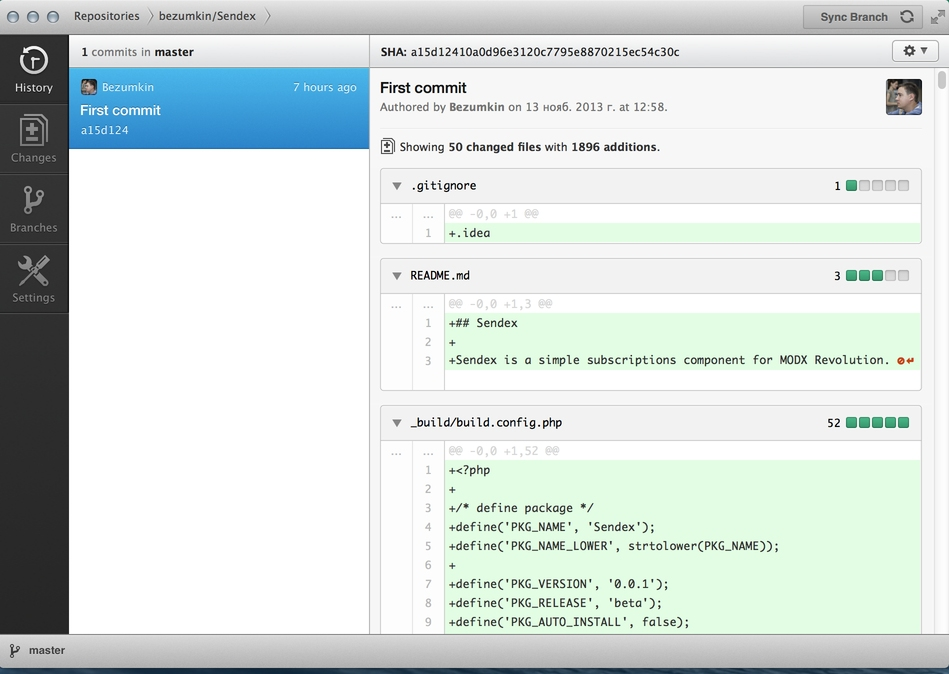


Тоже хороший вариант.

## Заключение

Сегодня мы выгрузили наш проект на сервер, переименовали, синхронизировали изменения и добавили систему контроля версий. Мы даже выгрузили наш репозиторий на GitHub, чтобы все интересующиеся могли наблюдать за прогрессом нашиего курса =)

На следующем занятии продумываем логику работы компонента, пишем схему и генерируем модель БД.
