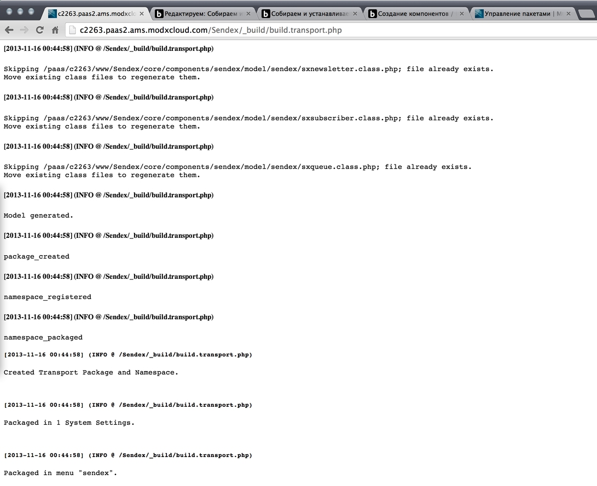
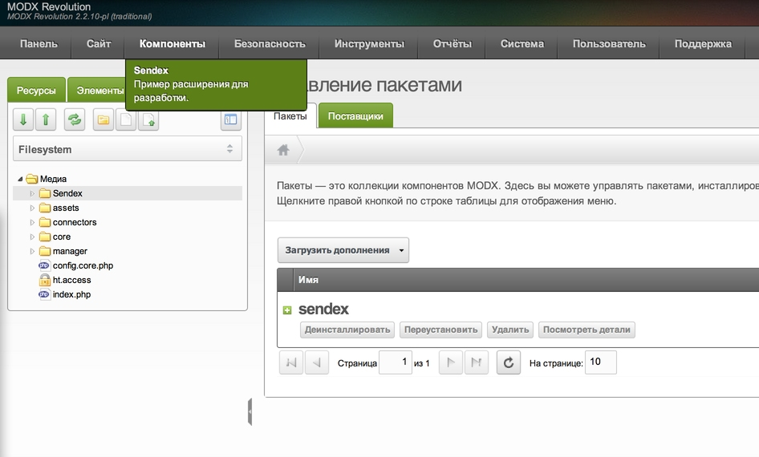
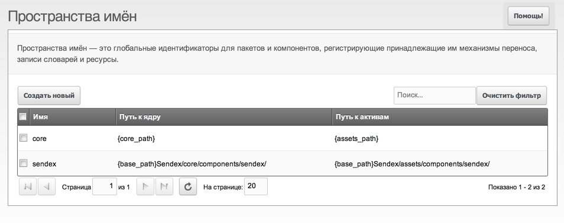
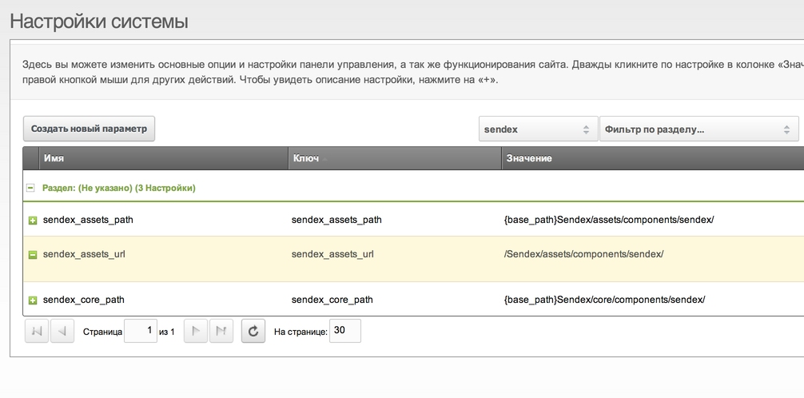
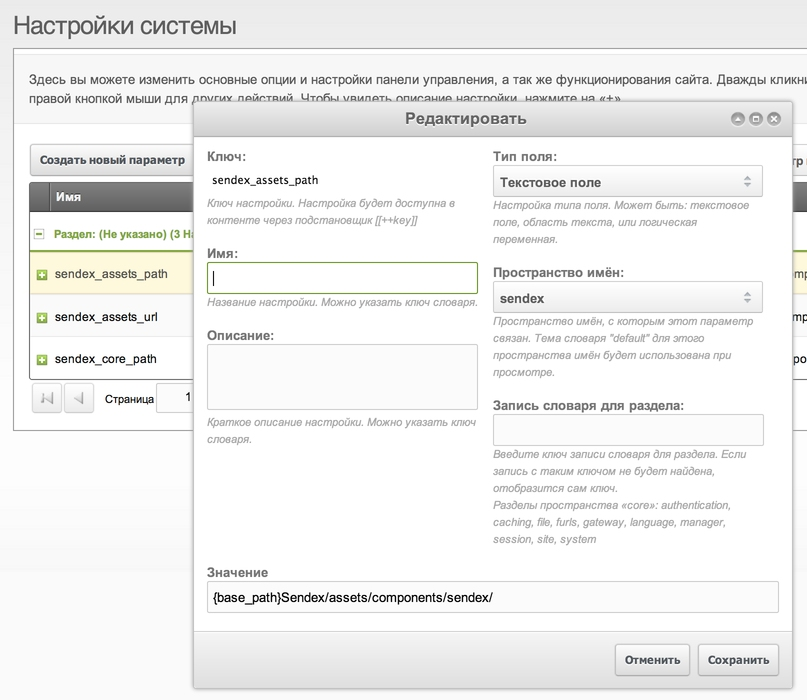
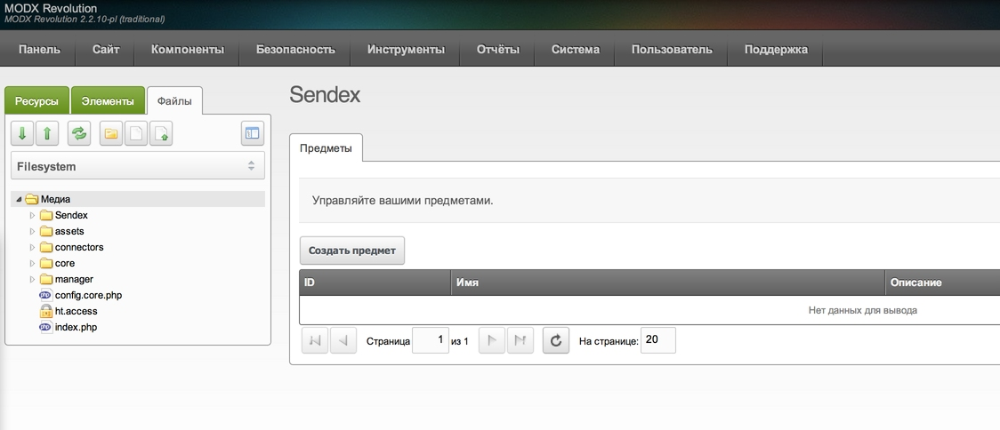
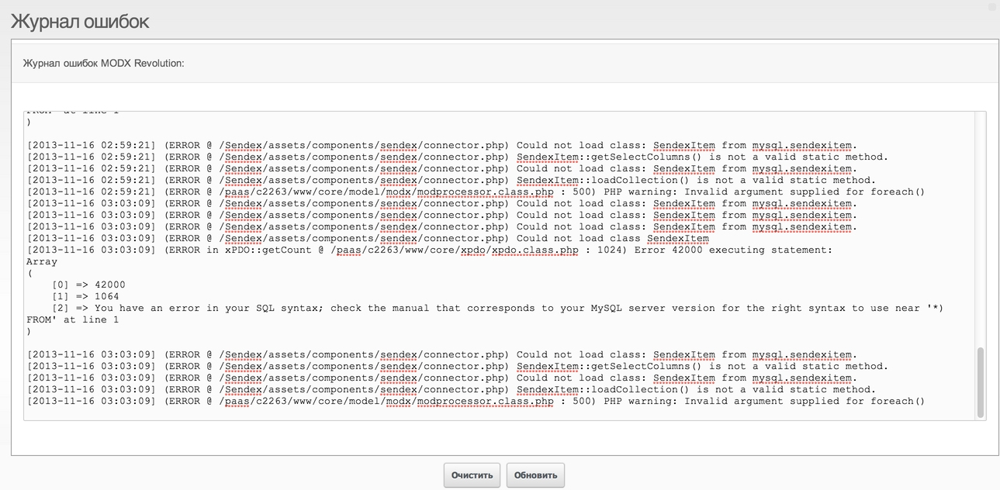
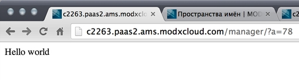
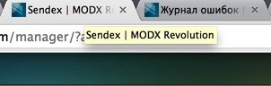
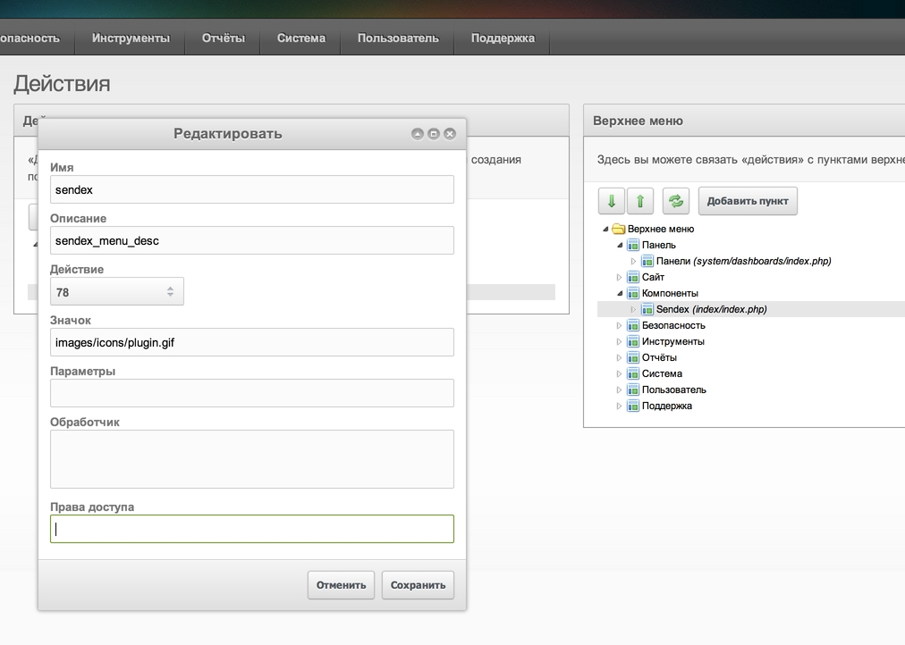

В прошлом уроке мы определились с примерным функционалом, написали схему таблиц и сгенерировали модель xPDO для MySQL.

Сегодня собираем и устанавливаем первую версию пакета и смотрим, как устроены [Custom Manager Pages](extending-modx/custom-manager-pages).

## Скрипты сборки (актуальный modExtra)

В старых материалах курса фигурировали `build.transport.php` и `build.config.php`. В текущих заготовках этих файлов **нет**.

| MODX | Заготовка | Сборка | Конфиг |
| --- | --- | --- | --- |
| 3.x | [modx-pro/ModExtra3](https://github.com/modx-pro/ModExtra3) | `_build/build.php` | `_build/config.inc.php` |
| 2.x | [modx-pro/modExtra](https://github.com/modx-pro/modExtra) | `_build/build.php` | `_build/config.inc.php` |

Рабочая копия лежит в каталоге `Extras/` в корне сайта. Переименование через `rename_it.php`, затем сборка:

```bash
php ~/www/Extras/modExtra/rename_it.php Sendex
php ~/www/Extras/Sendex/_build/build.php
```

То же можно открыть в браузере:

`https://your-dev-site/Extras/Sendex/_build/build.php`

Параметр `?download=1` отдаёт готовый transport zip после сборки.

В `config.inc.php` автоустановка это флаг `'install' => true` (не константа `PKG_AUTO_INSTALL`):

```php
return [
    'name' => 'Sendex',
    'name_lower' => 'sendex',
    'version' => '1.0.0',
    'release' => 'pl',
    'install' => true,
    // ...
];
```

При `'install' => true` скрипт собирает пакет и сразу ставит его через Package Management. Если `false`, зайдите в **Приложения → Установщик**, найдите пакет локально и установите zip вручную.





Списки элементов лежат в `_build/elements/` (например `menus.php`, `snippets.php`). PHP-файлы, имя которых не начинается с `.` или `_`, подхватываются автоматически. Резолверы в `_build/resolvers/`. Подробнее: [Структура компонента](extending-modx/creating-components/component-structure).

## Меню

В MODX 3 объекта `modAction` уже нет. Пункт меню это `modMenu`, в поле `action` пишется имя контроллера внутри namespace компонента.

В актуальных modExtra / ModExtra3 меню задаётся в [`_build/elements/menus.php`](https://github.com/modx-pro/ModExtra3/blob/master/_build/elements/menus.php):

```php
return [
    'sendex' => [
        'description' => 'sendex_menu_desc',
        'action' => 'home',
        // 'parent' => 'components', // так задаёт скрипт сборки по умолчанию
    ],
];
```

- `action` → файл `core/components/sendex/controllers/home.class.php` (класс вроде `SendexHomeManagerController`).
- `parent` → обычно `components`. Пустая строка для корневого пункта, который только открывает подменю.
- `handler` → необязательный JavaScript. Для «пустого» родителя часто `return false;`.

В старых коммитах Sendex ещё встречается `_build/data/transport.menu.php` с вложенным массивом `action` под `modAction`. Это история. Для MODX 3 используйте `menus.php`, как выше.

## Настройка для разработки

Каталог проекта (например `Extras/Sendex`) это рабочее дерево. После установки MODX также кладёт файлы в `core/components/sendex/` и `assets/components/sendex/`. Правки в `Extras/Sendex` не попадут в установленные копии, пока вы не пересоберёте пакет или не направите namespace на проект.

Варианты:

1. После каждого изменения собирать и ставить пакет заново.
2. Указать namespace (и пути) на `Extras/Sendex`, чтобы менеджер читал PHP/JS из проекта.

Для варианта 2: **Система → Пространства имён**, откройте `sendex` и пропишите путь к `core` проекта. В ModExtra3 резолвер `symlinks` может сам сделать ссылки `core` и `assets` обратно в `Extras/`.



При необходимости создайте системные настройки `sendex_core_path` и `sendex_assets_url` (демо-настройки можно удалить):





```php
$corePath = $this->modx->getOption(
    'sendex_core_path',
    $config,
    $this->modx->getOption('core_path') . 'components/sendex/'
);
$assetsUrl = $this->modx->getOption(
    'sendex_assets_url',
    $config,
    $this->modx->getOption('assets_url') . 'components/sendex/'
);
```

На время разработки можно включить вывод ошибок в корневых `index.php` и `manager/index.php` (хостинги часто их прячут). На проде так не оставляйте.

## Контроллеры CMP

По клику на пункт меню MODX загружает контроллер из `action` в каталоге `controllers/` компонента.

Домашний контроллер ModExtra3 наследует `MODX\Revolution\modExtraManagerController` и уже подключает ассеты через `addCss()` / `addJavascript()` / `addHtml()`. См. [`controllers/home.class.php`](https://github.com/modx-pro/ModExtra3/blob/master/core/components/modextra/controllers/home.class.php).

В уроках Sendex ещё разбирается старая цепочка (`index.class.php` → `SendexMainController` → `home.class.php`). Смысл тот же: входной контроллер поднимает конфиг и ассеты, затем отдаёт страницу дочернему. После настройки путей во входной файл почти не лезут.

После первой установки из заготовки откройте CMP. Демо-гриды могут писать ошибки в лог, пока вы не замените процессоры. Так и должно быть.





Проверка, что менеджер читает ваш проект: временно в начале активного контроллера:

```php
echo 'Hello world';
die;
```

Сохраните и обновите CMP. Если видите сообщение, namespace смотрит в рабочую копию.



Повторная сборка может сбросить пути namespace. Поправьте резолвер или namespace после установки, если работаете из `Extras/`. В истории Sendex есть [правки установщика под это](https://github.com/bezumkin/Sendex/commit/5416d620300261025420f9e73c41ee3a6fb9fd5a).

## Основные методы контроллера

Полезные методы домашнего контроллера:

### getPageTitle

Текст для title страницы в менеджере (часто ключ лексикона).



### getTemplateFile

Путь к Smarty-шаблону или пустая строка, если разметку добавляет сам контроллер (в ModExtra3 в контроллер дописывается `<div id="...">`, метод возвращает `''`).

### getLanguageTopics

Темы лексиконов, например `['sendex:default']`.

### checkPermissions

Вернуть `true`/`false` или опираться на права в настройках меню.



### loadCustomCssJs

Подключает CSS/JS страницы. Сюда обычно идёт основная работа по UI CMP.

## Заключение

Сборка идёт через `_build/build.php`, автоустановка через `'install'` в `_build/config.inc.php`. Меню на MODX 3 это `modMenu` со строковым `action`, без `modAction`. Для живых правок без постоянной пересборки направьте namespace на `Extras/YourExtra`.

Дальше: интерфейс админки на ExtJS.

История Sendex: [коммиты](https://github.com/bezumkin/Sendex/commits/master). Новые extras под MODX 3 начинайте с [ModExtra3](https://github.com/modx-pro/ModExtra3).
