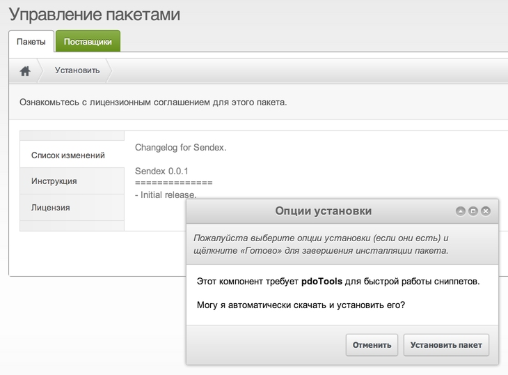
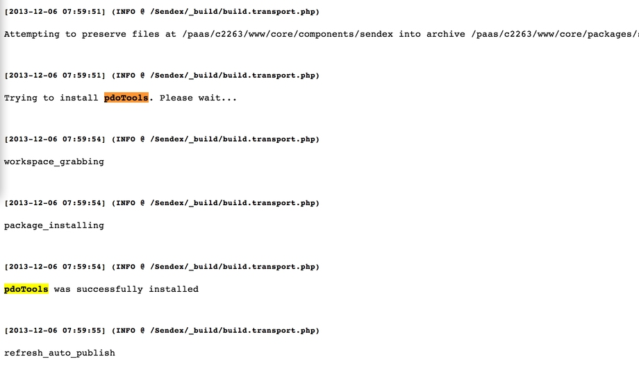
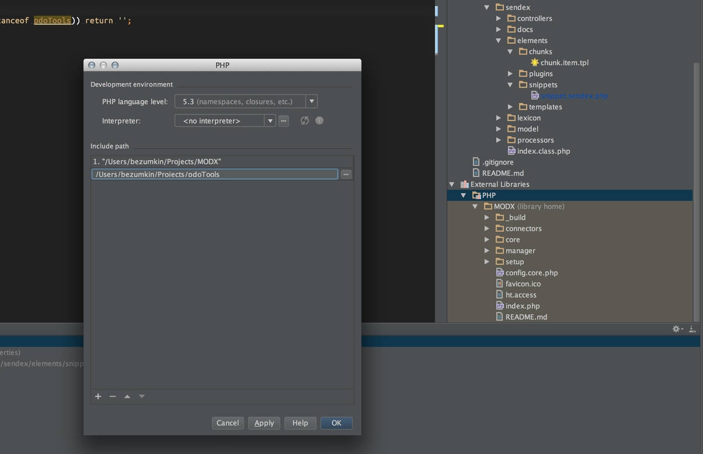
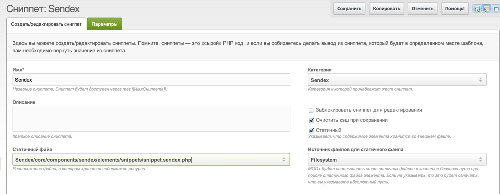
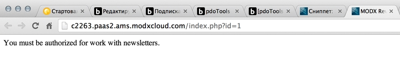
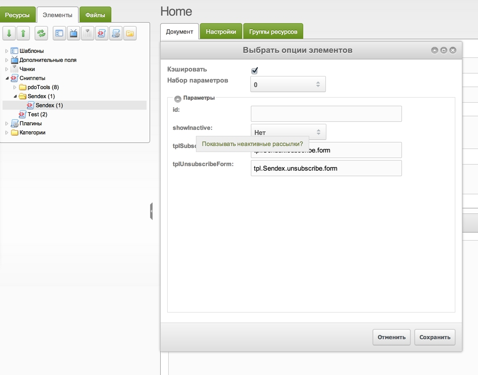
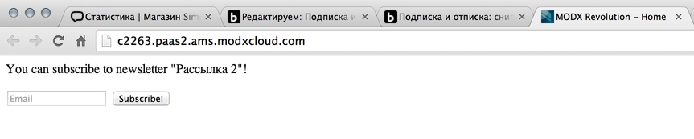
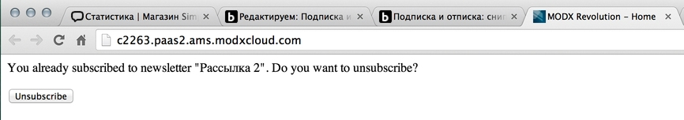

На прошлых занятиях мы закончили написание административного интерфейса нашего компонента и теперь переходим на фронтенд.

Нам нужено организовать возможно самостоятельной работы авторизованным пользователям с подписками. Определяем минимальный функционал:

* Вывод формы подписки на определенную рассылку — её мы укажем по id
* Если юзер уже подписан — тогда показываем форму отписки
* При том и другом действие происходит отправка писем с кодом, для подтверждения
* При переходе по коду, его ловит плагин и выполняет что нужно

Для сниппета мы будем использовать pdoTools. Во-первых, это быстро и удобно, а во вторых велика вероятность, что он уже установлен на сайте. Если же нет — нужно предусмотреть и автоматическую установку, при инсталляции пакета.

Автоустановка пакетов
В официальных пакетах MODX используется поставка транспортных zip в составе своего пакета. То есть, качаете один Articles, а там внутри еще [5 пакетов](https://github.com/splittingred/Articles/tree/develop/_build/subpackages) не самых свежих версий. Причем, во время установки вас никто об этом не предупредит, а при деинсталяции тоже могут быть заморочки.

Поэтому, я придумал другой способ — загрузка нужных пакетов из репозитория в ресолвере. Это даёт возможность указания минимальной версии пакета, выбор репозитория и работу толкьо после согласия пользователя.



Если пользователь принципиально против — он может отказаться от установки, решать ему.

Итак, чтобы выполнять каакие-то произвольные действия с согласия пользователя мы используем специальный атрибут `/_build/build.transport.php`:

``` php
$builder->setPackageAttributes(array(
    'changelog' => file_get_contents($sources['docs'] . 'changelog.txt')
    ,'license' => file_get_contents($sources['docs'] . 'license.txt')
    ,'readme' => file_get_contents($sources['docs'] . 'readme.txt')
    // Вот он - опции установки!
    ,'setup-options' => array(
        // Указываем использовать ресолвер setup
        'source' => $sources['build'].'setup.options.php',
    ),
));
```

У вас этот блок закомментирован — нужно раскомментить.

Затем создаём файл-ресолвер `/_build/resolvers/resolve.setup.php`. Внутри обычная обвязка по определению действия установщика:

``` php
if ($object->xpdo) {
    /* @var modX $modx */
    $modx =& $object->xpdo;
    $success= false;
    switch ($options[xPDOTransport::PACKAGE_ACTION]) {
        case xPDOTransport::ACTION_INSTALL:
        case xPDOTransport::ACTION_UPGRADE:
            $success = true;
            break;
        case xPDOTransport::ACTION_UNINSTALL:
            $success = true;
            break;
    }
    return $success;
}
```

Вписываем установку pdoTools версии 1.8, обратите внимание — у нас тут массив, можно списать еще несколько дополнений, если нужно:

``` php
case xPDOTransport::ACTION_UPGRADE:
    /* Checking and installing required packages */
    $packages = array(
        'pdoTools' => array(
            'version_major' => 1,
            'version_minor:>=' =>  8,
        )
    );
    foreach ($packages as $package => $options) {
        $query = array('package_name' => $package);
        if (!empty($options)) {$query = array_merge($query, $options);}
        if (!$modx->getObject('transport.modTransportPackage', $query)) {
            $modx->log(modX::LOG_LEVEL_INFO, 'Trying to install <b>'.$package.'</b>. Please wait...');

            // Собственно закачка пакета специальной функцией
            $response = installPackage($package);
            if ($response['success']) {$level = modX::LOG_LEVEL_INFO;}
            else {$level = modX::LOG_LEVEL_ERROR;}

            $modx->log($level, $response['message']);
        }
    }
    $success = true;
    break;
```

Закачивает и устанавливает пакеты моя функция `installPackage`, о которой я писал в отдельной заметке.

Также еще нужно поправить ресолвер `resolve.tables.php` — там есть небольшой баг, который не даёт работать другим ресолверам после него:

``` php
// Меняем $object на $tmp
foreach ($objects as $tmp) {
    $manager->createObjectContainer($tmp);
//...
```

Вот коммит со всеми изменениями, нужными для автоустановки pdoTools.

Теперь можно синхронизировать все файлы с сервером и заново собрать пакет. Если у вас в конфиге включена опция автоустановки при сборке — в списке пакетов сайта должен появиться pdoTools.



Теперь вы знаете, как можно устанавливать любые дополнения из репозиториев MODX в своих компонентах.

## Подготовка файлов

Теперь оформляем сниппет Sendex, который будет выводить наши формы отписки\подписки и проверять статус юзера.

Вообще-то, он у нас уже есть и даже установлен — там стандартное содержимое от modExtra. Нужно его переписать и добавить свои параметр сниппету.

Работаем с файлами:

* `/_build/data/transport.snippets.php` — Здесь у нас указано, что нужно запаковывать сниппет Sendex, откуда его брать и какие добавлять параметры
* `/_build/properties/properties.sendex.php` — Массив параметров, его мы будем изменять
* `/core/components/sendex/elements/snippets/snippet.sendex.php` — Сам сниппет с выводом и обработкой форм.

Формы будут в чанках, так что нам понадобятся еще файлы:

* `/_build/data/transport.chunks.php` — Перечень чанков для установки
* `/core/components/sendex/elements/chunks` — Здесь мы создадим новые чанки

Ну вроде подготовились, пишем сниппет.

## Сниппет Sendex

Чтобы PhpStorm адекватно воспринимал pdoTools и его методы — нужно [загрузить последнюю версию](https://github.com/bezumkin/pdoTools/archive/master.zip) из репозитория, распаковать куда-то и добавить в проект.



На время активной разработки сниппета, его можно сделать статичным — тогда он должен обновляться сразу при загрузке файлов на сервер. Путь нужно указать такой:

``` php
Sendex/core/components/sendex/elements/snippets/snippet.sendex.php
```



Инициализируем классы **Sendex** и **pdoTools**:

``` php
<?php
/** @var array $scriptProperties */
/** @var Sendex $Sendex */
$Sendex = $modx->getService('sendex','Sendex',$modx->getOption('sendex_core_path',null,$modx->getOption('core_path').'components/sendex/').'model/sendex/',$scriptProperties);
/** @var pdoTools $pdoTools */
$pdoTools = $modx->getService('pdoTools');

if (!($Sendex instanceof Sendex) || !($pdoTools instanceof pdoTools)) return '';
```

Обратите внимание на комментарии перед переменными — это чтобы PhpStorm понимал, о чем идёт речь. Sendex инициализируется так сложно, чтобы можно было использовать его класс из нашей директории разработки.

А вот pdoTools, наоборот, загружается очень просто.

При загрузке класса Sendex выполняется его метод `__construct()` в файле `/core/components/sendex/model/sendex/sendex.class.php`, который загружает модель компонента и лексикон. Мы сразу можем их использовать.

Ранее я говорил, что пока мы пишем компонент только для зарегистрированных пользователей (потом я уберу это ограничение, но уже после курсов), поэтому выставляем проверку:

``` php
if (!$modx->user->isAuthenticated($modx->context->key)) {
    return $modx->lexicon('sendex_err_auth_req');
}
```

Сохраняем, вызываем и проверяем.



Теперь нужно сделать авторизацию на сайте (HybridAuth, Login, Loginza — на выбор) или набросать авторизующий плагин для админов. Второе быстрее и проще, поэтому создаём в админке плагин **autoWebAuth**:

``` php
if ($modx->event->name == 'OnManagerPageInit' && !$modx->user->hasSessionContext('web')) {
    $modx->user->addSessionContext('web');
}
```

Отмечаем действие OnManagerPageInit, сохраняем, обновляем страницу и мы авторизованы на фронтенде, в контексте **web** — ошибка сниппета пропала.

Добавляем проверку указания id подписки для работы сниппет. Вот и первый параметр — **id**:

``` php
elseif (empty($id) || !$newsletter = $modx->getObject('sxNewsletter', $id)) {
    return $modx->lexicon('sendex_newsletter_err_ns');
}
```

Я обращаюсь к `$id`, а не к `$scriptProperties['id']` потому, что все переменные этого массива доступны в сниппете благодаря функции [extract()](http://www.php.net/manual/ru/function.extract.php), которую MODX запускает при его старте.

Если вы там будуте делать, то всегда нужно проверять переменную на существование, ведь она может быть не прописана в параметрах сниппета, и тогда мы получим `E_NOTICE` уведомление, мол `undefined`.

Сохраняем сниппет, проверяем:


Указываем id существующей подписки в вызове сниппета и добавляем следующую проверку — на активность:

``` php
/** @var sxNewsletter $newsletter */
if (!$newsletter->active && empty($showInactive)) {
    return $modx->lexicon('sendex_newsletter_err_disabled');
}
```

Как видите, здесь появился очередной параметр `showInactive`. Он позволяет работать с неактивными подписками.

Проверяем, какую форму нам нужно вывести:

``` php
if ($newsletter->isSubscribed($modx->user->id)) {
    return !empty($tplUnsubscribeForm)
        ? $pdoTools->getChunk($tplUnsubscribeForm, $newsletter->toArray())
        : 'Parameter "tplUnsubscribeForm" is empty';
}
elseif (!$newsletter->isSubscribed($modx->user->id)) {
    return !empty($tplSubscribeForm)
        ? $pdoTools->getChunk($tplSubscribeForm, $newsletter->toArray())
        : 'Parameter "tplSubscribeForm" is empty';
}
```

Новые параметры с именами чанков и новый метод `sxNewsletter::isSubscribed()` для проверки статуса юзера по отношению к подписке — его нужно добавить. Лексиконы я здесь не использую, ибо чанки должны быть всегда заданы и это уже просто перестраховка для невнимательного админа.

[Коммит обновлённого класса](https://github.com/bezumkin/Sendex/commit/1efef64ff6f648871cb151eb0ff5998b27414eb2) `sxNewsletter`.

Редактируем `/core/components/sendex/model/sendex/sxnewsletter.class.php`:

``` php
public function isSubscribed($user_id = 0, $email = '') {
    $q = $this->xpdo->newQuery('sxSubscriber', array('newsletter_id' => $this->get('id')));
    if (!empty($id)) {
        $q->where(array('user_id' => $user_id));
    }
    if (!empty($email)) {
        $q->where(array('email' => $email));
    }
    return (bool) $this->xpdo->getCount('sxSubscriber', $q);
}
```

Как видите, проверяем подписанность юзера по `id` или `email` или по обоим сразу. В ответ получаем `true` или `false`.

Прописываем имеющиеся параметры сниппету в `/_build/properties/properties.sendex.php`:

``` php
$tmp = array(
    // Цифровое поле для указания id рассылки
    'id' => array(
        'type' => 'numberfield',
        'value' => '',
    ),
    // Переключатель да\нет
    'showInactive' => array(
        'type' => 'combo-boolean',
        'value' => false,
    ),
    // Форма подписки с чанком по умолчанию
    'tplSubscribeForm' => array(
        'type' => 'textfield',
        'value' => 'tpl.Sendex.subscribe.form',
    ),
    // Форма отписки с чанком по умолчанию
    'tplUnsubscribeForm' => array(
        'type' => 'textfield',
        'value' => 'tpl.Sendex.unsubscribe.form',
    ),
);
```

Добавляем строки с описанием параметров в лексикон `/core/components/sendex/lexicon/en/properties.inc.php` и `/core/components/sendex/lexicon/ru/properties.inc.php`.

После этого можно пересобрать пакет.



Как видите, при перетаскивании сниппета в окошко страницы появляются параметры с подписями. Теперь пользователям будет очень удобно пользоваться нашим компонентом — запоминать параметры не нужно.

После пересборки и установки пакета, сниппет снова стал не статичным. Можно исправить это, как было.
[Коммит сниппета с его параметрами](https://github.com/bezumkin/Sendex/commit/c628a376f687dd35ce898eff651e47a829a4aa8f).

## Чанки подписки и отписки

Нужно добавить чанки подписки и отпискию Создаём два файла с говорящими названиями:

* `/core/components/sendex/elements/chunks/chunk.subscribe.form.tpl`
* `/core/components/sendex/elements/chunks/chunk.unsubscribe.form.tpl`

и добавляем их в установку пакета `/_build/data/transport.chunks.php`:

``` php
$tmp = array(
    'tpl.Sendex.subscribe.form' => array(
        'file' => 'subscribe.form',
        'description' => '',
    ),
    'tpl.Sendex.unsubscribe.form' => array(
        'file' => 'unsubscribe.form',
        'description' => '',
    ),
);
```

Мы создаём чанки, которые указаны по умолчанию в параметрах сниппета, поэтому пользователю не придётся их указывать каждый раз.

Пишем простейшие формы, нам главное указать там `sx_action: subscribe` или `unsubscribe`. У меня в итоге получилось вот так:





Логику подписки\отписки мы оставляем на следующий урок, а переключение форм вы можете проверить добавляя и удаляя своего юзера в админке.

Да, советую выставить константу `BUILD_CHUNK_UPDATE` в `true`, чтобы чанки обновлялись при пересборке пакета. Напоминаю, что опции сборщика находятся в `/_build/build.config.php`.

[Коммит с чанками](https://github.com/bezumkin/Sendex/commit/fe4e4cba44bb136570436fe8ca74c553ea6dd8c9).

## Заключение

Вот мы и написали наш простенький сниппет **Sendex**, правда пока без логики подписки и отписки — это на следующем уроке.

Не забывайте добавлять записи в лексиконы — [вот мои](https://github.com/bezumkin/Sendex/commit/4a412e360a15fe9da383f4e39208f76a7aa173fa).

Разработка получается долгой, так как я рассказываю все очень подробно, возможно даже слишком. В любом случае, мы уже почти у цели, осталось немного.
