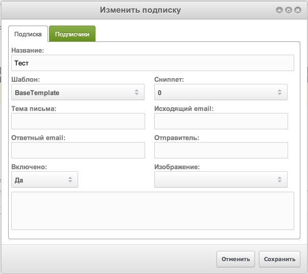
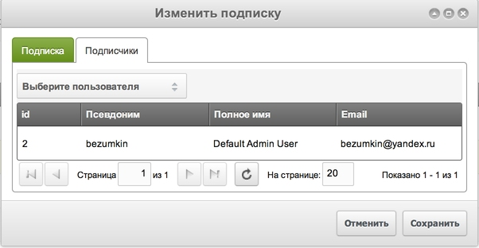
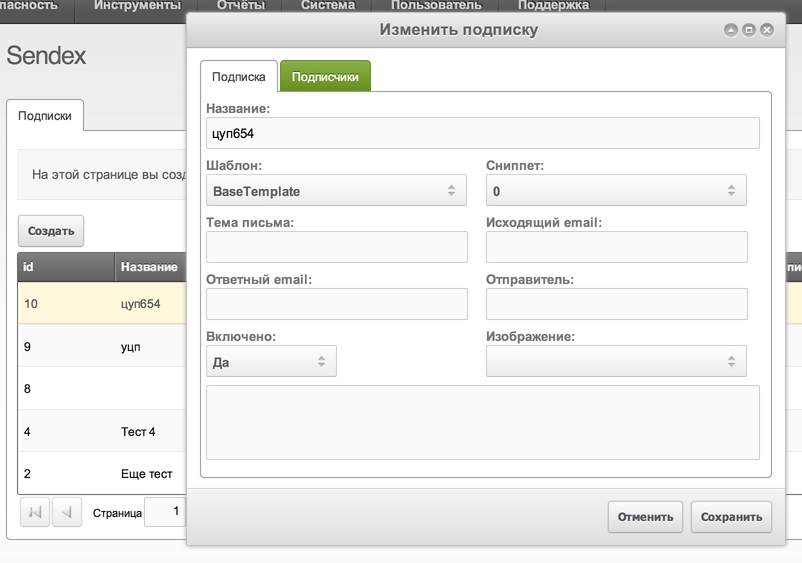
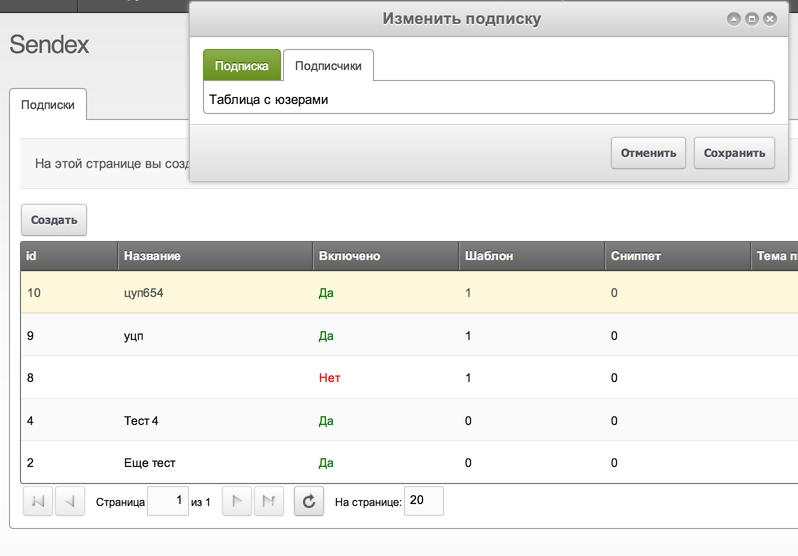
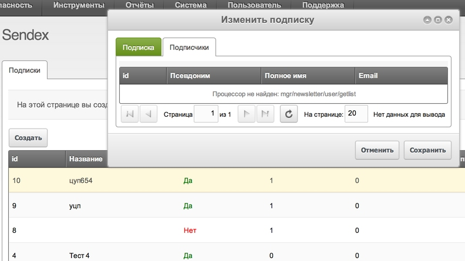
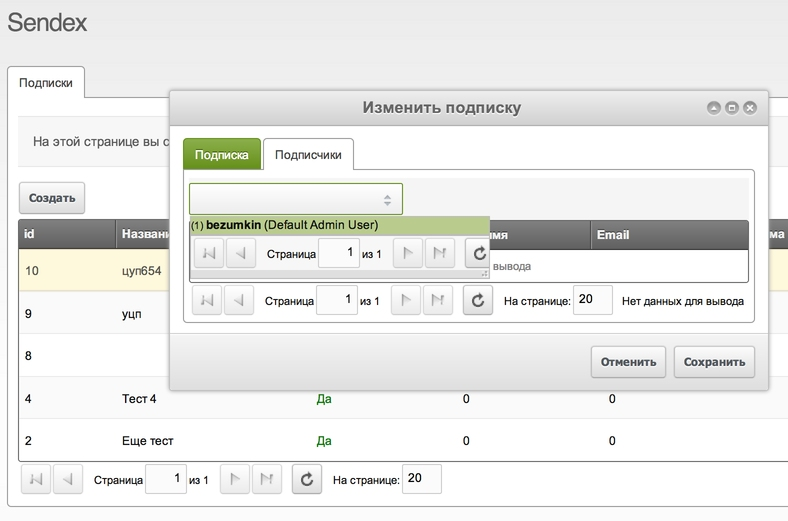
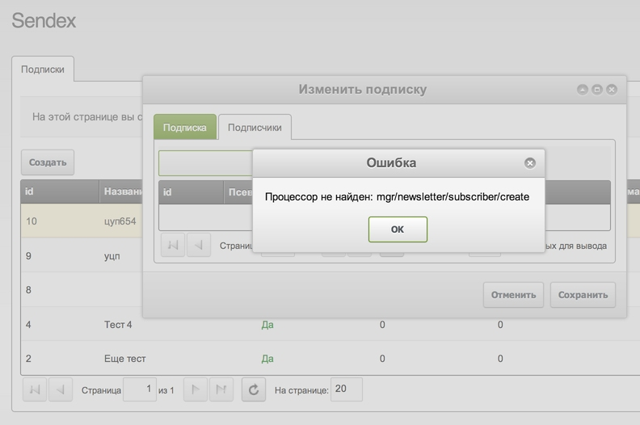
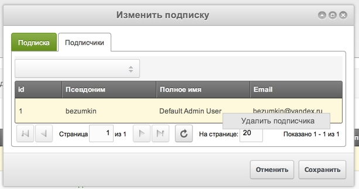
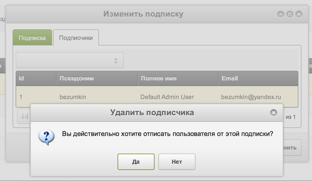

На прошлом занятии мы сделали таблицу подписок и окно создания.

Теперь нам нужно добавить окно изменения подписки, и сложность здесь в управлении подписчиками — нам нужно окно с вкладками.
На первой те же поля, что и при создании, а на второй — добавление и удаление пользователей.

Для работы с пользователями, нужно написать свои процессоры: выборка, поиск и добавление\удаление к подписке.





## Окно в вкладками

Как вы уже знаете, в ExtJS можно вкладывать одни компоненты внутрь других. Мы это видели на примере простого окна, где внутри была форма с кнопочками.

Теперь нам нужно эту же самую форму обернуть в табы. Мы работаем с **Sendex.window.UpdateNewsletter** и нам нужно указать `xtype: 'modx-tabs'` в параметре `fields`:

``` javascript
,fields: {
    // У нас здесь табы
    xtype: 'modx-tabs'
    // Рендерим их сразу
    ,deferredRender: false
    // Добавляем обводку
    ,border: true
    // И отступы для контекта внутри таба
    ,bodyStyle: 'padding:5px;'
    // Пошло перечисление табов
    ,items: [{
        // Таб №1 - Подписка
        title: _('sendex_newsletter')
        // Как прятать при переключении - советую всегда использовать offset
        ,hideMode: 'offsets'
        // Указываем, что содержимое таба - форма
        ,layout: 'form'
        // Здесь уже не нужна обводка
        ,border:false
        // Пошли поля формы
        ,items: [
            // Обязательно скрытый input с id, чтобы процессор понял, что мы обновляем
            {xtype: 'hidden',name: 'id',id: 'sendex-'+this.ident+'-id'}
            // Дальше все те же поля, что и в форме создания
            // ...
        ]
    },{
        // Таб №2 - Пользователи
        title: _('sendex_subscribers')
        // Здесь должен быть xtype с таблицей подписчиков, пока комментируем
        //,xtype: 'sendex-grid-newsletter-subscribers'
        ,xtype: 'displayfield'
        ,html: '<p>Таблица с юзерами</p>'
    ]}
}
```

И получаем работающее окошко с двумя вкладками.





Нужно добавить в процессор **newsletter/update** те же проверки, что и в **create**, но с одним изменением:

``` javascript
if ($this->modx->getCount($this->classKey, array('name' => $this->getProperty($tmp), 'id:!=' => $this->getProperty('id')))) {
    $this->addFieldError($tmp, $this->modx->lexicon('sendex_newsletter_err_ae'));
}
```

Уникальность имени нужно проверять с учетом id, иначе процессор будет ругаться на постоянные дубликат.

Редактирование подписки работает. Переходим к таблице пользователей.

## Таблица пользователей

Здесь работаем по тем же правилам, что и в таблице подписок: нужно создать новый xtype и добавить для него процессоры.

``` javascript
Sendex.grid.NewsletterSubscribers = function(config) {
    config = config || {};
    Ext.applyIf(config,{
        id: 'sendex-grid-newsletter-subscribers'
        ,url: Sendex.config.connector_url
        ,baseParams: {
            action: 'mgr/newsletter/subscriber/getlist'
            ,newsletter_id: config.record.id
        }
        ,fields: ['id','username','fullname','email']
        ,autoHeight: true
        ,paging: true
        ,remoteSort: true
        ,columns: [
            {header: _('sendex_subscriber_id'),dataIndex: 'id',width: 50}
            ,{header: _('sendex_subscriber_username'),dataIndex: 'username',width: 100}
            ,{header: _('sendex_subscriber_fullname'),dataIndex: 'fullname',width: 100}
            ,{header: _('sendex_subscriber_email'),dataIndex: 'email',width: 100}
        ]
        ,tbar: []
    });
    Sendex.grid.NewsletterSubscribers.superclass.constructor.call(this,config);
};
Ext.extend(Sendex.grid.NewsletterSubscribers,MODx.grid.Grid);
Ext.reg('sendex-grid-newsletter-subscribers',Sendex.grid.NewsletterSubscribers);
```

Обратите внимание на

``` javascript
,baseParams: {
    action: 'mgr/newsletter/subscriber/getlist'
    ,newsletter_id: config.record.id
}
```

Процессоры подписчиков будут располагаться внутри директории с процессорами подписок — так логичнее. А вот параметр **newsletter_id** нам нужно отправить, чтобы процессор знал, от какой именно подписки показывать пользователей.

Как же мы узнаем id подписки во всплывающем окне? Следите за руками:

* Таблица подписок загружает все подписки
* При клике на редактирование в контекстонм меню запускается метод `updateNewsletter`
* Он отправляет запрос на сервер и получает маасив с ключом `object`, в котором есть ключ `id`.
* Дальше он вызывает окошко и передаёт в него параметр `record` с ответом от сервера, где есть ключ `object`
* При запуске окна, все переданные параметры находятся в переменной `config`
* Значит, все свойства объекта у нас находятся в переменной `config.record.object`
* Поэтому, при вызове таблицы внутри окна, нужно передать ей эту переменную

``` javascript
{
    title: _('sendex_subscribers')
    ,xtype: 'sendex-grid-newsletter-subscribers'
    // Вот они, свойства подписки, полученные перед загрузкой окна
    ,record: config.record.object
}
```

То есть, мы объявили новый xtype и вызвали его во второй вкладке окна редактирования. При вызове указали параметр **record**, куда передали массив со свойствами подписки.

Ну а таблица подписчиков отправит на сервер id подписки, чтобы получить только нужные записи. Добавляем записи в лексикон, чистим кэш и обновляем страницу.



Таблица появилась, нужно написать процессор выборки.

## Выборка подписчиков

Первым делом нам нужен процессор `getlist`, который будет выдавать подписанных юзеров.

Создаём директорию **subscriber** внутри `/processors/newsletter/` и добавляем туда файл `getlist.class.php`:

``` php
class sxSubscriberGetListProcessor extends modObjectGetListProcessor {
    public $objectType = 'sxSubscriber';
    public $classKey = 'sxSubscriber';
    public $defaultSortField = 'id';
    public $defaultSortDirection = 'DESC';


    /**
     * @param xPDOQuery $c
     *
     * @return xPDOQuery
     */
    public function prepareQueryBeforeCount(xPDOQuery $c) {
        // Выбираем только нужные записи
        $c->where(array('newsletter_id' => $this->getProperty('newsletter_id')));
        // И присоединяем свойства пользователей
        $c->leftJoin('modUser', 'modUser', 'sxSubscriber.user_id = modUser.id');
        $c->leftJoin('modUserProfile', 'modUserProfile', 'sxSubscriber.user_id = modUserProfile.internalKey');

        // Выбираем поля подписчика
        $c->select($this->modx->getSelectColumns($this->classKey, $this->classKey));
        // И добавляем псевдоним и имя
        $c->select('modUser.username, modUserProfile.fullname');

        return $c;
    }

}

return 'sxSubscriberGetListProcessor';
```

Ну вот, таблица больше не ругается, что «процессор не найден». Правда, выводить новому процессору еще нечего.
Нужно написать добавление пользователей.

## Добавление подписчиков

Обычно такие вещи делают через всплывающие окна, но я придумал более простой и симпатичный вариант — комбобокс с пользователями вверху таблицы. Там будет поиск, и выбор при клике.

Это уже продвинутый уровень написания компонентов: там есть работа с шаблонами и событиями.

Редактируем `/assets/components/sendex/js/mgr/misc/sendex.combo.js`:

``` javascript
Sendex.combo.User = function(config) {
    config = config || {};
    Ext.applyIf(config,{
        name: 'user_id'
        ,fieldLabel: _('sendex_subscriber')
        ,hiddenName: config.name || 'user_id'
        ,displayField: 'username'
        ,valueField: 'id'
        ,anchor: '99%'
        ,fields: ['username','id','fullname']
        // Количество результатов на странице
        ,pageSize: 20
        // Используем родной процессор MODX
        ,url: MODx.config.connectors_url + 'security/user.php'
        // Комбо можно редактировать, то есть - искать юзеров
        ,editable: true
        // Можно оставлять пустым
        ,allowBlank: true
        // Текст по умолчанию
        ,emptyText: _('sendex_select_user')
        // Данные для отправки процессору
        ,baseParams: {
            action: 'getlist'
            ,combo: 1
        }
        // Шаблон оформления, похоже на Smarty
        ,tpl: new Ext.XTemplate(''
            +'<tpl for="."><div class="sendex-list-item">'
            +'<span><small>({id})</small> <b>{username}</b> ({fullname})</span>'
            +'</div></tpl>',{
            compiled: true
        })
        // Какой элемент является селекторо. То есть, выбор будет при клике на этот элемент
        ,itemSelector: 'div.sendex-list-item'
    });
    Sendex.combo.User.superclass.constructor.call(this,config);
};
Ext.extend(Sendex.combo.User,MODx.combo.ComboBox);
Ext.reg('sendex-combo-user',Sendex.combo.User);
```

Добавляем оформление для этого комбобокса в файл `/assets/components/sendex/css/mgr/main.css`

``` css
sendex-list-item {font:normal 11px tahoma, arial, helvetica, sans-serif;padding:3px 10px 3px 10px;border:1px solid #fff;border-bottom:1px solid #eeeeee;white-space:normal;color:#555;cursor: pointer;}

sendex-list-item:hover {background: #efefef;}

sendex-list-item h3 {display:block;font:inherit;font-weight:bold;font-size: 1.1em;line-height: 1.1em;}
```

Если вы забыли — он подключается у нас в контроллере `index.class.php` и может задавать стиль всему компоненту.

Ну а теперь самое интеерсное — добавляем новый xtype а таблицу подписчиков. Она нам нужна в `tbar`:

``` javascript
,tbar: [{
    xtype: 'sendex-combo-user'
    // Имя поля
    ,name: 'user_id'
    ,hiddenName: 'user_id'
    // Ширина - 50%
    ,width: '50%'
    ,listeners: {
        // При выборе позиции нужно запустить метод addSubscriber таблицы
        select: {fn: this.addSubscriber, scope: this}
    }
]}
```



Расширяем таблицу подписчиков — нужно добавить метод обработки выбора комбобокса:

``` javascript
Ext.extend(Sendex.grid.NewsletterSubscribers,MODx.grid.Grid, {

    addSubscriber: function(combo, user, e) {
        // Очищаем выбор в комбобоксе
        combo.reset();

        // Отправляем ajax запрос на сервер, в процессор добавления
        MODx.Ajax.request({
            url: Sendex.config.connector_url
            ,params: {
                action: 'mgr/newsletter/subscriber/create'
                // И передаём ему id юзера
                ,user_id: user.id
                ,newsletter_id: this.config.record.id
            }
            ,listeners: {
                // Если все хорошо - обновляем таблицу подписчиков
                success: {fn:function® {this.refresh();},scope:this}
            }
        });
    }

});
Ext.reg('sendex-grid-newsletter-subscribers',Sendex.grid.NewsletterSubscribers);
```



Последний штрих — добавляем процессор создания подписчика `/core/components/sendex/processors/mgr/newsletter/subscriber/create.class.php`

## Удаление подписчика

Подписчика можно добавить, но нельзя удалить. Для этого добавляем в таблицу контекстное меню:

``` javascript
Ext.extend(Sendex.grid.NewsletterSubscribers,MODx.grid.Grid, {

    getMenu: function() {
        var m = [];
        m.push({
            text: _('sendex_subscriber_remove')
            ,handler: this.removeSubscriber
        });
        this.addContextMenuItem(m);
    }

    // ...

    ,removeSubscriber:function(btn,e) {
        MODx.msg.confirm({
            title: _('sendex_subscriber_remove')
            ,text: _('sendex_subscriber_remove_confirm')
            ,url: Sendex.config.connector_url
            ,params: {
                action: 'mgr/newsletter/subscriber/remove'
                ,id: this.menu.record.id
            }
            ,listeners: {
                success: {fn:function® {this.refresh();},scope:this}
            }
        });
    }

});
Ext.reg('sendex-grid-newsletter-subscribers',Sendex.grid.NewsletterSubscribers);
```

Добавляем запись в лексикон, чистим кэш и проверяем:



Обратите внимание, что в методе удаления подписчика используется `MODx.msg.confirm` — это окошко, которое выводит подтверждение и 2 кнопки: да или нет. Вот [документация по таким окошкам](http://rtfm.modx.com/revolution/2.x/developing-in-modx/advanced-development/custom-manager-pages/modext/modx.msg).

Добавляем в лексиконы запись `sendex_subscriber_remove_confirm` и проверяем:



Если нажать «Нет» — окно просто закроется, а если «Да», то пойдёт запрос на процессор `mgr/newsletter/subscriber/remove`, нужно его написать:

``` php
class sxSubscriberRemoveProcessor extends modObjectRemoveProcessor {
    public $checkRemovePermission = true;
    public $objectType = 'sxSubscriber';
    public $classKey = 'sxSubscriber';
    public $languageTopics = array('sendex');

}

return 'sxSubscriberRemoveProcessor';
```

Ну вот и всё: пользователи добавляются и удаляются. [Коммит со всеми изменениями](https://github.com/bezumkin/Sendex/commit/84dd4f014034beec088a5d5bebff9dfe94012efe).

## Заключение

Возможно, все эти действия выглдят немного сложно, но на самом деле это всего 4 пункта:

* Создаём эелемент и навешиваем на него обработчик (контекстное меню, или кнопка)
* Обработчик принимает данные и передаёт их процессору через ajax
* Процессор что-то делает и возвращает ответ (успех или ошибка)
* Обработчик выводит ответ от процессора: показывает ошибку или обновляет таблицу (или что-то другое)

Еще хочу енмного добавить про наш комбобокс `Sendex.combo.User` — у него есть один недостаток в работе с подписками — он не прячет уже подписанных пользователей. Это потому, что мы используем стандартный процессор MODX, который знать ничего не знает о подписках.

В принципе, можно было бы потратить еще немного времени, и написать свой процессор для выборки юзеров с цетом подписок, но мне кажется, что в рамках обучения это лишнее. Просто имейте в виду, что вы можете написать компонент ExtJS с любой функциональностью.

На следующем уроке мы займёмся созданием и отправкой писем. Может, даже нарисуем таблицу с очередью сообщений.

## Обновление

После публикации урока, в комментариях подсказали ошибку: окно изменения подписки рендерится только один раз, поэтому при открытии нескольких окон у них всегда одна и та же таблица с подписчиками.

Поэтому я изменил регистрацию окна так, чтобы существующее окошко уничтожалось, и каждый раз рендерилось новое.

Вот код:

``` javascript
,listeners: {
    success: {fn:function® {
        // Если окно еже есть - закрываем и уничтожаем
        if (this.windows.updateNewsletter) {
            this.windows.updateNewsletter.close();
            this.windows.updateNewsletter.destroy();
        }
        // Создаём новое окно
        this.windows.updateNewsletter = MODx.load({
            xtype: 'sendex-window-newsletter-update'
            ,record: r
            ,listeners: {
                success: {fn:function() { this.refresh(); },scope:this}
            }
        });
        this.windows.updateNewsletter.fp.getForm().reset();
        this.windows.updateNewsletter.fp.getForm().setValues(r.object);
        this.windows.updateNewsletter.show(e.target);
    },scope:this}
}
```

А [вот коммит](https://github.com/bezumkin/Sendex/commit/1d0e2d795e1be026b51204675d7c2c3e7887cdc2).
